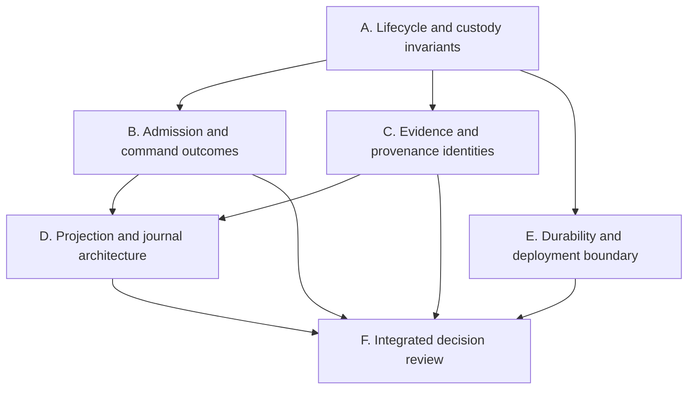
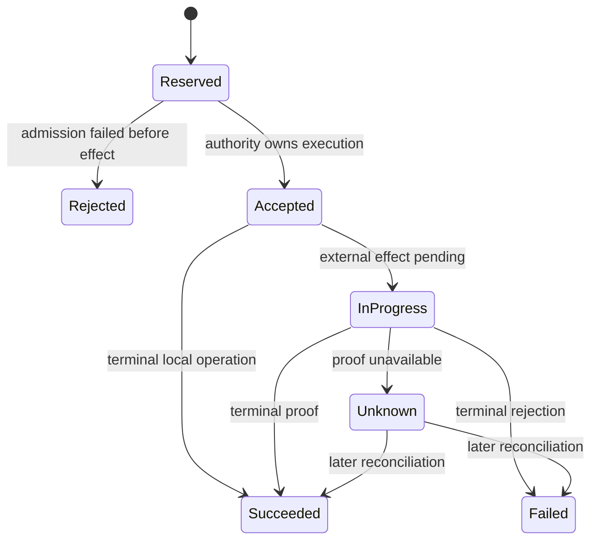

# Alpaca bot control remediation research plan

**Date:** 2026-08-02

**Input:** [`docs/audits/alpaca-bot-control-panel-architecture-audit-2026-08-02.md`](../audits/alpaca-bot-control-panel-architecture-audit-2026-08-02.md)

**Purpose:** Determine the safest, simplest, and most maintainable solutions to the audit findings before implementation begins.

**Research horizon:** Five focused engineering days, followed by one decision review. This plan produces decisions, adversarial proofs, and implementation-ready issue slices; it does not silently turn research spikes into production code.

## 1. Research outcome

At completion, the team should have:

1. an approved target architecture for immutable strategy instances, run lifecycle, cancellation, and Clerk effect fencing;
2. one canonical admission model for Deploy, Start, hold clearance, and other control actions;
3. a typed command/effect receipt lifecycle with recoverable idempotency;
4. a causally correct evidence and validation-provenance model;
5. a measured projection-storage choice that meets the 100-bot requirement without per-request journal replay;
6. a documented security and durability boundary;
7. failing regression tests or executable probes that demonstrate every audited defect before its fix;
8. ADRs and independently implementable vertical-slice issues, ordered by custody risk;
9. a stable Bot Cockpit delivery model with prominent market-data freshness, lazy run history, and no full-screen redraw on background updates;
10. a supported Dry Run and Resume model that preserves immutable instance identity and append-only run history.

The research is successful only if it selects a solution and explains why the rejected alternatives are worse for this repository. A catalogue of options without a decision is not an acceptable outcome.

## 2. Decision principles

Apply these in order:

1. **Custody truth outranks availability.** Unknown liveness, exposure, or command outcome must remain visibly unknown and block new exposure.
2. **One authority per decision.** Projection and execution must consume the same typed admission function; Angular never re-authors safety meaning.
3. **Strategy instance and run are different identities.** Instance configuration is immutable; runs are append-only incarnations of that instance.
4. **Terminal words require terminal evidence.** “Stopped,” “flat,” “cleared,” and “success” are unavailable until the owning authority proves them.
5. **Retries preserve intent identity.** A transport retry reuses a command ID; a new command receives a new ID.
6. **Evidence must be causal and durable.** A transaction view never borrows an unrelated latest fact, and an audit claim survives the failure model it names.
7. **Cold replay is allowed; request-time replay is not.** Full journal scans belong to startup/recovery, not five-second polling.
8. **Prefer the smallest design that closes the invariant.** Do not introduce a distributed system merely to repair a single-worker local control plane.

### 2.1 Product decisions incorporated from operator feedback

These are requirements, not unresolved option questions:

1. **Start and Resume depend on bot facts and Clerk truth only.** The target
   contract is `evaluate_run_admission(bot, clerk)`. `bot` is a typed
   Start/Resume process/lifecycle fact whose liveness is owned by the process
   registry. `clerk` is a typed custody snapshot that already incorporates and
   reconciles broker-account
   positions, working orders, unresolved effects, holds, and freshness. There
   is no third `account` policy input and no second account interpretation in
   the router or Angular.
2. **The Clerk owns custody truth.** The panel asks the Clerk whether
   instance-attributed exposure exists, whether orders are working or resolved,
   whether reconciliation is current, and whether any result is unknown. A bot
   process may report runtime evidence but cannot declare broker custody.
3. **Resume means a new run of the same instance.** Immutable configuration
   remains under the same `strategy_instance_id`; every Resume creates a new
   `run_id`. Continuing a paused live process is named **Continue**, not Resume.
   Until the new-run behavior exists end to end, the V2 panel must not render a
   Resume button.
4. **Changing configuration means a new strategy instance.** Symbol, strategy,
   quantity/action plan, submission mode, and other immutable settings cannot
   be edited by Resume.
5. **Current and previous runs are visible on demand.** Both Trader and
   Operator lenses show the current run first and allow one historical run at a
   time to be opened by date. Viewing an old run never routes a command to it.
6. **Dry Run is a first-class safe path.** A Dry Run consumes market data and
   produces simulated activity without broker submission. Starting dry mode
   from a live-paper configuration creates a new strategy instance because
   submission mode is immutable.
7. **Market-data time is primary header information.** The header must show
   channel state, last market-data time in ET, age, and `LIVE`, `STALE`, or
   `MISSING`. Missing or unacceptably stale required data visibly blocks actions
   that need it. The working UI concept is a persistent **Market Pulse** in the
   header: a compact status light plus `Last bar 10:35:00 ET · 4s ago`; stale or
   missing data expands into an unmistakable warning with the next step.
8. **Only evidence earns terminal language.** `Stopped`, `flat`, `cleared`, and
   `success` require the responsible backend authority's durable evidence.
   Pending or uncertain outcomes remain `in_progress` or `unknown` and continue
   reconciliation.
9. **The backend owns command idempotency.** Angular creates a command ID before
   sending, but the backend durably reserves it before any effect and remains
   the authority for its state and receipt.
10. **Background updates preserve the screen.** The panel retains the last good
    snapshot, applies only changed data, and never resets chart zoom, selection,
    scroll, or run tab during routine refresh.

Current-code gaps to verify with regression tests:

- `StartAdmissionService` currently reads account freeze, observation, and
  fleet checks as separate dependencies. The research must fold those answers
  behind a Clerk-authored custody snapshot before approving the target
  `evaluate_run_admission(bot, clerk)` boundary.
- The legacy Bot Control surface already uses a versioned SSE snapshot stream,
  while the V2 panel still polls and the V2 chart replaces its complete candle
  set. Reuse the proven stream primitives where their contracts fit; do not
  create a second competing event framework.
- The original Interactive Brokers Bot Control UI is a retirement candidate.
  Treat it as migration source material: carry forward only its small generic
  SSE/reconnect/version-adoption mechanisms and their tests, prune IBKR-specific
  view models and obsolete action semantics, then delete the old surface after
  the V2 cutover proves parity.

## 3. Workstreams and dependency order



Workstream A is the hard prerequisite. Other work may gather evidence in parallel, but no final command, evidence, or projection design should be approved until instance/run/effect identities are settled.

## 4. Workstream A — Lifecycle and custody invariants

**Audit findings:** P0-1, P0-2, P0-3.

### A1. Separate immutable instance configuration from mutable run state

Research questions:

- Which fields belong to the lifetime strategy instance, and which belong to a run?
- Should run history be an append-only journal, one file per run, or a current pointer plus immutable run records?
- How are existing version-1/version-2 `broker_binding.json` records migrated without changing custody identity?
- Where should `replaces_sid` and validation lineage live?
- Which hash is compared during Resume and carryover proof?
- How is a new Resume run created atomically and bound only after Clerk custody
  proof passes?
- What compact run-summary contract supports current-first, date-labelled,
  paginated history without scanning or loading every run into the panel?

Candidate designs to compare:

| Candidate | Advantages | Risks / reasons to reject |
| --- | --- | --- |
| Split `instance_config.json` plus immutable `runs/<run_id>.json` and current-run pointer | Makes the domain distinction explicit; supports history and exact carryover references; create-once configuration is easy to enforce | Requires artifact migration and more reads unless composed behind one repository |
| Keep one mutable binding with compare-and-swap immutable fingerprint | Smaller patch and easier migration | Continues mixing instance and run identity; loses run history; future drift likely |
| Event-source every lifecycle mutation in one journal | Strong history and recovery semantics | Larger migration and more machinery than the current control plane needs |

Working hypothesis: choose the split configuration/run-record design, hidden behind a `StrategyInstanceRepository`. Validate that it can lift existing bindings deterministically and preserve the old SID namespace.

Required experiments:

1. Convert representative v1 and v2 bindings in memory and prove stable immutable hashes.
2. Attempt same-process and post-restart redeploy with changed strategy, symbol, quantity, plan, and carryover policy.
3. Resume twice and prove one immutable instance identity with three distinct run records.
4. Fault-inject between configuration creation, run creation, desired-state update, and task launch; define the conservative recovered state for each cut point.
5. Open a previous run in both UI lenses and prove controls remain bound to the
   current instance/run rather than the viewed history record.
6. Change any immutable setting during a Resume request and prove the request is
   rejected with guidance to create a new strategy instance.

Decision artifact: ADR, migration table, artifact schema, and a state-transition diagram.

### A1.1 Define Resume, Continue, and Dry Run as separate operations

Research and prototype these closed semantics:

| Operation | Identity result | Broker effect | Required UI behavior |
| --- | --- | --- | --- |
| Continue | Same instance, same live `run_id` | Existing configured mode | Available only for a paused process that is still authoritatively live |
| Resume | Same instance, new `run_id` | Existing immutable configured mode | Hidden until new-run creation, Clerk proof, and command recovery work end to end |
| Start Dry Run | New instance when source configuration is not already dry; new run | No broker submission; simulated fills are clearly labelled | Explicit Dry Run CTA and permanent non-live badge |

The existing `shadow`/no-submit engine path is the leading implementation
candidate for Dry Run. Research must prove that its market-data, simulated-fill,
and zero-broker-write guarantees satisfy the user-facing promise; the UI must
not merely rename `readonly` without verifying its behavior.

### A2. Design terminal Stop and surviving-task fencing

Define one typed bot process fact before lifecycle experiments:

```text
strategy_instance_id
run_id
process_identity
state: STARTING | RUNNING | STOPPING | EXITED | UNKNOWN
registry_generation
observed_at_ms
```

The process registry authors this fact. Missing, stale, or contradictory
evidence produces `UNKNOWN`; a PID or run artifact alone never proves
`RUNNING`. Process liveness also does not prove broker custody or permission to
trade—that answer still requires the Clerk snapshot. `PAUSED` remains a desired
state/operator-intent value rather than a process-liveness value.

Research questions:

- What state represents a requested Stop whose task has not terminated?
- How does the Clerk reject a late ENTER from a stale or cancellation-suppressing run?
- Should the fence be desired-state based, run-generation based, capability-token based, or a combination?
- How are already accepted, shielded Clerk effects allowed to finish while new effects are refused?
- What operational recovery is required when a Python task does not terminate?

Candidate designs to compare:

| Candidate | Advantages | Risks / reasons to reject |
| --- | --- | --- |
| Durable active-run generation checked by Clerk for every ENTER; STOP revokes generation before cancellation | Closes the stale-task write path under the Clerk lock; supports precise receipts | Requires Clerk access to lifecycle authority and careful EXIT/reduction exemptions |
| Check only `desired_state=STOPPED` in the runner | Small | A surviving runner can ignore it; not authoritative at the broker-write boundary |
| Move each bot into its own process and terminate the process | Strong liveness isolation | Large topology change; does not replace Clerk fencing for response races |
| Account-wide hold on cancellation timeout | Safest immediate backstop | Over-broad and operationally disruptive; useful as escalation, not the primary identity fence |

Working hypothesis: durable run-generation fencing at the Clerk boundary, plus a non-terminal `STOPPING` state and an account-level safety escalation on timeout. EXIT/cancel/reduction operations remain allowed when they reduce exposure.

Required experiments:

1. Reuse the cancellation-suppressing feed from the audit reproduction.
2. Race Stop against: pre-accept ENTER, accepted/shielded ENTER, post-stop ENTER, EXIT, and broker callback.
3. Prove that accepted effects resolve once, post-revocation ENTER is rejected, and Stop cannot become terminal while the task is alive.
4. Simulate process restart while `STOPPING`; boot recovery must preserve the run fence and reconcile before any Resume.

Decision artifact: ADR amendment defining `RUNNING → STOPPING → STOPPED/EXITED_UNVERIFIED`, run fencing, and timeout escalation.

### A3. Make hold clearance reason-specific

Research questions:

- What evidence discharges each hold reason?
- Can a generic `HOLD_CLEARED` event remain, or should the event carry a proof kind/reference?
- Which checks must occur under the Clerk intake lock to eliminate time-of-check/time-of-use gaps?
- Should unrecognized future hold reasons be non-clearable by default?

Proposed admission table to validate:

| Hold reason | Minimum clear proof |
| --- | --- |
| `STREAM_HEALTH_HOLD` | Both required channels healthy within operation-specific TTLs |
| `UNEXPLAINED_ORDER_HOLD` | Fresh reconciliation with no unexplained orders, unresolved intents, incompatible working orders, or custody freeze |
| Unknown/future reason | Refuse generic clear; require a registered reason-specific handler |

Required experiments:

1. Keep a foreign order present and prove clear is rejected.
2. Remove it without reconciling and prove clear is still rejected.
3. Reconcile cleanly, then race a new foreign observation against clear under the intake lock.
4. Reproduce stream recovery at freshness boundaries.

Decision artifact: a closed `HoldClearAdmission` registry and receipt schema.

### Workstream A exit gate

- Every P0 has a deterministic failing test against current behavior.
- The chosen identity/fence design closes all three P0s together; it does not fix one by weakening another.
- Migration and crash-cut behavior are specified.
- No implementation issue for Start, Stop, Deploy, or Clear Hold is opened before this gate is approved.

## 5. Workstream B — Admission, command identity, and terminal outcomes

**Audit findings:** P1-1, P1-2, P1-6, P1-8, P2-1.

### B1. Define operation-specific freshness

Measure the actual update guarantees of:

- market-data feed health;
- execution websocket connection/heartbeat;
- account posture;
- reconciliation/custody proof;
- validation current-state projection.

Market-data freshness is a hard, visible product requirement. Specify a
backend-authored header model containing channel state, last event/bar time,
age, expected cadence/session context, and a stable reason code. Test `LIVE`,
`STALE`, `MISSING`, market-closed, delayed-feed, and clock-skew cases. Angular
formats the time and renders the state; it does not invent freshness thresholds.

For each operation—Deploy, Start, Clear Hold, Stop-and-Flatten—record:

```text
required fact
authority
maximum acceptable age
clock used
unknown/stale behavior
recovery action
```

Do not derive control TTLs from the 24-hour historical-display threshold. The selected TTL must be justified by producer behavior and tested immediately below, at, and above the boundary.

### B2. Introduce canonical admission decisions

Spike pure typed decisions:

- `DeployAdmissionDecision`
- `RunAdmissionDecision` over typed `StartRunFacts | ResumeRunFacts`
- `HoldClearAdmissionDecision`
- `FlattenAdmissionDecision`

Each result should contain `allowed`, stable reason code, scope, evidence references, evaluated-at time, fact ages, and recovery copy. The exact same function must author the presented action and be rerun under the execution lock immediately before mutation.

The Start/Resume decision has exactly two typed inputs:

```python
decision = evaluate_run_admission(bot, clerk)
```

- `bot` contains immutable instance identity plus process-registry/lifecycle
  evidence for the current or proposed run, including backend-authored
  market-data freshness required by that run. The Resume variant also carries
  the stopped previous-run ID, proposed new-run ID, and immutable configuration
  hash.
- `clerk` contains the Clerk-authored custody snapshot, including reconciled
  account identity, instance-attributed exposure, working/open-order state,
  unresolved effects, holds, freshness, and evidence references.

The Clerk may internally consume raw broker-account observations; those facts
must not reappear as an independent `account` argument to run admission. The
same function authors the displayed Start or Resume capability and is rerun
under the Clerk's execution/admission lock. Resume binds its new run only under
that lock after the same decision admits the unchanged instance configuration
and fresh custody snapshot. Angular renders its reason codes and operator copy
without recreating the rule.

### B3. Define a command state machine

Research and select a shared state model for deploy and panel actions:



Required decisions:

- whether `unknown` is terminal for the HTTP attempt but recoverable for the durable command;
- how command IDs map to Clerk effect IDs and child order refs;
- how the UI looks up and replays the same command ID after transport loss;
- which actions may safely return `accepted` versus waiting for terminal proof;
- retention and compaction of command receipts.

Required durable ledger shape:

```text
command_id: command-123
target: alpaca-spy-ema-01
action: stop
request_hash: abc123
state: succeeded
receipt: STOPPED
```

Required duplicate behavior:

- same ID plus the same canonical request hash returns the original state and
  receipt without re-executing;
- same ID plus a different target, action, or payload is rejected as a conflict;
- an executing command returns `in_progress`;
- an unprovable effect returns `unknown` and remains eligible for Clerk-backed
  reconciliation rather than being rewritten as failure or success.

STOP-AND-FLATTEN may return `accepted`/`in_progress`; only `STOPPED_AND_ATTRIBUTED_FLAT` maps to `success`.

### B4. Prototype end-to-end retry recovery

Build a test-only spike that:

1. creates the command ID before POST;
2. persists/reserves it before the performer;
3. loses the first HTTP response after the effect begins;
4. retries with the same ID;
5. returns the original receipt without another effect;
6. rejects the same ID with a changed payload;
7. resolves an `unknown` command from later Clerk evidence;
8. exposes `GET /commands/{command_id}` for reload/reconnect recovery;
9. stores a small non-secret pending-command record in browser persistence,
   restores it after page reload, and removes it only after a terminal backend
   receipt;
10. proves browser loss/corruption cannot alter the backend ledger or permit a
    second effect.

Use a dedicated receipt endpoint as the recovery authority. Angular should use
`crypto.randomUUID()` before POST, keep the active record in memory, and persist
only pending non-secret command metadata in IndexedDB (preferred) or a narrowly
scoped local-storage fallback. Never store broker credentials, control secrets,
or authentication tokens there.

### Workstream B exit gate

- All four operations consume explicit admission decisions.
- Receipt vocabulary cannot label pending/unprovable work as success.
- Deploy and panel actions share command-identity semantics.
- Transport-loss tests prove no duplicate broker effect.

## 6. Workstream C — Causal evidence and scientific provenance

**Audit findings:** P1-3, P1-4, P1-5, P2-5.

### C1. Define durable event identity and causal links

Specify identifiers for:

- decision receipt;
- effect operation;
- intent/order transaction;
- order-journal event;
- reconciliation observation;
- validation event/snapshot;
- operator evidence read.

Draw the allowed links. At minimum:

```text
validation event -> immutable instance configuration
decision receipt -> effect operation -> intent/order_ref -> broker events
reconciliation -> account observation time and journal sequence
evidence read -> actor + query + returned sequence interval
```

Decide whether the order journal receives a persisted monotonic `seq` or whether sequence is maintained by an indexed envelope. Reject page-relative indices as identities.

### C2. Fix selected-transaction semantics on paper

Before changing code, define each station's scope:

| Station | Scope | Allowed evidence |
| --- | --- | --- |
| SIGNAL | Selected decision/transaction | Decision explicitly linked to selected effect/order |
| INTENT through FILL | Selected transaction | Entries with the exact `order_ref` |
| RECONCILED | Account observation causally after selected submission | Reconciliation receipt plus explicit account scope |

Test the model with two overlapping transactions, out-of-order callbacks, no-action decisions, restart replay, and an account reconciliation between transactions.

### C3. Preserve validation provenance at deploy

Determine the minimal immutable deployment-provenance envelope:

- validation event ID and timestamp;
- accepted verdict and human actor;
- reference implementation/revision;
- evidence snapshot and content hashes;
- validation case/window;
- tolerance and parity/reconciliation reference;
- strategy implementation/configuration hash.

Research whether to embed this envelope or store a content-addressed reference. The binding and receipt must remain auditable if the validation catalog is later superseded or unavailable.

The `learn-ai-validation` contract applies: confirm that canonical math, reference note, golden fixtures, and tolerance remain linked rather than duplicating the strategy calculation in deploy code.

### C4. Select an evidence-read audit policy

Compare:

- fail closed on any audit append failure;
- serve only redacted summary with `audit_recorded=false`, while blocking raw detail;
- write audit records to the same durable journal substrate before serving evidence.

Evaluate actor identity, privacy, availability during incident response, fsync cost, and retention. Static `PANEL_OPERATOR_IDENTITY` must be treated as a deployment limitation, not mistaken for human attribution.

### Workstream C exit gate

- A selected transaction can be reconstructed without “latest” substitution.
- Order and decision watermarks are distinct and durable.
- A deployment receipt proves exactly which accepted evidence authorized it.
- Evidence access behavior under audit-write failure is explicit and tested.

## 7. Workstream D — Projection and journal scale

**Audit findings:** P1-7 and the performance portion of P2-4.

### D1. Establish a reproducible baseline

Create deterministic fixtures at:

- 1, 10, and 100 bots;
- 10,000, 100,000, and 1,000,000 account-journal entries;
- idle polls and burst append rates;
- one and five simultaneous browser clients.

Measure:

- bytes and lines read per catalog/panel/evidence request;
- JSON validation count;
- cold replay time;
- warm request p50/p95/max;
- projection age;
- memory footprint;
- event-to-visible latency.

### D2. Compare storage/projection options

| Candidate | Research focus |
| --- | --- |
| File-tail owner with byte offset and monotonic sequence | Minimal change; rotation, corruption, multi-client behavior, restart replay |
| JSONL authority plus SQLite WAL read index/projection | Queryability and bounded evidence paging; dual-write/rebuild semantics |
| Postgres/event broker projection | Operational cost and whether it is justified for a single-worker paper control plane |

Working hypothesis: retain JSONL as authority and add one account-scoped tailing owner, with a rebuildable local index only if bounded reverse evidence paging cannot meet the budget from offsets alone.

### D3. Define measurable budgets

Propose budgets before comparing prototypes. Initial targets to validate against host measurements:

- warm catalog server p95 below 100 ms at 100 bots/1M entries;
- warm panel server p95 below 75 ms;
- no historical journal bytes parsed on an idle warm poll;
- new event visible within one five-second UI polling interval;
- one cold replay per process start or journal rotation, never per request.

The final numbers may change after measurement, but the chosen solution must have explicit budgets and CI-friendly structural assertions.

### D4. Select the stable panel delivery model

Prototype one account-scoped projection owner that:

1. replays the Clerk journal once at startup/recovery;
2. tails only newly appended events using a durable sequence/offset;
3. publishes an immutable panel snapshot with a monotonic revision;
4. answers warm REST reads without reopening historical journal content;
5. marks the snapshot stale/unknown and blocks new exposure if a sequence gap,
   corruption, or Clerk-authority loss is detected.

Adopt this delivery sequence unless measurements disprove it:

1. initial versioned REST snapshot;
2. reuse the existing tested SSE/versioned-snapshot primitives to notify or
   deliver newer revisions;
3. bounded polling only as reconnect/fallback, using revision/ETag checks;
4. no WebSocket or external event broker for this single-worker deployment.

Legacy IBKR SSE reuse and retirement plan:

1. inventory the reusable, broker-neutral behavior in
   `authenticated-sse-connection.ts`, `versioned-snapshot-stream.ts`, and their
   tests;
2. create a thin V2 adapter that validates `BotPanelView` identity, epoch, and
   revision without importing the legacy `LiveInstanceStatus` UI contract;
3. carry forward reconnect, malformed-snapshot, epoch-change, stale/read-only,
   and latest-version-wins tests;
4. migrate one V2 panel route and compare it with REST/poll fallback under
   disconnect, replay, gap, and backend restart;
5. remove legacy routes, components, stores, and IBKR-only presentation models
   only after import/route searches show no consumers and the replacement test
   matrix passes;
6. retain the shared generic SSE primitives if they still have another caller;
   delete them too if the V2 replacement fully subsumes them.

This is a controlled copy-and-prune migration, not a wholesale copy of the old
panel. Safety meanings continue to come from the new Clerk-backed V2 contract.

SSE is transport, not truth: terminal wording and custody meaning still come
from Clerk-backed projection fields. Reconnect must backfill from a cursor or
force a fresh snapshot when a gap is detected.

Frontend acceptance behavior:

- retain the last same-session snapshot while reconnecting and mark it stale;
- do not replace unchanged panel objects when the revision is unchanged;
- merge rows by stable identity and preserve expansion, selection, scroll, and
  the selected historical run;
- update the current candle with the chart library's incremental update path;
  use full `setData` only for first load, range/symbol changes, or recovery;
- show the persistent Market Pulse in the header without unmounting the page;
- lazy-load one historical run at a time for both Trader and Operator lenses.

Required tests measure DOM/component identity, chart zoom/range preservation,
network bytes, journal bytes read, event-to-visible latency, SSE reconnect/gap
recovery, and unchanged-revision behavior.

### Workstream D exit gate

- A recorded benchmark compares all viable candidates on the same fixture.
- Complexity is demonstrated by counters, not inferred from elapsed time alone.
- The chosen owner has restart, rotation, corruption, and compaction behavior.
- Open-P&L marks can join the projection with timestamp/source provenance and no second numerical implementation.
- The V2 panel has one chosen REST/SSE/fallback contract and does not maintain a
  second meaning of the same safety state.
- Routine updates preserve page and chart interaction state.
- Run history is bounded and lazy rather than part of every live snapshot.

## 8. Workstream E — Durability, security, and remaining operability

**Audit findings:** P2-2, P2-3, P2-4, P2-6.

### E1. Standardize durable artifact writes

Inventory every Alpaca control artifact writer and record:

- lock scope;
- temp-file naming;
- file fsync;
- atomic replace;
- parent-directory fsync;
- schema validation on read;
- corrupt/partial-file recovery;
- path confinement.

Compare the existing writers and design one public `AtomicJsonRepository` or narrower utility. Fault-inject before write, after file fsync, after rename, and before directory fsync. The result must be either the old valid artifact, the new valid artifact, or a conservative explicit recovery error—never a silently missing command identity.

### E2. Enforce the deployment topology boundary

Research a startup assertion for the Clerk's one-worker requirement. Document how Uvicorn worker count, reload mode, container replicas, and shared artifact volumes are detected or prohibited. Decide the trigger for migrating the intake lock/authority out of process.

### E3. Define the authentication growth path

Document two supported modes:

1. current trusted-local single-operator mode; and
2. future authenticated multi-user mode.

For the future mode, decide the BFF/session boundary, human actor identity, Trader/Operator RBAC, CSRF/origin policy, service-secret role, audit retention, and authorization tests. Do not implement partial browser-side roles that imply security without enforcement.

### E4. Close feature-scope decisions

For Retire, targeted Cancel Order, and open P&L, produce one-page mini-designs covering authority, prerequisites, receipt, and tests. Decide whether each is required before calling the panel complete or is explicitly removed from the governing design.

### Workstream E exit gate

- Durability guarantees name their exact crash model.
- Unsupported multi-worker topology is automatically rejected or unmistakably documented in deployment checks.
- Local presentation lenses are not described as authorization.
- Retire, Cancel Order, and open P&L have approved disposition.

## 9. Five-day research schedule

| Day | Focus | End-of-day evidence |
| --- | --- | --- |
| 1 | Convert P0 reproductions into deterministic tests; map instance/run/effect identities and crash cuts | Failing test pack, identity diagram, candidate matrix |
| 2 | Prototype instance/run split, new-run Resume, Dry Run, Stop fencing, and reason-specific hold clearance | Spike results, run-history contract, race table, draft lifecycle ADR |
| 3 | Prototype `evaluate_run_admission(bot, clerk)`, command ledger, browser recovery, and causal evidence links | API schemas, transport-loss proof, draft command/evidence ADRs |
| 4 | Run scale benchmarks; copy and prune the proven IBKR SSE path into V2; verify projection owner, fallback, and stable Angular/chart updates | Benchmark report, SSE parity/deletion map, UI stability tests, persistence matrix |
| 5 | Resolve cross-workstream conflicts; specify migration, rollout, observability, and vertical slices | Final ADR set, implementation issue pack, acceptance matrix |
| Review | Engineering/product safety review | Approve, revise, or explicitly reject each decision |

If a P0 experiment invalidates the working hypothesis, stop dependent design work and revise the identity/custody model first. Schedule pressure must not convert a disputed safety assumption into an implementation decision.

## 10. Required artifacts

1. `docs/architecture/adrs/` — instance/run identity and Clerk run-fencing ADR.
2. `docs/architecture/adrs/` — command/admission/terminal-receipt ADR.
3. `docs/architecture/adrs/` — journal sequence, causal evidence, and projection-owner ADR.
4. `docs/references/` or validation architecture note — immutable deploy-provenance envelope.
5. `docs/audits/` — benchmark and fault-injection results with commands and machine context.
6. Regression-test branch or patch containing current-behavior failures, clearly separated from production fixes.
7. Ordered issue set with one vertical invariant per issue and explicit dependencies.
8. Updates required by the repository authority rules: `docs/math-sources-of-truth.md` and `docs/architecture/engine-authority-map.md` only when an implementation actually moves or introduces an authority path.
9. A Trader/Operator wireframe and typed contract for header market-data
   freshness, current/previous run navigation, Dry Run, Continue, and Resume.
10. A legacy IBKR Bot Control retirement map naming reusable SSE files, V2
    replacements, route/import consumers, parity tests, and deletion gates.

## 11. Candidate evaluation rubric

Score each serious candidate from 0–3 and retain the written evidence:

| Criterion | Weight | Question |
| --- | ---: | --- |
| Custody safety | 5 | Can stale work or uncertain state create new exposure? |
| Crash/restart correctness | 5 | Is state conservative at every persistence cut? |
| Single authority | 4 | Do projection and execution share the same decision owner? |
| Causal auditability | 4 | Can an operator prove why this exact state/action occurred? |
| Migration safety | 4 | Can existing SIDs/exposure be lifted without identity loss? |
| Idempotency | 4 | Are retries safe across response loss and process restart? |
| Testability | 3 | Can races and failure modes be deterministic in CI? |
| Complexity | 3 | Is the machinery proportionate to a single-worker local control plane? |
| Performance | 2 | Does it meet the measured 100-bot budgets? |
| Operability | 2 | Are recovery and unknown states understandable from the UI? |

Any candidate scoring zero on custody safety, crash correctness, or migration safety is rejected regardless of total score.

## 12. Implementation issue shape after research

Each resulting issue must be a vertical tracer bullet containing:

1. the invariant it closes;
2. authoritative input and output contracts;
3. artifact/schema migration;
4. a regression that fails before the fix;
5. execution and projection wiring through the same path;
6. operator receipt/blocker behavior;
7. observability and recovery procedure;
8. focused verification commands;
9. explicit non-goals and dependency links.

Recommended first implementation order after decisions are approved:

1. run fence and honest Stop terminal state;
2. Clerk custody snapshot and `evaluate_run_admission(bot, clerk)`;
3. immutable instance configuration, append-only run records, and lazy history;
4. new-run Resume plus same-run Continue vocabulary and behavior;
5. first-class Dry Run through the verified no-submit path;
6. reason-specific hold clearance and prominent market-data freshness;
7. typed command ledger, browser persistence, and outcome recovery endpoint;
8. causal journal/event identities and deploy provenance;
9. tailing projection owner, bounded evidence index, and versioned SSE delivery;
10. stable Angular/chart incremental rendering;
11. remove the superseded Interactive Brokers Bot Control surface after parity;
12. durability unification;
13. Retire, Cancel Order, marks, and authentication expansion.

## 13. Final research acceptance checklist

- [ ] All three P0 failures have deterministic adversarial tests.
- [ ] Instance configuration and run identity are represented separately.
- [ ] Resume creates a new run of the same immutable instance; Continue keeps a
  paused live run; the UI never uses one word for both.
- [ ] Current and historical runs are available in both lenses one at a time,
  and selecting history cannot retarget controls.
- [ ] Dry Run is visibly non-submitting and has a tested zero-broker-write
  guarantee.
- [ ] A stale/surviving run cannot create new exposure after Stop.
- [ ] Every hold reason has a registered clear proof; unknown reasons fail closed.
- [ ] Control freshness thresholds are producer-derived and operation-specific.
- [ ] The header makes market-data state, last ET observation, and age prominent;
  stale/missing required data fails closed.
- [ ] Deploy, Start, Clear Hold, and Flatten share projection/execution admission functions.
- [ ] Start admission consumes only typed bot facts and the Clerk custody
  snapshot; it has no independent account-policy input.
- [ ] Pending or unprovable flatten never renders as success.
- [ ] Browser and API retries reuse durable command identity.
- [ ] `GET /commands/{command_id}` recovers `in_progress`, `unknown`, and terminal
  receipts after refresh; browser storage contains no secrets.
- [ ] Historical transactions show only causally linked decisions/evidence.
- [ ] Validation lineage survives catalog supersession.
- [ ] Warm polling performs no full historical journal replay.
- [ ] Initial snapshot plus versioned SSE and bounded fallback polling preserve
  page, chart zoom, scroll, selection, and unchanged component identity.
- [ ] The V2 panel reuses only broker-neutral SSE mechanics; legacy IBKR safety
  meanings and view models are not copied into the new authority contract.
- [ ] The old IBKR Bot Control surface is deleted only after route/import audits
  and the complete SSE reconnect/parity test matrix pass.
- [ ] Evidence-audit failure behavior is explicit.
- [ ] Artifact writes satisfy the declared crash model.
- [ ] The single-worker and trusted-local boundaries are enforced/documented.
- [ ] ADRs, migration plan, benchmarks, and implementation issues are approved.

## 14. Research guardrails

- Do not place live broker orders; use fakes, retained fixtures, and Alpaca paper only for an approved final soak.
- Do not mutate or retire existing real SIDs while studying migration.
- Do not weaken Clerk holds, freezes, intake serialization, or capture-before-contact journaling in a spike.
- Do not introduce a runtime dependency on LEAN or another reference implementation.
- Do not merge a spike merely because it makes the reproduction pass; it must satisfy the integrated exit gates and repository provenance rules.
- Preserve all timestamps as `int64 ms UTC` at storage and wire boundaries.
