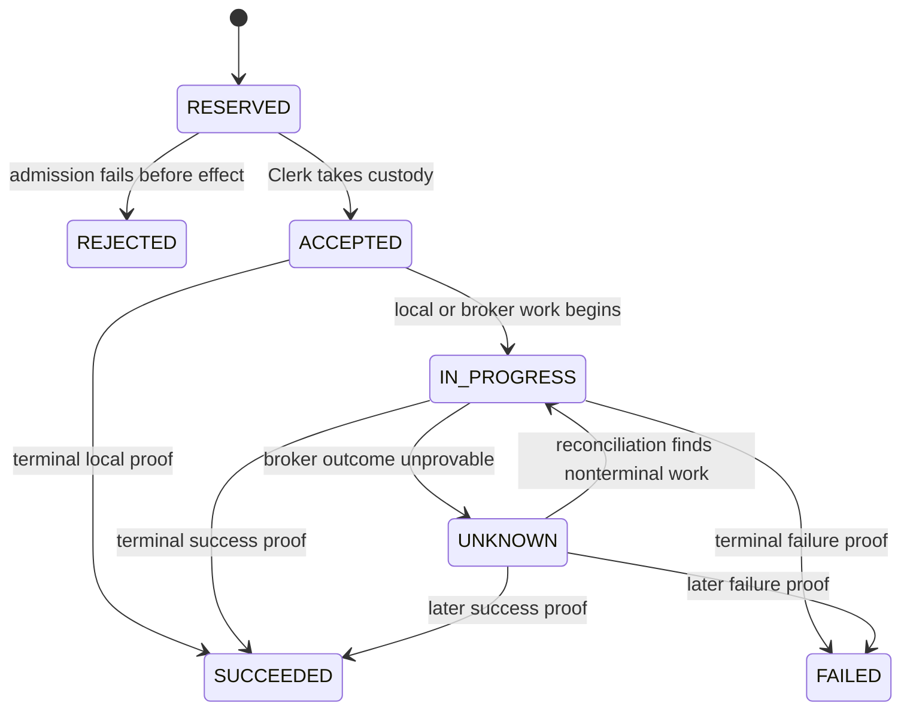

# Alpaca Clerk SQLite — pinned implementation contracts

- **Status:** Pinned for implementation (Slice 1 / issue #1374, PRD Phase 0).
  Produced alongside ADR 0035, which remains **Proposed** — this document does
  not change the ADR's acceptance status. It exists so Slices 2–10 build
  against one frozen contract instead of re-deriving it from prose each time.
  **Corrected by the corrective foundation slice** (see
  `docs/superpowers/plans/2026-08-05-alpaca-clerk-corrective-foundation-slice.md`
  and `docs/audits/open-pr-review-2026-08-05.md`): §3–§4 no longer describe a
  standalone command reservation, which directly contradicted PRD §4 goal 3
  and §9.3; §9 gained per-sequence mirror reconciliation, generation
  validation, lease renewal, and full path confinement. `SCHEMA_VERSION`
  bumped 1 → 2 for the DDL changes this correction required.
- Issue #1377 (ENTER) added an index on `custody_transitions(order_ref)` (§3)
  — no new columns, but a DDL change all the same, so `SCHEMA_VERSION` bumped
  2 → 3. There is no live database to migrate yet (pre-cutover, #1382); the
  bump exists so `open()`'s version check rejects a stale on-disk DDL
  shape with a clear error instead of silently running without the index.
- **Source of truth ranking:** ADR 0035 (decision rationale) →
  `docs/prds/alpaca-account-clerk-sqlite-control-plane.md` §9–§11 (functional
  contract) → this document (concrete, implementable pin). Where this document
  adds detail the PRD left unspecified (e.g. exact columns on `positions` or
  `holds`), that detail is a Slice 1 implementation decision, called out
  inline, and is binding on Slice 2 onward exactly like the rest of this file.
- **Scope:** logical schema (DDL), required uniqueness/immutability, PRAGMA
  set, transaction boundaries, command + custody state machines, hash-chain
  row format, write-only mirror line format, and fail-closed startup checks.
  No production code changes ship in this slice.

## 1. Database identity (PRD §9.1)

```text
<artifacts_root>/accounts/alpaca/<safe_account_id>/clerk.db
<artifacts_root>/accounts/alpaca/<safe_account_id>/custody_transitions.mirror
```

`safe_account_id` is the existing path-safe account-id transform already used
elsewhere in `PythonDataService/app/broker/alpaca/` (Slice 2 reuses it; it is
not redefined here).

### 1a. Established-accounts registry

Closes PRD §15.4: "remove `clerk.db` after authority was established and
prove it is not recreated."

Every fail-closed check in §9 reads state *from* `clerk.db` or its mirror.
None of them can distinguish "this account's database was deleted" from
"this account has never been initialized" — both look identical from inside
the per-account directory once `clerk.db` is gone. Proving the former
requires evidence that survives deletion of that directory, so it cannot
live inside it.

```text
<artifacts_root>/accounts/alpaca/_established_generations.jsonl
```

One append-only, fsync'd, newline-delimited JSON line per successful
`clerk.db` initialization — the very first one for an account, and every
reset-created generation after it:

```json
{"account_id": "...", "authority_generation": 3, "db_identity_token": "...", "established_at_ms": 1785900000000}
```

This file lives at the `accounts/alpaca/` level, one directory above any
single account — deleting or corrupting one account's directory cannot erase
its own establishment evidence. (It does not defend against wiping the
entire `accounts/alpaca/` tree; that is outside the trust boundary the PRD
draws around `artifacts_root`, consistent with every other recovery
mechanism in this document.) Slice 2 owns writing to it as part of the
"initialize a new database and authority generation" workflow; this document
pins only that the file exists, its format, and that startup consults it —
see §9 check 2.

## 2. PRAGMA / runtime configuration (PRD §9.2)

Enabled and verified on every connection open, in this order:

```sql
PRAGMA journal_mode = WAL;
PRAGMA synchronous = FULL;
PRAGMA foreign_keys = ON;
PRAGMA busy_timeout = 5000;   -- ms; Slice 2 may tune, must stay bounded and documented
```

- All mutations use `BEGIN IMMEDIATE ... COMMIT`. No bare `BEGIN`.
- One application-owned write coordinator (an `asyncio.Lock`-equivalent
  serializing writers within the process) sits in front of `BEGIN IMMEDIATE`
  — belt-and-suspenders, not a substitute for it.
- A durable per-account **execution lease** (a row in `control_meta`, see
  below) and a transactionally claimed **operation work item** (a row-level
  claim on the owning `effect_operations` row) are acquired before any broker
  contact. `BEGIN IMMEDIATE` proves single-writer-at-the-database; it does not
  prove single-process. The lease + work claim close that gap.
- A startup topology fence rejects a second local scheduler, stream-consumer,
  or reconciler registration for the same account within one process, and
  rejects a second process from acquiring the lease while it is held and
  unexpired.

## 3. Logical schema (PRD §9.3 pinned to concrete DDL)

`custody_transitions` is the sole canonical authority. Every other
business-state table is a fold of it, written in the **same SQLite
transaction** as the log append it derives from. `mirror_fence` is derived
delivery/recovery metadata, never custody authority.

```sql
-- ============================================================
-- control_meta — guarded singleton (PRD §9.1)
-- ============================================================
CREATE TABLE control_meta (
    id                      INTEGER PRIMARY KEY CHECK (id = 1),  -- singleton row
    schema_version          INTEGER NOT NULL,
    broker                  TEXT NOT NULL CHECK (broker = 'alpaca'),
    account_id              TEXT NOT NULL,
    db_identity_token       TEXT NOT NULL,          -- random, minted at init; rejects file substitution
    authority_generation    INTEGER NOT NULL,       -- increments only on explicit reset (§13)
    control_revision        INTEGER NOT NULL DEFAULT 0,  -- monotonic; advanced by every fold
    created_at_ms           INTEGER NOT NULL,
    last_open_at_ms         INTEGER NOT NULL,
    reset_provenance_json   TEXT,                   -- null unless this generation began via reset
    execution_lease_owner   TEXT,                   -- process identity holding the lease, null if unheld
    execution_lease_expires_at_ms INTEGER
);

-- ============================================================
-- strategy_instances — immutable configured bot identity; insert once, retire only
-- ============================================================
CREATE TABLE strategy_instances (
    strategy_instance_id    TEXT PRIMARY KEY,
    symbol                  TEXT NOT NULL,
    config_hash             TEXT NOT NULL,          -- content hash of the immutable bot config
    created_at_ms           INTEGER NOT NULL,
    retired_at_ms           INTEGER                 -- null while active; set once, never cleared
);

-- ============================================================
-- runs — per-instance run records and the active-run fence
-- ============================================================
CREATE TABLE runs (
    run_id                  TEXT PRIMARY KEY,
    strategy_instance_id    TEXT NOT NULL REFERENCES strategy_instances(strategy_instance_id),
    lifecycle_run_id        TEXT NOT NULL,          -- the identity Start/Resume reserves (ADR 0035 #3)
    state                   TEXT NOT NULL CHECK (state IN ('ACTIVE','STOPPED')),
    started_at_ms           INTEGER NOT NULL,
    stopped_at_ms           INTEGER
);
-- one active run fence per strategy instance (PRD §9.4):
CREATE UNIQUE INDEX ux_runs_one_active_per_instance
    ON runs(strategy_instance_id) WHERE state = 'ACTIVE';
CREATE UNIQUE INDEX ux_runs_lifecycle_run_id ON runs(strategy_instance_id, lifecycle_run_id);
-- composite target for commands/effect_operations run ownership below —
-- run_id is already globally unique (PK), this pins the (instance, run) pair
-- so a cross-bot FK reference is rejected rather than silently satisfiable:
CREATE UNIQUE INDEX ux_runs_instance_run ON runs(strategy_instance_id, run_id);

-- ============================================================
-- commands — content-addressed request identity (R2)
-- ============================================================
CREATE TABLE commands (
    command_id              TEXT PRIMARY KEY,       -- opaque durable resource id (GET /commands/{command_id})
    authority_generation    INTEGER NOT NULL,
    idempotency_key         TEXT NOT NULL,           -- canonical natural key, see §3a below
    payload_hash            TEXT NOT NULL,           -- immutable once first committed
    kind                    TEXT NOT NULL CHECK (kind IN ('strategy_decision','operator_lifecycle')),
    strategy_instance_id    TEXT NOT NULL REFERENCES strategy_instances(strategy_instance_id),
    run_id                  TEXT,                    -- null only for pre-run commands; see composite FK below
    action                  TEXT NOT NULL,           -- e.g. START, RESUME, STOP, STOP_AND_FLATTEN, decision replay
    intended_end_state      TEXT,                    -- operator-lifecycle only
    state                   TEXT NOT NULL CHECK (state IN
                             ('reserved','rejected','accepted','in_progress','unknown','succeeded','failed')),
    effect_operation_id     TEXT REFERENCES effect_operations(effect_operation_id),
    receipt_id              TEXT REFERENCES receipts(receipt_id),
    created_at_ms           INTEGER NOT NULL,
    updated_at_ms           INTEGER NOT NULL,
    -- cross-bot run link is rejected: a non-null run_id must belong to this
    -- same strategy_instance_id (SQLite leaves a multi-column FK unchecked
    -- when any member is NULL, so a pre-run command's null run_id passes):
    FOREIGN KEY (strategy_instance_id, run_id) REFERENCES runs(strategy_instance_id, run_id)
);
-- unique content-addressed command identity within the authority generation (§9.4):
CREATE UNIQUE INDEX ux_commands_idempotency
    ON commands(authority_generation, idempotency_key);

-- ============================================================
-- effect_operations — Clerk-owned ENTER/EXIT/cancel/recovery work (§7)
-- ============================================================
CREATE TABLE effect_operations (
    effect_operation_id     TEXT PRIMARY KEY,
    authority_generation    INTEGER NOT NULL,
    idempotency_key         TEXT NOT NULL,           -- Clerk effect idempotency identity, distinct from command's
    command_id              TEXT NOT NULL REFERENCES commands(command_id),
    strategy_instance_id    TEXT NOT NULL REFERENCES strategy_instances(strategy_instance_id),
    run_id                  TEXT,                    -- see composite FK below
    kind                    TEXT NOT NULL CHECK (kind IN
                             ('ENTER','EXIT','CANCEL','RECONCILE','STOP','STOP_AND_FLATTEN')),
    state                   TEXT NOT NULL CHECK (state IN
                             ('reserved','rejected','accepted','in_progress','unknown','succeeded','failed')),
    custody_owner           TEXT NOT NULL DEFAULT 'ACCOUNT_CLERK',
    created_at_ms           INTEGER NOT NULL,
    updated_at_ms           INTEGER NOT NULL,
    terminal_receipt_id     TEXT REFERENCES receipts(receipt_id),
    -- operation-claim CAS fields (Scope D): a durable owner + unique fencing
    -- token claimed before broker contact; all null while unclaimed:
    claim_owner              TEXT,
    claim_token              TEXT,
    claimed_at_ms            INTEGER,
    claim_expires_at_ms      INTEGER,
    -- a claim is all-null (unclaimed) or fully populated with a real
    -- expiry window — never partially populated (open-pr-review-2026-08-05.md
    -- "Require operation claims to be all-null or complete"):
    CHECK (
        (claim_owner IS NULL AND claim_token IS NULL
            AND claimed_at_ms IS NULL AND claim_expires_at_ms IS NULL)
        OR
        (claim_owner IS NOT NULL AND claim_token IS NOT NULL
            AND claimed_at_ms IS NOT NULL AND claim_expires_at_ms > claimed_at_ms)
    ),
    FOREIGN KEY (strategy_instance_id, run_id) REFERENCES runs(strategy_instance_id, run_id)
);
-- unique Clerk effect idempotency identity (§9.4):
CREATE UNIQUE INDEX ux_effect_operations_idempotency
    ON effect_operations(authority_generation, idempotency_key);
-- unique fencing token while claimed (§9.4 extension, Scope D):
CREATE UNIQUE INDEX ux_effect_operations_claim_token
    ON effect_operations(claim_token) WHERE claim_token IS NOT NULL;

-- ============================================================
-- orders — one row per broker/client order identity (R7)
-- ============================================================
CREATE TABLE orders (
    order_ref                TEXT PRIMARY KEY,       -- Clerk-minted, committed before submission
    effect_operation_id      TEXT NOT NULL REFERENCES effect_operations(effect_operation_id),
    client_order_id          TEXT NOT NULL,           -- Alpaca reconciliation identity (R7)
    broker_order_id          TEXT,                    -- filled in once Alpaca acknowledges
    role                     TEXT NOT NULL CHECK (role IN ('ENTRY','REDUCING','OTHER')),
    broker_state             TEXT,                    -- last proven Alpaca order status
    submitted_at_ms          INTEGER,
    updated_at_ms            INTEGER NOT NULL
);
-- unique broker client_order_id/order reference (§9.4):
CREATE UNIQUE INDEX ux_orders_client_order_id ON orders(client_order_id);
CREATE UNIQUE INDEX ux_orders_broker_order_id ON orders(broker_order_id)
    WHERE broker_order_id IS NOT NULL;

-- ============================================================
-- fills — permanent executions and corrections (append/idempotent insert)
-- ============================================================
CREATE TABLE fills (
    fill_id                  TEXT PRIMARY KEY,       -- Alpaca execution id (idempotent identity, §9.4)
    order_ref                TEXT NOT NULL REFERENCES orders(order_ref),
    qty                      REAL NOT NULL,
    price                    REAL NOT NULL,
    side                     TEXT NOT NULL CHECK (side IN ('BUY','SELL')),
    is_correction             INTEGER NOT NULL DEFAULT 0,  -- 1 = broker-issued correction, not erasure of prior fact
    source_event_at_ms       INTEGER,                 -- Alpaca's fill timestamp, when supplied
    clerk_observed_at_ms     INTEGER NOT NULL,
    recorded_at_ms           INTEGER NOT NULL
);

-- ============================================================
-- positions — current Clerk-attributed exposure; fold of the log, namespace-attributed
-- (never nets from raw broker position — preserves existing exposure.py semantics)
-- ============================================================
CREATE TABLE positions (
    strategy_instance_id     TEXT NOT NULL REFERENCES strategy_instances(strategy_instance_id),
    symbol                   TEXT NOT NULL,
    attributed_qty           REAL NOT NULL DEFAULT 0,
    updated_at_ms             INTEGER NOT NULL,
    PRIMARY KEY (strategy_instance_id, symbol)
);

-- ============================================================
-- holds — active and resolved bot/Account-Clerk holds; fold of the log
-- ============================================================
CREATE TABLE holds (
    hold_id                  TEXT PRIMARY KEY,
    scope                    TEXT NOT NULL CHECK (scope IN ('BOT','ACCOUNT_CLERK')),
    strategy_instance_id     TEXT REFERENCES strategy_instances(strategy_instance_id),  -- null for ACCOUNT_CLERK scope
    reason_code               TEXT NOT NULL,
    state                     TEXT NOT NULL CHECK (state IN ('ACTIVE','RESOLVED')),
    opened_at_ms               INTEGER NOT NULL,
    resolved_at_ms             INTEGER,
    evidence_refs_json         TEXT,
    -- scope is truthfully coupled to bot identity, not just documented by a
    -- comment: BOT requires a strategy instance, ACCOUNT_CLERK forbids one.
    CHECK ((scope = 'BOT' AND strategy_instance_id IS NOT NULL)
        OR (scope = 'ACCOUNT_CLERK' AND strategy_instance_id IS NULL))
);

-- ============================================================
-- uncertainties — active nonterminal unknowns; fold of the log. Columns are
-- the R5 envelope verbatim.
-- ============================================================
CREATE TABLE uncertainties (
    uncertainty_id            TEXT PRIMARY KEY,
    scope                     TEXT NOT NULL CHECK (scope IN ('BOT','ACCOUNT_CLERK')),
    severity                  TEXT NOT NULL,
    blocks_new_exposure       INTEGER NOT NULL CHECK (blocks_new_exposure IN (0,1)),
    allows_reduction          INTEGER NOT NULL CHECK (allows_reduction IN (0,1)),
    custody_owner             TEXT NOT NULL DEFAULT 'ACCOUNT_CLERK',
    strategy_instance_id      TEXT REFERENCES strategy_instances(strategy_instance_id),  -- null for ACCOUNT_CLERK
    reason_code               TEXT NOT NULL,
    headline                  TEXT NOT NULL,
    explanation               TEXT NOT NULL,
    operator_impact           TEXT NOT NULL,
    next_step                 TEXT NOT NULL,
    observed_at_ms            INTEGER NOT NULL,
    resolved_at_ms            INTEGER,       -- null while active
    evidence_refs_json        TEXT,
    facts_schema_version      INTEGER NOT NULL,
    facts_json                TEXT NOT NULL,
    -- same truthful scope/identity coupling as holds, above:
    CHECK ((scope = 'BOT' AND strategy_instance_id IS NOT NULL)
        OR (scope = 'ACCOUNT_CLERK' AND strategy_instance_id IS NULL))
);

-- ============================================================
-- reconciliations — reconciliation attempts and terminal receipts
-- ============================================================
CREATE TABLE reconciliations (
    reconciliation_id        TEXT PRIMARY KEY,
    effect_operation_id      TEXT REFERENCES effect_operations(effect_operation_id),
    order_ref                TEXT REFERENCES orders(order_ref),
    trigger                  TEXT NOT NULL CHECK (trigger IN ('AUTOMATIC','OPERATOR_RECONCILE_NOW')),
    attempted_at_ms           INTEGER NOT NULL,
    outcome                   TEXT NOT NULL CHECK (outcome IN ('STILL_UNKNOWN','RESOLVED_SUCCESS','RESOLVED_FAILURE')),
    evidence_refs_json        TEXT
);

-- ============================================================
-- receipts — permanent terminal command/effect proof; insert once
-- ============================================================
CREATE TABLE receipts (
    receipt_id                TEXT PRIMARY KEY,
    command_id                 TEXT REFERENCES commands(command_id),
    effect_operation_id        TEXT REFERENCES effect_operations(effect_operation_id),
    terminal_state              TEXT NOT NULL CHECK (terminal_state IN ('succeeded','failed','rejected')),
    summary_code                 TEXT NOT NULL,          -- stable code; prose comes from the closed registry (§11 rule 5)
    proof_reference               TEXT,
    recorded_at_ms                 INTEGER NOT NULL,
    facts_json                      TEXT
);

-- ============================================================
-- custody_transitions — THE canonical, append-only, hash-chained,
-- operation-first log. Columns are the PRD §11 list verbatim.
-- ============================================================
CREATE TABLE custody_transitions (
    sequence                  INTEGER PRIMARY KEY AUTOINCREMENT,   -- serialization order, not broker time
    prev_hash                 TEXT NOT NULL,            -- literal 'GENESIS' sentinel for sequence 1, never null
    row_hash                  TEXT NOT NULL,
    authority_generation      INTEGER NOT NULL,
    strategy_instance_id      TEXT REFERENCES strategy_instances(strategy_instance_id) DEFERRABLE INITIALLY DEFERRED,
    run_id                    TEXT REFERENCES runs(run_id) DEFERRABLE INITIALLY DEFERRED,
    command_id                TEXT REFERENCES commands(command_id) DEFERRABLE INITIALLY DEFERRED,
    effect_operation_id       TEXT REFERENCES effect_operations(effect_operation_id) DEFERRABLE INITIALLY DEFERRED,
    order_ref                 TEXT REFERENCES orders(order_ref) DEFERRABLE INITIALLY DEFERRED,
    broker_order_id           TEXT,
    transition_kind           TEXT NOT NULL,
    custody_owner             TEXT NOT NULL,
    execution_authority       TEXT NOT NULL,
    operation_state           TEXT NOT NULL,
    broker_state              TEXT,
    proof_reference           TEXT,
    source_event_at_ms        INTEGER,   -- null unless Alpaca supplied one; never backfilled
    clerk_observed_at_ms      INTEGER NOT NULL,
    recorded_at_ms            INTEGER NOT NULL,
    summary_code              TEXT NOT NULL,
    facts_schema_version      INTEGER NOT NULL,
    facts_json                TEXT NOT NULL
);
-- order_ref is scanned by both the §3c ack idempotency guard and recovery's
-- transitions_for_order (#1377) — an index keeps both O(log n), not O(n):
CREATE INDEX ix_custody_transitions_order_ref ON custody_transitions(order_ref);
-- immutable sequence/payload/hash-chain-link after commit (§9.4): enforced by
-- the triggers below, not just by Slice 2's repository boundary declining to
-- issue UPDATE/DELETE. A dedicated test asserts both hold.

-- ============================================================
-- mirror_fence — records that the SQLite transaction verified and consumed a
-- matching PREPARE line from the external mirror file (§8). It never gets a
-- FINALIZE-phase row: the external mirror's finalize fsync (R9 step 3) happens
-- *after* this transaction commits, so re-recording it in SQLite would need a
-- second, separately-fenced write — the same unbounded-regress problem the
-- two-phase fence exists to avoid. "Is sequence N finalized?" is answered by
-- reading the external mirror file's tail at startup (§9 check 9), never by a
-- SQLite column. `phase` is retained rather than dropped only so a future
-- schema version could add a durable FINALIZE marker without a migration;
-- today it is always 'PREPARE'.
-- ============================================================
CREATE TABLE mirror_fence (
    sequence                  INTEGER PRIMARY KEY REFERENCES custody_transitions(sequence),
    phase                     TEXT NOT NULL CHECK (phase = 'PREPARE'),
    row_hash                  TEXT NOT NULL,
    authority_generation      INTEGER NOT NULL,
    recorded_at_ms            INTEGER NOT NULL
);

-- ============================================================
-- Immutability backstops (§9.4): the repository boundary is the only writer
-- and never issues UPDATE/DELETE against these two invariants, but per the
-- ADR's "robustness is bought explicitly" posture, convention alone is not
-- the standard this program holds itself to elsewhere — these two get a
-- database-enforced backstop rather than resting on that convention alone.
-- ============================================================
CREATE TRIGGER trg_custody_transitions_immutable_update
BEFORE UPDATE ON custody_transitions
BEGIN
    SELECT RAISE(ABORT, 'custody_transitions is append-only: UPDATE forbidden');
END;

CREATE TRIGGER trg_custody_transitions_immutable_delete
BEFORE DELETE ON custody_transitions
BEGIN
    SELECT RAISE(ABORT, 'custody_transitions is append-only: DELETE forbidden');
END;

CREATE TRIGGER trg_commands_payload_hash_immutable
BEFORE UPDATE OF payload_hash ON commands
WHEN OLD.payload_hash IS NOT NULL AND NEW.payload_hash != OLD.payload_hash
BEGIN
    SELECT RAISE(ABORT, 'commands.payload_hash is immutable once committed');
END;

-- ============================================================
-- Terminal-state regression backstops (§9.4 "terminal outcomes cannot
-- regress to nonterminal"): a DB-enforced floor under the fold's own
-- discipline, same posture as the immutability triggers above.
-- ============================================================
CREATE TRIGGER trg_commands_terminal_state_immutable
BEFORE UPDATE OF state ON commands
WHEN OLD.state IN ('succeeded','failed','rejected') AND NEW.state != OLD.state
BEGIN
    SELECT RAISE(ABORT, 'commands.state cannot change once terminal');
END;

CREATE TRIGGER trg_effect_operations_terminal_state_immutable
BEFORE UPDATE OF state ON effect_operations
WHEN OLD.state IN ('succeeded','failed','rejected') AND NEW.state != OLD.state
BEGIN
    SELECT RAISE(ABORT, 'effect_operations.state cannot change once terminal');
END;
```

Five `custody_transitions` foreign keys (`strategy_instance_id`, `run_id`,
`command_id`, `effect_operation_id`, `order_ref`) are `DEFERRABLE INITIALLY
DEFERRED` — discovered as a genuine implementation-level necessity while
building Slice 2, per §10. A transition legitimately creates the very
entity it references in the same atomic commit (e.g. a
`STRATEGY_INSTANCE_REGISTERED` transition's fold inserts the
`strategy_instances` row it points at). SQLite checks a plain `REFERENCES`
immediately, per statement; deferring the check to `COMMIT` lets the
transition row and the entity row commit together in either statement
order without breaking the FK guarantee itself — it is still enforced,
just at the transaction boundary instead of the statement boundary, which
is exactly where this document already draws the atomicity line (§4).

### 3a. Content-addressed idempotency keys (R2, ADR 0035 #3)

- **Strategy decision:** `idempotency_key = f"{strategy_instance_id}:{decision_id}"`.
- **Operator lifecycle:** `idempotency_key = f"{account_id}:{strategy_instance_id}:{lifecycle_run_id}:{action}:{intended_end_state}"`.
  **Both** Start/Resume and Stop take a caller-supplied `lifecycle_run_id` —
  Stop is not exempt. A prior revision of this document had Stop *resolve*
  `lifecycle_run_id` from the currently `ACTIVE` run instead of taking it from
  the caller; that made a lost Stop response unrecoverable (a retry could no
  longer find an active run to resolve against, since the first attempt had
  already stopped it) and is corrected here (open-pr-review-2026-08-05.md
  P2 "Stop retry loses the active-run identity"). The existing-command lookup
  by `idempotency_key` happens **before** admission re-reads the active run,
  so a lost-response retry replays the already-completed Stop even though the
  run it targeted is no longer active. This is why a run-2 lifecycle command
  cannot collide with the same action recorded for run 1 — the key embeds the
  run identity supplied by the caller for both directions.
- `payload_hash` canonically hashes: action, target, account, instance, run,
  the immutable semantic payload, and any operator reason that changes
  meaning (R2). Same key + same hash → transport retry (return existing, no
  error). Same key + different hash → durable conflict (§9.4 "immutable
  request hash for an existing command").

### 3b. Uniqueness and immutability — full pin (PRD §9.4)

| Requirement | Enforced by |
| --- | --- |
| Unique content-addressed command identity within the authority generation | `ux_commands_idempotency` |
| Immutable request hash for an existing command | `trg_commands_payload_hash_immutable` (DB-enforced) |
| Unique Clerk effect idempotency identity | `ux_effect_operations_idempotency` |
| Unique broker `client_order_id`/order reference | `ux_orders_client_order_id`, `orders.order_ref` PK |
| Idempotent fill identities | `fills.fill_id` PK (Alpaca execution id) |
| Idempotent broker order-state-transition events | No separate identity table — the fold is idempotent by construction (§3c) |
| One active run fence per strategy instance | `ux_runs_one_active_per_instance` (partial unique index) |
| One monotonically increasing account control revision | `control_meta.control_revision`, advanced by every fold, asserted non-decreasing by a repository invariant test |
| Immutable terminal receipt identity | `receipts.receipt_id` PK, insert-only repository method (no update method exists) |
| Immutable custody-transition sequence, payload, and hash-chain link after commit | `AUTOINCREMENT` PK + `trg_custody_transitions_immutable_update`/`_delete` (DB-enforced) |

### 3c. Idempotent broker order-state-transition folding (§9.4, distinct from fill identity)

Fills need identity-based dedup (`fills.fill_id`) because double-counting an
execution corrupts P&L. A pure order-*status* transition (e.g. `new` →
`accepted` → `partially_filled`) does not carry that risk and does not get a
separate idempotency table. Instead the fold is idempotent by construction:

- Applying an identical `(order_ref, broker_state, source_event_at_ms)` a
  second time is a no-op — `orders.broker_state` is already that value.
- An event whose `source_event_at_ms` is older than the value already
  recorded for that order is still appended to `custody_transitions` (for
  audit — nothing is silently dropped) but does **not** regress
  `orders.broker_state`, satisfying adversarial test 15.2's "duplicate and
  out-of-order broker events fold idempotently."
- This relies on Alpaca order states being monotonic for a given order
  lifecycle (Slice 5/#1378's reconciliation logic owns the exact ordering
  table); this document pins only that no separate broker-event-identity
  table is introduced for this purpose.

### 3d. Typed replay facts (corrective foundation slice, Scope A2)

Every registered `transition_kind`'s `facts_json` is a **typed** dataclass, not
an untyped snapshot bag — `facts_schema_version` selects the parser. A fold
must be able to rebuild an identical `commands` (and, from #1377 onward,
`effect_operations`/`orders`) row from a finalized mirror line alone: the
mirror has only the outer transition payload plus this facts string, never a
live database or a caller closure to consult. Concretely, any command-only
field that is *not* already an outer `custody_transitions` column
(`idempotency_key`, `payload_hash`, `kind`, `action`, `intended_end_state` —
`strategy_instance_id`, `run_id`, and `command_id` already are outer columns)
must round-trip through facts.

| Transition | Required facts beyond the outer transition row |
| --- | --- |
| `RUN_STARTED` | `idempotency_key`, `payload_hash`, `kind`, `action`, `intended_end_state`, `lifecycle_run_id`, `operator_reason` |
| `COMMAND_REJECTED` | `idempotency_key`, `payload_hash`, `kind`, `action`, `intended_end_state`, `reason_code`, `operator_reason` |
| `RUN_STOPPED` | `idempotency_key`, `payload_hash`, `kind`, `action`, `intended_end_state`, `lifecycle_run_id`, `operator_reason` |
| `ENTER_ACCEPTED` | command idempotency key/hash/kind/action; decision id; effect idempotency key/kind; complete immutable broker leg/captured order fields |

Implemented in `app/broker/alpaca/clerk/sqlite/facts.py`. `ENTER_ACCEPTED`'s
dataclass and fold are not implemented in the corrective slice — no command
flow appends that transition kind yet — but its facts shape is pinned here so
issue #1377's rebuild has a fixed target rather than inventing one ad hoc.

## 4. Transaction matrix — which facts commit atomically together

**Corrected in the corrective foundation slice** (open-pr-review-2026-08-05.md,
"Cross-stack blocker: the source-of-truth contract contradicts the PRD"). A
prior revision of this table had a standalone "command reservation" row that
inserted a bare `commands` row with no `custody_transitions` insert and no
mirror fence — directly contradicting PRD §4 goal 3 and §9.3, both of which
require reservation, effect creation, custody transition, projection fold, and
revision advancement in **one** SQLite transaction. There is no longer a
reservation transaction distinct from the transition that creates the command:
**a command first becomes durable as part of a canonical custody transition,
and that transition's fold is what creates every projection it establishes,**
in the same transaction the transition itself commits in.

| Operation | Atomic SQLite transaction contents | External fence before "accepted"/broker-eligible |
| --- | --- | --- |
| Command admission, local (Start success, Start rejection, Stop success) | look up the content-addressed `idempotency_key` against `commands` (existing-same/existing-conflict short-circuits with no new transition); if fresh, insert `custody_transitions` row whose fold **atomically creates** `commands` (already in its terminal state — `succeeded` or `rejected`, never observed as `reserved`), any `runs` row/state change, and the linked terminal `receipts` row, advance `control_meta.control_revision`, insert `mirror_fence` PREPARE row | mirror **finalize** fsync (R9 step 3) — required even for a rejection, because the rejection is still the accepted record of the decision |
| Command/effect admission, broker-eligible (from #1377 onward) | same content-addressed lookup; if fresh, insert `custody_transitions` row whose fold **atomically creates** `commands` (state=`accepted`), `effect_operations` (state=`accepted`), and the captured `orders` row (order_ref minted, no `broker_order_id` yet), advance `control_meta.control_revision`, insert `mirror_fence` PREPARE row | mirror **finalize** fsync — this is the acceptance fence; no broker call may occur before it completes (R1) |
| Broker evidence fold — fill | insert `fills`, update `orders.broker_state`, insert `custody_transitions`, apply position/hold/uncertainty folds, advance revision, insert `mirror_fence` PREPARE row | mirror finalize fsync before the fold is externally visible as current state |
| Broker evidence fold — order-state transition (no fill) | update `orders.broker_state` (idempotently, §3c), insert `custody_transitions`, advance revision, insert `mirror_fence` PREPARE row | mirror finalize fsync |
| Broker evidence fold — reconciliation outcome | insert `reconciliations`, update the resolved `effect_operations`/`orders`/`uncertainties` rows as the outcome dictates, insert `custody_transitions`, advance revision, insert `mirror_fence` PREPARE row | mirror finalize fsync |
| Reset / new generation (§13) | update `control_meta.authority_generation`, insert `custody_transitions` (generation-reset transition kind), fresh `mirror_fence` sequence restarts at 1 for the new generation | requires the full reset workflow (fresh broker proof, flat/order-free account) — Slice 9 scope, not Slice 1 |

The content-addressed lookup and the transition append are one atomic
operation from the caller's perspective (`ClerkSqliteRepository.
commit_first_transition`, held under the repository's private write
coordinator) — never two separately callable steps. There is no public lock a
domain module can acquire to compose its own multi-step sequence; the
generic reservation lookup and the domain-specific admission decision (e.g.
"is there already an active run?") are unified behind that one repository
method, which accepts a small typed transition-plan builder rather than
exposing a lock, cursor, connection, or arbitrary SQL callback.

Every row that carries a `custody_transitions` insert obeys R9's ordered
fsync fence exactly:

1. **Prepare** — fsync a mirror line (authority generation, sequence,
   canonical transition bytes, predecessor hash, row hash) *before* the
   SQLite transaction opens.
2. **Commit** — one `synchronous=FULL` SQLite transaction: verify the
   prepared identity, append the `custody_transitions` row, apply every
   fold, insert the matching `mirror_fence` PREPARE row, commit.
3. **Finalize** — fsync the matching finalize line to the *external* mirror
   file. This step writes nothing back into SQLite (§3, `mirror_fence`
   comment) — the external fsync succeeding is itself the finalization fact.
   Only after it completes may the backend return accepted or claim the
   operation for broker contact.

## 5. Command lifecycle state machine (PRD §10.1, pinned)



Closed vocabulary (R3): `reserved | rejected | accepted | in_progress |
unknown | succeeded | failed`. `commands.state` and `effect_operations.state`
CHECK constraints above enforce this vocabulary at the schema level.
`UNKNOWN` is terminal only for the synchronous HTTP wait (endpoint may return
`202 Accepted`); it is nonterminal for SQLite custody — no CHECK constraint
can express that half, so Slice 5 (#1378) is responsible for the
reconciliation behavior itself.

## 6. Operation-first custody structure (PRD §10.2, pinned)

```text
EXIT operation
├── accepted by Account Clerk
├── working-entry cancellation
│   └── entry order broker transitions
├── final attributed-quantity calculation
├── reducing order
│   └── close order broker transitions and fills
└── attributed-exposure verification
    └── terminal EXIT receipt
```

An `effect_operations` row of kind `EXIT` owns one or more `orders` rows via
`orders.effect_operation_id`; `orders.role` distinguishes the cancelled entry
from the reducing/close order. The UI may open an individual order, but the
primary timeline and terminal outcome belong to the effect operation (Slice 8
reads `custody_transitions` filtered by `effect_operation_id`, ordered by
`sequence`, to render this).

## 7. Hash-chain row format (PRD §11 rule 2, pinned)

```text
row_hash = H(prev_hash || canonical(payload))
```

Pinned to the byte level, so two independent implementations produce
identical hashes:

- `H` = SHA-256. `row_hash` is stored as its lowercase hex digest (64
  characters).
- `||` is **string concatenation of UTF-8 text**, not concatenation of
  decoded hash bytes. Concretely:
  `hashlib.sha256((prev_hash + canonical_payload).encode("utf-8")).hexdigest()`,
  where `prev_hash` is the previous row's stored hex-string `row_hash` (or
  the sentinel below for the first row) and `canonical_payload` is the JSON
  string defined next.
- `prev_hash` for `sequence = 1` is the fixed genesis value `"GENESIS"` (not
  null, not empty string, and not valid hex — an explicit sentinel so a
  truncated chain cannot be mistaken for a fresh one during rebuild
  verification, and so string-concatenation semantics are unambiguous even
  before any real hash exists).
- `canonical(payload)` = a JSON object built from the row's non-hash columns
  (`authority_generation` through `facts_json`, i.e. everything except
  `sequence`, `prev_hash`, `row_hash` themselves), with **every** column
  present as a key — a SQL `NULL` serializes as JSON `null`, columns are
  never omitted — serialized via `json.dumps(obj, sort_keys=True,
  separators=(",", ":"), ensure_ascii=True)` (sorted keys, no whitespace,
  ASCII-escaped so encoding is not locale/platform dependent).
- `facts_json` is itself a JSON *string* value inside that object (per the
  schema, `facts_json TEXT`). It must already have been produced by the
  identical canonicalization call (`sort_keys=True, separators=(",", ":")`)
  before being assigned to the column — the outer `canonical(payload)` call
  treats it as an ordinary string, it does not re-serialize nested JSON. Two
  logically-identical `facts_json` payloads that were canonicalized
  differently before storage would otherwise produce different `row_hash`
  values despite being semantically equal; pinning the inner
  canonicalization closes that gap.
- The chain is verified at startup (§9 check 8) and on every mirror rebuild
  by recomputing `row_hash` for each row in sequence order and comparing.

## 8. Write-only mirror line format (R9, pinned)

One line per record, newline-delimited JSON, append-only, fsync'd after every
write. Two record kinds share the file:

```json
{"phase": "PREPARE", "sequence": 42, "authority_generation": 3, "row_hash": "…", "prev_hash": "…", "payload_canonical": "…", "recorded_at_ms": 1785900000000}
{"phase": "FINALIZE", "sequence": 42, "authority_generation": 3, "row_hash": "…", "recorded_at_ms": 1785900000012}
```

- `payload_canonical` on the PREPARE line is the exact `canonical(payload)`
  string hashed in §7 — this is what makes a from-mirror rebuild able to
  recompute `row_hash` and reconstruct the row without touching `clerk.db`.
- The FINALIZE line omits `payload_canonical` (redundant — it's a
  fsync'd commitment that the matching PREPARE's transaction committed, not a
  second copy of the payload).
- Rebuild only imports a `sequence` that has **both** a PREPARE and a
  matching FINALIZE line with the same `row_hash`. A PREPARE without a
  FINALIZE is an aborted preparation (excluded, no broker effect could have
  occurred). A sequence gap, a duplicate sequence with a different hash, or a
  hash-chain break (recomputing `row_hash` from `prev_hash` +
  `payload_canonical` disagrees with the stored `row_hash`) fails closed —
  the rebuild halts rather than importing ambiguous data.
- Mirror retention/rotation policy: rotated per authority generation. A prior
  generation's mirror file is retained read-only for audit and is never
  consulted for current-generation rebuild. (Rotation mechanics are a Slice 2
  implementation detail; this pins only the *contract* — one mirror file is
  scoped to exactly one authority generation.)

## 9. Fail-closed startup checks (PRD §9.2, §13, pinned as an ordered list)

On every process start, before the Clerk accepts any command:

1. **Path confinement** — `clerk.db` and the mirror file resolve inside the
   expected `accounts/alpaca/<safe_account_id>/` directory; reject symlink
   escapes or a path outside `artifacts_root`.
2. **Missing-database check against the established-accounts registry
   (§1a)** — if `clerk.db` does not exist for the requested account, consult
   `_established_generations.jsonl`. No matching `account_id` entry → this is
   a genuinely new account, initialization may proceed (Slice 2 scope). A
   matching entry exists → an authority was previously established and is
   now missing; this is `ACCOUNT_CLERK` uncertainty, fails closed, blocks new
   exposure, and requires the explicit recovery/reset workflow — the service
   never silently creates an empty database here (PRD §13, §15.4).
3. **Database identity and generation, together** — `control_meta.
   db_identity_token` **and** `control_meta.authority_generation` both match
   the latest entry the established-accounts registry (§1a) has for this
   account, not just the token alone. Corrected in the corrective foundation
   slice (open-pr-review-2026-08-05.md P1 "Registry does not validate the
   active generation"): checking the token without the generation cannot
   reject a restored older-generation database whose token happens to still
   be the latest recorded one is a stronger claim than the code proved; both
   fields must agree with the registry's newest record or this fails closed.
4. **Account identity** — `control_meta.account_id` matches the requested
   account; mismatch fails closed (§9.1).
5. **Schema** — `control_meta.schema_version` matches the version this Slice
   2+ binary expects; an older/newer schema fails closed rather than
   attempting an implicit migration.
6. **Authority generation** — `control_meta.authority_generation` is read and
   becomes part of every subsequent idempotency key and hash-chain check for
   this session (generation itself was already cross-checked against the
   registry in check 3 above; reset, Slice 9, is the only path that mints a
   new one).
7. **`PRAGMA integrity_check`** — must return `ok`; any other result fails
   closed and preserves the file for diagnosis (never overwrites it).
8. **Hash-chain verification** — recompute `row_hash` for every
   `custody_transitions` row in sequence order (§7); the first mismatch fails
   closed.
9. **Mirror reconciliation, every committed sequence** — corrected in the
   corrective foundation slice (open-pr-review-2026-08-05.md P2 "Only the
   mirror tail is checked"): for **every** committed `custody_transitions`
   row, not only the highest sequence, confirm a matching FINALIZE mirror
   record with the same `row_hash` and `authority_generation` exists. A
   sequence missing its FINALIZE is finalized now from the committed row's
   own data (crash between steps 2 and 3 of §4's fence, DB is intact — this
   is the one case startup is allowed to complete a fence rather than fail
   closed, because the DB transaction is the durable fact and the mirror is
   catching up to it, not the reverse). A sequence whose FINALIZE disagrees
   with the committed row (different hash or generation) is genuine
   corruption and fails closed rather than being silently "caught up." If the
   DB is later found corrupt in a way that prevents this comparison, fall
   back to the full mirror-rebuild recovery workflow instead of guessing.

Only after all nine checks pass (or check 2 explicitly clears a genuinely new
account for initialization) does the process register its execution lease
(§2) and accept commands.

### 9a. Lease renewal and poison-after-uncertain-finalize (Scope C2/D)

The execution lease acquired at open (§2, `control_meta.execution_lease_owner`
+ `execution_lease_expires_at_ms`) is **not** a one-time acquisition — a lease
taken once at open and never revisited is not a live-process fence, only a
"who opened this last" record (open-pr-review-2026-08-05.md P1 "Lease is
never renewed"). The repository renews and verifies the lease before every
mutating call (every `commit_first_transition`/`append_transition`, every
operation claim); an owner whose lease has expired or whose token no longer
matches loses write authority immediately and cannot silently reacquire it.
The lease owner is a per-process random token (not a bare PID, which the OS
can recycle onto an unrelated later process), so the same PID appearing again
is never mistaken for the same live process.

If a transition's SQLite commit succeeds but its mirror FINALIZE then fails or
raises, the repository handle is **poisoned**: it rejects every further
mutating call (and any operation claim) with a typed authority-unavailable
error until the exact §9 check-9 reconciliation is re-run and finds the fence
consistent again. A poisoned handle is not automatically reopened — the
process either re-runs reconciliation explicitly or closes and lets a fresh
`open()` run the full startup sequence.

### 9b. Filesystem confinement, per path (Scope C3)

Check 1's confinement applies to the **exact** `clerk.db` and mirror file
paths, not only their containing account directory — a legitimate account
directory can still contain a `clerk.db` that is itself a symlink escaping
`artifacts_root` (open-pr-review-2026-08-05.md P2, both "`clerk.db` is not
itself confined" and "mirror file is not itself confined"). `initialize()`,
`open()`, and `rebuild_from_mirror()` all resolve and confine the full file
path, not just its parent directory, before any read, write, or
`sqlite3.connect`. The first write that creates the mirror file, and the
first write that creates the established-accounts registry file, each fsync
their containing directory afterward — the directory-creation fsync that
already runs when the account directory itself is first created predates
either file's existence and does not cover their later directory entries.

## 10. What Slice 2 owes back to this document

Slice 2 (#1375) implements this schema, PRAGMA set, and transaction matrix
literally — table names, column names, and constraint semantics above are
binding, not illustrative. If Slice 2 discovers a genuine implementation-level
necessity to deviate (e.g. a column needs a different type for a
`sqlite3`-driver reason), it updates this document in the same PR and states
the reason, per this repo's "single source of truth" rule — it does not
silently diverge.
