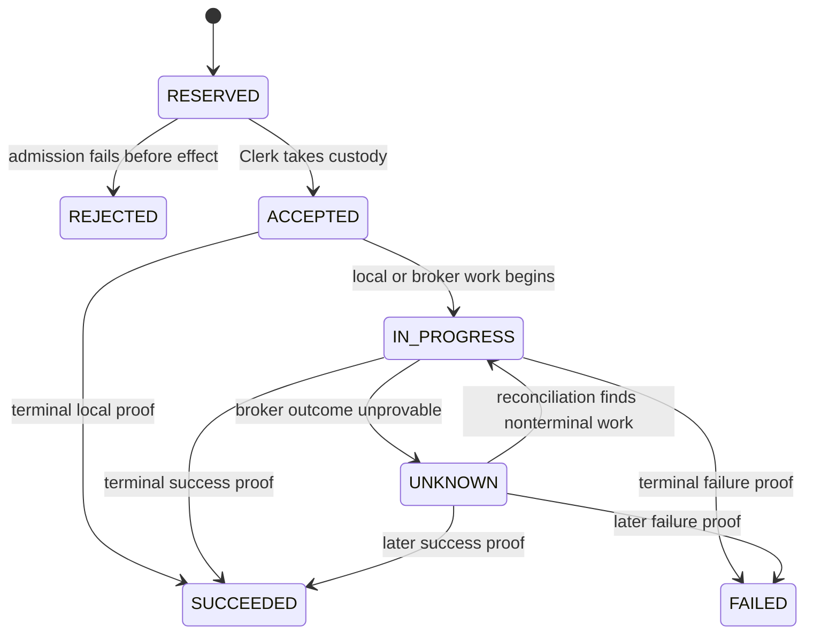

# Alpaca Clerk SQLite — pinned implementation contracts

- **Status:** Pinned for implementation (Slice 1 / issue #1374, PRD Phase 0).
  Produced alongside ADR 0035, which remains **Proposed** — this document does
  not change the ADR's acceptance status. It exists so Slices 2–10 build
  against one frozen contract instead of re-deriving it from prose each time.
- **Source of truth ranking:** ADR 0035 (decision rationale) →
  `docs/prds/alpaca-account-clerk-sqlite-control-plane.md` §9–§11 (functional
  contract) → this document (concrete, implementable pin). Where this document
  adds detail the PRD left unspecified (e.g. exact columns on `positions` or
  `holds`), that detail is a Slice 1 implementation decision, called out
  inline, and is binding on Slice 2 onward exactly like the rest of this file.
- **Scope:** logical schema (DDL), required uniqueness/immutability, PRAGMA
  set, transaction boundaries, command + custody state machines, hash-chain
  row format, write-only mirror line format, and fail-closed startup checks.
  No production code changes ship in this slice.

## 1. Database identity (PRD §9.1)

```text
<artifacts_root>/accounts/alpaca/<safe_account_id>/clerk.db
<artifacts_root>/accounts/alpaca/<safe_account_id>/custody_transitions.mirror
```

`safe_account_id` is the existing path-safe account-id transform already used
elsewhere in `PythonDataService/app/broker/alpaca/` (Slice 2 reuses it; it is
not redefined here).

## 2. PRAGMA / runtime configuration (PRD §9.2)

Enabled and verified on every connection open, in this order:

```sql
PRAGMA journal_mode = WAL;
PRAGMA synchronous = FULL;
PRAGMA foreign_keys = ON;
PRAGMA busy_timeout = 5000;   -- ms; Slice 2 may tune, must stay bounded and documented
```

- All mutations use `BEGIN IMMEDIATE ... COMMIT`. No bare `BEGIN`.
- One application-owned write coordinator (an `asyncio.Lock`-equivalent
  serializing writers within the process) sits in front of `BEGIN IMMEDIATE`
  — belt-and-suspenders, not a substitute for it.
- A durable per-account **execution lease** (a row in `control_meta`, see
  below) and a transactionally claimed **operation work item** (a row-level
  claim on the owning `effect_operations` row) are acquired before any broker
  contact. `BEGIN IMMEDIATE` proves single-writer-at-the-database; it does not
  prove single-process. The lease + work claim close that gap.
- A startup topology fence rejects a second local scheduler, stream-consumer,
  or reconciler registration for the same account within one process, and
  rejects a second process from acquiring the lease while it is held and
  unexpired.

## 3. Logical schema (PRD §9.3 pinned to concrete DDL)

`custody_transitions` is the sole canonical authority. Every other
business-state table is a fold of it, written in the **same SQLite
transaction** as the log append it derives from. `mirror_fence` is derived
delivery/recovery metadata, never custody authority.

```sql
-- ============================================================
-- control_meta — guarded singleton (PRD §9.1)
-- ============================================================
CREATE TABLE control_meta (
    id                      INTEGER PRIMARY KEY CHECK (id = 1),  -- singleton row
    schema_version          INTEGER NOT NULL,
    broker                  TEXT NOT NULL CHECK (broker = 'alpaca'),
    account_id              TEXT NOT NULL,
    db_identity_token       TEXT NOT NULL,          -- random, minted at init; rejects file substitution
    authority_generation    INTEGER NOT NULL,       -- increments only on explicit reset (§13)
    control_revision        INTEGER NOT NULL DEFAULT 0,  -- monotonic; advanced by every fold
    created_at_ms           INTEGER NOT NULL,
    last_open_at_ms         INTEGER NOT NULL,
    reset_provenance_json   TEXT,                   -- null unless this generation began via reset
    execution_lease_owner   TEXT,                   -- process identity holding the lease, null if unheld
    execution_lease_expires_at_ms INTEGER
);

-- ============================================================
-- strategy_instances — immutable configured bot identity; insert once, retire only
-- ============================================================
CREATE TABLE strategy_instances (
    strategy_instance_id    TEXT PRIMARY KEY,
    symbol                  TEXT NOT NULL,
    config_hash             TEXT NOT NULL,          -- content hash of the immutable bot config
    created_at_ms           INTEGER NOT NULL,
    retired_at_ms           INTEGER                 -- null while active; set once, never cleared
);

-- ============================================================
-- runs — per-instance run records and the active-run fence
-- ============================================================
CREATE TABLE runs (
    run_id                  TEXT PRIMARY KEY,
    strategy_instance_id    TEXT NOT NULL REFERENCES strategy_instances(strategy_instance_id),
    lifecycle_run_id        TEXT NOT NULL,          -- the identity Start/Resume reserves (ADR 0035 #3)
    state                   TEXT NOT NULL CHECK (state IN ('ACTIVE','STOPPED')),
    started_at_ms           INTEGER NOT NULL,
    stopped_at_ms           INTEGER
);
-- one active run fence per strategy instance (PRD §9.4):
CREATE UNIQUE INDEX ux_runs_one_active_per_instance
    ON runs(strategy_instance_id) WHERE state = 'ACTIVE';
CREATE UNIQUE INDEX ux_runs_lifecycle_run_id ON runs(strategy_instance_id, lifecycle_run_id);

-- ============================================================
-- commands — content-addressed request identity (R2)
-- ============================================================
CREATE TABLE commands (
    command_id              TEXT PRIMARY KEY,       -- opaque durable resource id (GET /commands/{command_id})
    authority_generation    INTEGER NOT NULL,
    idempotency_key         TEXT NOT NULL,           -- canonical natural key, see §3a below
    payload_hash            TEXT NOT NULL,           -- immutable once first committed
    kind                    TEXT NOT NULL CHECK (kind IN ('strategy_decision','operator_lifecycle')),
    strategy_instance_id    TEXT NOT NULL REFERENCES strategy_instances(strategy_instance_id),
    run_id                  TEXT REFERENCES runs(run_id),          -- null only for pre-run commands
    action                  TEXT NOT NULL,           -- e.g. START, RESUME, STOP, STOP_AND_FLATTEN, decision replay
    intended_end_state      TEXT,                    -- operator-lifecycle only
    state                   TEXT NOT NULL CHECK (state IN
                             ('reserved','rejected','accepted','in_progress','unknown','succeeded','failed')),
    effect_operation_id     TEXT REFERENCES effect_operations(effect_operation_id),
    receipt_id              TEXT REFERENCES receipts(receipt_id),
    created_at_ms           INTEGER NOT NULL,
    updated_at_ms           INTEGER NOT NULL
);
-- unique content-addressed command identity within the authority generation (§9.4):
CREATE UNIQUE INDEX ux_commands_idempotency
    ON commands(authority_generation, idempotency_key);

-- ============================================================
-- effect_operations — Clerk-owned ENTER/EXIT/cancel/recovery work (§7)
-- ============================================================
CREATE TABLE effect_operations (
    effect_operation_id     TEXT PRIMARY KEY,
    authority_generation    INTEGER NOT NULL,
    idempotency_key         TEXT NOT NULL,           -- Clerk effect idempotency identity, distinct from command's
    command_id              TEXT NOT NULL REFERENCES commands(command_id),
    strategy_instance_id    TEXT NOT NULL REFERENCES strategy_instances(strategy_instance_id),
    run_id                  TEXT REFERENCES runs(run_id),
    kind                    TEXT NOT NULL CHECK (kind IN
                             ('ENTER','EXIT','CANCEL','RECONCILE','STOP','STOP_AND_FLATTEN')),
    state                   TEXT NOT NULL CHECK (state IN
                             ('reserved','rejected','accepted','in_progress','unknown','succeeded','failed')),
    custody_owner           TEXT NOT NULL DEFAULT 'ACCOUNT_CLERK',
    created_at_ms           INTEGER NOT NULL,
    updated_at_ms           INTEGER NOT NULL,
    terminal_receipt_id     TEXT REFERENCES receipts(receipt_id)
);
-- unique Clerk effect idempotency identity (§9.4):
CREATE UNIQUE INDEX ux_effect_operations_idempotency
    ON effect_operations(authority_generation, idempotency_key);

-- ============================================================
-- orders — one row per broker/client order identity (R7)
-- ============================================================
CREATE TABLE orders (
    order_ref                TEXT PRIMARY KEY,       -- Clerk-minted, committed before submission
    effect_operation_id      TEXT NOT NULL REFERENCES effect_operations(effect_operation_id),
    client_order_id          TEXT NOT NULL,           -- Alpaca reconciliation identity (R7)
    broker_order_id          TEXT,                    -- filled in once Alpaca acknowledges
    role                     TEXT NOT NULL CHECK (role IN ('ENTRY','REDUCING','OTHER')),
    broker_state             TEXT,                    -- last proven Alpaca order status
    submitted_at_ms          INTEGER,
    updated_at_ms            INTEGER NOT NULL
);
-- unique broker client_order_id/order reference (§9.4):
CREATE UNIQUE INDEX ux_orders_client_order_id ON orders(client_order_id);
CREATE UNIQUE INDEX ux_orders_broker_order_id ON orders(broker_order_id)
    WHERE broker_order_id IS NOT NULL;

-- ============================================================
-- fills — permanent executions and corrections (append/idempotent insert)
-- ============================================================
CREATE TABLE fills (
    fill_id                  TEXT PRIMARY KEY,       -- Alpaca execution id (idempotent identity, §9.4)
    order_ref                TEXT NOT NULL REFERENCES orders(order_ref),
    qty                      REAL NOT NULL,
    price                    REAL NOT NULL,
    side                     TEXT NOT NULL CHECK (side IN ('BUY','SELL')),
    is_correction             INTEGER NOT NULL DEFAULT 0,  -- 1 = broker-issued correction, not erasure of prior fact
    source_event_at_ms       INTEGER,                 -- Alpaca's fill timestamp, when supplied
    clerk_observed_at_ms     INTEGER NOT NULL,
    recorded_at_ms           INTEGER NOT NULL
);

-- ============================================================
-- positions — current Clerk-attributed exposure; fold of the log, namespace-attributed
-- (never nets from raw broker position — preserves existing exposure.py semantics)
-- ============================================================
CREATE TABLE positions (
    strategy_instance_id     TEXT NOT NULL REFERENCES strategy_instances(strategy_instance_id),
    symbol                   TEXT NOT NULL,
    attributed_qty           REAL NOT NULL DEFAULT 0,
    updated_at_ms             INTEGER NOT NULL,
    PRIMARY KEY (strategy_instance_id, symbol)
);

-- ============================================================
-- holds — active and resolved bot/Account-Clerk holds; fold of the log
-- ============================================================
CREATE TABLE holds (
    hold_id                  TEXT PRIMARY KEY,
    scope                    TEXT NOT NULL CHECK (scope IN ('BOT','ACCOUNT_CLERK')),
    strategy_instance_id     TEXT REFERENCES strategy_instances(strategy_instance_id),  -- null for ACCOUNT_CLERK scope
    reason_code               TEXT NOT NULL,
    state                     TEXT NOT NULL CHECK (state IN ('ACTIVE','RESOLVED')),
    opened_at_ms               INTEGER NOT NULL,
    resolved_at_ms             INTEGER,
    evidence_refs_json         TEXT
);

-- ============================================================
-- uncertainties — active nonterminal unknowns; fold of the log. Columns are
-- the R5 envelope verbatim.
-- ============================================================
CREATE TABLE uncertainties (
    uncertainty_id            TEXT PRIMARY KEY,
    scope                     TEXT NOT NULL CHECK (scope IN ('BOT','ACCOUNT_CLERK')),
    severity                  TEXT NOT NULL,
    blocks_new_exposure       INTEGER NOT NULL CHECK (blocks_new_exposure IN (0,1)),
    allows_reduction          INTEGER NOT NULL CHECK (allows_reduction IN (0,1)),
    custody_owner             TEXT NOT NULL DEFAULT 'ACCOUNT_CLERK',
    strategy_instance_id      TEXT REFERENCES strategy_instances(strategy_instance_id),  -- null for ACCOUNT_CLERK
    reason_code               TEXT NOT NULL,
    headline                  TEXT NOT NULL,
    explanation               TEXT NOT NULL,
    operator_impact           TEXT NOT NULL,
    next_step                 TEXT NOT NULL,
    observed_at_ms            INTEGER NOT NULL,
    resolved_at_ms            INTEGER,       -- null while active
    evidence_refs_json        TEXT,
    facts_schema_version      INTEGER NOT NULL,
    facts_json                TEXT NOT NULL
);

-- ============================================================
-- reconciliations — reconciliation attempts and terminal receipts
-- ============================================================
CREATE TABLE reconciliations (
    reconciliation_id        TEXT PRIMARY KEY,
    effect_operation_id      TEXT REFERENCES effect_operations(effect_operation_id),
    order_ref                TEXT REFERENCES orders(order_ref),
    trigger                  TEXT NOT NULL CHECK (trigger IN ('AUTOMATIC','OPERATOR_RECONCILE_NOW')),
    attempted_at_ms           INTEGER NOT NULL,
    outcome                   TEXT NOT NULL CHECK (outcome IN ('STILL_UNKNOWN','RESOLVED_SUCCESS','RESOLVED_FAILURE')),
    evidence_refs_json        TEXT
);

-- ============================================================
-- receipts — permanent terminal command/effect proof; insert once
-- ============================================================
CREATE TABLE receipts (
    receipt_id                TEXT PRIMARY KEY,
    command_id                 TEXT REFERENCES commands(command_id),
    effect_operation_id        TEXT REFERENCES effect_operations(effect_operation_id),
    terminal_state              TEXT NOT NULL CHECK (terminal_state IN ('succeeded','failed')),
    summary_code                 TEXT NOT NULL,          -- stable code; prose comes from the closed registry (§11 rule 5)
    proof_reference               TEXT,
    recorded_at_ms                 INTEGER NOT NULL,
    facts_json                      TEXT
);

-- ============================================================
-- custody_transitions — THE canonical, append-only, hash-chained,
-- operation-first log. Columns are the PRD §11 list verbatim.
-- ============================================================
CREATE TABLE custody_transitions (
    sequence                  INTEGER PRIMARY KEY AUTOINCREMENT,   -- serialization order, not broker time
    prev_hash                 TEXT,                     -- null only for sequence 1
    row_hash                  TEXT NOT NULL,
    authority_generation      INTEGER NOT NULL,
    strategy_instance_id      TEXT REFERENCES strategy_instances(strategy_instance_id),
    run_id                    TEXT REFERENCES runs(run_id),
    command_id                TEXT REFERENCES commands(command_id),
    effect_operation_id       TEXT REFERENCES effect_operations(effect_operation_id),
    order_ref                 TEXT REFERENCES orders(order_ref),
    broker_order_id           TEXT,
    transition_kind           TEXT NOT NULL,
    custody_owner             TEXT NOT NULL,
    execution_authority       TEXT NOT NULL,
    operation_state           TEXT NOT NULL,
    broker_state              TEXT,
    proof_reference           TEXT,
    source_event_at_ms        INTEGER,   -- null unless Alpaca supplied one; never backfilled
    clerk_observed_at_ms      INTEGER NOT NULL,
    recorded_at_ms            INTEGER NOT NULL,
    summary_code              TEXT NOT NULL,
    facts_schema_version      INTEGER NOT NULL,
    facts_json                TEXT NOT NULL
);
-- immutable sequence/payload/hash-chain-link after commit (§9.4): enforced by
-- application code (SQLite has no UPDATE-forbidding constraint); Slice 2's
-- repository boundary is the only writer and never issues UPDATE/DELETE
-- against this table. A dedicated test asserts that.

-- ============================================================
-- mirror_fence — mirror prepare/finalize identities; derived, never authority
-- ============================================================
CREATE TABLE mirror_fence (
    sequence                  INTEGER PRIMARY KEY,     -- matches custody_transitions.sequence 1:1
    phase                     TEXT NOT NULL CHECK (phase IN ('PREPARE','FINALIZE')),
    row_hash                  TEXT NOT NULL,
    authority_generation      INTEGER NOT NULL,
    recorded_at_ms            INTEGER NOT NULL
);
```

### 3a. Content-addressed idempotency keys (R2, ADR 0035 #3)

- **Strategy decision:** `idempotency_key = f"{strategy_instance_id}:{decision_id}"`.
- **Operator lifecycle:** `idempotency_key = f"{account_id}:{strategy_instance_id}:{lifecycle_run_id}:{action}:{intended_end_state}"`.
  Start/Resume reserves its proposed `lifecycle_run_id` in `runs` **before**
  the `commands` row commits its key; Stop resolves and binds the currently
  `ACTIVE` run's `lifecycle_run_id`. This is why a run-2 lifecycle command
  cannot collide with the same action recorded for run 1 — the key embeds the
  run identity.
- `payload_hash` canonically hashes: action, target, account, instance, run,
  the immutable semantic payload, and any operator reason that changes
  meaning (R2). Same key + same hash → transport retry (return existing, no
  error). Same key + different hash → durable conflict (§9.4 "immutable
  request hash for an existing command").

### 3b. Uniqueness and immutability — full pin (PRD §9.4)

| Requirement | Enforced by |
| --- | --- |
| Unique content-addressed command identity within the authority generation | `ux_commands_idempotency` |
| Immutable request hash for an existing command | Repository boundary rejects any UPDATE of `commands.payload_hash`; parity test |
| Unique Clerk effect idempotency identity | `ux_effect_operations_idempotency` |
| Unique broker `client_order_id`/order reference | `ux_orders_client_order_id`, `orders.order_ref` PK |
| Idempotent broker-event and fill identities | `fills.fill_id` PK (Alpaca execution id) |
| One active run fence per strategy instance | `ux_runs_one_active_per_instance` (partial unique index) |
| One monotonically increasing account control revision | `control_meta.control_revision`, advanced by every fold, asserted non-decreasing by a repository invariant test |
| Immutable terminal receipt identity | `receipts.receipt_id` PK, insert-only repository method (no update method exists) |
| Immutable custody-transition sequence, payload, and hash-chain link after commit | `AUTOINCREMENT` PK + repository boundary issues no UPDATE/DELETE on `custody_transitions`; parity test |

## 4. Transaction matrix — which facts commit atomically together

| Operation | Atomic SQLite transaction contents | External fence before "accepted"/broker-eligible |
| --- | --- | --- |
| Command reservation | insert `commands` (state=`reserved`) | none — reservation alone is not externally visible acceptance |
| Command acceptance (admission passes, no broker contact needed, e.g. reject/local-terminal) | update `commands.state`, insert `custody_transitions` row, apply fold(s), advance `control_meta.control_revision`, insert `mirror_fence` PREPARE row | mirror **finalize** fsync (R9 step 3) — required even when no broker contact occurs, because the transition is still the accepted record of the decision |
| Effect operation acceptance + broker-eligible capture (R1) | insert/update `effect_operations`, insert `orders` (order_ref minted), insert `custody_transitions` (with hash link), apply every affected fold (`positions`/`holds`/`uncertainties` as relevant), advance `control_meta.control_revision`, insert `mirror_fence` PREPARE row | mirror **finalize** fsync — this is the acceptance fence; no broker call may occur before it completes (R1) |
| Broker evidence fold (fill, order-state transition, reconciliation outcome) | insert `fills`/update `orders.broker_state`, insert `custody_transitions`, apply fold, advance revision, insert `mirror_fence` PREPARE row | mirror finalize fsync before the fold is externally visible as current state |
| Reset / new generation (§13) | update `control_meta.authority_generation`, insert `custody_transitions` (generation-reset transition kind), fresh `mirror_fence` sequence restarts at 1 for the new generation | requires the full reset workflow (fresh broker proof, flat/order-free account) — Slice 9 scope, not Slice 1 |

Every row above obeys R9's ordered fsync fence exactly:

1. **Prepare** — fsync a mirror line (authority generation, sequence,
   canonical transition bytes, predecessor hash, row hash) *before* the
   SQLite transaction opens.
2. **Commit** — one `synchronous=FULL` SQLite transaction: verify the
   prepared identity, append the `custody_transitions` row, apply every
   fold, insert the matching `mirror_fence` row, commit.
3. **Finalize** — fsync the matching finalize record. Only after this may the
   backend return accepted or claim the operation for broker contact.

## 5. Command lifecycle state machine (PRD §10.1, pinned)



Closed vocabulary (R3): `reserved | rejected | accepted | in_progress |
unknown | succeeded | failed`. `commands.state` and `effect_operations.state`
CHECK constraints above enforce this vocabulary at the schema level.
`UNKNOWN` is terminal only for the synchronous HTTP wait (endpoint may return
`202 Accepted`); it is nonterminal for SQLite custody — no CHECK constraint
can express that half, so Slice 5 (#1378) is responsible for the
reconciliation behavior itself.

## 6. Operation-first custody structure (PRD §10.2, pinned)

```text
EXIT operation
├── accepted by Account Clerk
├── working-entry cancellation
│   └── entry order broker transitions
├── final attributed-quantity calculation
├── reducing order
│   └── close order broker transitions and fills
└── attributed-exposure verification
    └── terminal EXIT receipt
```

An `effect_operations` row of kind `EXIT` owns one or more `orders` rows via
`orders.effect_operation_id`; `orders.role` distinguishes the cancelled entry
from the reducing/close order. The UI may open an individual order, but the
primary timeline and terminal outcome belong to the effect operation (Slice 8
reads `custody_transitions` filtered by `effect_operation_id`, ordered by
`sequence`, to render this).

## 7. Hash-chain row format (PRD §11 rule 2, pinned)

```text
row_hash = H(prev_hash || canonical(payload))
```

- `H` = SHA-256, hex-encoded.
- `canonical(payload)` = the row's non-hash columns (`authority_generation`
  through `facts_json`, i.e. everything except `sequence`, `prev_hash`,
  `row_hash` themselves), serialized as JSON with sorted keys, UTF-8 encoded,
  no whitespace between tokens (`json.dumps(..., sort_keys=True,
  separators=(",", ":"))` in Slice 2's Python implementation).
- `prev_hash` for `sequence = 1` is the fixed genesis value `"GENESIS"` (not
  null, not empty string — an explicit sentinel so a truncated chain cannot
  be mistaken for a fresh one during rebuild verification).
- The chain is verified at startup (§13) and on every mirror rebuild by
  recomputing `row_hash` for each row in sequence order and comparing.

## 8. Write-only mirror line format (R9, pinned)

One line per record, newline-delimited JSON, append-only, fsync'd after every
write. Two record kinds share the file:

```json
{"phase": "PREPARE", "sequence": 42, "authority_generation": 3, "row_hash": "…", "prev_hash": "…", "payload_canonical": "…", "recorded_at_ms": 1785900000000}
{"phase": "FINALIZE", "sequence": 42, "authority_generation": 3, "row_hash": "…", "recorded_at_ms": 1785900000012}
```

- `payload_canonical` on the PREPARE line is the exact `canonical(payload)`
  string hashed in §7 — this is what makes a from-mirror rebuild able to
  recompute `row_hash` and reconstruct the row without touching `clerk.db`.
- The FINALIZE line omits `payload_canonical` (redundant — it's a
  fsync'd commitment that the matching PREPARE's transaction committed, not a
  second copy of the payload).
- Rebuild only imports a `sequence` that has **both** a PREPARE and a
  matching FINALIZE line with the same `row_hash`. A PREPARE without a
  FINALIZE is an aborted preparation (excluded, no broker effect could have
  occurred). A sequence gap, a duplicate sequence with a different hash, or a
  hash-chain break (recomputing `row_hash` from `prev_hash` +
  `payload_canonical` disagrees with the stored `row_hash`) fails closed —
  the rebuild halts rather than importing ambiguous data.
- Mirror retention/rotation policy: rotated per authority generation. A prior
  generation's mirror file is retained read-only for audit and is never
  consulted for current-generation rebuild. (Rotation mechanics are a Slice 2
  implementation detail; this pins only the *contract* — one mirror file is
  scoped to exactly one authority generation.)

## 9. Fail-closed startup checks (PRD §9.2, §13, pinned as an ordered list)

On every process start, before the Clerk accepts any command:

1. **Path confinement** — `clerk.db` and the mirror file resolve inside the
   expected `accounts/alpaca/<safe_account_id>/` directory; reject symlink
   escapes or a path outside `artifacts_root`.
2. **Database identity** — `control_meta.db_identity_token` exists and was
   minted by this account's initialization, not copied from another account's
   database.
3. **Account identity** — `control_meta.account_id` matches the requested
   account; mismatch fails closed (§9.1).
4. **Schema** — `control_meta.schema_version` matches the version this Slice
   2+ binary expects; an older/newer schema fails closed rather than
   attempting an implicit migration.
5. **Authority generation** — `control_meta.authority_generation` is read and
   becomes part of every subsequent idempotency key and hash-chain check for
   this session (generation is not itself re-validated against an external
   source at this step — that happens only during reset, Slice 9).
6. **`PRAGMA integrity_check`** — must return `ok`; any other result fails
   closed and preserves the file for diagnosis (never overwrites it).
7. **Hash-chain verification** — recompute `row_hash` for every
   `custody_transitions` row in sequence order (§7); the first mismatch fails
   closed.
8. **Mirror reconciliation** — for the highest committed `custody_transitions`
   sequence, confirm a matching FINALIZE mirror line exists. If the DB shows a
   commit with no FINALIZE line, finalize it now (crash between steps 2 and 3
   of §4's fence, DB is intact — this is the one case startup is allowed to
   complete a fence rather than fail closed, because the DB transaction is
   the durable fact and the mirror is catching up to it, not the reverse).
   If the DB is later found corrupt in a way that prevents this comparison,
   fall back to the full mirror-rebuild recovery workflow (Slice 2 scope)
   instead of guessing.

Only after all eight checks pass does the process register its execution
lease (§2) and accept commands.

## 10. What Slice 2 owes back to this document

Slice 2 (#1375) implements this schema, PRAGMA set, and transaction matrix
literally — table names, column names, and constraint semantics above are
binding, not illustrative. If Slice 2 discovers a genuine implementation-level
necessity to deviate (e.g. a column needs a different type for a
`sqlite3`-driver reason), it updates this document in the same PR and states
the reason, per this repo's "single source of truth" rule — it does not
silently diverge.
