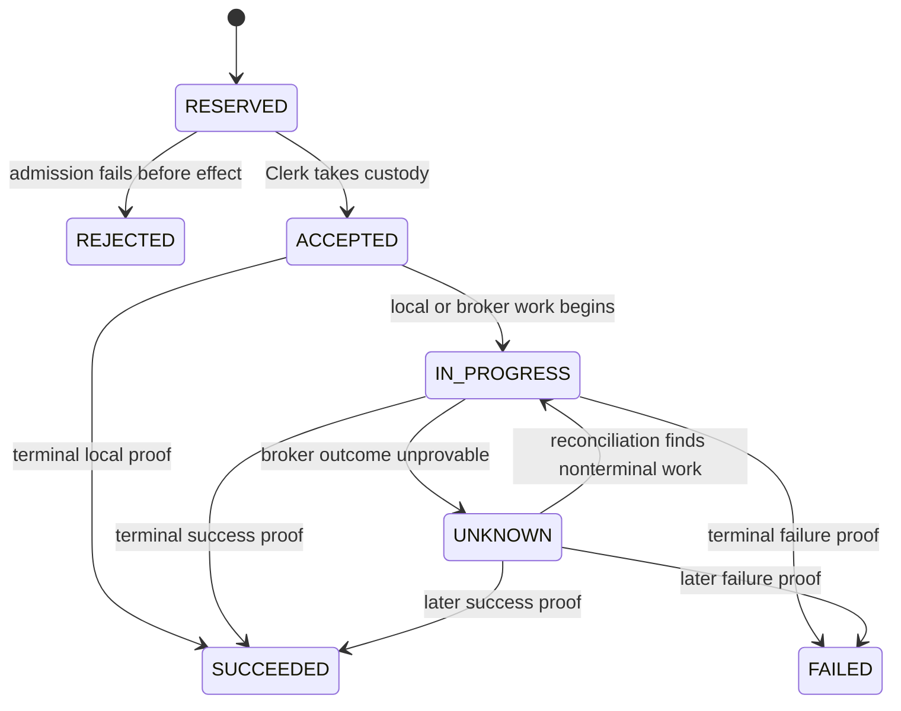

# Alpaca Clerk SQLite — pinned implementation contracts

- **Status:** Pinned for implementation (Slice 1 / issue #1374, PRD Phase 0).
  Produced alongside ADR 0035, which remains **Proposed** — this document does
  not change the ADR's acceptance status. It exists so Slices 2–10 build
  against one frozen contract instead of re-deriving it from prose each time.
  **Corrected by the corrective foundation slice** (see
  `docs/superpowers/plans/2026-08-05-alpaca-clerk-corrective-foundation-slice.md`
  and `docs/audits/open-pr-review-2026-08-05.md`): §3–§4 no longer describe a
  standalone command reservation, which directly contradicted PRD §4 goal 3
  and §9.3; §9 gained per-sequence mirror reconciliation, generation
  validation, lease renewal, and full path confinement. `SCHEMA_VERSION`
  bumped 1 → 2 for the DDL changes this correction required.
- Issue #1377 (ENTER) added an index on `custody_transitions(order_ref)` (§3)
  — no new columns, but a DDL change all the same, so `SCHEMA_VERSION` bumped
  2 → 3. There is no live database to migrate yet (human cutover, #1383); the
  bump exists so `open()`'s version check rejects a stale on-disk DDL
  shape with a clear error instead of silently running without the index.
- The consolidated Account Clerk control-plane PR keeps order provenance
  immutable and records later resolution custody in `operation_order_links`.
  The new table and once-only reducing-order index bump `SCHEMA_VERSION` 3 → 4.
  There is still no live database to migrate (human cutover, #1383).
- Issue #1395 adds covering read-model indexes for bounded account/bot
  snapshots and timeline pages. `SCHEMA_VERSION` bumps 4 → 5; there is still
  no activated SQLite account to migrate before the human cutover in #1383.
- The execution-ledger authority expansion is a fresh schema-v7 generation.
  It adds execution provenance to the `fills` fold plus `external_orders`,
  `bot_config`, and `decision_receipts`. The registered v6 → v7 migration is
  deliberately guarded: it atomically adds the complete v7 DDL only after
  proving every operational v6 table is empty. A data-bearing v6 authority
  fails closed and remains untouched; the human cutover initializes a clean
  v7 authority generation after the existing account is safely retired.
- Schema-v8 keeps the exact custody transition sequence which materialized
  each execution, so equal broker timestamps never force a fabricated
  secondary ordering key. It also replaces the ambiguous external-order
  `price` field with the broker's order type plus separate limit, stop, and
  filled-average prices. The additive v7 → v8 migration backfills only
  execution rows whose transition facts name their execution identity; any
  unprovable legacy sequence remains unavailable to sequence-sensitive reads.
- Schema-v9 makes the economic actor explicit through immutable
  `custody_subjects`: an existing strategy receives exactly one `BOT` subject,
  and a trusted human receives exactly one `MANUAL_OPERATOR` subject. The v8 →
  v9 path is deliberately **offline only**: normal startup refuses v8, while
  the operator ceremony verifies a backup, replays finalized mirror facts into
  a staged v9 authority, proves journal/projection parity, fsyncs a prepared
  receipt, and atomically swaps only a verified stage. A stopped retry
  finalizes a post-swap prepared receipt only after it re-verifies the selected
  v9 journal identity. See the recovery runbook's “Offline v8-to-v9
  custody-subject upgrade” procedure.
- Schema-v10 adds the immutable `manual_order_cancellations` resource and
  expands the subject-bound effect trigger to admit its `CANCEL` effect. The
  registered v9 → v10 migration creates that resource and replaces the two
  effect-subject triggers in the same transaction; the verified v8 → v9
  ceremony remains exactly v9 and startup then applies this additive upgrade.
- Schema-v11 adds an immutable `sequence_index` to each replayable manual
  ticket leg. The registered v10 → v11 migration deterministically backfills
  distinct indices for every historical ticket, adds the per-ticket uniqueness fence, and
  replaces the leg-identity trigger so an operator cannot reorder a reserved
  ticket after confirmation.
- Schema-v12 folds `holds` into `uncertainties` (ADR 0048 Decision 2): the
  hold table is retired and its name survives only as a read-only view over
  the uncertainty rows whose `reason_code` is a registered hold cause. The
  registered v11 → v12 migration drops the table with its indexes and
  subject-compatibility triggers and creates the view in the same
  transaction, so one vocabulary — the registry — decides what a hold is.
- Schema-v13 adds `envelope_reservations`, the cash one accepted ENTER
  claims until its fills are observed (ADR 0059 Decision 4). It was first
  product evidence outside the hash chain, like `decision_receipts`: written
  inside `ENTER_ACCEPTED`'s transaction, never in `facts_json`, never in the
  mirror. Every reservation is now folded from `ENTER_ACCEPTED`'s facts (the
  exact price and the recorded fee provision, #2553), so it replays; a row
  written the earlier way carries no provision and refuses to price an
  unfilled remainder's fee. It also indexes `external_orders.observed_at_ms`: the day-P&L rule asks
  that column one question on every 15 s envelope tick and the table's only
  index was on `broker_order_id`.
  The registered v12 → v13 migration is the same statement list the fresh
  block renders, so it also re-publishes the `holds` view — a view's SQL is
  stored text fixed at the version that created it, and only re-rendering it
  from `HOLD_REASON_CODES` makes an upgraded file project the new
  loss-hold cause exactly as a fresh one does.
- Schema-v14 admits `simulated_execution` into the `fills.evidence_source`
  vocabulary (#2178). A deterministic no-submit adapter (the Shadow and
  Dry-Run worlds) executes entirely inside `submit` and shapes each fill
  event with its own durable execution identity, so its authoritative
  submission response folds as exact execution slices — not through the
  generic cumulative-recovery delta that read every simulated fill as
  incomplete coverage and raised a false `needs_attention` flag on healthy
  Shadow bots. SQLite cannot ALTER a CHECK constraint, so the registered
  v13 → v14 migration replaces the table (the v11 → v12 holds replacement
  is the precedent) and backfills only persisted rows whose own durable
  evidence proves they were Shadow-synthesized: the order's
  `broker_order_id` is the synthesized `shadow-order:<client_order_id>`
  identity and the order owns exactly one cumulative fill. Real Paper/Live
  cumulative recovery rows are untouched by construction — the re-derived
  `shadow-execution:` identity is the Shadow world's own namespace, never a
  fabricated broker receipt. The Dry-Run world's legacy rows are not
  re-tagged by the migration; they convert lazily through the
  auto-supersession proof when their order is next observed.
- Schema-v15 is index-only (#2305): `ix_fills_order_ref` and
  `ix_fills_superseded_execution_ref` cover the effective-fill predicate the
  reconciliation worklist evaluates per nonterminal order, to decide whether
  a terminal order's recorded fills still fall short of the broker's
  reported cumulative (`ORDER_SUBMIT_ACKED.facts_json.reported_filled_quantity`,
  omitted when absent so every earlier acknowledgement stays `{}`). Every
  historical ENTER stays nonterminal, so without them that read scanned
  `fills` once per order and again per fill. The registered v14 → v15
  migration is the same two `CREATE INDEX IF NOT EXISTS` statements.
- Schema-v16 is index-only (#2363): `ix_custody_transitions_resolution_summary`
  (partial, `UNCERTAINTY_RESOLVED` rows only) lets the unfoldable-broker-order
  fence read its operator reviews
  (`UNFOLDABLE_BROKER_ORDER_ACKNOWLEDGED` resolutions) without scanning the
  append-only journal on every sweep of a resting order, and
  `ix_uncertainties_reason_code` lets the day-P&L fact read every
  `UNFOLDABLE_BROKER_ORDER` episode without scanning `uncertainties`. The
  registered v15 → v16 migration is the same two `CREATE INDEX IF NOT EXISTS`
  statements.
- Schema-v17 adds `exit_recovery_checks`, one replaceable freshness row per bot.
  It stores the current episode, lease owner, successful-check and completed-pass
  times, and configured interval. It stores no failure budget or recovery decision:
  those remain hash-chained `EXIT_RECOVERY_EVALUATED` facts. The additive v16 → v17
  migration starts with no freshness proof; the current owner must complete a pass.
- Schema-v18 adds `strategy_exit_terms`, the single immutable, journal-rebuildable
  projection of each bot's execution terms. The v17 → v18 migration folds existing
  registration and `EXIT_TERMS_SEALED` facts without rewriting their hashes.
  After arming refresh, the explicit legacy upgrade seals any remaining old
  registrations once and appends `EXIT_TERMS_UPGRADE_COMPLETED`. New Starts must
  supply deployed terms; binding JSON is never a pricing or arming authority.
- Schema-v22 (#2555) adds `released_cents` and `held_cents` to
  `deployment_budgets`: what a Stop released and what stayed claimed then, folded
  from its `RUN_STOPPED` facts (both or neither) so a money read takes them from
  the budget row instead of searching the journal. The v21 → v22 migration fills
  them from the Stops already recorded, without rewriting any hash.
- Issue #1775 narrows one clause of §3f. `EXIT_ACCEPTED.entry_order_refs`
  captured *every* same-strategy/symbol sibling entry; it now captures every
  sibling that is still **cancel-provable**, excluding one already carrying
  durable proof that the broker never accepted it (no broker order id, no
  acknowledgement, no fill, and a definitive-absence void on its owning
  ENTER). Such an order can hold no exposure and can never be cancelled, so
  enumerating it only gave each reconciliation pass a dead order to prove —
  the mechanism behind fleet-stress finding S15c. The EXIT's own targeted
  entry is always captured, whatever its state. No DDL change, so
  `SCHEMA_VERSION` is unchanged; the shared every-ENTRY read that safe
  flatten, runtime recovery and the stuck-EXIT watchdog use is unchanged too.
- **Source of truth ranking:** ADR 0035 (decision rationale) →
  `docs/prds/alpaca-account-clerk-sqlite-control-plane.md` §9–§11 (functional
  contract) → this document (concrete, implementable pin). Where this document
  adds detail the PRD left unspecified (e.g. exact columns on `positions` or
  `holds`), that detail is a Slice 1 implementation decision, called out
  inline, and is binding on Slice 2 onward exactly like the rest of this file.
- **Scope:** logical schema (DDL), required uniqueness/immutability, PRAGMA
  set, transaction boundaries, command + custody state machines, hash-chain
  row format, write-only mirror line format, and fail-closed startup checks.
  No production code changes ship in this slice.

## 1. Database identity (PRD §9.1)

```text
<artifacts_root>/accounts/alpaca/<safe_account_id>/clerk.db
<artifacts_root>/accounts/alpaca/<safe_account_id>/custody_transitions.mirror
```

`safe_account_id` is the existing path-safe account-id transform already used
elsewhere in `PythonDataService/app/broker/alpaca/` (Slice 2 reuses it; it is
not redefined here).

### 1a. Established-accounts registry

Closes PRD §15.4: "remove `clerk.db` after authority was established and
prove it is not recreated."

Every fail-closed check in §9 reads state *from* `clerk.db` or its mirror.
None of them can distinguish "this account's database was deleted" from
"this account has never been initialized" — both look identical from inside
the per-account directory once `clerk.db` is gone. Proving the former
requires evidence that survives deletion of that directory, so it cannot
live inside it.

```text
<artifacts_root>/accounts/alpaca/_established_generations.jsonl
```

One append-only, fsync'd, newline-delimited JSON line per successful
`clerk.db` initialization — the very first one for an account, and every
reset-created generation after it:

```json
{"account_id": "...", "authority_generation": 3, "db_identity_token": "...", "established_at_ms": 1785900000000}
```

This file lives at the `accounts/alpaca/` level, one directory above any
single account — deleting or corrupting one account's directory cannot erase
its own establishment evidence. (It does not defend against wiping the
entire `accounts/alpaca/` tree; that is outside the trust boundary the PRD
draws around `artifacts_root`, consistent with every other recovery
mechanism in this document.) Slice 2 owns writing to it as part of the
"initialize a new database and authority generation" workflow; this document
pins only that the file exists, its format, and that startup consults it —
see §9 check 2.

## 2. PRAGMA / runtime configuration (PRD §9.2)

Enabled and verified on every connection open, in this order:

```sql
PRAGMA journal_mode = WAL;
PRAGMA synchronous = FULL;
PRAGMA foreign_keys = ON;
PRAGMA busy_timeout = 5000;   -- ms; Slice 2 may tune, must stay bounded and documented
```

- All mutations use `BEGIN IMMEDIATE ... COMMIT`. No bare `BEGIN`.
- One application-owned write coordinator (an `asyncio.Lock`-equivalent
  serializing writers within the process) sits in front of `BEGIN IMMEDIATE`
  — belt-and-suspenders, not a substitute for it.
- A durable per-account **execution lease** (a row in `control_meta`, see
  below) and a transactionally claimed **operation work item** (a row-level
  claim on the owning `effect_operations` row) are acquired before any broker
  contact. `BEGIN IMMEDIATE` proves single-writer-at-the-database; it does not
  prove single-process. The lease + work claim close that gap. Claims are
  exclusive even for the same process owner: each attempt gets a new token,
  renews that exact still-live token before and after broker I/O, revalidates
  it before folding evidence, and CAS-releases only its own token. An expired
  attempt cannot resurrect itself or mutate projections after a successor
  takes over.
- A startup topology fence rejects a second local scheduler, stream-consumer,
  or reconciler registration for the same account within one process, and
  rejects a second process from acquiring the lease while it is held and
  unexpired.

## 3. Logical schema (PRD §9.3)

`custody_transitions` is the sole canonical authority. Every other
business-state table is a fold of it, written in the **same SQLite
transaction** as the log append it derives from. `mirror_fence` is derived
delivery/recovery metadata, never custody authority.

The DDL itself is code: `SCHEMA_DDL` in
`app/broker/alpaca/clerk/sqlite/schema.py`. This annex keeps no copy of it.

Five `custody_transitions` foreign keys (`strategy_instance_id`, `run_id`,
`command_id`, `effect_operation_id`, `order_ref`) are `DEFERRABLE INITIALLY
DEFERRED` — discovered as a genuine implementation-level necessity while
building Slice 2, per §10. A transition legitimately creates the very
entity it references in the same atomic commit (e.g. a
`STRATEGY_INSTANCE_REGISTERED` transition's fold inserts the
`strategy_instances` row it points at). SQLite checks a plain `REFERENCES`
immediately, per statement; deferring the check to `COMMIT` lets the
transition row and the entity row commit together in either statement
order without breaking the FK guarantee itself — it is still enforced,
just at the transaction boundary instead of the statement boundary, which
is exactly where this document already draws the atomicity line (§4).

### 3a. Content-addressed idempotency keys (R2, ADR 0035 #3)

- **Strategy decision:** `idempotency_key = f"{strategy_instance_id}:{decision_id}"`.
- **Operator lifecycle:** `idempotency_key = f"{account_id}:{strategy_instance_id}:{lifecycle_run_id}:{action}:{intended_end_state}"`.
  **Both** Start/Resume and Stop take a caller-supplied `lifecycle_run_id` —
  Stop is not exempt. A prior revision of this document had Stop *resolve*
  `lifecycle_run_id` from the currently `ACTIVE` run instead of taking it from
  the caller; that made a lost Stop response unrecoverable (a retry could no
  longer find an active run to resolve against, since the first attempt had
  already stopped it) and is corrected here (open-pr-review-2026-08-05.md
  P2 "Stop retry loses the active-run identity"). The existing-command lookup
  by `idempotency_key` happens **before** admission re-reads the active run,
  so a lost-response retry replays the already-completed Stop even though the
  run it targeted is no longer active. This is why a run-2 lifecycle command
  cannot collide with the same action recorded for run 1 — the key embeds the
  run identity supplied by the caller for both directions.
- `payload_hash` canonically hashes: action, target, account, instance, run,
  the immutable semantic payload, and any operator reason that changes
  meaning (R2). Same key + same hash → transport retry (return existing, no
  error). Same key + different hash → durable conflict (§9.4 "immutable
  request hash for an existing command").

### 3b. Uniqueness and immutability — full pin (PRD §9.4)

| Requirement | Enforced by |
| --- | --- |
| Unique content-addressed command identity within the authority generation | `ux_commands_idempotency` |
| Immutable request hash for an existing command | `trg_commands_payload_hash_immutable` (DB-enforced) |
| Unique Clerk effect idempotency identity | `ux_effect_operations_idempotency` |
| Unique broker `client_order_id`/order reference | `ux_orders_client_order_id`, `orders.order_ref` PK |
| Idempotent fill identities | `fills.fill_id` PK (Alpaca execution id) |
| Idempotent broker order-state-transition events | No separate identity table — the fold is idempotent by construction (§3c) |
| One active run fence per strategy instance | `ux_runs_one_active_per_instance` (partial unique index) |
| One monotonically increasing account control revision | `control_meta.control_revision`, advanced by every fold, asserted non-decreasing by a repository invariant test |
| Immutable terminal receipt identity | `receipts.receipt_id` PK, insert-only repository method (no update method exists) |
| Immutable custody-transition sequence, payload, and hash-chain link after commit | `AUTOINCREMENT` PK + `trg_custody_transitions_immutable_update`/`_delete` (DB-enforced) |

### 3c. Idempotent broker order-state-transition folding (§9.4, distinct from fill identity)

Fills need identity-based dedup (`fills.fill_id`) because double-counting an
execution corrupts P&L. A pure order-*status* transition (e.g. `new` →
`accepted` → `partially_filled`) does not carry that risk and does not get a
separate idempotency table. Instead the fold is idempotent by construction:

- Applying an identical `(order_ref, broker_state, source_event_at_ms)` a
  second time is a no-op — `orders.broker_state` is already that value.
- An event whose `source_event_at_ms` is older than the value already
  recorded for that order is still appended to `custody_transitions` (for
  audit — nothing is silently dropped) but does **not** regress
  `orders.broker_state`, satisfying adversarial test 15.2's "duplicate and
  out-of-order broker events fold idempotently."
- This relies on Alpaca order states being monotonic for a given order
  lifecycle (Slice 5/#1378's reconciliation logic owns the exact ordering
  table); this document pins only that no separate broker-event-identity
  table is introduced for this purpose.

### 3d. Typed replay facts (corrective foundation slice, Scope A2)

Every registered `transition_kind`'s `facts_json` is a **typed** dataclass, not
an untyped snapshot bag — `facts_schema_version` selects the parser. A fold
must be able to rebuild an identical `commands` (and, from #1377 onward,
`effect_operations`/`orders`) row from a finalized mirror line alone: the
mirror has only the outer transition payload plus this facts string, never a
live database or a caller closure to consult. Concretely, any command-only
field that is *not* already an outer `custody_transitions` column
(`idempotency_key`, `payload_hash`, `kind`, `action`, `intended_end_state` —
`strategy_instance_id`, `run_id`, and `command_id` already are outer columns)
must round-trip through facts.

| Transition | Required facts beyond the outer transition row |
| --- | --- |
| `RUN_STARTED` | `idempotency_key`, `payload_hash`, `kind`, `action`, `intended_end_state`, `lifecycle_run_id`, `operator_reason` |
| `COMMAND_REJECTED` | `idempotency_key`, `payload_hash`, `kind`, `action`, `intended_end_state`, `reason_code`, `operator_reason` |
| `RUN_STOPPED` | `idempotency_key`, `payload_hash`, `kind`, `action`, `intended_end_state`, `lifecycle_run_id`, `operator_reason`; for a budgeted run whose money could be valued at the Stop, `released_cents` and `held_cents` together — what it released and what stayed claimed (#2555). Both are omitted when absent, so every other Stop keeps the bytes earlier Stops have; the fold copies them onto the run's `deployment_budgets` row (schema v22). |
| `ENTER_ACCEPTED` | command idempotency key/hash/kind/action; decision id; effect idempotency key/kind; complete immutable broker leg/captured order fields |
| `MANUAL_ORDER_ACCEPTED` | immutable `ticket_id`/`leg_id`/manual-subject/operator identities; ticket-leg instruction hash; command idempotency key/hash/kind/action; effect idempotency key/kind; complete BUY/market/DAY broker leg. The outer strategy and run identities are null. |
| `MANUAL_ORDER_FILLED` | none (`{}`). It may be appended only after the broker's terminal `filled` state and effective exact execution quantity both cover the immutable manual leg; its fold creates the shared terminal success receipt and completes the one-leg ticket. |

For this completion rule, exact execution means an effective broker-issued
`websocket` or `activity_recovery` slice with an execution identity. Aggregate
`cumulative_recovery` evidence may recover exposure and broker lifecycle state,
but never completes a manual ticket.

Implemented in `app/broker/alpaca/clerk/sqlite/facts.py`. `ENTER_ACCEPTED`'s
dataclass and fold are not implemented in the corrective slice — no command
flow appends that transition kind yet — but its facts shape is pinned here so
issue #1377's rebuild has a fixed target rather than inventing one ad hoc.
`MANUAL_ORDER_ACCEPTED` is the S2 manual-market tracer's implemented
strategy-free counterpart: it is legal only after an immutable ticket/leg
reservation, and its fold creates one manual command/effect/order resource
chain before the caller may contact the broker. Every later execution,
aggregate recovery, coverage conflict, and account FIFO/history projection
resolves custody from that effect's immutable `subject_id`: manual fills are
reported as `manual` origin and never as a synthetic strategy. Ticket/leg
state is updated by those same canonical folds (acknowledged, unknown, failed,
and exact-filled), never inferred only at the HTTP boundary.

### 3e. Reconciliation and hold transition facts (#1378)

Two transition kinds added by issue #1378 fall outside §3d's table above
because neither creates or mutates a `commands` row — they populate the
auxiliary `reconciliations`/`holds` tables (§3) only, so there is no
command-rebuild fidelity concern to pin facts against. Documented here for
discoverability, not because §3d's rule applies to them:

| Transition | Facts | Fold effect |
| --- | --- | --- |
| `RECONCILIATION_ATTEMPTED` | `trigger` (`AUTOMATIC` \| `OPERATOR_RECONCILE_NOW`), `outcome` (`STILL_UNKNOWN` \| `RESOLVED_SUCCESS` \| `RESOLVED_FAILURE`), `why` | Inserts one `reconciliations` row. Never touches `orders`/`effect_operations`/`positions` — those are already correct by the time this is appended (see `reconcile.reconcile_uncertain_order`). |
| `ACCOUNT_HOLD_RAISED` | `reason_code`, `evidence_refs` (foreign orders' broker-assigned `order_id`s) | Inserts one `ACTIVE`, `ACCOUNT_CLERK`-scoped episode. A partial unique index enforces one active cause. Changed evidence uses `ACCOUNT_HOLD_REFRESHED`; a fresh clean snapshot uses `ACCOUNT_HOLD_RESOLVED`; unchanged evidence appends nothing. |

Both mint their own primary key (`reconciliation_id`/`hold_id`) from the
just-inserted transition's own `custody_transitions.sequence` (read back
inside the fold, safe because the transition row is inserted before the fold
runs, under the same write lock and `BEGIN IMMEDIATE`) rather than a random
source — keeps the fold pure/replay-deterministic for mirror rebuild.

An account reconciliation pass is serialized from the first broker snapshot
read through evidence recovery and the final hold/uncertainty verdict. The
automatic sweep and operator `Reconcile now` route share this coordinator, so
an older clean snapshot cannot finish after and erase a newer foreign-order or
drift verdict. The account execution lease remains the cross-process fence;
the pass coordinator orders callers inside that one live authority process.

### 3f. EXIT transition facts (#1379)

`EXIT_ACCEPTED` follows §3d's rule exactly (it creates/mutates `commands` and
`effect_operations`, so its facts must be sufficient to rebuild them from a
finalized mirror line alone) — added to that table's shape here rather than
duplicating the whole table:

| Transition | Required facts beyond the outer transition row |
| --- | --- |
| `EXIT_ACCEPTED` | command idempotency key/hash/kind/action; decision id; effect idempotency key/kind; `entry_order_ref` (the targeted entry) and `entry_order_refs` (every still-cancel-provable same-strategy/symbol sibling entry captured before broker contact, plus the targeted entry itself — see the #1775 amendment above for what "cancel-provable" excludes and why). There is no `leg`, unlike `ENTER_ACCEPTED`: the reducing order's side/quantity are not knowable until every entry is terminal and refreshed. |

`EXIT_REDUCING_ORDER_CREATED` falls outside §3d's table the same way §3e's two
kinds do — it creates an `orders` row, but that row has no symbol/side/quantity
columns to rebuild from facts, so there is no command/effect/order-identity
fidelity concern:

| Transition | Facts | Fold effect |
| --- | --- | --- |
| `EXIT_REDUCING_ORDER_CREATED` | `symbol`, `side`, `quantity` (the Clerk-proven final attributed quantity after every entry is terminal and immediately refreshed — the durable audit proof of the "final attributed-quantity calculation" pinned-contract step) | Inserts one immutable-origin `role='REDUCING'` `orders` row and one EXIT custody link. A partial unique index permits at most one reducing identity per EXIT. The facts reconstruct the order instruction during recovery. |
| `ORDER_CANCEL_REQUESTED` | `reason_code` (`EXIT_OPEN_REPLACEMENT` for a regular-open replacement; legacy empty facts remain readable) | Records cancellation intent before broker I/O. Exact terminal evidence and complete cumulative fills must prove cancellation before a replacement can reduce the remainder. |
| `ORDER_CANCEL_UNCERTAIN` | `why` | Same fold body as `ORDER_SUBMIT_UNCERTAIN` (registered under both transition_kind names) — a lost cancel-poll response is the identical "effect/command → `unknown`, no receipt" outcome, under a distinct name for audit-trail honesty about which broker call was actually attempted. |
| `ENTRY_NEVER_ACCEPTED` (#1775) | `reason`, `why` | Records that an enumerated entry provably never reached the broker, so cancel proof has a terminal answer instead of folding `ORDER_CANCEL_UNCERTAIN` forever. Deliberately **not** `ORDER_SUBMIT_FAILED`: this transition belongs to the EXIT that enumerated the dead entry, and that EXIT has not failed. The fold releases the exact `(effect, order)` identity from any open unknown-outcome episode and returns the effect to `in_progress` only when nothing else about it is still unknown. The entry's own ENTER is voided separately, through the canonical definitive-absence producer. |
| `EXIT_ATTRIBUTED_FLAT` | none (`{}`) | Same fold body as the generic terminal-success tail (`_fold_effect_terminal(..., terminal_state="succeeded")`) — EXIT is the first caller to ever reach `succeeded` through it; ENTER never does within its own module (#1377's own docstring defers that to EXIT/reconciliation). |

### 3g. Uncertainty transition facts (#1380, Part A)

These kinds fall outside §3d's table the same way §3e's kinds do — none
creates or mutates a `commands` row, only the `uncertainties` table (§3):

| Transition | Facts | Fold effect |
| --- | --- | --- |
| `UNCERTAINTY_RAISED` | `severity`, `blocks_new_exposure`, `allows_reduction`, `reason_code`, `headline`, `explanation`, `operator_impact`, `next_step`, `evidence_refs`, and versioned `cause_facts` | Inserts one uncertainty episode and persists both `facts_schema_version` and the complete `facts_json`. Scope comes from the registered reason policy; an unknown reason is forced account-wide and reduction-blocking. A partial unique index enforces one active cause. |
| `UNCERTAINTY_REFRESHED` | Same stable envelope and typed cause facts as the raise | Updates the active episode only when its evidence/facts changed; unchanged observations append nothing. |
| `UNCERTAINTY_RESOLVED` | `uncertainty_id`, closed `resolution_kind`, and `evidence_refs` | `UPDATE`s `resolved_at_ms` on the named active episode. Only a reason-specific recovery function with its required fresh evidence may build this transition; there is no generic clear. |
| `EXECUTION_COVERAGE_QUARANTINED` | `order_ref`, stable conflict-origin execution id, full typed exact execution facts, sorted conflicting cumulative `fill_id`s, and the typed blocking uncertainty only for the originating exact execution | Persists every distinct rejected exact execution in the hash-chained transition stream. The origin opens its blocking uncertainty in the same SQLite transaction; later evidence is linked to that same active episode. No quarantine writes `fills`, positions, FIFO, or P&L, so ambiguous executions cannot be double-applied or become unblocked after a partial write. |
| `EXECUTION_COVERAGE_RESOLVED` | `uncertainty_id`, account identity, authority generation, database identity, expected control revision, `order_ref`, closed `resolution_kind`, selected cumulative `fill_id`, full typed exact execution facts, and sorted evidence references | Supported only for `EXACT_REPLACES_CUMULATIVE`: validates that the episode contains exactly one quarantined exact execution and one current cumulative-recovery fold with matching side, quantity, and price within `FILL_QTY_EPSILON`; it replaces the rebuildable `fills` row without a position delta and resolves only the named `EXECUTION_COVERAGE_CONFLICT` episode. |

All are raised/refreshed/resolved through
`app/broker/alpaca/clerk/sqlite/uncertainty.py`; the repository performs each
observe-or-resolve decision under the same write coordinator as its append.
`ORDER_SUBMIT_UNCERTAIN` and `ORDER_CANCEL_UNCERTAIN` are the deliberate
exception to a separately named uncertainty transition: their replay fold
atomically moves the effect to `unknown` **and** opens/refreshes the typed
bot-scoped `ORDER_OUTCOME_UNKNOWN` episode in that same transaction. Exact
ACK or terminal evidence removes only its exact `(effect_operation_id,
order_ref)` pair and closes the episode only after no recorded pair remains.
Evidence for another order linked to the same EXIT cannot clear a lost reducing
submit. Thus there is no committed UNKNOWN effect that can briefly admit
another ENTER.

### 3g.i. Execution-coverage recovery (#1521)

`EXECUTION_COVERAGE_CONFLICT` is not a generic reconciliation instruction. A
late exact execution that overlaps cumulative recovery is first quarantined
with the complete immutable economics. The presented
`resolve_execution_coverage` action binds the account, authority generation,
database identity, relevant control revision, uncertainty id, order reference,
execution id, and selected cumulative fold through its recovery token; the
committed resolution facts preserve that authority binding for audit. Retry
after a committed resolution returns the original `coverage-resolution:<seq>`
receipt and performs no second economic fold. A mismatch, more than one
cumulative fold, more than one quarantined exact execution, a missing
quarantine, or unreadable facts remains unavailable with backend-authored
evidence requirements; the UI must never invent a retry or override.

**R6 capability policy** (`uncertainty.decide_capability`/
`require_capability`) folds both uncertainties and holds for `NEW_EXPOSURE`,
`CANCEL`, `REDUCE`, and `RECONCILE`. ENTER and EXIT call the same policy used by
preview/status reads immediately before their side effects. Cancel and
reconcile remain available. A reduction is allowed only for a strict current
`POSITION_DRIFT` cause whose facts have the exact registered shape and version,
are at most 30 seconds old, name the action's symbol, still match the Clerk's
current attributed account quantity, and prove that the requested signed delta
moves both broker and attributed quantities toward zero without crossing it.
`ORDER_OUTCOME_UNKNOWN`, stale snapshots, unknown/future cause shapes, and
unregistered reasons do not authorize reduction. A live EXIT also fences new
exposure for its strategy: if ENTER commits first, EXIT captures it as a
sibling; if EXIT commits first, the same serialized admission policy rejects
the ENTER.

**Deferred to a follow-up slice**: the 6 named, backend-authored recovery
actions (Reconcile now, Cancel verified working orders, Prepare safe
flatten, Stop bot decisions, Open custody timeline, Rebuild from mirror /
Reset authority) with their own availability/reason/scope/freshness/
next-step metadata — this slice ships the envelope and the admission policy
those actions will eventually consult, not the action catalog itself.

## 4. Transaction matrix — which facts commit atomically together

**Corrected in the corrective foundation slice** (open-pr-review-2026-08-05.md,
"Cross-stack blocker: the source-of-truth contract contradicts the PRD"). A
prior revision of this table had a standalone "command reservation" row that
inserted a bare `commands` row with no `custody_transitions` insert and no
mirror fence — directly contradicting PRD §4 goal 3 and §9.3, both of which
require reservation, effect creation, custody transition, projection fold, and
revision advancement in **one** SQLite transaction. There is no longer a
reservation transaction distinct from the transition that creates the command:
**a command first becomes durable as part of a canonical custody transition,
and that transition's fold is what creates every projection it establishes,**
in the same transaction the transition itself commits in.

| Operation | Atomic SQLite transaction contents | External fence before "accepted"/broker-eligible |
| --- | --- | --- |
| Command admission, local (Start success, Start rejection, Stop success) | look up the content-addressed `idempotency_key` against `commands` (existing-same/existing-conflict short-circuits with no new transition); if fresh, insert `custody_transitions` row whose fold **atomically creates** `commands` (already in its terminal state — `succeeded` or `rejected`, never observed as `reserved`), any `runs` row/state change, and the linked terminal `receipts` row, advance `control_meta.control_revision`, insert `mirror_fence` PREPARE row | mirror **finalize** fsync (R9 step 3) — required even for a rejection, because the rejection is still the accepted record of the decision |
| Command/effect admission, broker-eligible (from #1377 onward) | same content-addressed lookup; if fresh, insert `custody_transitions` row whose fold **atomically creates** `commands` (state=`accepted`), `effect_operations` (state=`accepted`), and the captured `orders` row (order_ref minted, no `broker_order_id` yet), advance `control_meta.control_revision`, insert `mirror_fence` PREPARE row | mirror **finalize** fsync — this is the acceptance fence; no broker call may occur before it completes (R1) |
| Broker evidence fold — fill | insert `fills`, update `orders.broker_state`, insert `custody_transitions`, apply position/hold/uncertainty folds, advance revision, insert `mirror_fence` PREPARE row | mirror finalize fsync before the fold is externally visible as current state |
| Broker evidence fold — order-state transition (no fill) | update `orders.broker_state` (idempotently, §3c), insert `custody_transitions`, advance revision, insert `mirror_fence` PREPARE row | mirror finalize fsync |
| Broker evidence fold — reconciliation outcome | insert `reconciliations`, update the resolved `effect_operations`/`orders`/`uncertainties` rows as the outcome dictates, insert `custody_transitions`, advance revision, insert `mirror_fence` PREPARE row | mirror finalize fsync |
| Reset / new generation (§13) | update `control_meta.authority_generation`, insert `custody_transitions` (generation-reset transition kind), fresh `mirror_fence` sequence restarts at 1 for the new generation | requires the full reset workflow (fresh broker proof, flat/order-free account) — Slice 9 scope, not Slice 1 |

The content-addressed lookup and the transition append are one atomic
operation from the caller's perspective (`ClerkSqliteRepository.
commit_first_transition`, held under the repository's private write
coordinator) — never two separately callable steps. There is no public lock a
domain module can acquire to compose its own multi-step sequence; the
generic reservation lookup and the domain-specific admission decision (e.g.
"is there already an active run?") are unified behind that one repository
method, which accepts a small typed transition-plan builder rather than
exposing a lock, cursor, connection, or arbitrary SQL callback.

Every row that carries a `custody_transitions` insert obeys R9's ordered
fsync fence exactly:

1. **Prepare** — fsync a mirror line (authority generation, sequence,
   canonical transition bytes, predecessor hash, row hash) *before* the
   SQLite transaction opens.
2. **Commit** — one `synchronous=FULL` SQLite transaction: verify the
   prepared identity, append the `custody_transitions` row, apply every
   fold, insert the matching `mirror_fence` PREPARE row, commit.
3. **Finalize** — fsync the matching finalize line to the *external* mirror
   file. This step writes nothing back into SQLite (§3, `mirror_fence`
   comment) — the external fsync succeeding is itself the finalization fact.
   Only after it completes may the backend return accepted or claim the
   operation for broker contact.

## 5. Command lifecycle state machine (PRD §10.1, pinned)


```mermaid
stateDiagram-v2
    [*] --> RESERVED
    RESERVED --> REJECTED: admission fails before effect
    RESERVED --> ACCEPTED: Clerk takes custody
    ACCEPTED --> IN_PROGRESS: local or broker work begins
    ACCEPTED --> SUCCEEDED: terminal local proof
    IN_PROGRESS --> SUCCEEDED: terminal success proof
    IN_PROGRESS --> FAILED: terminal failure proof
    IN_PROGRESS --> UNKNOWN: broker outcome unprovable
    UNKNOWN --> IN_PROGRESS: reconciliation finds nonterminal work
    UNKNOWN --> SUCCEEDED: later success proof
    UNKNOWN --> FAILED: later failure proof
```

Closed vocabulary (R3): `reserved | rejected | accepted | in_progress |
unknown | succeeded | failed`. `commands.state` and `effect_operations.state`
CHECK constraints above enforce this vocabulary at the schema level.
`UNKNOWN` is terminal only for the synchronous HTTP wait (endpoint may return
`202 Accepted`); it is nonterminal for SQLite custody — no CHECK constraint
can express that half, so Slice 5 (#1378) is responsible for the
reconciliation behavior itself.

## 6. Operation-first custody structure (PRD §10.2, pinned)

```text
EXIT operation
├── accepted by Account Clerk
├── working-entry cancellation
│   └── entry order broker transitions
├── final attributed-quantity calculation
├── reducing order
│   └── close order broker transitions and fills
└── attributed-exposure verification
    └── terminal EXIT receipt
```

`orders.effect_operation_id` is immutable creation provenance. An EXIT acquires
resolution custody through `operation_order_links`: `EXIT_ACCEPTED` links every
same-strategy/symbol entry before broker contact, while
`EXIT_REDUCING_ORDER_CREATED` links the single reducing order. This preserves
the ENTER origin, supports sibling entries, and makes a retry reproduce the
same operation graph instead of re-parenting shared rows.

The primary timeline and terminal outcome belong to the EXIT effect. Every
cancel, refresh, reducing-order, and terminal transition carries the EXIT's
`effect_operation_id`; a scan by `order_ref` still shows the immutable ENTER
history. EXIT uses one exclusive operation claim across cancel → exact terminal
proof → immediate entry refresh → reduction admission → deterministic reducing
identity → submit/poll → attributed-flat verification. A terminal projection
never regresses when late or duplicate broker evidence arrives.

## 7. Hash-chain row format (PRD §11 rule 2, pinned)

```text
row_hash = H(prev_hash || canonical(payload))
```

Pinned to the byte level, so two independent implementations produce
identical hashes:

- `H` = SHA-256. `row_hash` is stored as its lowercase hex digest (64
  characters).
- `||` is **string concatenation of UTF-8 text**, not concatenation of
  decoded hash bytes. Concretely:
  `hashlib.sha256((prev_hash + canonical_payload).encode("utf-8")).hexdigest()`,
  where `prev_hash` is the previous row's stored hex-string `row_hash` (or
  the sentinel below for the first row) and `canonical_payload` is the JSON
  string defined next.
- `prev_hash` for `sequence = 1` is the fixed genesis value `"GENESIS"` (not
  null, not empty string, and not valid hex — an explicit sentinel so a
  truncated chain cannot be mistaken for a fresh one during rebuild
  verification, and so string-concatenation semantics are unambiguous even
  before any real hash exists).
- `canonical(payload)` = a JSON object built from the row's non-hash columns
  (`authority_generation` through `facts_json`, i.e. everything except
  `sequence`, `prev_hash`, `row_hash` themselves), with **every** column
  present as a key — a SQL `NULL` serializes as JSON `null`, columns are
  never omitted — serialized via `json.dumps(obj, sort_keys=True,
  separators=(",", ":"), ensure_ascii=True)` (sorted keys, no whitespace,
  ASCII-escaped so encoding is not locale/platform dependent).
- `facts_json` is itself a JSON *string* value inside that object (per the
  schema, `facts_json TEXT`). It must already have been produced by the
  identical canonicalization call (`sort_keys=True, separators=(",", ":")`)
  before being assigned to the column — the outer `canonical(payload)` call
  treats it as an ordinary string, it does not re-serialize nested JSON. Two
  logically-identical `facts_json` payloads that were canonicalized
  differently before storage would otherwise produce different `row_hash`
  values despite being semantically equal; pinning the inner
  canonicalization closes that gap.
- The chain is verified at startup (§9 check 8) and on every mirror rebuild
  by recomputing `row_hash` for each row in sequence order and comparing.

## 8. Write-only mirror line format (R9, pinned)

One line per record, newline-delimited JSON, append-only, fsync'd after every
write. An immutable identity record is written once when the generation is
established, before any transitions; PREPARE and FINALIZE records follow:

```json
{"phase": "IDENTITY", "account_id": "PA123", "authority_generation": 3, "db_identity_token": "…"}
{"phase": "PREPARE", "sequence": 42, "authority_generation": 3, "row_hash": "…", "prev_hash": "…", "payload_canonical": "…", "recorded_at_ms": 1785900000000}
{"phase": "FINALIZE", "sequence": 42, "authority_generation": 3, "row_hash": "…", "recorded_at_ms": 1785900000012}
```

- The IDENTITY record binds the mirror to the account, authority generation,
  and random database identity token in the established-accounts registry.
  Startup and rebuild require an exact match, so a valid mirror copied from a
  different account or generation is rejected rather than replayed.
- `payload_canonical` on the PREPARE line is the exact `canonical(payload)`
  string hashed in §7 — this is what makes a from-mirror rebuild able to
  recompute `row_hash` and reconstruct the row without touching `clerk.db`.
- The FINALIZE line omits `payload_canonical` (redundant — it's a
  fsync'd commitment that the matching PREPARE's transaction committed, not a
  second copy of the payload).
- Rebuild only imports a `sequence` that has **both** a PREPARE and a
  matching FINALIZE line with the same `row_hash`. A PREPARE without a
  FINALIZE is an aborted preparation (excluded, no broker effect could have
  occurred). A sequence gap, a duplicate sequence with a different hash, or a
  hash-chain break (recomputing `row_hash` from `prev_hash` +
  `payload_canonical` disagrees with the stored `row_hash`) fails closed —
  the rebuild halts rather than importing ambiguous data.
- Mirror retention/rotation policy: rotated per authority generation. A prior
  generation's mirror file is retained read-only for audit and is never
  consulted for current-generation rebuild. (Rotation mechanics are a Slice 2
  implementation detail; this pins only the *contract* — one mirror file is
  scoped to exactly one authority generation.)

## 9. Fail-closed startup checks (PRD §9.2, §13, pinned as an ordered list)

On every process start, before the Clerk accepts any command:

1. **Path confinement** — `clerk.db` and the mirror file resolve inside the
   expected `accounts/alpaca/<safe_account_id>/` directory; reject symlink
   escapes or a path outside `artifacts_root`.
2. **Missing-database check against the established-accounts registry
   (§1a)** — if `clerk.db` does not exist for the requested account, consult
   `_established_generations.jsonl`. No matching `account_id` entry → this is
   a genuinely new account, initialization may proceed (Slice 2 scope). A
   matching entry exists → an authority was previously established and is
   now missing; this is `ACCOUNT_CLERK` uncertainty, fails closed, blocks new
   exposure, and requires the explicit recovery/reset workflow — the service
   never silently creates an empty database here (PRD §13, §15.4).
3. **Database identity and generation, together** — `control_meta.
   db_identity_token` **and** `control_meta.authority_generation` both match
   the latest entry the established-accounts registry (§1a) has for this
   account, not just the token alone. Corrected in the corrective foundation
   slice (open-pr-review-2026-08-05.md P1 "Registry does not validate the
   active generation"): checking the token without the generation cannot
   reject a restored older-generation database whose token happens to still
   be the latest recorded one is a stronger claim than the code proved; both
   fields must agree with the registry's newest record or this fails closed.
4. **Account identity** — `control_meta.account_id` matches the requested
   account; mismatch fails closed (§9.1).
5. **Schema** — `control_meta.schema_version` matches the version this Slice
   2+ binary expects. The legacy v4 → v6 index-only path may be upgraded only
   by its explicitly registered migration. The v6 → v7 migration is likewise
   registered, but only a proven-empty authority may run it: the complete
   additive DDL (including the new `fills` columns) and version advance share
   one SQLite transaction. Any data-bearing v6 authority (or any newer
   mismatch) fails closed without schema mutation.
6. **Authority generation** — `control_meta.authority_generation` is read and
   becomes part of every subsequent idempotency key and hash-chain check for
   this session (generation itself was already cross-checked against the
   registry in check 3 above; reset, Slice 9, is the only path that mints a
   new one).
7. **`PRAGMA integrity_check`** — must return `ok`; any other result fails
   closed and preserves the file for diagnosis (never overwrites it).
8. **Hash-chain verification** — recompute `row_hash` for every
   `custody_transitions` row in sequence order (§7); the first mismatch fails
   closed.
9. **Mirror reconciliation, every committed sequence** — corrected in the
   corrective foundation slice (open-pr-review-2026-08-05.md P2 "Only the
   mirror tail is checked"): for **every** committed `custody_transitions`
   row, not only the highest sequence, confirm a matching FINALIZE mirror
   record with the same `row_hash` and `authority_generation` exists. A
   sequence missing its FINALIZE is finalized now from the committed row's
   own data (crash between steps 2 and 3 of §4's fence, DB is intact — this
   is the one case startup is allowed to complete a fence rather than fail
   closed, because the DB transaction is the durable fact and the mirror is
   catching up to it, not the reverse). A sequence whose FINALIZE disagrees
   with the committed row (different hash or generation) is genuine
   corruption and fails closed rather than being silently "caught up." If the
   DB is later found corrupt in a way that prevents this comparison, fall
   back to the full mirror-rebuild recovery workflow instead of guessing.

Only after all nine checks pass (or check 2 explicitly clears a genuinely new
account for initialization) does the process register its execution lease
(§2) and accept commands.

### 9a. Lease renewal and poison-after-uncertain-finalize (Scope C2/D)

The execution lease acquired at open (§2, `control_meta.execution_lease_owner`
+ `execution_lease_expires_at_ms`) is **not** a one-time acquisition — a lease
taken once at open and never revisited is not a live-process fence, only a
"who opened this last" record (open-pr-review-2026-08-05.md P1 "Lease is
never renewed"). The active runtime targets a lease renewal every one-third
of the TTL on an independent heartbeat, and the repository also renews and
verifies it before every mutating call (every
`commit_first_transition`/`append_transition`, every operation claim); an
owner whose lease has expired or whose token no longer matches loses write
authority immediately and cannot silently reacquire it.
The lease owner is a per-process random token (not a bare PID, which the OS
can recycle onto an unrelated later process), so the same PID appearing again
is never mistaken for the same live process.

If a transition's SQLite commit succeeds but its mirror FINALIZE then fails or
raises, the repository handle is **poisoned**: it rejects every further
mutating call (and any operation claim) with a typed authority-unavailable
error until the exact §9 check-9 reconciliation is re-run and finds the fence
consistent again. A poisoned handle is not automatically reopened — the
process either re-runs reconciliation explicitly or closes and lets a fresh
`open()` run the full startup sequence.

### 9b. Filesystem confinement, per path (Scope C3)

Check 1's confinement applies to the **exact** `clerk.db` and mirror file
paths, not only their containing account directory — a legitimate account
directory can still contain a `clerk.db` that is itself a symlink escaping
`artifacts_root` (open-pr-review-2026-08-05.md P2, both "`clerk.db` is not
itself confined" and "mirror file is not itself confined"). `initialize()`,
`open()`, and `rebuild_from_mirror()` all resolve and confine the full file
path, not just its parent directory, before any read, write, or
`sqlite3.connect`. The first write that creates the mirror file, and the
first write that creates the established-accounts registry file, each fsync
their containing directory afterward — the directory-creation fsync that
already runs when the account directory itself is first created predates
either file's existence and does not cover their later directory entries.

## 10. What Slice 2 owes back to this document

Slice 2 (#1375) implements this schema, PRAGMA set, and transaction matrix
literally — table names, column names, and constraint semantics above are
binding, not illustrative. If Slice 2 discovers a genuine implementation-level
necessity to deviate (e.g. a column needs a different type for a
`sqlite3`-driver reason), it updates this document in the same PR and states
the reason, per this repo's "single source of truth" rule — it does not
silently diverge.
