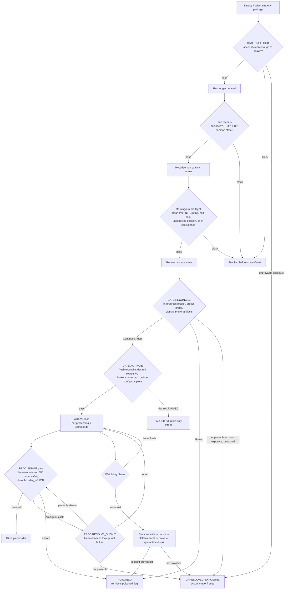
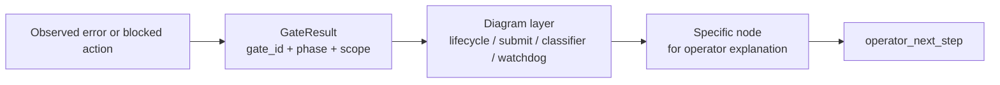

# Bot Lifecycle Gate Map

**Status:** supporting design map; not implementation authority
**Created:** 2026-06-27
**Deepened codebase review:** 2026-06-28
**Input:** codebase review plus design notes summarized in "Design Source Summary" below.
**Related:** ADR-0016 (bot-control trader-authored activity & deploy packages — supersedes the pruned trader-activity-deploy PRD), `docs/architecture/bot-lifecycle-account-owner-prd.md`, `docs/ibkr-integration-authority.md`

This document makes the bot lifecycle gates visible as a chart and a set of tables.
For current implementation authority, load
`docs/bot-lifecycle-account-owner-authority.md` first. That authority document
now owns the canonical lifecycle node ids, overview transition table, desired-
state casing contract, and shipped/not-shipped status. When this map disagrees
with the authority document, the authority document wins.
It intentionally separates:

- **Current gates**: checks already enforced by code.
- **Partial gates**: checks that exist, but not at the scope Claude's design requires.
- **Proposed gates**: new account/fleet substrate from the original design.
  Some rows below intentionally preserve historical design context and may now
  be shipped; check the authority document before treating any "Proposed" cell
  as current truth.

## Design Source Summary

The external design input proposed an account-scoped lifecycle model with a single broker writer, write-ahead account registry, account freeze artifact, explicit operator baseline/override flow, proof-before-disconnect watchdog shutdown, and a gate board whose rows are authored by the same predicates that enforce deploy/start/resume/submit transitions. This repo map translates those ideas into the current `PythonDataService/app/engine/live/*`, broker, router, and operator-surface code paths.

## Legend

| Term | Meaning |
|---|---|
| Gate | A predicate that must pass before an action or transition can continue. |
| Block | The action is refused, but the run/account is not necessarily contaminated. |
| Poison | The run is permanently unsafe; `poisoned.flag` blocks restart and requires redeploy. |
| Freeze | The account is unsafe for more deploys until operator recovery proves it clean. |
| Instance scope | Applies to one `strategy_instance_id` or one `run_id`. |
| Account scope | Applies to everything sharing one IBKR `account_id`. |

## Lifecycle Chart

Important reading of the chart:

- `GATE.PREFLIGHT` in the original spec is **account-scoped and pre-spawn**. Today we have several pre-flight checks; the shipped account-artifact pieces are tracked in the authority document.
- `GATE.RECONCILE` is already a real cold-start gate.
- `GATE.UNRESOLVED_EXPOSURE` is now a shipped account artifact according to the authority document. This map keeps the original design language for provenance.
- `PROC.SUBMIT` has one low-level IBKR `placeOrder` call site today, but more than one production path can reach it through wrappers.

## Visualization Layers

A single flow chart is useful for orientation but too dense for implementation and operator feedback. The AccountOwner PRD therefore splits the visuals into five layers:

| Layer | Purpose | Primary audience |
|---|---|---|
| Lifecycle overview | Shows deploy/start/reconcile/activate/submit/recovery as one account-scoped flow. | Operator, reviewer. |
| Runner-to-AccountOwner sequence | Shows when the runner writes durable intent, when AccountOwner writes artifacts, and when IBKR is called. | Engineer implementing R3. |
| Account classifier flow | Shows how broker snapshots, registry, intents, baseline, and override produce continue/adopt/freeze/poison/ignore outcomes. | Engineer and incident reviewer. |
| Watchdog proof-before-disconnect | Shows the JUN26TSLA fix path and where unresolved evidence is persisted. | Engineer and operator. |
| Gate-board feedback | Shows that the UI row and the enforcing mutation consume the same `GateResult`. | Frontend/backend integration. |

The UI can later render these concepts however it wants, but the backend model should be able to point every blocked action to one layer, one node, and one gate id.

## Gate Inventory

| Gate | Scope | Current status | Enforced today | What it blocks or causes | Gap / design decision |
|---|---:|---|---|---|---|
| Broker enabled | Process | Implemented | `PythonDataService/app/routers/broker.py` | Broker connection lifecycle routes fail when `IBKR_BROKER_ENABLED=false`. | Not part of Claude's named gates, but it is an outer operational gate. |
| Broker account sentinel | Account | Implemented, single-account only | `PythonDataService/app/broker/ibkr/client.py` | Connect refuses empty managed accounts, multiple managed accounts, or paper/live mismatch. | Multi-account FA/sub-account use is intentionally unsupported today. |
| Paper order safety | Order | Implemented | `PythonDataService/app/broker/ibkr/orders.py::_enforce_paper_safety` | Refuses order before contract/order construction if readonly, wrong mode, live port, non-DU account, or missing `confirm_paper`. | Works for paper. Does not solve multi-account ownership. |
| Start recheck | Run/instance | Implemented | `PythonDataService/app/routers/live_instances.py::_assert_start_allowed` | Blocks stale UI starts when run is poisoned, durable intent is `STOPPED`, host daemon is offline, or daemon says running/stopping. | Defers deeper start checks to daemon/runtime. |
| Morning/run pre-flight | Run/account-symbol | Implemented, partial account scope | `PythonDataService/app/engine/live/pre_flight.py` | Blocks dirty source, NTP drift, missing/corrupt ledger, prior `halt.flag`, missing sizing, unexpected positions, all-in coexistence conflicts, bad prior artifacts. | Not the same as Claude's account-wide `GATE.PREFLIGHT`; no account registry or account freeze artifact. |
| Account preflight classifier | Account | Implemented V1 classifier; pre-spawn account gate board target remains | `PythonDataService/app/engine/live/account_classifier.py` | Classifies broker evidence against registry/intent/account artifacts and projects `GateResult`. | Not yet a unified pre-spawn account gate board row; R3 AccountOwner daemon/IPC still future. |
| Cold-start reconciliation | Run | Implemented | `PythonDataService/app/engine/live/reconciliation_orchestrator.py` | Writes `in_progress` receipt first; corrupt sidecar/WAL, broker probe failure, or classifier poison writes failed receipt and `poisoned.flag`; Continue/Adopt writes passed receipt. | Current classifier is "allowed namespaces" based, not registry-known sibling based. |
| Ownership classifier | Run/account artifacts | Implemented, too local | `PythonDataService/app/engine/live/reconciliation_classifier.py` | Continue, Adopt, or Poison based on projection, broker snapshot, allowed namespaces, prior unresolved tail, emergency audit, baseline cutoff. | Claude wants "unaccounted = owned by no registry-known instance", not "not owned by me". Needs registry. |
| Activate/readiness | Run | Implemented, partial | `PythonDataService/app/engine/live/readiness.py`, `PythonDataService/app/engine/live/run.py`, `PythonDataService/app/engine/live/live_engine.py` | Live readiness blocks/degrades on desired state, broker connection, poison sentinel, session window, order cap; start readiness derives durable start gates. | Claude's `GATE.ACTIVATE` also wants fresh receipt boot id and lease/fencing token as explicit pass conditions. |
| Durable submit identity | Order | Implemented | `PythonDataService/app/engine/live/live_portfolio.py`, `PythonDataService/app/broker/ibkr/orders.py`, `PythonDataService/app/engine/live/order_identity.py` | Real broker submit requires IntentWal, namespace, deterministic `order_ref`, and matching namespace before `place_paper_order`. | Good foundation for R2/R3. R1 may simplify ownership by partitioning account. |
| Submit uncertainty | Order | Implemented | `PythonDataService/app/engine/live/live_portfolio.py`, `PythonDataService/app/engine/live/submit_state_machine.py` | Clean ack records SUBMITTED; raised/timeout records ACK_FAILED_UNCERTAIN; probe PRESENT adopts, absent retries, not provable halts. | Claude wants not-provable to become account `UNRESOLVED_EXPOSURE`, not only a run halt. |
| Reconnect recovery halt | Process/account | Implemented | `PythonDataService/app/broker/ibkr/orders.py::_check_reconnect_recovery_halt` | Refuses new order submits while broker-activity publisher is replaying executions after reconnect. | Good account-wide submission brake, but process-local. |
| Operator action capability | Instance | Implemented | `PythonDataService/app/services/operator_capability.py` | Resume, Pause, Stop, Flatten-and-pause, Mark-poisoned all use one evaluator for status projection and mutation endpoints. | Does not cover Start; Start has its own recheck. |
| Resume guards | Instance/run artifacts | Implemented | `PythonDataService/app/services/resume_guard_state.py` | Resume blocks on broker safety unsafe/unknown, submission capability blocked/unknown, reconciliation failed/stale/unavailable/unknown, unresolved uncertain intent, STOPPED, poisoned, already running. | Claude wants Resume to re-run reconciliation before ACTIVE; current guards fold artifact state. |
| Deactivate gates | Instance | Implemented | desired-state endpoint and flatten-and-pause endpoint in `live_instances.py` | Pause/Stop are durable intent writes; flatten-and-pause writes PAUSED before FLATTEN_NOW. | Matches PRD direction. Emergency flatten is separate account-wide recovery. |
| Watchdog lease loss | Daemon/process | Implemented, semantics differ from Claude target | `PythonDataService/app/engine/live/control_plane.py`, `PythonDataService/app/engine/live/watchdog_controller.py` | Daemon lease expiry/change triggers halt sequence: block submissions, persist PAUSED, flatten, disconnect, request exit; critical outcomes remain unresolved incidents. | Claude wants "disconnect last only after proof or quarantine" and account freeze when proof is impossible. Current executor still disconnects after flatten failure to finish halt. |
| Owner generation / fencing token | Account writer | Implemented V1 generation; R3 IPC fencing target remains | `PythonDataService/app/engine/live/account_artifacts.py`, `PythonDataService/app/engine/live/account_owner.py` | Persists owner generation/phase and fences the V1 AccountOwner submit/reconnect lane. | Does not prove a long-lived R3 daemon/IPC single-writer authority. |
| Unresolved exposure freeze | Account | Implemented | `PythonDataService/app/engine/live/account_artifacts.py`, `PythonDataService/app/routers/live_instances.py`, `PythonDataService/app/services/operator_surface.py`, `PythonDataService/app/engine/live/live_portfolio.py` | Freezes deploy/start/router resume/submit for the account while active. | Direct runner CLI resume remains a documented gap; richer gate-board display remains target work. |
| Fleet reset baseline | Account | Partial concept, not first-class workflow | `ignore_unknown_namespaces_before_ms` exists in cold-start reconciliation; PRD mentions fleet-reset rule. | Lets old completed unknown executions be ignored under strict conditions. | Needs account-scoped `account_baseline` artifact and explicit operator workflow. |
| Restart intensity | Account | Implemented | `PythonDataService/app/engine/live/account_artifacts.py`, `PythonDataService/app/engine/live/host_daemon.py`, `PythonDataService/app/engine/live/run.py` | Freezes auto redeploy/restart after 3 starts inside 300000 ms (5 minutes), reset by a clean recovery proof. | Gate-board display remains target work. |

## Gate By Operator Action

| Operator action | Gate sequence today | Blocks on | Current owner | Proposed change |
|---|---|---|---|---|
| Deploy bot | Deploy route and package/deploy guardrails; broker account evidence is derived from connected broker session per PRD. | Missing/ambiguous account, invalid package/settings, account proof unavailable. | Deploy/data-plane code and host daemon. | Add account-scoped `GATE.PREFLIGHT` before run creation or before spawn. |
| Start bot process | Data-plane `_assert_start_allowed` then daemon/runtime pre-flight then cold-start reconciliation. | `poisoned.flag`, STOPPED, host offline, already running/stopping, run pre-flight failure, reconcile poison. | `live_instances.py`, daemon, `pre_flight.py`, `reconciliation_orchestrator.py`. | Make account preflight explicit before daemon spawn; show it as a gate group in bot control. |
| Enter ACTIVE bar loop | Runtime only after reconcile passed and engine constructs live runtime. | Broker/reconcile failure, poisoned run, invalid runtime config, paused desired state. | `run.py`, `live_engine.py`, `readiness.py`. | Add explicit `receipt.boot_id == current_boot_id` and lease/fencing token to `GATE.ACTIVATE`. |
| Submit broker order | LivePortfolio WAL/id gate, broker safety verdict, submit state machine, `place_paper_order` paper safety. | Non-paper verdict, missing `order_ref`, reconnect recovery, disconnected broker, readonly, wrong mode/port/account, missing confirm, ambiguous submit not provable. | `live_portfolio.py`, `orders.py`. | Collapse all real broker submission into one named `PROC.SUBMIT` with submit lock + fencing token. |
| Resume | Shared capability evaluator plus resume guard state. | Already running, STOPPED, poisoned, broker safety unsafe/unknown, submit capability blocked/unknown, reconciliation failed/stale/missing/unknown, unresolved uncertain intent, mutation conflict. | `operator_capability.py`, `resume_guard_state.py`, router revalidation. | Re-run reconcile before transition to ACTIVE; account freeze also blocks. |
| Pause | Capability evaluator, then durable desired-state write, then optional live command. | Already paused, STOPPED, poisoned, mutation conflict. | `operator_capability.py`, desired-state endpoint. | Keep as safe durable write. |
| Stop | Capability evaluator, then durable STOPPED write, then optional live command. | Already stopped, poisoned, mutation conflict. | `operator_capability.py`, desired-state endpoint. | Keep terminal: redeploy required to return. |
| Flatten and pause | Capability evaluator, durable PAUSED write first, then FLATTEN_NOW command if live binding exists. | No live binding, no owned positions, mutation conflict. | `operator_capability.py`, `flatten_and_pause_instance`. | If no live binding and exposure exists, route operator to emergency flatten/account recovery. |
| Emergency flatten | Account echo + confirm, daemon-mediated, independent of live binding. | Missing confirm, no run, daemon failure, account mismatch at CLI/broker path. | `live_instances.py`, `run.py`. | Clearing `UNRESOLVED_EXPOSURE` should require emergency flatten plus clean account reconcile. |
| Mark poisoned | Capability evaluator then command channel. | No live binding, already poisoned, mutation conflict. | `operator_capability.py`, one-shot command endpoint. | Poison remains run-scoped; unresolved exposure remains account-scoped. |

## Current Subgate Checklist

### Broker / Order Safety

| Subgate | Enforced in | Pass condition | Failure effect |
|---|---|---|---|
| `IBKR_BROKER_ENABLED` | `broker.py` | Broker feature enabled | Connection routes disabled. |
| Managed account count | `IbkrClient.connect` | Exactly one account | Disconnect and refuse. |
| Paper/live sentinel | `IbkrClient.connect`, `_enforce_paper_safety` | `IBKR_MODE=paper` with `DU...` account; live mode with non-DU | Disconnect/refuse. |
| Readonly kill switch | `_enforce_paper_safety` | `IBKR_READONLY=false` for order placement | Order refused. |
| Port-vs-mode | config and `_enforce_paper_safety` | Paper mode uses paper port | Order refused. |
| Per-request confirmation | `_enforce_paper_safety` | `confirm_paper=true` | Order refused. |
| Deterministic attribution | `LivePortfolio`, `place_paper_order` | `order_ref={namespace}:{intent_id}` present and namespace matches | Order refused or assertion before broker call. |

### Start / Runtime Safety

| Subgate | Enforced in | Pass condition | Failure effect |
|---|---|---|---|
| Poison sentinel | `_assert_start_allowed`, readiness | No `poisoned.flag` | Start refused / readiness blocked. |
| Durable STOPPED | `_assert_start_allowed`, capability evaluator | Desired state not STOPPED | Start/resume refused; redeploy required. |
| Daemon state | `_assert_start_allowed` | Host reachable and not running/stopping | Start refused. |
| Clean tree | `pre_flight.py` | Scoped git tree clean | Pre-flight/start blocked. |
| NTP offset | `pre_flight.py` | Clock drift within budget | Pre-flight/start blocked. |
| Run state intact | `pre_flight.py` | `run_ledger.json` exists and parses | Pre-flight/start blocked. |
| Prior halt flag | `pre_flight.py` | No `halt.flag` | Pre-flight/start blocked. |
| Sizing policy present | `pre_flight.py`, `run.py` | `live_config.sizing` present | Start blocked; redeploy with sizing. |
| Unexpected position | `pre_flight.py` | Only allowed managed/expected exposure | Start blocked. |
| All-in coexistence | `pre_flight.py` | No same-symbol full-all-in conflict; broker positions reachable when all-in | Start blocked. |
| Yesterday artifacts | `pre_flight.py` | Prior reconciliation artifacts exist and hashes match | Start blocked. |
| Session window | `readiness.py`, live engine | In trading session and before force-flat | Readiness blocked; flat-only after force-flat. |
| Daily order cap | `readiness.py`, live engine | Orders used below cap | Readiness blocked / runtime halt. |

### Reconciliation / Ownership

| Subgate | Enforced in | Pass condition | Failure effect |
|---|---|---|---|
| In-progress receipt first | `reconciliation_orchestrator.py` | `reconciliation_receipt.json` starts as `in_progress` | Crash cannot leave stale passed receipt. |
| Sidecar readable | `reconciliation_orchestrator.py` | Live-state sidecar parses | Poison + failed receipt. |
| WAL readable | `reconciliation_orchestrator.py` | Intent WAL parses | Poison + failed receipt. |
| Broker probe | `reconciliation_orchestrator.py` | Probe succeeds | Poison + failed receipt. |
| Namespace classifier | `reconciliation_classifier.py` | Artifacts are known/resolved or adoptable | Continue/Adopt; otherwise Poison. |
| Adoption | `reconciliation_orchestrator.py` | Owned orphan can be recorded | Append `ADOPTED_BROKER_ORDER`, passed receipt. |

## Missing Visual Concepts From Claude's Design

These are the concepts that should become first-class if we implement Claude's robust design:

| Missing concept | Why it matters | Suggested visual surface |
|---|---|---|
| `instance_registry` | Lets us distinguish "owned by a known sibling" from "owned by nobody". | Account detail table: namespace, instance, lifecycle, last run, account. |
| `account_baseline` | Makes fleet reset explicit instead of hidden cutoff logic. | Account recovery panel: baseline timestamp, listed instance ids, what residue it authorizes. |
| `unresolved_exposure.flag` | Stops a single unprovable submit/exposure from cascading into repeated poisoned bots. | Shipped account artifact; richer account banner and gate row remain target UI. |
| `owner_generation` fencing token | Prevents stale AccountOwner V1 submit/reconnect work from accepting stale generation evidence; future R3 IPC must make it process-wide. | Shipped owner-generation row; future control-plane row should show current generation, phase, holder, boot id, lease age. |
| Restart intensity window | Stops death-restart loops. | Shipped fold: 3 starts / 5 minutes; future fleet row should show observed count, threshold, window, frozen/unfrozen. |
| Registry-aware classifier | Prevents sibling-owned executions from poisoning every other bot on the account. | Reconcile table grouped by self / sibling-known / unowned / baseline-ignored / poison. |

## Review Update

Claude's follow-up closes several gaps in this plan:

| Gap | Resolution |
|---|---|
| R2 vs R3 ambiguity | The current runtime is R2: the daemon spawns one OS process per `strategy_instance_id`, and each child has its own in-process `asyncio.Lock` for submits. A shared function plus per-process locks is not R3. True R3 means one account-scoped broker-writer process owns the IBKR session and receives intents from runners. |
| Existing submit lock scope | `LiveEngine._submit_lock` is process-local. It serializes bar-loop submits, flatten submits, and runtime reconcile inside one runner only. It is not a cross-process account lock. |
| Confirmed live bug priority | Watchdog proof-before-disconnect is urgent and independent of account registry work. It should ship before account artifacts: block submits, persist PAUSED, attempt flatten/cancel while broker is still connected, prove or persist unresolved incident, then disconnect/exit. |
| Classifier scope | Do not build a per-instance sibling-aware classifier as the final shape. The durable classifier should be account-scoped from the start: reconcile broker state against the union of registry-known instance intents. |
| Registry criticality | `instance_registry` is safety-critical, not display metadata. It must be append-only and write-ahead before first submit; rebuilding from run dirs is not sufficient. |
| Gate board drift risk | The gate board must report the exact predicate result produced by the enforcement callable. A parallel projection is explicitly out of scope. |
| Recovery deadlock | `UNRESOLVED_EXPOSURE` needs an audited operator override for cases where broker reachability is the thing preventing automated proof. |
| Start bypass | Start uses `_assert_start_allowed`, not `operator_capability.py`; account freeze/preflight must be wired into Start explicitly. |

## Recommended Design Shape

Use one manually reviewable "gate board" data model for the bot control page and docs:

| Field | Meaning |
|---|---|
| `gate_id` | Stable id such as `broker.paper_safety`, `start.poison_sentinel`, `account.unresolved_exposure`. |
| `scope` | `process`, `account`, `instance`, `run`, or `order`. |
| `phase` | `deploy`, `start`, `preflight`, `reconcile`, `activate`, `submit`, `action`, `recovery`. |
| `status` | `pass`, `block`, `poison`, `freeze`, `unknown`, or `not_applicable`. |
| `source_of_truth` | File/artifact/service that authored the result. |
| `enforcement_point` | The function/module that actually refuses or transitions. |
| `blocks` | Human-readable action/transition blocked by the gate. |
| `operator_next_step` | Flatten, reconnect broker, redeploy, reconcile, acknowledge baseline, etc. |

The board should be composed backend-side. Angular should render it as a table/timeline, not infer gate meaning from raw states.

## Revised Implementation Split

This split supersedes the original V0-V4 table. It commits to R3 for any shared-account setup and moves the known watchdog exposure bug ahead of registry work.

| Slice | Work | Acceptance |
|---|---|---|
| R0 process-fact lock-in | Document that current live runners are separate OS processes and existing submit locks are per-process. | PRD commits to AccountOwner for R3 instead of cross-process lock-only hardening. |
| R1 watchdog proof-before-disconnect | Reorder lease-loss shutdown so broker disconnect happens only after exposure proof or after durable unresolved/quarantine evidence is written. | JUN26TSLA fixture ends in unresolved incident/freeze semantics instead of silent poison after unproven flatten. |
| R2 single-source gate predicates | Introduce backend gate result objects emitted by the same callable that enforces each gate. | A gate board row cannot say pass while the mutation/start/submit path blocks. |
| R3 account safety artifacts | Add append-only `instance_registry`, `account_baseline`, and `unresolved_exposure.flag` with audited operator override. | Start/deploy are blocked by account freeze; registry is written before first submit; override is explicit and durable. |
| R4 account-scoped classifier | Refactor classification to reconcile account broker state against the union of registry-known intents. | Known live/dead sibling residue is classified by lifecycle, not blindly ignored; unowned open orders still fail closed. |
| R5 AccountOwner broker-writer | Add one account-scoped writer process/service that owns the IBKR session and receives intents from runners. | No runner process calls `placeOrder`; submit serialization is in-process at AccountOwner; stale runner cannot place directly. |
| R6 fleet supervisor | Add fleet reset workflow, restart intensity, post-reconnect ordering, and account gate board. | Repeated failures freeze redeploy; baseline is visible; reconnect drains replay before new intents; operator sees account-level gates. |
