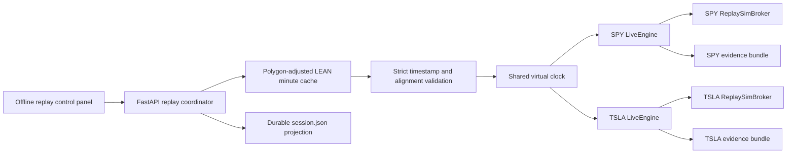

# Offline market replay

**Status:** Implemented for SPY and TSLA  
**Last reviewed:** 2026-07-29  
**Operator surface:** `/broker/offline-replay`  
**API:** `/api/offline-replay`

## Purpose

Offline market replay lets learn-ai exercise bot trading when the exchange is
closed. It is deliberately a live-engine rehearsal, not a second strategy
backtester:

- SPY has one bot and one simulated account.
- TSLA has one bot and one simulated account.
- Both bots consume the same historical market minute at the same logical time.
- Strategy callbacks, signal execution, order submission, fills, portfolio
  updates, decisions, and evidence all pass through the existing
  `LiveEngine`.
- Historical Polygon minute bars replace the live feed.
- `ReplaySimBroker` replaces the external broker and fills market orders at the
  next bar open with the engine's existing deterministic fee model.

This is a research and education facility. It cannot place an order at IBKR,
Alpaca, or any other live/paper brokerage account.

## Why this design

Established trading systems treat replay as another deployment mode around a
shared event engine:

- QuantConnect documents a common algorithm event model for backtesting and
  live trading, and treats warm-up as a distinct initialization phase:
  [live key concepts](https://www.quantconnect.com/docs/v2/writing-algorithms/live-trading/key-concepts),
  [event handlers](https://www.quantconnect.com/docs/v2/writing-algorithms/key-concepts/event-handlers),
  [warm-up](https://www.quantconnect.com/docs/v2/writing-algorithms/historical-data/warm-up-periods).
- NautilusTrader documents a common core for live and backtest modes, immutable
  historical streams, and deterministic event ordering:
  [backtesting concepts](https://nautilustrader.io/docs/latest/concepts/backtesting/).
- NinjaTrader's Playback connection combines recorded/downloaded market data,
  isolated simulated accounts, synchronized instruments, and speed controls:
  [Playback](https://ninjatrader.com/support/helpguides/nt8/playback.htm),
  [Playback connection](https://ninjatrader.com/support/helpGuides/nt8/playback_connection.htm).
- Polygon/Massive provides the minute-aggregate source already used by
  learn-ai's canonical data cache:
  [custom aggregate bars](https://massive.com/docs/rest/stocks/aggregates/custom-bars),
  [stock flat files](https://massive.com/docs/flat-files/stocks/overview).

The resulting boundary is:



## Session contract

1. The client selects a completed canonical NYSE session-open timestamp. Every
   API/storage timestamp is `int64 ms UTC`.
2. The coordinator requests exactly SPY and TSLA, validates a full regular-hours
   minute stream for each, and downloads missing days through the existing
   Polygon-to-LEAN cache path when `auto_fetch` is enabled.
3. Source bars must be strictly increasing, one minute apart, and exactly
   aligned across both symbols. Missing minutes are a hard failure; the replay
   does not forward-fill invented market activity.
4. The first 225 source minutes are a fast pre-roll for the current
   15-minute EMA/RSI strategy. Pre-roll is part of the historical run and its
   evidence; it is not paced by the operator clock. This preserves the exact
   strategy state that existed at the beginning of the visible window.
5. The following 30 or 60 minutes are operator-visible playback. The clock can
   run at 1×, 10×, or 60×; pause; resume; or advance exactly one source minute.
   Speed changes wall-clock delay only and never changes market timestamps.
6. The coordinator does not release minute N+1 until both bot feeds consumed
   minute N. This makes cross-symbol progress deterministic while retaining
   isolated strategy and account state.
7. Each source stream receives a SHA-256 fingerprint. Re-running the same bytes
   under the same code/config makes data identity auditable.
8. Terminal projections survive a data-service restart. A non-terminal session
   found after restart is marked `interrupted`, never silently presented as
   completed.

## Artifacts and failure evidence

The root defaults to
`PythonDataService/artifacts/offline_replays/<session_id>/`.

```text
<session_id>/
├── session.json
└── bots/
    ├── spy/
    │   ├── input_bars.parquet/
    │   ├── decisions.parquet/
    │   ├── executions.parquet/
    │   ├── trades.parquet/
    │   └── equity_curve.parquet/
    └── tsla/
        └── ...
```

`session.json` is an atomic durable projection. It records lifecycle,
playhead, timing, strategy key, bot run IDs, counts, position/equity, data
fingerprints, and typed failure code/message. The Parquet paths are append-only
dataset directories written by the canonical live artifact writers.

A preparation failure (missing data, non-trading date, short session, gap, or
symbol misalignment) fails the session before playback. A bot callback or
engine failure fails that bot and the parent session while preserving all
evidence written before the failure.

## Fidelity boundary

Version 1 is intentionally minute-bar and market-order fidelity:

- adjusted Polygon/Massive regular-hours OHLCV;
- deterministic next-bar-open fills;
- the existing fixed replay commission;
- no bid/ask queue, spread, partial-fill, latency, halt, or market-impact model;
- no options, short selling, extended hours, or multi-symbol bot;
- no claim that replay profit predicts live profit.

These limits make it suitable for strategy/control-path rehearsal and failure
diagnosis, not execution-quality certification. Quote/trade event replay and a
calibrated slippage model are future fidelity layers; they should extend the
feed/broker boundaries without forking `LiveEngine`.

## Verification

- Field-captured SPY/TSLA session replayed with the service clock inside a later
  NYSE session:
  `PythonDataService/tests/integration/test_offline_replay_market_capture.py`
  using `PythonDataService/tests/fixtures/offline_replay/spy-tsla-2026-07-31/`
- Virtual clock behavior:
  `PythonDataService/tests/services/test_offline_replay_clock.py`
- Strict data/alignment/fingerprint behavior:
  `PythonDataService/tests/services/test_offline_replay_data.py`
- Two-symbol canonical-engine and artifact integration:
  `PythonDataService/tests/services/test_offline_replay_service.py`
- FastAPI contracts:
  `PythonDataService/tests/routers/test_offline_replay.py`
- Angular service and operator surface:
  `Frontend/src/app/services/offline-replay.service.spec.ts` and
  `Frontend/src/app/components/broker/offline-replay/offline-replay-page.component.spec.ts`
