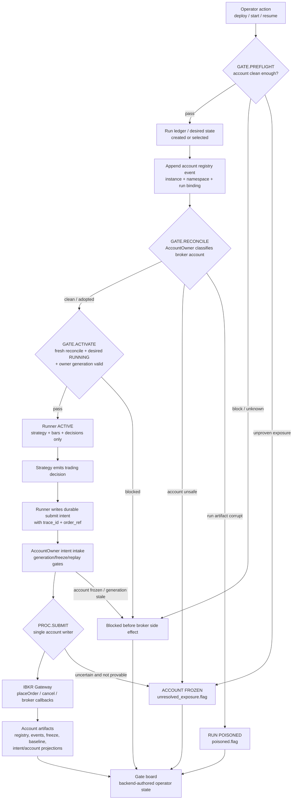
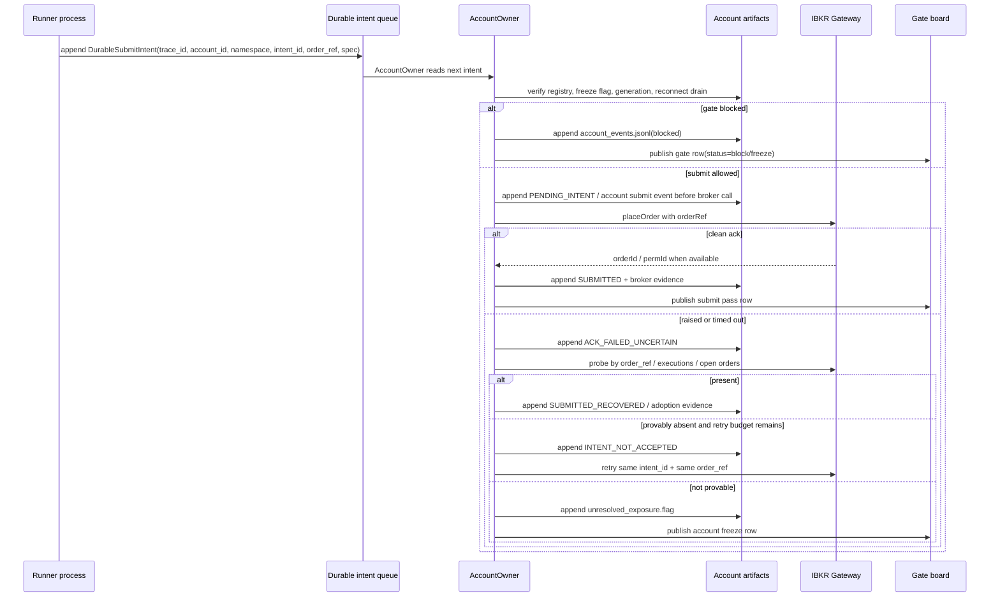
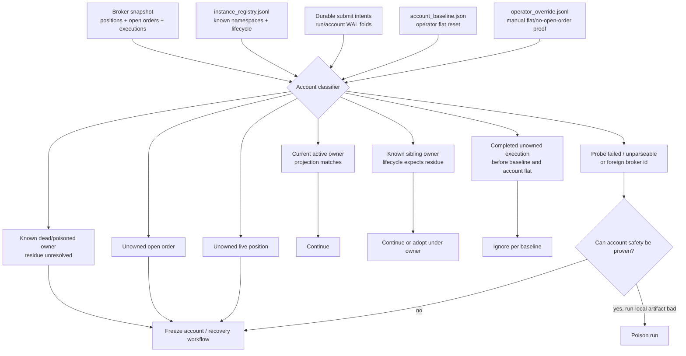
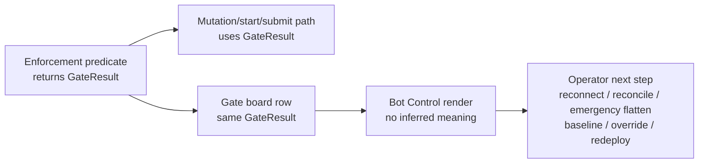
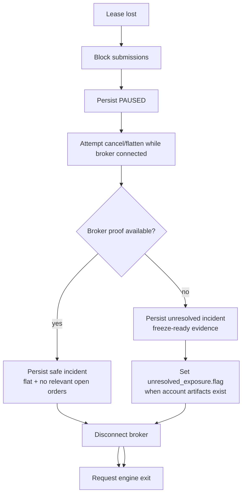

> **Status:** Archived / superseded (2026-07-22).
> **Do not use as implementation authority or an operator procedure.**
> **Current authority:** `docs/bot-control-operator-manual.md`, ADR-0030, ADR-0026, and `docs/architecture/engine-authority-map.md`.
> **Archived because:** Its AccountOwner implementation assumptions are superseded by the Account Clerk authority.

# PRD: Robust Bot Lifecycle, Account Ownership, and Gate Board

**Status:** Draft for review
**Created:** 2026-06-27
**Deepened codebase review:** 2026-06-28
**Owner:** Inkant
**Primary objective:** Stop multi-bot lifecycle cascades by making broker-account ownership explicit, account-scoped, and visualizable.
**Inputs:** `docs/architecture/bot-lifecycle-gate-map.md`, the design-source summary in that gate map, code review of `PythonDataService/app/engine/live/*`, `PythonDataService/app/broker/ibkr/*`, `PythonDataService/app/routers/live_instances.py`, and `PythonDataService/app/services/operator_*.py`.
**Implementation authority:** shipped behavior remains the code under review plus existing authority docs; the dedicated AccountOwner authority document is introduced by the authority-docs slice, while this PRD tracks target behavior.

## Problem Statement

Bot Control has many useful gates, but they are spread across start routing, runtime pre-flight, readiness, reconciliation, operator actions, broker order safety, and watchdog shutdown. That makes the system hard to reason about and leaves gaps where one bot's failed lifecycle can contaminate the shared IBKR account and trigger more failures.

The root cause is that a broker account is a shared mutable resource. IBKR does not enforce our per-bot ownership model, and it will not reject a stale process's `placeOrder` just because our control-plane lease changed. Today, the host daemon runs one OS subprocess per `strategy_instance_id`; each child has its own in-process submit lock. That is still multiple writers to one account, not a true single-writer design.

The most urgent live failure is watchdog shutdown ordering. Current lease-loss shutdown can proceed to disconnect/exit after an unproven flatten attempt. If flatten/cancel cannot be proven while the broker is still connected, the account can retain exposure while the run exits or poisons itself. That is the JUN26TSLA class and must be fixed before larger account-registry work.

## Current Facts

| Fact | Evidence | Consequence |
|---|---|---|
| Live runners are separate OS processes | `RunnerProcessManager` owns one subprocess per strategy instance and spawns `python -m app.engine.live.run start`. | A per-runner lock does not serialize account-level writes. |
| Submit lock is in-process | `LiveEngine._submit_lock = asyncio.Lock()` serializes submits inside one runner only. | Cross-process stale-writer windows remain. |
| Low-level IBKR call has one code site | `place_paper_order` calls `client.ib.placeOrder(...)`. | Good choke point, but not sufficient for R3 while multiple processes can call it. |
| Submit uncertainty handling mostly exists | `LivePortfolio.submit_pending_orders` records `PENDING_INTENT`, `ACK_FAILED_UNCERTAIN`, probes, adopts/retries/halts. | PROC.RESOLVE_SUBMIT is mostly built; terminal outcome must become account-scoped. |
| Start bypasses shared action evaluator | Start uses `_assert_start_allowed`; Resume/Pause/Stop use `operator_capability.py`. | Account freeze/preflight must be wired into Start explicitly. |
| Gate board does not exist | Gate map is documentation only. | Operator cannot see one authoritative table of gate status. |

## Codebase-Grounded Clarifications

This PRD incorporates several useful external suggestions, but translates them into this codebase's existing invariants.

| Suggestion area | What the code already has | PRD correction / requirement |
|---|---|---|
| Single writer and locks | `RunnerProcessManager` spawns one child process per instance; each `LiveEngine` has a process-local `_submit_lock`; `place_paper_order` is the low-level `IB.placeOrder` choke point. | An `asyncio.Lock` is not the architecture. R3 requires one account-scoped AccountOwner that owns the IBKR session and receives runner intents. Locks are internal to AccountOwner only. |
| Durable schemas | `IntentEvent`, `IntentWal`, `LedgerView`, `ReconciliationReceipt`, `DesiredState`, and broker Pydantic models already define strict schemas. | Do not invent new loose dictionaries for AccountOwner. Reuse or deliberately extend these models; ambiguous states must become durable typed outcomes, not just exceptions. |
| State machines | `submit_state_machine.py` already models clean ack, uncertain ack, present/absent/not-provable probe, retry once, and halt. | Preserve this state machine, but move real-broker ownership and terminal uncertainty to account scope. `NOT_PROVABLE` becomes account freeze when account safety cannot be proven. |
| Async diagnostics | Logging is structured in places, but there is no account-level trace context carried across runner intent, AccountOwner submit, broker callback, and gate row. | Add `trace_id` to durable submit intent and AccountOwner events. `contextvars` may bind async-local logging inside AccountOwner, but WAL/artifact fields are the durable correlation authority. |
| Reconnect handling | `IbkrClient` reacts to IBKR code `326` as client-id-in-use via `IbkrClientIdInUseError`; reconnect recovery currently halts new `place_paper_order` calls while broker-activity replay is active. | Use code `326` for client-id-in-use, not `508`. Any client-id rotation or backoff must be fenced by AccountOwner generation so rotation cannot produce two writers. |
| Async tests | Existing tests exercise reconciliation, watchdog notices, runtime freshness, and action gates with fakes. | New tests must use `pytest-asyncio`, fake broker clients, `AsyncMock`, and `asyncio.Event`/`Future` barriers instead of sleeps when proving concurrency interleavings. |

## Visual Model

The operator needs one mental model, but the implementation should be visualized in smaller charts. The top-level lifecycle shows where a bot is in the full account flow; subcharts explain the high-risk branches.

### R3 Lifecycle Overview



### Runner To AccountOwner Submit



### Account Classifier



### Operator Feedback Flow



Every error should be locatable to one node in these charts. The gate board row names that node through `gate_id`, `phase`, `scope`, `enforcement_point`, and `operator_next_step`.

## Decision

For any shared broker account, adopt **R3: AccountOwner single broker-writer authority**.

R3 means one account-scoped process/service owns order-capable broker access and is the only component allowed to call broker `placeOrder` or cancel APIs. Strategy runner processes emit durable intents to AccountOwner. AccountOwner serializes, reconciles, resolves uncertain submissions, and owns account-level freeze/baseline/recovery state.

R1, one broker sub-account per bot, remains a valid future simplification if IBKR paper/FA sub-accounts become available and operationally acceptable. The current code refuses multiple managed accounts, so this PRD targets the current shared-account reality.

R2, many independent runner writers plus per-instance reconciliation, is rejected as the long-term design.

## Goals

1. Make all lifecycle gates visible in one operator-readable gate board.
2. Ensure each visible gate row is produced by the same predicate used for enforcement.
3. Fix watchdog lease-loss ordering before any larger architecture migration.
4. Add account-scoped safety artifacts: append-only registry, baseline, unresolved exposure freeze.
5. Move ownership classification to account scope.
6. Introduce AccountOwner as the only writer to a shared broker account.
7. Prevent death-restart cascades with restart intensity and explicit account recovery workflows.

## Non-Goals

- Live-money enablement.
- Alpha strategy changes.
- Frontend visual redesign beyond rendering the gate board.
- Full FA/sub-account provisioning.
- Replacing existing mathematical/backtest engines.

## Gate Board Contract

The gate board is a backend-authored table. Angular renders it; Angular does not infer gate meaning.

| Field | Meaning |
|---|---|
| `gate_id` | Stable id such as `account.unresolved_exposure`, `start.poison_sentinel`, `submit.paper_safety`. |
| `scope` | `process`, `account`, `instance`, `run`, or `order`. |
| `phase` | `deploy`, `start`, `preflight`, `reconcile`, `activate`, `submit`, `action`, or `recovery`. |
| `status` | `pass`, `block`, `poison`, `freeze`, `unknown`, or `not_applicable`. |
| `source_of_truth` | Artifact, service, or broker observation that authored the result. |
| `enforcement_point` | Function/service that uses this same predicate to enforce. |
| `blocks` | Action or transition blocked by this gate. |
| `operator_next_step` | Reconnect, reconcile, flatten, redeploy, acknowledge baseline, override, etc. |
| `evidence` | Structured facts needed for debugging, with raw codes kept technical. |

Hard rule: every gate row must come from the enforcement predicate or a value object returned by it. Parallel descriptive projections are forbidden.

## Account Artifacts

| Artifact | Scope | Semantics |
|---|---|---|
| `instance_registry.jsonl` | Account | Append-only, write-ahead registry of every `strategy_instance_id`, namespace, lifecycle, and first/last run bound to this account. Written before first submit. Never reconstructed solely from run dirs. |
| `account_baseline.json` | Account | Explicit fleet reset: operator verified flat/no open orders, with `baseline_at_ms` and `verified_at_ms` as `int64 ms UTC`, listed instance ids, and residue class allowed. Never authorizes ignoring open orders. |
| `unresolved_exposure.flag` | Account | Freezes deploy/start/submit for the account when exposure or submit state is not provable. |
| `operator_override.jsonl` | Account | Audited override when broker is unreachable but operator manually confirms flat in TWS/Client Portal and acknowledges risk. All persisted times are `int64 ms UTC` fields such as `approved_at_ms`, `valid_until_ms`, and `cleared_at_ms`; ISO strings and native datetimes are not storage formats. |
| `account_events.jsonl` | Account | Restart intensity, AccountOwner lifecycle, freeze/unfreeze, reconnect drain, baseline, and override events. |

Recommended root:

```text
artifacts/accounts/<account_id>/
  instance_registry.jsonl
  account_baseline.json
  unresolved_exposure.flag
  operator_override.jsonl
  account_events.jsonl
  owner_generation.json
  intents/
    <trace_id-or-intent-id>.json
  projections/
    gate_board.json
    account_reconciliation.json
```

The first implementation may choose a narrower path, but it must avoid burying account-wide facts under one run directory. Run directories are still evidence for one process lifetime; account artifacts are the shared-account control plane.

### Durable Submit Intent Contract

The runner-to-AccountOwner payload must be schema-first. It should extend the current `IntentEvent` vocabulary rather than replace it.

Required fields:

| Field | Source | Notes |
|---|---|---|
| `trace_id` | Runner minted | Correlates runner decision, AccountOwner submit, broker callback, account event, and gate row. |
| `account_id` | Run ledger / connected account evidence | Must match AccountOwner account. |
| `strategy_instance_id` | Run ledger | Durable bot identity. |
| `run_id` | Run ledger | Process lifetime that authored the intent. |
| `bot_order_namespace` | `build_bot_order_namespace(strategy_instance_id)` | Must match `order_ref` prefix. |
| `intent_id` | Existing minting policy | One execution intent. |
| `order_ref` | `build_order_ref(namespace, intent_id)` | AccountOwner verifies equality before submit. |
| `intent_kind` | Existing `IntentKind` | Human provenance only; never ownership authority. |
| `order_spec` | Existing `IbkrOrderSpec`-like payload | AccountOwner owns final broker spec validation. |
| `owner_generation` | AccountOwner fencing token | Refuses stale runner intents after owner restart/handoff. |
| `created_at_ms` | int64 ms UTC | Provenance only; never the fold cursor. |

Ordering rule:

1. Runner persists the durable submit intent before handing it to AccountOwner.
2. AccountOwner verifies registry, account freeze, reconnect drain, and generation.
3. AccountOwner appends account submit evidence before `placeOrder`.
4. AccountOwner calls IBKR.
5. AccountOwner appends `SUBMITTED`, `ACK_FAILED_UNCERTAIN`, `SUBMITTED_RECOVERED`, `INTENT_NOT_ACCEPTED`, or account freeze evidence.

No path may call `place_paper_order` from a runner process in shared-account mode.

### AccountOwner Internal Concurrency Contract

AccountOwner should have one account-scoped command loop. Inside that process:

- Use one serialized submit lane for broker writes.
- Use narrow `asyncio.Lock` sections around in-memory projection mutation.
- Do not treat a lock as a fencing token; stale-process prevention comes from `owner_generation` plus the absence of any runner-owned IBKR connection.
- Avoid broad locks around long broker awaits unless a test proves callbacks, cancel, flatten, and reconnect cannot be starved.
- Use `asyncio.Event` / `Future` barriers in tests to force interleavings; do not use `asyncio.sleep()` as the proof of safety.

## Lifecycle Gates

| Gate | Required behavior |
|---|---|
| `GATE.PREFLIGHT` | Account-scoped, pre-spawn. Blocks deploy/start when unresolved exposure exists, account state is unowned/unprovable, restart intensity is exceeded, or baseline acknowledgement is required. |
| `GATE.RECONCILE` | Account-scoped under AccountOwner. Reconciles broker positions/orders/executions against the union of registry-known live/dead instance intents and lifecycle states. |
| `GATE.ACTIVATE` | Instance may enter ACTIVE only when desired state is RUNNING, no poison/freeze applies, reconcile is fresh, broker is connected, runtime config is complete, and AccountOwner accepts the instance. |
| `GATE.RESUME` | Resume uses the shared gate predicates and must recheck account freeze and reconcile freshness before ACTIVE. |
| `GATE.DEACTIVATE` | Pause/Stop remain durable safe writes. Flatten-and-pause writes PAUSED before flatten. |
| `GATE.POISON` | Run-level sink: this run is unsafe; account may remain usable if account state is proven safe. |
| `GATE.UNRESOLVED_EXPOSURE` | Account-level sink: no new deploy/start/submit until emergency flatten plus clean reconcile, or audited operator override. |

## Gate Board Rows

The gate board should show both current R2 gates and proposed R3 gates during the migration. Each row must point to the enforcement function or artifact that actually blocks the action.

| Gate id | Scope | Phase | Current/proposed source | Enforcement point |
|---|---|---|---|---|
| `start.poison_sentinel` | run | start | `poisoned.flag` | `live_instances.py::_assert_start_allowed` |
| `start.durable_stopped` | instance | start | `desired_state.json` | `live_instances.py::_assert_start_allowed` |
| `start.daemon_state` | instance | start | host daemon process state | `live_instances.py::_assert_start_allowed`, `RunnerProcessManager.start` |
| `preflight.run_state` | run | preflight | run ledger / pre-flight checks | `pre_flight.py`, `run.py cmd_start` |
| `reconcile.receipt` | run today, account target | reconcile | `reconciliation_receipt.json` | `reconciliation_orchestrator.py` |
| `submit.durable_identity` | order | submit | `IntentWal`, `order_ref`, `bot_order_namespace` | `LivePortfolio.__post_init__`, `submit_pending_orders`, `place_paper_order` |
| `submit.reconnect_replay` | account/process today, account target | submit | broker-activity publisher recovery state | `orders.py::_check_reconnect_recovery_halt` |
| `watchdog.lease_loss` | process | recovery | daemon lease / `OperatorIncident` | `ChildWatchdog`, `WatchdogHaltExecutor` |
| `account.instance_registry` | account | deploy/start/submit | `instance_registry.jsonl` | proposed AccountOwner/account preflight |
| `account.unresolved_exposure` | account | deploy/start/submit/recovery | `unresolved_exposure.flag` | proposed AccountOwner/account preflight |
| `account.owner_generation` | account | activate/submit | `owner_generation.json` | proposed AccountOwner intent intake |
| `account.restart_intensity` | account | deploy/start | `account_events.jsonl` fold | proposed fleet supervisor |

Operator-facing feedback is not a UI-polish problem yet. The backend payload should already answer:

| Status | Operator interpretation | Next step examples |
|---|---|---|
| `pass` | This gate is satisfied and did not block the transition. | No action. |
| `block` | The requested transition is refused, but account contamination is not implied. | Fix settings, connect daemon, redeploy, wait for stop, complete package evidence. |
| `poison` | This run is permanently unsafe to resume. | Redeploy or inspect poisoned run evidence. |
| `freeze` | The account cannot safely accept deploy/start/submit. | Emergency flatten, clean account reconcile, baseline, or audited override. |
| `unknown` | The system cannot prove the gate either way. | Reconnect broker/daemon, repair artifact, rerun reconcile. |
| `not_applicable` | The gate does not apply in this phase or mode. | No action. |

## Account-Scoped Classification

The classifier must answer against the whole account, not one bot's narrow namespace.

| Broker artifact class | Outcome |
|---|---|
| Owned by active/current instance and matches projection | Continue. |
| Owned by registry-known instance with lifecycle that expects it | Continue or adopt under that instance. |
| Owned by registry-known instance that is poisoned/dead and has unresolved exposure | Account freeze or recovery workflow, not ignore. |
| Completed unowned execution before explicit baseline, account flat, no open orders, instance listed | Ignore per baseline. |
| Unowned open order | Freeze/poison path; never baselineable. |
| Unowned live position | Freeze until flattened/reconciled or audited override. |
| Probe failed / unparseable / foreign broker id | Freeze or poison depending on whether account safety can be proven. |

Classifier inputs:

- Broker snapshot: current positions, open orders, executions, and raw broker callback evidence when available.
- Account registry: every namespace/account/instance/run binding that may own broker residue.
- Durable submit intent folds: current run WALs, prior unresolved tails, AccountOwner submit events, and emergency-flatten audit events.
- Baseline: explicit flat-account reset that may authorize ignoring completed historical residue only.
- Override: audited manual proof when broker is unreachable or unprovable.

Classifier outputs:

| Output | Meaning | Gate effect |
|---|---|---|
| `continue` | Broker account matches registry/projection and no adoption is needed. | `GATE.RECONCILE=pass`. |
| `adopt` | Broker evidence is owned but missing from the current projection. | Append adoption evidence, then pass or pause depending on active exposure. |
| `pause` | Owned/adopted state exists but should not re-enter trading yet. | `GATE.ACTIVATE=block`; durable desired state should remain or become `PAUSED`. |
| `ignore_baseline` | Completed historical residue is authorized by explicit baseline. | Pass with baseline evidence visible. |
| `retry` | Submit was provably absent and retry budget remains. | Retry same `intent_id` and same `order_ref` once. |
| `freeze` | Account safety cannot be proven or unowned live state exists. | Set or preserve `unresolved_exposure.flag`; block deploy/start/submit. |
| `poison_run` | A run artifact is corrupt or unsafe while the account itself is proven clean. | Write `poisoned.flag`; account may remain usable. |
| `unknown` | Required evidence is unavailable and no override applies. | Fail closed; normally freeze for account-safety questions. |

The current `reconciliation_classifier.py` already proves the value of a pure classifier, but it is too local: it compares broker artifacts to an `allowed_namespaces` set for one run. The AccountOwner classifier must instead classify against the registry-known union of account owners and their lifecycle states.

## Watchdog Fix

This ships first because it addresses the confirmed live bug class.

Required order on lease loss:

1. Block new submits immediately.
2. Persist durable PAUSED.
3. While broker is still connected, attempt cancel/flatten.
4. Prove account/namespace result through broker lookup: positions flat and no relevant open orders.
5. If proof succeeds, persist safe incident outcome and allow run-level poison/exit as appropriate.
6. If proof is not available, persist unresolved incident now; when account artifacts exist, set `unresolved_exposure.flag`.
7. Only after proof or durable unresolved/quarantine evidence exists, disconnect broker and request engine exit.

Acceptance: a lease-loss fixture where flatten times out or broker proof is unavailable must not end as silent clean/poison with unproven exposure.

Current code gap:

- `ChildWatchdog` detects daemon lease loss and delegates to `WatchdogHaltExecutor`.
- `WatchdogHaltExecutor` currently blocks submissions, persists paused, runs flatten with timeout, then disconnects and requests exit even for timeout/failed flatten outcomes.
- Critical outcomes remain unresolved incidents, but there is not yet an account-scoped `unresolved_exposure.flag`.

Required P1 change:



The proof step must query broker state before disconnect. If the broker is unreachable and therefore proof is impossible, the system must preserve the unresolved evidence before losing the session.

## AccountOwner

AccountOwner is the R3 broker-writer for one IBKR account.

Responsibilities:

- Own the account's order-capable IBKR session, or any connection that can place/cancel broker orders.
- Accept durable submit intents from runner processes.
- Stamp or verify `order_ref` attribution.
- Serialize broker writes in one process.
- Run submit resolution on ambiguous outcomes.
- Own account-scoped reconciliation and freeze/baseline/override state.
- Drain reconnect replay before new submits.
- Publish gate board rows for account-level gates.

Runner processes may continue to run strategies and emit decisions, but they must not call `placeOrder` directly in shared-account mode.

Market data is a separate concern. Today runners use `IbkrClient` for live bars. Under R3, a runner may keep strategy/bar work only if its data source cannot place or cancel orders. If IBKR remains the bar source, implement either an AccountOwner-published bar feed or a read-only market-data adapter that has no route to `place_paper_order`, `cancel_paper_order`, or `IB.placeOrder`.

### Proposed Process Shape

Preferred MVP shape: AccountOwner is a host-daemon-owned child process per account.

Rationale:

- The host daemon already owns child process lifecycle, host-side repo paths, daemon boot id, and the control-plane lease.
- IBKR connectivity already prefers the host side because the original daemon exists to avoid container/Gateway IP-binding problems.
- A daemon-owned process gives clean separation from strategy runner crashes while avoiding a second always-on FastAPI service.

Alternatives:

| Shape | Benefit | Rejection / deferral reason |
|---|---|---|
| Daemon thread | Simpler IPC. | Harder to isolate crashes and long broker awaits from daemon responsiveness. |
| Separate FastAPI service | Clean API boundary. | More operational surface before the basic single-writer invariant is proven. |
| Reuse one strategy runner as owner | Less code. | Reintroduces stale runner ownership and makes sibling lifecycle dependent on one bot. |

### Intent Transport

Preferred MVP transport: filesystem queue under `artifacts/accounts/<account_id>/intents/`, with atomic create/rename and per-intent ack/result files.

Rationale:

- The repo already relies on JSON/Parquet artifacts and fsync discipline for live state, intent WALs, desired state, and reconciliation receipts.
- The host daemon and runners already share an artifacts root.
- A durable queue is inspectable during incidents and naturally powers the gate board.

The queue must still be treated as IPC, not as the business projection. AccountOwner owns the account projection and append-only account events.

### Diagnostics

AccountOwner logs and artifacts must carry:

- `trace_id`
- `account_id`
- `strategy_instance_id`
- `run_id`
- `intent_id`
- `order_ref`
- `owner_generation`
- `ibkr_client_id`
- broker `order_id`, `perm_id`, `exec_id` when known
- gate id / classifier output when an intent is blocked

Use Python `contextvars` to bind these fields inside AccountOwner's async tasks, but never rely on contextvars as the only source. Broker callbacks may arrive outside the original task context; persisted correlation fields are the authority.

## Post-Reconnect Ordering

After broker reconnect:

1. Stop accepting new submit intents.
2. Validate AccountOwner ownership/generation.
3. Drain broker-activity replay.
4. Reconcile account state against registry/intent union.
5. Publish gate board update.
6. Re-enable submit intents only if account gates pass.

This composes the existing reconnect-recovery halt with account reconciliation instead of letting independent brakes race each other.

## Recovery and Override

Automated clear path for `UNRESOLVED_EXPOSURE`:

1. Emergency flatten/cancel.
2. Broker probe succeeds.
3. Account classifier returns clean or baseline-authorized residue only.
4. Append unfreeze event.

Audited operator override path:

1. Broker remains unreachable or unprovable.
2. Operator confirms flat/no open orders in TWS or Client Portal.
3. Operator enters acknowledgement with account id, `approved_at_ms` (`int64 ms UTC`), reason, and evidence note.
4. System appends `operator_override.jsonl`.
5. Account may unfreeze, but next successful broker reconnect must run account reconciliation before new submit.

## User Stories

1. As an operator, I want a gate board that shows every deploy/start/resume/submit blocker, so I know exactly why the bot can or cannot trade.
2. As an operator, I want account freezes shown separately from run poisons, so I know whether redeploy is safe.
3. As an operator, I want a failed watchdog flatten to preserve broker proof or unresolved evidence before disconnect, so I do not lose the chance to know whether exposure remains.
4. As an engineer, I want gate rows emitted by enforcement predicates, so UI and backend behavior cannot drift.
5. As an engineer, I want registry writes before first submit, so broker residue is never falsely unowned because a run dir was missing or archived.
6. As an engineer, I want AccountOwner to be the only broker writer for a shared account, so stale runner processes cannot submit directly.
7. As an operator, I want an audited override for frozen accounts when IBKR is unreachable but I have manually verified flat state.

## Implementation Plan

| Slice | Work | Acceptance |
|---|---|---|
| P0 design lock | Document that current runtime is multi-process R2 and this PRD commits to R3 AccountOwner for shared accounts. | Gate map and PRD agree; no cross-process-lock-only plan remains. |
| P1 watchdog proof-before-disconnect | Reorder lease-loss shutdown and persist unresolved evidence before broker disconnect. | JUN26TSLA-style timeout/proof-fail fixture leaves unresolved incident/freeze-ready evidence. |
| P2 gate result value objects | Introduce `GateResult`-style backend values at the existing enforcement points: start, action capability, readiness, reconciliation, submit, watchdog. | A gate board row cannot say pass while the mutation/start/submit path blocks in the same fixture. |
| P3 account artifacts | Add account root, append-only registry, baseline, unresolved exposure flag, override log, account events, and owner generation. | Start/deploy refuse when freeze exists; registry is written before first submit intent; account artifacts are not reconstructed solely from run dirs. |
| P4 account classifier | Refactor classification around account-level registry + union of intents. | Sibling-known live/dead residue is classified by lifecycle; completed baseline-authorized residue is visible; unowned open orders and unowned live positions freeze. |
| P5 AccountOwner MVP | Add daemon-owned account writer process and artifact-backed intent queue; route runner submit intents through it. | In shared-account mode, no runner, REST route, operator-surface path, emergency CLI, or other non-AccountOwner code path can place or cancel broker orders; AccountOwner serializes submit/reconcile/reconnect ordering and publishes gate rows. |
| P6 runner no-broker-write mode | Remove runner-owned order-capable IBKR access in shared-account mode; keep strategy/bar work and command handling in runners. | Runner can become ACTIVE, emit decisions, and write durable intents while AccountOwner owns all broker writes; any runner market-data feed cannot place/cancel orders. |
| P7 fleet governance | Add restart intensity, explicit fleet baseline workflow, post-reconnect choreography, and override UX contract. | Repeated failures freeze redeploy; baseline and reconnect drain are visible on gate board; override forces reconcile on next broker reconnect. |
| P8 authority update | Update `docs/bot-lifecycle-account-owner-authority.md` in the same PR as each shipped slice. | Authority doc reflects the shipped behavior exactly; aspirational PRD text stays separate. |

## Tests

| Test | Assert |
|---|---|
| `test_current_runner_process_model_documented` | Host daemon starts one subprocess per instance; submit lock remains per-process until AccountOwner migration. |
| `test_watchdog_disconnect_after_proof_or_unresolved` | Disconnect is not called before proof or durable unresolved incident. |
| `test_gate_board_uses_enforcement_result` | A gate displayed as pass cannot block the corresponding mutation in the same fixture. |
| `test_registry_write_ahead_before_submit` | Run id is allocated/selected before the account registry row is appended, and submit intent is refused if registry entry is missing. |
| `test_unresolved_exposure_blocks_start` | Start and deploy are refused while `unresolved_exposure.flag` exists. |
| `test_operator_override_unfreezes_with_audit` | Override requires account id, reason, `approved_at_ms` (`int64 ms UTC`), and evidence note; next reconnect forces reconcile. |
| `test_account_classifier_dead_sibling_residue_freezes` | Registry-known but dead/poisoned residue is not ignored. |
| `test_account_owner_only_writer` | In shared-account mode, runner, REST, operator surface, emergency CLI, and recovery paths cannot place/cancel broker orders directly; AccountOwner is the only broker writer. |
| `test_post_reconnect_ordering` | New submit is blocked until replay drain and account reconcile complete. |
| `test_restart_intensity_freeze` | More than configured failures inside window freezes auto redeploy. |
| `test_account_owner_generation_fences_stale_intent` | A runner intent carrying an old owner generation is blocked before broker submit and emits a gate row. |
| `test_account_owner_no_broad_lock_starves_reconnect` | A blocked broker call cannot starve reconnect drain/cancel/flatten control tasks; use barriers, not sleeps. |
| `test_trace_id_round_trip` | One trace id appears on runner intent, AccountOwner submit event, broker callback projection, and gate board evidence. |
| `test_classifier_visual_cases_are_exhaustive` | Every account classifier output in the PRD has a fixture and a gate-board rendering path. |
| `test_ibkr_client_id_in_use_326_is_actionable` | IBKR error 326 is surfaced as client-id-in-use; no code path treats 508 as the canonical client-id collision. |

## Open Questions

1. Account artifact migration path for existing run dirs: should the first registry build seed from known historical ledgers, or start fresh after an explicit baseline?
2. Restart intensity defaults: keep suggested `3 / 15 min` or tune for paper iteration speed?
3. Operator override evidence requirements: free-text note only, screenshot path, or structured checklist?
4. AccountOwner read responsibilities: should market data remain in runners while AccountOwner owns only broker writes, or should AccountOwner also own broker account/order reads used for reconciliation snapshots?
5. First gate board surface: expose as one account endpoint first, or stitch rows into existing `operator_surface` per instance first?
