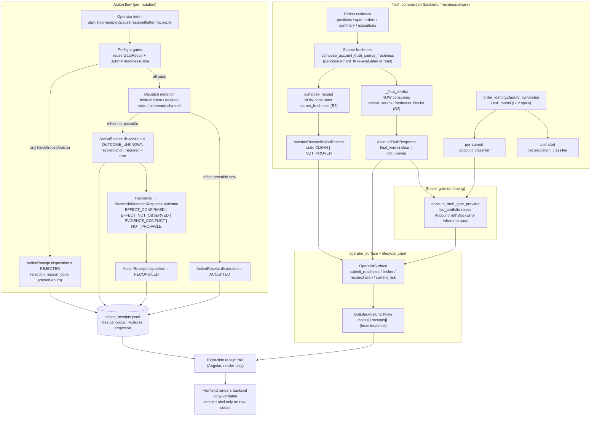

> **Status:** Archived / superseded (2026-07-22).
> **Do not use as implementation authority or an operator procedure.**
> **Current authority:** `docs/bot-control-operator-manual.md`, ADR-0030, ADR-0026, and `docs/architecture/engine-authority-map.md`.
> **Archived because:** This implementation plan is retained only as provenance after the Clerk/cockpit consolidation.

# PRD — Backend-Authored Bot Truth Surface & Right-Side Receipt Rail

- **Status:** ready-for-agent
- **Owner:** Inkant
- **Created:** 2026-07-03
- **Surfaces:** `/broker/bots` (catalog), `/broker/bots/:id` (control flow + right-side receipt rail), `/broker/account-monitor`, `/broker/reconciliation`.
- **Data plane:** Python FastAPI via `LiveRunsService` / `BrokerService`. No GraphQL is introduced for this surface.
- **Binding rules (honesty invariants):** ADR-0013 (operator surface — judgment vs evidence; no frontend-derived verdicts), ADR-0014 (broker-authored, backend-rendered narratives; versioned templates; closed verdict enums), ADR-0001 (files canonical; Postgres is a rebuildable projection), ADR-0006/0007 (authenticated host-daemon start/stop), ADR-0008 (durable-submit protocol — `order_ref`/`perm_id` ownership).
- **Builds on:** `docs/architecture/bot-control-inspector-receipts-prd.md` (node-scoped receipt rail; `headline`/`detail` already shipped), `docs/architecture/bot-control-account-triage-reconciliation-prd.md` (account-level reconciliation receipt + triage), `docs/bot-lifecycle-account-owner-authority.md` (the authority doc every implementing PR updates).
- **Bug-map input:** the 2026-07-03 second-iteration audit (bug IDs `B1`–`B22`) captured in [issue #876](https://github.com/tim1016/learn-ai/issues/876). This PRD is the productization of that audit's operator-safety cluster.
- **Implementation-snapshot DoD:** every PR that implements a slice updates `docs/bot-lifecycle-account-owner-authority.md` in the same PR, records which sources gate submit, and states which surfaces render honest-empty.

---

## Problem Statement

I am a trader operating a fleet of paper bots. When I **start, stop, redeploy, pause, resume, flatten, or reconcile** a bot, I need the screen to tell me two things truthfully: *what the backend just did* and *what the backend can currently prove*. Today it does neither reliably.

Three concrete failures, each verified against the running code in the 2026-07-03 audit:

1. **The safety surface lies while now gating real submits.** Account Truth's `final_verdict` became an *enforcing* submit gate (`live_portfolio.py` raises `AccountTruthBlockError` when the gate ≠ pass, wired whenever `broker.requires_durable_submit`). But the IBKR positions source can latch to a **frozen, unsubscribed cache** after a single 8-second timeout, stamped with a *fresh* `now` timestamp, and never self-heal (`B1`). Worse, the freshness the backend *does* compute (`AccountTruthSourceFreshness`) is consumed by exactly one call site — it is **not** read by `_final_verdict` (the board verdict), **not** by `compose_receipt` (the reconciliation receipt), and **not** rendered by `account-truth-board` (`B2`). So the operator sees "Clean / reconciled / fresh," the submit gate says `pass`, and the bot submits against **unknown positions**.

2. **The operator can lose all visibility with no receipt and no recovery.** Two broker calls on the new 15-second account-truth refresh loop have **no timeout** (`accountSummaryAsync`, `reqAllOpenOrdersAsync`), single-worker uvicorn has no `--timeout-graceful-shutdown`, and a request parked on a half-open socket wedges the reload forever (`B3`). The Bots page went blank; a human `podman restart` was the only recovery. A blinded operator cannot see or stop a misbehaving bot — an availability failure that is also a safety failure.

3. **The control flow and its receipts disagree, or aren't durable.** Each action returns a *different, non-durable* response shape (`HostRunnerActionResponse`, `SetInstanceDesiredStateResponse`, `ReconcileAckResponse`, `HostRunnerDeployResponse`). None is a uniform, persisted, trader-facing **receipt** of *what was proven*. Ambiguous outcomes exist as types (`MutationOutcomeUnknownResponse`, `ReconcileMutationResponse.outcome`) but are not surfaced on the right rail as a coherent "here is what happened and what you should do next." Lifecycle projection — one of the operator's named surfaces — is inert by default (503 storm; `B5`). Lifecycle truth leaks: a daemon-level crash orphans an `ACTIVE` binding forever (`B6`); a freeze-rejected start still writes a phantom `ACTIVE` row and deepens the freeze (`B7`). Reconciliation uses **two** ownership models that can disagree (`B12`), and a sibling's `perm_id` can be folded into a run's ownership set, under-poisoning a foreign order (`B9`).

### Safety rationale

Because `final_verdict` now **enforces** submission, every fail-open in the freshness/verdict path is a **submission-safety** bug, not a display bug. The blast radius today is the 28 live paper bots (paper still submits through IBKR). The Bot Truth Surface exists to make one guarantee structural: **the operator never sees a green light the backend cannot currently prove, and every action leaves a durable receipt.** Angular must not synthesize any part of that judgment (ADR-0013 §1).

---

## Solution

Introduce a **backend-authored Bot Truth Surface**: a single, composed, freshness-aware truth for one bot, rendered as (a) a backend-authored **control-flow** on the left (the existing `lifecycle_chart` flowchart) and (b) a **right-side receipt rail** that explains, in backend-authored trader language, exactly what the backend proved — account truth, broker evidence, lifecycle/process state, mutation outcome, action capability, and reconciliation status.

The solution is **compositional, not a rewrite.** It reuses the shipped `operator_surface`, `lifecycle_chart`, `LifecycleChartReceipt` (with `headline`/`detail`), `AccountTruthResponse`, `AccountReconciliationReceipt`, `GateResult`/`GateResultStatus`, and the reconciliation/triage endpoints. Its net-new value is four things:

1. **A uniform durable `ActionReceipt`** for every one of the seven actions — accepted, rejected, ambiguous, or stale — persisted files-canonical (ADR-0001) and surfaced on the right rail (Requirement 3).
2. **Wiring the safety fixes so the surface is true**: un-latch positions and propagate cache-fallback into the snapshot (`B1`); feed `critical_source_freshness_blocks` into `_final_verdict` and `compose_receipt` and render de-authoritative "Clean" (`B2`); bound the broker calls and unwedge the data plane (`B3`).
3. **Lifecycle truth**: boot-time registry↔liveness reconciliation (`B6`), pre-spawn freeze evaluation (`B7`), and an honest lifecycle-projection surface (`B5`).
4. **One ownership model**: namespace-filter the durable-intent fold (`B9`), an active `mark_refresh_failed` on account-scope conflict (`B8`), and a **design spike** to unify the cold-start and per-submit classifiers on one `order_identity` primitive (`B10`, `B12`).

The target operator experience:

> "I clicked **Resume**. The right rail shows: *Rejected — account `DU1234567` cannot be proven: positions evidence is stale (last confirmed 3m ago, TTL 60s). Refresh account truth, then resume.* The 'Clean' badge on the account board is greyed with 'Not proven — positions stale'."

or:

> "I clicked **Flatten**. The right rail shows: *Outcome unknown — flatten dispatched, terminal broker effect not yet provable. Run Reconcile before any new submit.* A **Reconcile** next-step button is offered, and the durable receipt id `arc_…` is shown for audit."

---

## Bot-Control Flow Diagram

Two flows compose the surface: the **truth-composition** flow (how the backend arrives at what it can prove) and the **action** flow (what happens when the operator mutates a bot). Both terminate in backend-authored artifacts the frontend renders verbatim.



The invariant the diagram encodes: **every arrow into `RAIL` originates from a backend-authored artifact.** There is no path where Angular composes a verdict, a headline, or a next step.

---

## User Stories

1. As a trader, I want the left side of the bot page to be a backend-authored control flow of my bot's lifecycle, so that I read the same shape the engine reasons about.
2. As a trader, I want the right side to be a receipt rail that explains what the backend proved for the thing I'm looking at, so that the two sides always agree.
3. As a trader, when I click **Start**, I want a durable receipt that says accepted / rejected / outcome-unknown with a trader-language reason, so that I never guess whether the start took effect.
4. As a trader, when I click **Stop**, I want a durable receipt that tells me whether the process actually exited or is still running after the stop signal, so that I know if exposure remains.
5. As a trader, when I click **Pause**, I want the receipt to show both the durable desired-state write and whether the live command actually actuated, so that I know the running bot is listening.
6. As a trader, when I click **Resume**, I want resume rejected with the specific blocking gate and its next step when a gate fails, so that I know exactly what to fix.
7. As a trader, when I click **Flatten**, I want the receipt to tell me if the flatten outcome is uncertain and to route me to Reconcile before any new submit, so that I never double-flatten or resume into unknown exposure.
8. As a trader, when I click **Redeploy**, I want the receipt to show the new run lineage and that the prior run was retired, so that I can trace the redeploy.
9. As a trader, when I click **Reconcile**, I want the receipt to show the reconciliation outcome (clean / adopted / stale / failed) and the evidence behind it, so that I trust broker and engine agree.
10. As a trader, for every action, I want an explicit "trader-facing next step" on the receipt, so that a rejection is never a dead end.
11. As a trader, I want a rejected action to record a **structured rejection receipt** (not a bare error), so that I can see why and audit it later.
12. As a trader, I want an ambiguous outcome ("we dispatched it but can't prove the result") shown as its own receipt state, so that uncertain and confirmed never look the same.
13. As a trader, I want an action refused because critical account evidence is stale to say so plainly ("positions stale, 3m old, TTL 60s"), so that I don't mistake staleness for a hard failure.
14. As a trader, on the account board, I want "Clean" to be visibly de-authoritatived when a critical source is stale or missing, so that I never trust a green badge over a frozen cache (`B2`).
15. As a trader, I want a stale positions/summary source to **block submit**, not just annotate the UI, so that the enforcing gate and the display never diverge (`B1`, `B2`).
16. As a trader, I want the account monitor's freshness label to reflect the real stream age and connection health, not a hardcoded "updates ~1s," so that I know when the feed is actually degraded (`B16`).
17. As a trader, I want the Activity view to show an explicit "as of <time>" / "stale" badge during a control-plane outage instead of silently freezing on the last projection, so that I don't read stale as live (`B15`).
18. As a trader, I want the lifecycle timeline to either show real timeline rows or say honestly "timeline unavailable — showing canonical fallback," never a silent empty (`B5`).
19. As a trader, I want raw backend codes on the rail (reason codes, gate ids, source names) rendered through the shared label pipe, and opaque ids (order refs, perm ids, receipt ids) preserved exactly, so that the rail is readable but auditable (`B18`).
20. As a trader, I want the catalog, the bot detail, the account monitor, and the reconciliation page to agree on the same backend truth for one bot, so that switching pages never changes the verdict (Requirement 7).
21. As an operator, I want the Bots page to stay responsive even when a broker call hangs, so that I never lose all visibility to a wedged data plane (`B3`).
22. As an operator, I want the account-truth refresh loop to bound its broker calls and surface a refresh failure as an evidence gap, so that a hung call fails closed instead of freezing the fleet (`B3`, `B13`).
23. As an operator, I want a daemon reboot to reconcile durable `ACTIVE` bindings against real process liveness and retire the orphans, so that a dead bot can't stay "ACTIVE" and trusted forever (`B6`).
24. As an operator, I want a start rejected by an account freeze to leave **no** phantom `ACTIVE` binding and to **not** deepen the freeze, so that a rejected start can't lock me out of the account (`B7`).
25. As an operator, during an account contamination event (two account ids in broker evidence), I want the submit gate to flip to blocked immediately, not serve the last clean snapshot for a TTL, so that contamination fails closed at once (`B8`).
26. As an operator, I want a foreign order carrying a sibling's `perm_id` to still be poisoned, not silently absorbed into my run's ownership, so that reconciliation can't under-poison (`B9`).
27. As an operator, I want the cold-start reconciliation verdict and the per-submit gate to derive from **one** ownership model, so that the two can't disagree about the same broker state (`B12`).
28. As an operator recovering a frozen account, I want a guarded backend endpoint that records a recovery proof or audited override and clears the freeze, so that I don't edit freeze files by hand (freeze-clear currently CLI-only).
29. As an operator, I want every action mutation to be idempotent by key, so that a double-click or two operators can't produce two broker effects.
30. As an auditor, I want every action receipt persisted with evidence refs (broker ids, run ids, WAL seqs, receipt id), so that a decision is replayable from the receipt alone.
31. As an auditor, I want the trader copy on the rail authored by the backend from structured facts, so that meaning is never invented by the frontend (ADR-0013 §1, ADR-0014 §3).
32. As an engineer, I want the preflight-gate → rejection-reason mapping pinned in a translation-table test, so that a new gate can't leak an unmapped code as trader copy.
33. As an engineer, I want the account-truth verdict, reconciliation receipt state, submit-readiness code, and `GateResultStatus` reconciled through an explicit, tested translation table, so that the four verdicts can't silently drift (Requirement 6, 7).
34. As an engineer, I want the `ActionReceipt` and `AccountTruthResponse` timestamps to be `int64 ms UTC` at every boundary, so that freshness/TTL claims are trustworthy.
35. As an engineer, I want the receipt WAL to be files-canonical with a rebuildable Postgres projection, so that receipts survive a data-plane restart (ADR-0001).
36. As a reviewer, I want each slice to update `docs/bot-lifecycle-account-owner-authority.md`, so that shipped authority stays synchronized.
37. As a trader, I want an internal-machinery gate (one I can't act on) to say "internal gate — no operator action needed" while still showing its receipts, so that I know what's my job and what's the system's (reuses the inspector-receipts actionability signal).
38. As a trader, I want the receipt rail to distinguish "not emitted yet / not available yet" from a real zero, so that a gap is never rendered as a value (honest-emptiness, inherited from the inspector-receipts PRD).
39. As a screen-reader user, I want each receipt-rail section, honest-empty state, and action-receipt disposition to be reachable and labelled, so that the surface passes AXE/WCAG-AA.
40. As a trader, I want an `OUTCOME_UNKNOWN` receipt to keep resume/submit blocked until reconciliation proves the effect, so that uncertainty is fail-closed by default.
41. As an operator, I want the connected-broker-account-mismatch condition to force every broker-sourced gate to `unknown` or `block` (never `pass`), so that acting on the wrong account is structurally impossible.
42. As an operator, I want a redeploy/start that is rejected before the process spawns to produce a `REJECTED` receipt with no side effects, so that the durable state matches reality.

---

## Implementation Decisions

### ID1 — The Bot Truth Surface is compositional, not a new engine.

The surface **re-projects** existing authorities. It does not re-derive account cleanliness, ownership, submit safety, or reconciliation pass/fail. Inputs: `LiveInstanceStatus.operator_surface` (`OperatorSurface` at `live_runs.py:1851`), `LiveInstanceStatus.lifecycle_chart` (`BotLifecycleChartView`), `AccountTruthResponse`, `AccountReconciliationReceipt`, `GateResult[]`, `SubmitReadinessCode`, `ReconciliationState`. Any place the compositor maps one verdict into another (e.g. `AccountTruthFinalVerdict` → `GateResultStatus`) the mapping is explicit and table-tested (Requirement 6).

### ID2 — Net-new contract: the uniform `ActionReceipt`.

Every one of the seven actions returns (200) or embeds in a 409 body a single `ActionReceipt`. It **wraps** the existing per-action responses rather than replacing them (the inner ack stays available under `dispatch`). Proposed schema (Pydantic v2, `app/schemas/action_receipt.py`; TS mirror in `Frontend/src/app/api`):

```
ActionReceipt:
  schema_version: int                      # start at 1
  receipt_id: str                          # "arc_" + uuid; opaque, preserved exactly by FE
  strategy_instance_id: str
  account_id: str | None
  action: LifecycleActionKind              # start|stop|redeploy|pause|resume|flatten|reconcile
  idempotency_key: str                     # client-supplied or server-derived; dedupes broker effect
  requested_by: str
  requested_at_ms: int                     # int64 ms UTC
  generated_at_ms: int
  disposition: ActionDisposition           # ACCEPTED | REJECTED | OUTCOME_UNKNOWN | RECONCILED
  rejection_reason_code: ActionRejectionReason | None   # set iff REJECTED
  reconciled_outcome: ReconcileOutcome | None           # set iff RECONCILED (existing enum)
  preflight_gates: list[GateResult]        # reuse GateResult (gate_id/status/source/operator_reason/operator_next_step/evidence_at_ms)
  headline: str                            # backend-authored trader copy
  detail: str                              # backend-authored trader copy
  operator_next_step: str | None           # backend-authored; never a dead end for REJECTED/OUTCOME_UNKNOWN
  receipts: list[LifecycleChartReceipt]    # reuse; the numeric proof of the outcome (headline/detail per receipt)
  evidence_refs: list[ActionEvidenceRef]   # concrete broker ids, run_id, WAL seq, account_reconciliation receipt_id
  dispatch: dict                           # the inner per-action response (HostRunnerActionResponse, etc.), verbatim
  resulting_state: ActionResultingState    # {desired_state, process_state, readiness_verdict, submit_readiness_code}
  reconciliation_required: bool            # true for OUTCOME_UNKNOWN; blocks resume/submit until reconciled
  account_truth_generated_at_ms: int | None
```

Closed enums:

- `LifecycleActionKind = "start" | "stop" | "redeploy" | "pause" | "resume" | "flatten" | "reconcile"`.
- `ActionDisposition = "ACCEPTED" | "REJECTED" | "OUTCOME_UNKNOWN" | "RECONCILED"`.
- `ReconcileOutcome` — reuse the existing `ReconcileMutationResponse.outcome` values verbatim: `"EFFECT_CONFIRMED" | "EFFECT_NOT_OBSERVED" | "EVIDENCE_CONFLICT" | "NOT_PROVABLE"`.
- `ActionRejectionReason` (closed StrEnum, net-new) — every value maps from an existing gate/readiness code and is pinned in a translation-table test: `GATE_BLOCKED`, `CAPABILITY_DISABLED`, `ACCOUNT_FROZEN`, `RESTART_INTENSITY_FREEZE`, `STALE_ACCOUNT_TRUTH`, `BROKER_STATE_UNPROVEN`, `RECONCILE_REQUIRED`, `RECONCILE_STALE`, `POISONED_RUN`, `DUPLICATE_NAMESPACE`, `CONNECTED_ACCOUNT_MISMATCH`, `CONTROL_PLANE_UNREACHABLE`, `OWNER_GENERATION_NOT_ACCEPTING`.

`ActionReceipt.headline`/`detail`/`operator_next_step`/`receipts[].headline` are the **only** trader-facing strings and are authored in Python (a versioned template table in the ADR-0014 spirit). The frontend renders them verbatim; it maps `disposition`/`rejection_reason_code` to layout only.

### ID3 — Durable persistence (ADR-0001).

Action receipts are appended to a per-instance `run_dir/action_receipts.jsonl` (files canonical), keyed by `receipt_id` and `idempotency_key`, and projected into a rebuildable Postgres table. The receipt is written **before** the HTTP response returns for `ACCEPTED`/`REJECTED`; for `OUTCOME_UNKNOWN` the receipt is written at dispatch and updated to `RECONCILED` when a later reconcile resolves it (append a new terminal receipt referencing the prior `receipt_id`; never mutate history — mirrors the ADR-0014 authored-WAL discipline). Retention/rotation is an open question (§Open Questions).

### ID4 — Fix the safety cluster so the surface is true (Requirement 1, 4).

- **`B1`:** Stop latching the positions timeout for the client lifetime. Retry each `fetch_positions` behind a short circuit-breaker that clears on the next successful connect/reconnect. Add a `used_cache_fallback: bool` (and `fetched_at_ms` of the *underlying* cached data, not `now`) to `IbkrPositionsSnapshot` so downstream can mark it degraded rather than fresh.
- **`B2`:** Feed `critical_source_freshness_blocks(source_freshness)` into `_final_verdict` (`account_truth.py:1365`, extend its signature) **and** into `AccountReconciliationService.compose_receipt` (`account_reconciliation.py:88`). A critical stale/missing source forces `final_verdict = "not_proven"` and receipt `state = "NOT_PROVEN"`. Make the per-source `hard_ttl_ms` a **read-time** re-evaluation, not compose-time only. Frontend `account-truth-board` renders a de-authoritative "Clean" (greyed badge + "Not proven — <source> stale") whenever a critical `source_freshness` row is not `fresh`.
- **`B3`:** Wrap `accountSummaryAsync` (`account.py:84`) and `reqAllOpenOrdersAsync` (`orders.py:596`) in `asyncio.wait_for` (mirror the existing 8s positions pattern; a `BrokerError` becomes an evidence gap that fails closed). Add `--timeout-graceful-shutdown` to both the compose dev command and the Dockerfile prod command. Same-root companions folded into this slice (audit `B4`, `B13`, `B17`): offload the `/catalog` filesystem scan via `asyncio.to_thread`, add jitter/backoff to the refresh loop, and `asyncio.gather` publisher shutdown.

### ID5 — Lifecycle truth (Requirement 5).

- **`B5`:** `GET /api/lifecycle-projection/timeline` returns **200** with `projection_available=false, canonical_fallback_required=true` when the feature is disabled or empty (not a 503 storm); a genuine DB error returns a **503 with a distinct `detail`**. Drive the tailer from a `main.py` lifespan task gated on `LIFECYCLE_PROJECTION_ENABLED`, or mark the feature honestly not-wired. The frontend's structured-fallback branch becomes reachable.
- **`B6`:** On daemon boot, reconcile durable `ACTIVE` bindings against verified process liveness (heartbeat/lease) and RETIRE the unbacked ones **before** they seed sibling-trust (`compute_reconcile_namespaces`) or the crash-recovery restart gate (`crash_retired_restart_blocking_binding`).
- **`B7`:** Evaluate account freeze + restart-intensity as a **dry-run (non-recording)** check *before* writing the `ACTIVE` binding. Persist `ACTIVE` only after a successful `Popen`; retire on any pre-spawn rejection. A freeze-rejected start writes **no** `ACTIVE` row and increments **no** restart-intensity counter.

### ID6 — One ownership model (Requirement 6).

- **`B9` (fix now):** Filter `_account_durable_intents_from_events` to the current `bot_order_namespace`. Only this run's own durable intents enter its `known_perm_ids`/`known_exec_ids` projection; a sibling's `perm_id` on an `order_ref=None` broker entry stays poison.
- **`B8` (fix now):** On an `account_scope` critical evidence gap (two account ids → `account_id=None`), actively `mark_refresh_failed` the bot's concrete account so the gate flips to `block` at once instead of serving the last clean snapshot until TTL.
- **`B12` + `B10` (design spike first — see Open Questions):** Unify the cold-start `reconciliation_classifier.classify` and the per-submit `account_classifier.classify_account` on one `order_identity.classify_ownership` primitive so they cannot disagree; and design (not yet build) a durable account-scoped single-writer lease to replace the per-process `_submit_lock`. These land as a written design memo before code.

### ID7 — Action capability and gates stay canonical (ADR-0013 §6).

`ActionReceipt.preflight_gates` are the **same** `GateResult` rows the mutation endpoint re-evaluates before executing; the receipt does not re-ask the question. Action eligibility continues to flow from `ActionCapability` (`enabled`, `effect`, `disabled_reason_code`, `disabled_reasons`, `gate_results`) — the receipt *explains*, it never *gates*. The `start_bot_process` path still re-evaluates `host_process.start_capability` before launch (ADR-0013 Amendment 2026-06-22 §2).

### ID8 — Guarded freeze-clear endpoint (net-new REST over existing artifact authority).

Add `POST /api/accounts/{account_id}/clear-freeze` that validates a fresh, clean `AccountReconciliationReceipt` (or a typed audited override) and calls the existing `clear_account_freeze(...)` (`account_artifacts.py:225`) — it does **not** rewrite freeze files directly. This closes the "no shipped caller" gap (audit finding; freeze-clear is currently CLI-only). Recovery proof requires `reconciliation_result="clean"` and `final_gate_result.status="pass"`.

### ID9 — Frontend renders, never derives (ADR-0013 §1, §4).

The right rail consumes `LifecycleChartNode.receipts[]` (node-scoped, existing) **and** the latest `ActionReceipt` (action-scoped, net-new). Angular maps closed enums (`disposition`, `rejection_reason_code`, `GateResultStatus`, `SubmitReadinessCode`) to component/layout selection only, and formats raw code-like tokens through the shared `receiptLabel` pipe. Opaque tokens (`receipt_id`, `order_ref`, `perm_id`, `exec_id`, run ids, paths, hashes) are preserved exactly (`B18`). No `ActionReceipt` field is computed client-side.

### ID10 — Do NOT reopen verified-fixed items.

The audit verified these fixed; this PRD builds on them and must not churn them: reconciliation adoption hole (owned-vs-sibling split), dedup-by-`recorded_at_ms`, IntentWal torn-tail truncation, bot-level crash self-heal, timestamp rigor across lifecycle/registry/freshness, and the prior `broker-orders`/`cockpit-shell` UI-conflation findings (refuted). `LifecycleChartReceipt.headline`/`detail` already exist — reuse, do not re-add.

---

## Action Lifecycle Matrix

For each action: the **preflight gates** evaluated, and the four receipt shapes plus the trader next step. All rejections carry a closed `rejection_reason_code`; all ambiguity carries `reconciliation_required=true`; all "stale evidence" is a `REJECTED` receipt with `rejection_reason_code=STALE_ACCOUNT_TRUTH`. Dispatch mechanisms in parentheses reference the confirmed endpoints.

### Preflight gate sets (reused `GateResult` / `SubmitReadinessCode`)

| Action | Preflight gates (all must be `pass`/`not_applicable`) |
|---|---|
| **start** (`POST /runs/{run_id}/start`) | `host_process.start_capability`, account-freeze, restart-intensity (dry-run, `B7`), connected-account-match, broker-safety (paper), account-truth freshness (`B2`) |
| **stop** (`POST /runs/{run_id}/stop`) | process-reachable; (stop is always permitted but the receipt must prove the exit) |
| **redeploy** (`POST /` deploy w/ `parent_run_id`) | prior-run retired, sizing/config provenance present, restart-intensity (dry-run), account-freeze |
| **pause** (`POST /{sid}/desired-state` action=pause) | command-loop fresh, control-plane reachable |
| **resume** (`POST /{sid}/desired-state` action=resume) | resume `ActionCapability.enabled`, account-freeze, account-truth freshness (`B2`), reconciliation not `STALE`/`FAILED`, submit-readiness ≠ `submit_outcome_uncertain` |
| **flatten** (`POST /{sid}/commands` FLATTEN or `/emergency-flatten`) | broker-connected; (flatten is risk-reducing, permitted broadly, but outcome must be proven) |
| **reconcile** (`POST /{sid}/reconcile`) | live binding present (runtime) or account-scope path (crashed-process) |

### Receipt shapes per action

| Action | Accepted receipt | Rejected receipt | Ambiguous (`OUTCOME_UNKNOWN`) receipt | Stale-evidence receipt | Trader next step |
|---|---|---|---|---|---|
| **start** | `ACCEPTED` — process spawned, `dispatch=HostRunnerActionResponse(accepted=true)`, resulting `process_state`, run lineage in `evidence_refs`. | `REJECTED` — e.g. `ACCOUNT_FROZEN` / `RESTART_INTENSITY_FREEZE` / `CONNECTED_ACCOUNT_MISMATCH`; **no** `ACTIVE` binding written (`B7`). | `OUTCOME_UNKNOWN` — daemon reachable but spawn confirmation not observed; `reconciliation_required=true`. | `REJECTED` / `STALE_ACCOUNT_TRUTH` — account-truth positions/summary stale; start refused. | "Clear the freeze in Account Monitor" / "Refresh account truth, then start." |
| **stop** | `ACCEPTED` — `stop_outcome="exited"`. | `REJECTED` — `CONTROL_PLANE_UNREACHABLE` (can't reach process). | `OUTCOME_UNKNOWN` — `stop_outcome="still_running_after_2s"`; exposure may remain. | n/a (stop does not read account truth). | "Process still running — run Reconcile / Flatten to confirm exposure is closed." |
| **redeploy** | `ACCEPTED` — new `run_id`, `RedeployLineage`, prior run RETIRED in `evidence_refs`. | `REJECTED` — `RESTART_INTENSITY_FREEZE` / missing sizing provenance. | `OUTCOME_UNKNOWN` — deploy dispatched, new run not confirmed live. | `REJECTED` / `STALE_ACCOUNT_TRUTH`. | "Wait for the restart-intensity window / add sizing config, then redeploy." |
| **pause** | `ACCEPTED` — durable `PAUSED` write **and** `actuation.actuated=true`. | `REJECTED` — `CONTROL_PLANE_UNREACHABLE`. | `OUTCOME_UNKNOWN` — durable write succeeded but `actuation.actuated=false` (command loop stale); bot may still be trading. | n/a | "Durable state is paused but the bot didn't acknowledge — check command-loop freshness." |
| **resume** | `ACCEPTED` — durable `RUNNING` + actuated. | `REJECTED` — `CAPABILITY_DISABLED` / `ACCOUNT_FROZEN` / `RECONCILE_STALE` / `POISONED_RUN`, with the exact blocking gate. | `OUTCOME_UNKNOWN` — actuation not confirmed. | `REJECTED` / `STALE_ACCOUNT_TRUTH` / `BROKER_STATE_UNPROVEN`. | The blocking gate's `operator_next_step` (e.g. "Reconcile is stale — run Reconcile, then resume"). |
| **flatten** | `ACCEPTED` — flatten command accepted and, for emergency path, order stamped and confirmed. | `REJECTED` — broker disconnected. | `OUTCOME_UNKNOWN` — flatten dispatched, terminal broker effect not provable (partial-fill / ambiguous); `reconciliation_required=true`. | n/a | "Outcome uncertain — run Reconcile before any new submit; do not re-flatten blindly." |
| **reconcile** | `RECONCILED` w/ `reconciled_outcome=EFFECT_CONFIRMED` (or `ACCEPTED` for the enqueue ack + a later terminal receipt). | `REJECTED` — no live binding and account-scope path unavailable. | `RECONCILED` w/ `reconciled_outcome=EVIDENCE_CONFLICT` / `NOT_PROVABLE`. | `REJECTED` / `STALE_ACCOUNT_TRUTH` (account-scope reconcile on stale sources). | On `EVIDENCE_CONFLICT`: "Broker and engine disagree — inspect Reconciliation; run stays blocked." |

---

## Backend Contract — Bot Truth Surface & Receipt Rail

The surface is delivered by **reusing** `LiveInstanceStatus` (`live_runs.py:2066`) and its `operator_surface` / `lifecycle_chart` members, plus the net-new `ActionReceipt`. Concretely:

1. **`LiveInstanceStatus` gains `latest_action_receipt: ActionReceipt | None`** (embed the most recent terminal receipt so the rail renders it on load without a second fetch). The `lifecycle_chart.nodes[].receipts[]` (existing `LifecycleChartReceipt` with `headline`/`detail`) remain the node-scoped rail content.
2. **`AccountTruthResponse` is unchanged in shape** but `final_verdict` now consumes `source_freshness` (`B2`); `AccountTruthSourceFreshness` (`source`, `status`∈`fresh|stale|missing`, `age_ms`, `hard_ttl_ms`, `reason_code`, `message`) is now **rendered** on `account-truth-board`.
3. **`AccountReconciliationReceipt.state` now consumes `source_freshness`** via `compose_receipt` (`B2`); `final_gate_result` (a `GateResult`) is the single account-clean gate.
4. **Translation table (tested).** One module maps `{AccountTruthFinalVerdict, ReconciliationState, SubmitReadinessCode, OperatorGate.status} → GateResultStatus` and `→ ActionRejectionReason`. This is the single reconciliation point behind Requirement 6/7. No compositor infers a `pass` from raw broker facts.
5. **All boundary timestamps are `int64 ms UTC`** (`requested_at_ms`, `generated_at_ms`, `evidence_at_ms`, `age_ms`, `hard_ttl_ms`).

---

## API Endpoint Changes

**Modified (wrap responses in `ActionReceipt`; keep inner ack under `dispatch`):**

- `POST /api/live-instances/runs/{run_id}/start` — return `ActionReceipt` (was `HostRunnerActionResponse`).
- `POST /api/live-instances/runs/{run_id}/stop` — return `ActionReceipt`.
- `POST /api/live-instances/{sid}/desired-state` (pause/resume/stop) — return `ActionReceipt` (was `SetInstanceDesiredStateResponse`).
- `POST /api/live-instances/{sid}/commands` (FLATTEN) and `POST /api/live-instances/{sid}/emergency-flatten` — return `ActionReceipt`.
- `POST /api/live-instances/` (redeploy) — return `ActionReceipt`.
- `POST /api/live-instances/{sid}/reconcile` — return `ActionReceipt` (ACCEPTED ack now; terminal `RECONCILED` receipt appended and fetchable).
- 409 bodies use `disposition=REJECTED|OUTCOME_UNKNOWN` `ActionReceipt` (subsumes the existing `MutationOutcomeUnknownResponse`; keep its fields under `dispatch`).

**New:**

- `GET /api/live-instances/{sid}/action-receipts` → `list[ActionReceipt]` (paginated, newest first).
- `GET /api/live-instances/{sid}/action-receipts/latest` → `ActionReceipt | null`.
- `POST /api/accounts/{account_id}/clear-freeze` → guarded recovery-proof / audited-override; wraps `clear_account_freeze(...)`.

**Fixed (behavior, not shape):**

- `GET /api/lifecycle-projection/timeline` — 200 `{projection_available:false, canonical_fallback_required:true}` when disabled/empty; 503 with distinct `detail` on DB error (`B5`).
- `GET /api/broker/account-truth` — same shape; `final_verdict` now freshness-gated (`B2`).
- `GET /api/live-instances/{sid}/status` — same shape + `latest_action_receipt`.

**Unchanged (named in the brief, verified present):** `GET /api/live-instances/catalog`, `GET /api/live-instances/account-summary`, `GET /api/live-instances/{sid}/activity`, `GET/POST /api/accounts/{id}/reconciliation`, `GET /api/accounts/{id}/triage`.

---

## Frontend Page / Layout Requirements

**`/broker/bots/:id` — two-pane control surface (existing shape, extended):**

- **Left — backend-authored control flow:** the existing `lifecycle_chart` flowchart (`bot-control-page.component` → `LiveRunsService.getInstanceStatus`). Unchanged authority.
- **Right — receipt rail (`node-receipts-pane` + net-new action-receipt panel):**
  - **Node-scoped receipts** (existing): the selected node's `receipts[]` rendered via `headline`/`detail`, raw tokens via `receiptLabel`, honest-empty where a source is absent.
  - **Action-receipt panel** (net-new): after any mutation, render `latest_action_receipt` — a disposition chip (`ACCEPTED`/`REJECTED`/`OUTCOME_UNKNOWN`/`RECONCILED`, closed-enum → color), the backend `headline`/`detail`, the `preflight_gates` list (each gate's `operator_reason`/`operator_next_step`), and a single `operator_next_step` call-to-action button that routes to the backend-named remediation (never a frontend-decided action).
  - **`OUTCOME_UNKNOWN` / `reconciliation_required`** renders a prominent "outcome uncertain — Reconcile before submit" state and keeps resume/submit disabled (fail-closed, ID7).
- **De-authoritative "Clean"** on `account-truth-board`: when a critical `source_freshness` row ≠ `fresh`, grey the "Clean" badge and show "Not proven — <source> stale (<age> old, TTL <ttl>)" (`B2`).

**`/broker/account-monitor`:** freshness label bound to real stream age + `IbkrConnectionHealth` (`connection_lost`/`subscriptions_stale`/`data_farm_degraded`), not a hardcoded literal (`B16`).

**Activity view:** explicit "as of <ts>" / "stale" badge when the projection is frozen during a control-plane outage; the LIVE indicator reflects real recency, not scroll position (`B15`).

**Cross-surface agreement (Requirement 7):** catalog, detail, account-monitor, and reconciliation all read the same backend verdicts (`final_verdict`, `SubmitReadinessCode`, `ReconciliationState`); no page recomputes a verdict. A Playwright meta-rule spec asserts the four surfaces show identical verdict values for one bot fixture.

**receiptLabel discipline (`B18`):** the shared pipe formats `reason_code`, `gate_id`, `source`, `source_freshness.source`, and known code-like receipt values; opaque ids are preserved exactly. Timeline `status`/`category`/`source_type`, broker-activity `source`, and ibkr-evidence `source` are piped.

All rail states pass AXE / WCAG-AA: labelled sections, focus management on the action-receipt call-to-action, ARIA on disposition chips.

---

## Testing Decisions

**What makes a good test here:** assert on the backend-authored artifact a synthetic input produces (the `ActionReceipt`, the `final_verdict`, the `AccountReconciliationReceipt.state`), and on what the trader observes in the rendered rail (which disposition chip, which copy, whether a gate/next-step is present) — never on private component signals or internal call order. CI must not require an IBKR Gateway; broker evidence is faked.

**Seams (all pre-existing — preferred over new):**
- Backend, receipt/verdict authoring: pytest over `operator_surface` composition, `account_truth._final_verdict` / `compose_account_truth_source_freshness`, `account_reconciliation.compose_receipt`, and the new `action_receipt` authoring function — driven by synthetic `OperatorSurface` / `AccountTruthResponse` / broker-evidence fixtures (the seam `tests/services/test_operator_surface.py` and `tests/broker/ibkr/test_account_truth.py` already use).
- Backend, endpoints: `httpx.AsyncClient` + `ASGITransport` over the mutation routers (existing router-test seam).
- Backend, reconciliation: pytest over `reconciliation_classifier` / `account_classifier` / `order_identity` (existing `tests/engine/live/`).
- Backend, lifecycle: pytest over host-daemon boot/start (`tests/engine/live/test_host_daemon_*`).
- Frontend: Angular Testing Library + Vitest with `LiveRunsService`/`BrokerService` faked at the DI seam, and `@input` fakes for `node-receipts-pane` / `account-truth-board` / `activity-tab` (existing bot-control spec seam).
- E2E: Playwright bot-control specs under the ADR-0013 meta-rule (assert independent PROCESS/INTENT/READINESS/BROKER/SAFETY values, never a synthetic master status).

**Test plan mapped to bug IDs (each fails before, passes after):**

| Bug | Test (name → seam) |
|---|---|
| `B1` | `test_fetch_positions_does_not_latch_after_timeout` and `test_positions_reconnect_clears_cache_latch` (`tests/broker/ibkr/test_account.py`); rewrite the existing `test_fetch_positions_uses_cached_positions_after_req_positions_timeout` which currently *codifies* the bug — assert the fallback snapshot is surfaced degraded and a reconnect retries live. |
| `B2` | `test_final_verdict_not_proven_when_critical_source_stale`, `test_reconciliation_receipt_not_proven_on_stale_source` (`tests/broker/ibkr/test_account_truth.py`, `tests/services/test_account_reconciliation.py`); frontend `account-truth-board.component.spec` — stale critical row greys "Clean". |
| `B3` | `test_account_summary_times_out_raises_broker_error`, `test_list_open_orders_times_out` (bounded, not a wedge); `test_catalog_offloads_io` (slow-FS stub → concurrent `/health` stays prompt); `test_lifespan_shutdown_bounded` (publishers gathered). |
| `B5` | `test_lifecycle_timeline_disabled_returns_200_fallback`, `test_lifecycle_timeline_db_down_returns_503_distinct_detail` (`tests/routers/`); frontend fallback-branch spec now reachable. |
| `B6` | `test_host_daemon_boot_retires_orphaned_active_binding`, `test_crash_retired_restart_blocking_binding_blocks_after_reboot` (`tests/engine/live/test_host_daemon_boot_reconcile.py`, new). |
| `B7` | `test_frozen_account_start_writes_no_phantom_active`, `test_frozen_account_start_does_not_increment_restart_intensity` (`tests/engine/live/test_host_daemon_start.py`). |
| `B8` | `test_conflicting_account_id_marks_refresh_failed` (gate flips to block immediately) (`tests/broker/ibkr/test_account_truth.py`). |
| `B9` | `test_sibling_perm_id_still_poisons_null_order_ref` (`tests/engine/live/test_reconciliation_classifier.py`). |
| `B10`/`B12` | `test_reconcile_gate_consistency` — one snapshot through both classifiers agrees (guards the unification); the durable-lease design has a memo, not code, this PRD. |
| `B14`/`B15`/`B16`/`B18` | `activity-tab.component.spec` (stale/as-of badge under `control_plane=UNREACHABLE`); `broker-account-monitor.component.spec` (freshness bound to `health.*`); `readiness_verdict` downgraded to `UNKNOWN` when `process_state=unreachable`; receiptLabel-leak specs for timeline/broker-activity/ibkr-evidence sources. |
| `ActionReceipt` | `test_action_receipt_accepted/rejected/outcome_unknown/reconciled` per action (7×4 table test); `test_action_rejection_reason_translation_table` (every `ActionRejectionReason` maps from a real gate code); `test_action_receipt_persisted_and_idempotent` (double-dispatch same `idempotency_key` → one broker effect, one terminal receipt). |
| Cross-surface | Playwright `bot-truth-surface.spec` — catalog / detail / account-monitor / reconciliation show identical verdict for one fixture (Requirement 7). |

Numerical/timestamp contract tests assert `int64 ms UTC` at every `ActionReceipt`/`AccountTruthResponse` boundary (grep-ban `isoformat`/`utcnow`/`new Date(`).

---

## Out of Scope

- **Real-money live trading.** The system stays paper-only; no `LIVE_EXECUTION` posture is introduced.
- **Building the durable account-scoped single-writer daemon (`B10`).** This PRD delivers the *design memo* only; the R3 AccountOwner daemon remains unshipped.
- **A per-bot P&L aggregation source.** P&L stays "not authoritative today" (inherited decision from the inspector-receipts PRD); the rail shows "P&L not yet available."
- **Moving any verdict, ownership, or numeric math into Angular.** Explicitly forbidden (ADR-0013).
- **New cross-asset / spread instrument modeling** and the `signal_symbol` vs `execution_symbol` decoupling.
- **Adding event emitters** for the strategy-signal and broker-acknowledgment nodes (honest-empty stays honest-empty).
- **The low-severity audit nits `B19`–`B22`** (dead `DUPLICATE_NAMESPACE` gate, classifier precedence cosmetic inversion, executions-freshness `ts_ms` vs sweep-time, adoption-namespace stamping) — tracked, not scheduled here.
- **Re-opening any verified-fixed item** (ID10).

---

## Open Questions

Only genuine design decisions remain:

1. **`B10` lease shape.** What is the durable account-scoped single-writer primitive — a file lease with fencing token, a Postgres advisory lock, or a registry-row CAS with generation? (Blocks nothing in this PRD; gates the R3 follow-on.)
2. **`B12` unification approach.** Should the per-submit `account_classifier` be replaced by `reconciliation_classifier` outright, or should both delegate to a shared `order_identity.classify_ownership` and keep their distinct post-processing? Decide in the memo before touching either classifier.
3. **Action-receipt retention.** How many receipts per instance are retained on the canonical `action_receipts.jsonl` before rotation, and does the Postgres projection keep full history? (Affects rail pagination and audit replay.)
4. **Idempotency key shape.** Is `idempotency_key` client-supplied (frontend generates per click) or server-derived from `(sid, action, requested_at_ms bucket)`? This must be shared with the freeze-clear and cancel mutations for a uniform dedupe story.
5. **Rail composition.** Does the action-receipt panel *replace* the node-scoped receipts when an action is in flight, or stack above them? (UX; affects `node-inspector` layout.)
6. **`OUTCOME_UNKNOWN` auto-reconcile.** When an action returns `OUTCOME_UNKNOWN`, does the backend auto-enqueue a reconcile, or wait for the operator to click the next-step? (Fail-closed either way; affects whether the terminal `RECONCILED` receipt appears without operator action.)
7. **Freeze-clear operator identity in dev.** What is the `requested_by`/`approved_by` source for `record_account_recovery_proof` / audited override in local/dev mode?
8. **`B5` decision.** Wire the lifecycle-projection tailer for real, or ship it honestly marked not-wired with canonical fallback? (Either satisfies Requirement 5; pick based on whether the timeline is needed this iteration.)

---

## Further Notes

- **Verified against live code (2026-07-03 audit + contract exploration):** `LifecycleChartReceipt.headline`/`detail` already exist (`live_runs.py:1958-1959`) — the receipt rail is not net-new, only its action-awareness and truthfulness are. `critical_source_freshness_blocks` has exactly one call site (`account_truth_snapshot.py:209`) and is **not** consumed by `_final_verdict` or `compose_receipt` — the core `B2` gap. The ambiguity vocabulary (`MutationOutcomeUnknownResponse`, `ReconcileMutationResponse.outcome`) already exists and is reused by `ActionReceipt` rather than reinvented.
- **Correction to prior memory:** Account Truth `final_verdict` is **no longer observational** — it enforces submit on `requires_durable_submit` brokers (`live_portfolio.py` + `live_engine.py`). This is why the `B1`/`B2` freshness fail-open is a submission-safety issue, not a display issue.
- **Priority order (implementation slices):**
  - **Slice A — Safety cluster (`B1`+`B2`):** un-latch positions + propagate `used_cache_fallback`; feed freshness into `_final_verdict` and `compose_receipt`; de-authoritative "Clean". *Highest priority — closes the submit-gate fail-open.*
  - **Slice B — Un-wedge the data plane (`B3`, +`B4`/`B13`/`B17`):** bound broker calls; `--timeout-graceful-shutdown`; offload catalog scan; gather publisher shutdown.
  - **Slice C — `ActionReceipt` spine:** schema + durable WAL + wrap the seven mutation responses + `GET .../action-receipts`. Delivers Requirement 3.
  - **Slice D — Receipt-rail rendering:** action-receipt panel + de-authoritative "Clean" + honest-empty + receiptLabel discipline (`B18`).
  - **Slice E — Lifecycle truth (`B5`+`B6`+`B7`):** timeline honesty; boot-time registry↔liveness reconcile; pre-spawn freeze check.
  - **Slice F — Reconciliation trust (`B8`+`B9`):** namespace-filter the durable-intent fold; active `mark_refresh_failed` on conflict.
  - **Slice G — Design memo (`B10`+`B12`):** one ownership model + durable lease design; no code.
  - **Slice H — UI honesty batch (`B14`+`B15`+`B16`):** stale/as-of badges; health-bound freshness; readiness downgrade when unreachable.
- **Concurrency:** a background Codex agent commits into this shared working clone. The implementing agent must review read-only against origin refs and coordinate branches rather than assuming exclusive control of the tree.
- **DoD recap:** every implementing PR updates `docs/bot-lifecycle-account-owner-authority.md` (which sources gate submit, which surfaces render honest-empty, which actions emit durable receipts) and, if any math/engine authority path moves, `docs/math-sources-of-truth.md` + `docs/architecture/engine-authority-map.md`.
- **Governing principle:** the operator never sees a green light the backend cannot currently prove, and every action leaves a durable receipt. The surface stays trader-friendly without becoming fictional.
