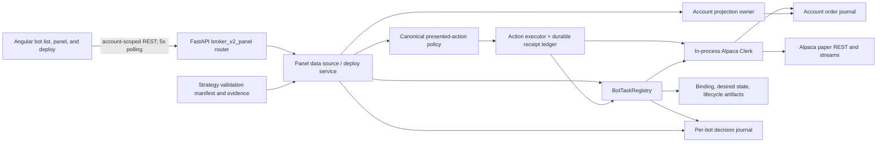

# Alpaca bot control panel architecture audit

**Date:** 2026-08-02

**Scope:** Current working tree of the Alpaca Bot Fleet / Bot Control / Deploy surfaces

**Method:** Static architecture trace, contract and PRD comparison, focused and broad tests, and targeted runtime reproductions

**Audience:** Engineering and product owners of the Alpaca Clerk-governed paper-bot control plane

## Executive assessment

The control panel has a strong safety-oriented shape: Python authors lifecycle and numerical meaning, Angular renders server contracts, Alpaca writes are funneled through one Clerk, order and decision evidence are durable, account scope is checked, panel actions are concurrency-bound and durably idempotent, and protected reads and mutations fail closed behind the data-plane control secret.

It is not ready to be treated as a production-grade multi-bot control plane yet. Three invariant breaks are release blockers:

1. a stopped strategy instance's durable binding can be overwritten by deploying the same SID with different strategy configuration; and
2. `clear_hold` can clear an unexplained-order hold without proving that the unexplained order or other root condition has disappeared; and
3. Stop can record a terminal `OPERATOR_STOP` and reap a bot whose coroutine is still alive after the cancellation timeout.

These are not UI polish issues. They affect custody continuity and the fail-closed boundary around broker writes. The next tier of findings concerns stale channel admission, non-terminal flatten operations labeled as success, transaction evidence that mixes historical and current facts, a decision-journal sequence used as an order-journal watermark, missing deploy-provenance lineage, non-idempotent deploy, and full journal replay on recurring reads.

**Recommendation:** do not enable live Alpaca execution or broaden the current trusted-local deployment boundary until P0 and P1 items in this audit are closed with regression tests. Paper trading may continue as an explicitly supervised validation environment, but SIDs involved in exposure should be treated as irreplaceable until the binding fix lands.

## Severity model

| Priority | Meaning |
| --- | --- |
| P0 | Custody, identity, or broker-write safety invariant can be violated; release blocker. |
| P1 | A control action or displayed receipt can materially misstate admission, evidence, outcome, or recoverability. |
| P2 | Architecture, scale, security-boundary, or scope gap that should be resolved before wider use. |

## System map



### Authority boundaries observed

| Concern | Current authority | Assessment |
| --- | --- | --- |
| Strategy math and decisions | Python strategy kernel and decision journal | Correct layer; the EMA change reuses canonical Python math and has provenance/parity coverage. |
| Broker writes and attribution | In-process Alpaca Clerk and account order journal | Correct ownership, conditional on one Uvicorn worker. |
| Lifecycle and run supervision | `BotTaskRegistry` plus durable per-SID artifacts | Correct owner, but deploy does not enforce create-once SID binding. |
| Action availability and copy | Python action-policy registry | Good closed-set pattern; several guards are incomplete. |
| UI rendering | Angular standalone components and generated contracts | Appropriately thin; current redesign improves component boundaries and trader/operator separation. |
| Deploy validation admission | Current validation-manifest projection | Admission is checked, but the accepted evidence identity is not carried into the durable binding or receipt. |
| Operator identity | Static process setting | Appropriate only for a trusted local single-operator boundary. |

## Findings

### P0-1 — Deploy can replace an immutable stopped strategy instance binding

**Evidence**

- The domain contract defines a strategy instance as a lifetime identity whose configuration, Clerk namespace, custody history, and attribution remain continuous: `docs/prds/alpaca-clerk-governed-bot-control.md:89-95`.
- `BotTaskRegistry.deploy` and `resume_existing` converge on `_launch`: `PythonDataService/app/services/bot_runner.py:250-307`.
- `_launch` rejects only an in-memory task that is still running: `PythonDataService/app/services/bot_runner.py:324-330`.
- It then creates a new binding and atomically replaces `broker_binding.json`, even when a durable binding already exists: `PythonDataService/app/services/bot_runner.py:341-356`.

**Runtime reproduction**

A temporary registry was used to deploy `audit-sid` as `deployment_validation` on `SPY`, stop it, and deploy the same SID as `ema_crossover_signal` on `QQQ`. The second call succeeded and the durable binding changed from `SPY` to `QQQ`:

```text
first_symbol=SPY
second_symbol=QQQ
persisted_strategy=ema_crossover_signal
persisted_symbol=QQQ
```

The existing regression covers redeploy while a task is running, not redeploy after STOP or after process restart.

**Impact**

The same Clerk namespace can silently acquire new strategy semantics, symbol, action plan, quantity, or carryover policy while retaining its prior custody and exposure history. The redeploy path also bypasses `resume_existing`'s fresh custody proof and configuration checkpoint comparison.

**Required correction**

- Split create-once instance configuration (SID, broker, strategy, symbol, action plan, quantity, carryover policy, validation lineage) from per-run identity (`run_id`, run start time). The current `BrokerBotBinding` conflates both and is rewritten on Resume.
- `deploy` must return a typed `409 IMMUTABLE_STRATEGY_INSTANCE_EXISTS` whenever any instance configuration already exists, regardless of task liveness.
- Permit subsequent run records only through `resume_existing`, after comparing the complete immutable configuration fingerprint.
- A replacement strategy gets a new SID plus explicit `replaces_sid` lineage; retirement remains terminal.
- Add same-process stopped-redeploy and post-restart redeploy regression tests. Assert that the original binding bytes and custody artifacts do not change.

### P0-2 — Clear hold does not prove that the hold's root condition recovered

**Evidence**

- Holds may be raised by stream health or by an unexplained/foreign order. The durable derivation explicitly treats `UNEXPLAINED_ORDER` as an active hold: `PythonDataService/app/broker/alpaca/clerk/derive.py:105-138`.
- The presented-action guard enables clear whenever a hold is active and two channels are considered fresh: `PythonDataService/app/broker/v2panel/action_policy.py:228-248`.
- The guard context carries no hold-reason-specific proof.
- `AlpacaClerk.clear_hold` appends `HOLD_CLEARED` under the intake lock without a broker reconciliation or root-condition revalidation: `PythonDataService/app/broker/alpaca/clerk/clerk.py:483-519`.
- The existing panel test asserts only the stream-health case: `PythonDataService/tests/broker/v2panel/test_panel_projection.py:387-399`.
- The Clerk reconciliation test clears the hold while its fake broker still contains the foreign order, and only removes the order afterward: `PythonDataService/tests/broker/alpaca/clerk/test_clerk_reconciliation.py:530-543`. The behavior is therefore explicitly executable, not merely inferred from missing guard code.

**Impact**

An operator can clear `UNEXPLAINED_ORDER_HOLD` while the foreign order is still present. Because the clear occurs after the projection guard and does not re-prove the condition under the Clerk lock, there is also a time-of-check/time-of-use window. Submission can be reopened until a later observation recreates the hold.

**Required correction**

- Move the authoritative clear admission into the Clerk, under the same intake lock as the append.
- For `STREAM_HEALTH_HOLD`, require operation-specific fresh healthy market-data and execution proofs.
- For `UNEXPLAINED_ORDER_HOLD`, require a fresh reconciliation proving no unexplained orders, no unresolved intents, no custody freeze, and no incompatible working orders.
- Return a typed terminal clear receipt containing the reason code, proof reference, observation time, and journal sequence.
- Keep the panel guard as a preview of that same admission decision, not a second implementation.

### P0-3 — Stop ignores a cancellation timeout and reports a live task as stopped

**Evidence**

- Stop writes the durable STOPPED desire, calls `task.cancel()`, and waits up to five seconds: `PythonDataService/app/services/bot_runner.py:429-443`.
- It ignores the `done` and `pending` sets returned by `asyncio.wait`, then unconditionally finalizes, reaps the registry entry, obtains a custody proof, and records a terminal outcome: `PythonDataService/app/services/bot_runner.py:443-466`.
- `_reap` removes the only managed-task reference: `PythonDataService/app/services/bot_runner.py:815-818`.
- A Python coroutine may delay or suppress `CancelledError`; an in-process task has no safe force-kill primitive.

**Runtime reproduction**

A temporary log-only bot used a feed whose async generator caught the first `CancelledError` and remained alive. With the stop timeout shortened only for the reproduction, Stop returned:

```text
reported_running=False
reported_outcome=OPERATOR_STOP
task_done_after_stop=False
cancellation_was_suppressed=True
```

**Impact**

The UI and durable artifacts can claim that a bot is off duty while its strategy coroutine is still evaluating. Because the task has been reaped, later lifecycle operations cannot find or cancel it. A surviving trade task may attempt additional Clerk effects unless a separate run-level fence rejects them.

**Required correction**

- Inspect the wait result. Never reap, prove terminal custody, or emit `OPERATOR_STOP` while the task is pending.
- Persist a non-terminal `STOPPING`/`EXITED_UNVERIFIED` state with the active run ID and block Resume/redeploy.
- Add a durable run-generation/effect-admission fence that the Clerk checks under its intake lock; a STOP intent must revoke new ENTER effects even if the strategy coroutine survives.
- Escalate a cancellation timeout to service health/controlled process recovery because Python cannot safely kill the coroutine in place.
- Add a regression with a cancellation-suppressing feed and assert that no terminal stop receipt or new Clerk entry can occur.

### P1-1 — A one-trading-day channel freshness window authorizes current control decisions

**Evidence**

- Station evidence uses `STALE_THRESHOLD_MS = 24 * 60 * 60 * 1000`: `PythonDataService/app/services/broker_v2_panel/station_derivation.py:34-37`.
- The panel reuses that historical-display threshold as the channel-control freshness threshold: `PythonDataService/app/services/broker_v2_panel/panel_projection_service.py:51-54`.
- Both deploy readiness and clear-hold/start presentation consume `evaluate_channel_health`: `PythonDataService/app/services/broker_v2_panel/panel_projection_service.py:259-287` and `PythonDataService/app/services/broker_v2_panel/paper_deploy_service.py:249-269`.
- Execution-channel health remains `healthy=True` as long as its last connection state was connected; its observation time is the connection-change watermark: `PythonDataService/app/broker/alpaca/clerk/stream_health.py:50-75`.

A pure projection reproduction confirmed that identical healthy channel facts aged 23 hours return `ready=True`; the same facts aged 25 hours return stale.

**Impact**

An execution channel last observed connected almost 24 hours ago can satisfy deploy and hold-clear readiness. The mission header separately evaluates channel readiness, but Start's canonical action guard does not include it, allowing contradictory “Mission blocked” and “Start ready” states.

**Required correction**

- Separate display staleness from control admission freshness.
- Define short, operation-specific TTLs from measured heartbeat/update guarantees; use milliseconds, document the source, and expose `observed_at_ms`, `age_ms`, and `evaluated_at_ms` in the contract.
- Use one `StartAdmissionDecision`/`DeployAdmissionDecision` in both projection and execution immediately before launch.
- Ensure the Clerk's hot submit gate remains the final fail-closed boundary.

### P1-2 — STOP-AND-FLATTEN reports success before a terminal flat proof

**Evidence**

- The domain contract says STOP-AND-FLATTEN completes only after runtime stop, terminal entry and closing orders, and zero attributed exposure: `docs/prds/alpaca-clerk-governed-bot-control.md:190-199`.
- `_flatten_stop` returns a normal string for `UNPROVABLE`, `FLAT`, and merely submitted reducing operations: `PythonDataService/app/services/broker_v2_panel/panel_data_source.py:587-624`.
- Any performer string is wrapped in a `PanelActionResult` whose only outcome is `success`: `PythonDataService/app/services/broker_v2_panel/action_execution_service.py:374-384` and `PythonDataService/app/schemas/broker_v2_panel.py:387-404`.

**Impact**

The UI can render a green success receipt when exposure is unprovable or a closing order is only working. This collapses accepted/in-progress/unknown/terminal states and conflicts with the panel's own custody language.

**Required correction**

- Replace string performers with typed results: `accepted`, `in_progress`, `success`, `unknown`, `failure`.
- Only emit `success` with terminal `STOPPED_AND_ATTRIBUTED_FLAT` evidence.
- Carry the Clerk effect/intent/order reference into the panel receipt and let polling resolve in-progress to terminal.
- Burn/replay idempotency keys against the typed durable result exactly as today.

### P1-3 — A selected historical transaction is paired with the latest strategy decision

**Evidence**

- The panel selects an order transaction from the account journal but passes `latest_decision` into station derivation: `PythonDataService/app/services/broker_v2_panel/panel_projection_service.py:516-527`.
- The SIGNAL station always renders that latest decision: `PythonDataService/app/services/broker_v2_panel/station_derivation.py:114-122,240-310`.
- The design requires the rail to render one selected transaction, not a mixture of bot-wide latest state and order-scoped history: `docs/superpowers/specs/2026-07-29-broker-v2-bot-control-panel-design.md:87-103`.

**Impact**

Selecting an older intent can show its intent/ack/fill beside an unrelated newer signal. That produces a plausible but false causal trace. The latest account reconciliation is also account-scoped; it should be labeled as such and only attached when causally later than the selected submission.

**Required correction**

- Persist and query the decision by `order_ref` or a stable decision/effect ID.
- For a selected transaction, render only the linked decision; if no link exists, display unknown/waiting rather than substituting the latest decision.
- Retain the existing causal-time gate for reconciliation, while describing the reconciliation's account scope honestly.

### P1-4 — The operator evidence resource watches the wrong journal watermark

**Evidence**

- `get_panel` sets `journal_tail_ref` to the decision endpoint and `journal_tail_seq` to the latest decision sequence: `PythonDataService/app/services/broker_v2_panel/panel_data_source.py:431-464`.
- The Operator lens reloads order-journal evidence only when that value changes: `Frontend/src/app/components/broker/v2-panel/operator-lens/operator-lens.component.ts:80-93`.
- Evidence reads the account order journal, not the decision journal: `PythonDataService/app/services/broker_v2_panel/evidence_service.py:186-199`.
- Evidence `seq` is a page-relative newest-first index, not a durable journal identity: `PythonDataService/app/services/broker_v2_panel/evidence_service.py:201-219`.
- The redesign requirement is to reload when the selected transaction or journal-tail sequence changes: `docs/prds/alpaca-bot-fleet-control-deploy-redesign.md:399-410`.

**Impact**

New acknowledgements, fills, holds, or reconciliation lines do not refresh the Operator journal when no new decision arrives. Existing evidence row sequence values also shift whenever a newer row is prepended, so they cannot be used as stable identities or watermarks.

**Required correction**

- Give every order-journal append a durable monotonic sequence/event ID.
- Expose the order-journal tail sequence separately from the decision-journal tail sequence.
- Key evidence loading on broker/account/SID, selected transaction, and the order-journal tail sequence.
- Use durable event IDs for track-by and evidence links; retain the cursor only for pagination.

### P1-5 — Deploy admission verifies current validation, but durable deployment evidence loses its lineage

**Evidence**

- The deploy service correctly re-reads current validation state and rejects strategies that are not current, human-validated, deployable, accepted for deploy, and hash-current: `PythonDataService/app/services/broker_v2_panel/paper_deploy_service.py:27-86,313-365`.
- In the current working-tree redesign, `AlpacaPaperDeployStrategy` was reduced to key/label/explanation/case symbol; validation event identity, hashes, reconciliation reference, tolerance, and diagnostics were removed: `PythonDataService/app/schemas/broker_bots.py:119-127`.
- `BrokerBotBinding` persists strategy key and runtime configuration but no validation event/hash: `PythonDataService/app/services/bot_runner.py:159-177`.
- `AlpacaPaperDeployReceipt` similarly has no validation lineage: `PythonDataService/app/schemas/broker_bots.py:226-244`; its builder records only deployment/run facts: `PythonDataService/app/services/broker_v2_panel/paper_deploy_service.py:384-407`.

**Impact**

Admission is safe at POST time, but a later auditor cannot prove which validation artifact authorized a deployed bot after the current validation projection changes or is superseded. The strategy key alone is insufficient scientific provenance.

**Required correction**

- Carry an immutable validation-evidence reference into the POST-side admission result.
- Persist its event ID, evidence snapshot hash, reference-implementation/version identity, tolerance, and accepted verdict in the binding and deployment receipt.
- Include that lineage in the binding configuration hash used for carryover comparison.
- The Trader lens may summarize it, but the Operator lens must retain an exact durable link even if the current validation catalog later changes.

### P1-6 — Deploy has no durable command idempotency or outcome-recovery key

**Evidence**

- Panel actions accept an idempotency key and use a durable per-SID ledger: `PythonDataService/app/services/broker_v2_panel/action_execution_service.py:167-257` and `PythonDataService/app/services/broker_v2_panel/panel_data_source.py:714`.
- The deploy request has no command/idempotency field: `PythonDataService/app/schemas/broker_bots.py:85-104`.
- A deployment-side failure after the operation may return `outcome=unknown` with no receipt ID: `PythonDataService/app/routers/broker_v2_panel.py:170-200`.

**Impact**

If the binding and task are created but the response is lost, a client cannot safely replay or retrieve the same command receipt. A blind retry currently conflicts if the bot is still running; before P0-1 is fixed, a retry after STOP can replace the binding.

**Required correction**

- Add a client command ID and a durable deployment command ledger.
- Replaying the same key and payload returns the original receipt; the same key with a different payload is a conflict.
- Provide receipt lookup by command ID and SID so an unknown HTTP outcome can be resolved without executing again.

### P1-7 — Recurring catalog, panel, and evidence reads still replay the complete order journal

**Evidence**

- Catalog polls call `_read_order_journal`, which calls `OrderJournal.read_entries`: `PythonDataService/app/services/broker_v2_panel/panel_data_source.py:180-193,374-383`.
- `OrderJournal.read_entries` opens the JSONL file and validates every line: `PythonDataService/app/broker/alpaca/clerk/journal.py:189-203`.
- Panel and evidence endpoints repeat the same full read: `PythonDataService/app/services/broker_v2_panel/panel_data_source.py:431-442` and `PythonDataService/app/services/broker_v2_panel/evidence_service.py:186-199`.
- `AccountProjectionOwner` avoids recomputing known rollups from old entries, but only after the full journal has already been read and parsed: `PythonDataService/app/services/broker_v2_panel/account_projection_owner.py:44-99`.
- The design's scale requirement is at least 100 bots/account with no O(journal) work per request: `docs/superpowers/specs/2026-07-29-broker-v2-bot-control-panel-design.md:181-193`.

**Impact**

Cost grows with the lifetime account journal and is duplicated per browser poll/client. Catalog adds one latest-decision file read per SID. The redesign PRD already recorded 9.4–18.6 second roster action latency and identifies journal/decision reads as a recurring cost: `docs/prds/alpaca-bot-fleet-control-deploy-redesign.md:85-103`.

**Required correction**

- Move tailing into a single account-scoped background projection owner with a byte offset plus durable event sequence.
- Serve immutable snapshots from that owner; recover with one full replay at startup/rotation only.
- Keep raw evidence paging bounded with an index/offset rather than reverse-reading the entire file.
- Instrument journal bytes/lines parsed, projection age, catalog duration, panel duration, and action round-trip time.
- Add the specified 100-bot/account performance fixture and assert complexity/latency budgets.

### P1-8 — Durable action idempotency is not recoverable end to end by the UI

**Evidence**

- The backend correctly persists reservations and terminal/unknown action records by idempotency key.
- Angular generates a fresh random UUID inside every `runBotAction` invocation: `Frontend/src/app/components/broker/v2-panel/lib/broker-v2-panel.service.ts:110-124`.
- The shell does not persist the command attempt or expose a receipt-lookup/replay path. A response-shaped unknown error can display the backend key, but a transport loss before any response fabricates a local timestamp and has no receipt ID: `Frontend/src/app/components/broker/v2-panel/panel-shell/bot-panel-shell.component.ts:231-297`.

**Impact**

An identical HTTP retry by infrastructure is safe, but an operator retry after a lost response is a new command with a new key. The durable ledger cannot correlate it with the first attempt. Concurrency state often prevents duplicate Start/Stop effects, but reconciliation, hold recovery, and future targeted commands should not rely on incidental state changes for exactly-once operator intent.

**Required correction**

- Create and retain a client command-attempt object before POST, including the idempotency key and target concurrency token.
- On timeout, retrieve/replay that same key until the backend returns its durable result; do not mint a new key for a retry.
- Add a bounded receipt lookup endpoint or include command receipts in the panel projection.
- Distinguish “retry transport for the same command” from “issue a new operator command” in the UI.

### P2-1 — Start display and execution do not share one explicit admission contract

**Evidence**

- `resume_eligible` treats a flat stopped bot as eligible without checking channel freshness, reconciliation, or outstanding intents: `PythonDataService/app/services/broker_v2_panel/presented_actions.py:36-61`.
- `_guard_start` checks lifecycle, hold, freeze, and carryover proof, but not channels, working orders, or unresolved intents: `PythonDataService/app/broker/v2panel/action_policy.py:112-165`.
- The runner then performs stronger boot-recovery and fresh instance custody checks: `PythonDataService/app/services/bot_runner.py:285-307,621-639,849-878` and `PythonDataService/app/services/bot_carryover.py:174-240`.
- The PRD requires every displayed readiness gate to be evaluated by the same production code path that admits the operation: `docs/prds/alpaca-bot-fleet-control-deploy-redesign.md:160-164`.

**Impact**

The panel can enable Start while the eventual runner rejects it, or while the mission header says channels are blocked. The stronger runner proof is good for safety, but duplicated admission logic makes readiness unreliable and invites future drift.

**Required correction**

Introduce a side-effect-free, typed `StartAdmissionDecision` that accepts the exact durable and fresh facts required by execution. Use it for the action projection, then rerun it immediately before launch under the relevant locks. Keep runtime recovery errors mapped to the same blocker vocabulary.

### P2-2 — The security model is a trusted-local control channel, not user authorization

**Evidence**

- All broker-v2 panel routes require the always-on data-plane secret: `PythonDataService/app/main.py:671-677`.
- Secret comparison is constant-time and fails closed when no secret is configured unless an explicit unsafe override is enabled: `PythonDataService/app/security/data_plane_control.py:32-57`.
- The Angular development proxy attaches the secret only for declared protected surfaces with a known intent and same-origin localhost browser provenance: `Frontend/proxy.conf.js:108-140`.
- Evidence and action audit records use static `PANEL_OPERATOR_IDENTITY`, defaulting to `operator`: `PythonDataService/app/config.py:65` and `PythonDataService/app/routers/broker_v2_panel.py:369-410`.

**Impact**

The current controls are suitable for a local trusted operator and protect the service from casual direct access. They do not authenticate a human, distinguish Trader from Operator authorization, attribute actions to a real actor, or support safe multi-user network exposure. The Trader/Operator lens is a presentation choice, not RBAC.

**Required correction before remote/multi-user deployment**

- Put authenticated identity at a server/BFF boundary; derive actor identity server-side.
- Enforce role/permission checks for mutations and raw evidence reads.
- Add origin/CSRF protections appropriate to the chosen session model.
- Keep the data-plane secret as service authentication, not user authentication.
- Document and enforce the local-only boundary until that work exists.

### P2-3 — Two routine workflows in the governing design are explicitly absent

**Evidence**

- `retire` and `cancel_order` have no supported broker and always-disabled guards: `PythonDataService/app/broker/v2panel/action_policy.py:220-225,351-364`.
- Tests explicitly assert that they are absent from Alpaca panel/profile contracts.
- The governing design includes retire and cancel among routine UI-operable workflows: `docs/superpowers/specs/2026-07-29-broker-v2-bot-control-panel-design.md:187-195`.

**Impact**

Lifecycle replacement lineage cannot be completed through the panel, and an operator cannot cancel a selected working order from the panel. This is a known scope gap, not a hidden implementation defect, but it blocks the design's completion claim.

**Required correction**

Ship each as a typed vertical slice with production performer, precise target identity, blocker/admission contract, confirmation for destructive behavior, durable idempotent receipt, and regression tests. Do not advertise the panel as 100% routine-operable until both exist.

### P2-4 — Open P&L is modeled but no production mark source is passed to the rollup

**Evidence**

- `BotRollupCache` deliberately returns `open_pnl=None` when marks are missing: `PythonDataService/app/broker/alpaca/clerk/rollup_cache.py:310-384`.
- Catalog and panel call the projection owner without `mark_prices`: `PythonDataService/app/services/broker_v2_panel/panel_data_source.py:383,442-455`.
- Angular honestly renders an em dash for null open P&L.

**Impact**

The contract is numerically honest, but the Trader lens cannot deliver the open-P&L capability implied by the roster/detail design for exposed bots.

**Required correction**

Choose one Python-owned, timestamped mark source, define market/session/staleness semantics, pass marks to the canonical rollup, and expose mark time/source alongside the value. Add parity tests proving roster, detail, and chart marker P&L derive from the same canonical lots and marks.

### P2-5 — Raw-evidence audit logging fails open

**Evidence**

- The evidence endpoint is described as operator-gated and audit-logged.
- `_append_audit_entry` catches any audit-file `OSError`, emits only a warning, and the evidence response continues: `PythonDataService/app/services/broker_v2_panel/evidence_service.py:65-77,225-248`.
- The audit append flushes Python buffers but does not `fsync` the file.

**Impact**

An operator can receive evidence while the system has no durable record of the read. Static operator identity already limits attribution; silently losing the record further weakens the audit claim.

**Required correction**

Choose and document a policy. For sensitive raw detail, fail closed if the audit receipt cannot be durably appended. If availability must win for the redacted summary, label the response `audit_recorded=false`, raise a prominent health incident, and prohibit deeper/raw detail. Use the same append/fsync discipline as the Clerk journal and test write failure explicitly.

### P2-6 — Several “durable” atomic JSON paths do not fsync their parent directory

**Evidence**

- Bot bindings use `run_status._atomic_write_json`, which fsyncs the temporary file and renames it but does not fsync the parent directory: `PythonDataService/app/engine/live/run_status.py:24-32`.
- The durable panel-action ledger has the same file-fsync/rename pattern: `PythonDataService/app/services/broker_v2_panel/action_execution_service.py:219-238`.
- The account-artifact writer demonstrates the stronger repository pattern by fsyncing the parent after replacement: `PythonDataService/app/engine/live/account_artifacts.py:1415-1423`.

**Impact**

Normal process restart is covered, but a host/kernel/power failure can lose the directory-entry update after the code has claimed durability. Losing an in-flight idempotency reservation can permit a command to be re-fired; losing a new binding can strand lifecycle artifacts.

**Required correction**

Extract and use one public, locked atomic-JSON primitive that fsyncs the file and parent directory, uses collision-safe temporary names, validates the target boundary, and has crash/fault-injection tests. Migrate binding, carryover, lifecycle adjunct, and action-receipt writes to it without duplicating helpers.

## Positive controls worth preserving

1. **One broker-write authority.** The Alpaca Clerk owns submit/cancel/reduce operations, journals intent before broker contact, and protects intake with an async lock.
2. **Explicit deployment constraint.** The Clerk documents the single-Uvicorn-worker requirement, and current Docker/Compose launch commands do not configure multiple workers. This must become an enforced startup invariant if deployment tooling grows.
3. **Durable evidence.** Binding, lifecycle, decision, order, and action-receipt artifacts are persisted with atomic replacement or append/fsync discipline in the critical paths reviewed; P2-6 identifies the remaining parent-directory durability gap.
4. **Server-authored safety meaning.** Action copy, blockers, confirmations, mission verdicts, readiness, and receipt labels originate in Python. Angular does not recompute trading numbers or invent action availability.
5. **Action concurrency and replay safety.** Panel actions carry action-specific concurrency tokens and use durable per-SID idempotency ledgers. Unknown performer outcomes burn the key and tell the operator to inspect evidence.
6. **Fail-closed service boundary.** Protected reads and mutations require the data-plane secret; the local proxy limits secret attachment to declared routes with same-origin browser provenance.
7. **Account scoping.** Account IDs are resolved from the broker and compared to route scope before panel/evidence operations.
8. **Canonical numerical ownership.** FIFO P&L/exposure is Python-owned and tolerant of missing marks by returning unknown, not a partial or fabricated total.
9. **UI decomposition.** The current working-tree redesign splits deploy binding, execution, readiness, trader summary, review, and receipt responsibilities, and the Trader/Operator tabs have keyboard/ARIA behavior.
10. **Account lookup coalescing.** Broker account posture is cached/coalesced for 60 seconds, addressing one previously measured first-load bottleneck.

## Remediation sequence

### Phase 0 — Freeze the custody invariants

1. Make SID instance configuration create-once, separate run records, and add stopped/restart redeploy tests.
2. Make Clerk hold-clear reason-specific and proof-backed under the intake lock.
3. Make Stop terminal only after task termination and fence Clerk effects by desired run generation.
4. Split historical display staleness from short control-admission TTLs.
5. Introduce typed effect/action outcomes; terminal flat is the only flatten success.

### Phase 1 — Make every displayed fact causally auditable

1. Link decisions to selected transactions.
2. Add a durable order-journal event sequence and correct the Operator reload key.
3. Persist validation evidence lineage in binding, configuration hash, and deploy receipt.
4. Add durable deploy command idempotency and receipt lookup.
5. Unify start projection and execution around one admission decision.
6. Make UI action attempts retain and recover the same durable idempotency key.

### Phase 2 — Meet the scale and operability contract

1. Replace per-request full journal replay with a single tailing account projection owner.
2. Add 100-bot/account performance and complexity tests plus request instrumentation.
3. Implement retire and targeted cancel-order vertical slices.
4. Wire a canonical timestamped mark source for open P&L.
5. Make evidence-read auditing and atomic JSON persistence match their durability claims.
6. Enforce/document the one-worker invariant and local-only authentication boundary.

### Phase 3 — Broaden deployment only after proof

1. Add authenticated actor identity and authorization before remote or multi-user use.
2. Run a paper soak that exercises deploy retry, process restart, stopped resume, hold recovery by reason, partial flatten fills, evidence refresh, and 100-bot polling.
3. Require zero P0/P1 findings and terminal receipt reconciliation before any live Alpaca enablement.

## Verification performed

| Check | Result |
| --- | --- |
| Focused Python panel/runner/Clerk suites | **227 passed** |
| Focused Angular control/deploy/validation suites | **124 passed across 17 files** |
| Full Angular unit suite | **1,897 passed across 240 files** |
| Angular development build | **Passed** |
| Frontend proxy/operator contract guards | **Passed** |
| Frontend ESLint | **Passed** |
| Python Ruff (`app/`, `tests/`) | **Passed** |
| Committed Python OpenAPI snapshot check | **Passed** |
| `git diff --check` | **Passed** |
| Full Python suite | **Inconclusive outside panel scope:** reached 56%, then hung in async/thread-pool teardown and required interruption. A fail-fast rerun found one environment-sensitive Alpaca credential test failure after 306 passes. |
| SID immutable-binding targeted reproduction | **Failed invariant:** stopped SID was rebound from SPY/deployment-validation to QQQ/EMA crossover. |
| Stop-timeout targeted reproduction | **Failed invariant:** status reported stopped/`OPERATOR_STOP` while the original task remained alive. |

The focused green suites show that the current behavior is internally consistent; they do not invalidate the findings. Several findings are precisely gaps in what the present tests assert. The full Python suite includes the entire research platform and must be classified separately from this panel's focused acceptance surface. Its first fail-fast failure was `tests/broker/alpaca/test_client.py::test_missing_credentials_map_to_auth_error`: the test deleted process environment variables but did not receive the expected auth error in this host environment. That is not evidence of a control-panel regression, but the broad suite is not green and its teardown hang deserves a separate test-infrastructure investigation.

## Regression tests required for closure

| Finding | Minimum regression |
| --- | --- |
| P0-1 | Existing stopped binding rejects deploy in-process and after registry restart; bytes unchanged. |
| P0-2 | Unexplained-order hold cannot clear until a fresh clean reconciliation; race under intake lock. |
| P0-3 | A cancellation-suppressing task remains registered/fenced and cannot yield a terminal Stop receipt. |
| P1-1 | 24-hour-old connected channel cannot admit deploy/start/clear; boundary TTL tests. |
| P1-2 | Submitted and unprovable flatten receipts are not success; only terminal attributed-flat succeeds. |
| P1-3 | Selecting transaction A never displays decision B; missing link renders unknown. |
| P1-4 | Order append without a decision advances the evidence watermark and reloads the Operator resource. |
| P1-5 | Binding and receipt retain the exact validation event/hash after catalog supersession. |
| P1-6 | Lost deploy response replays the same receipt without a second launch; conflicting payload is rejected. |
| P1-7 | Warm catalog/panel requests parse only appended bytes; 100-bot fixture meets explicit budget. |
| P1-8 | Lost-response UI retry reuses the same command key and resolves the original receipt. |
| P2-1 | Presented Start and execution use the same admission decision for every blocker fact. |
| P2-4 | Roster/detail open P&L parity from the same mark timestamp and canonical FIFO lots. |
| P2-5 | Audit write failure follows the documented fail-closed/degraded contract and is regression-tested. |
| P2-6 | Fault-injected atomic writes preserve or conservatively reject binding/action receipt state. |

## Scope notes

- This is an architecture and behavior audit, not an implementation patch. No existing source file or uncommitted user change was modified.
- The working tree contains an active deploy/EMA strategy redesign. Findings refer to that current state and explicitly call out where removed or newly generalized fields alter provenance.
- The audit did not contact Alpaca or place an order. Runtime reproduction used temporary local artifacts and test doubles.
- This platform is for research and education; nothing in this audit is financial advice.
