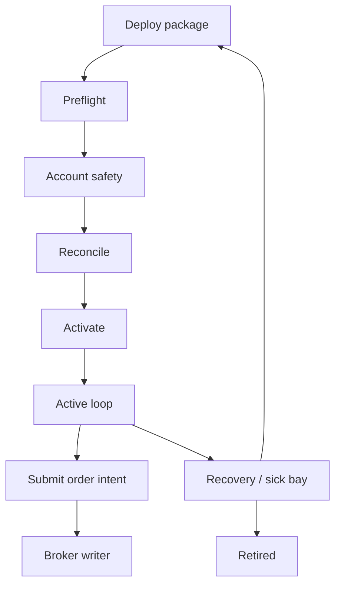

# Bot Cockpit Traffic Controller Guide

**Status:** operator guide, current shipped behavior plus near-term testing plan.
**Audience:** the single operator/developer running paper bots from Bot Cockpit.
**Last updated:** 2026-07-10.

This document explains how the Bot Cockpit traffic controller works now, how a
bot moves through its lifecycle, which bots should be deployed first, and how
we will keep testing resilience before trusting the cockpit with more paper
traffic.

This is paper-trading infrastructure. Nothing here is live-money guidance.

## The Short Version

The Bot Cockpit traffic controller is not one class. It is the coordination
layer made of:

- Python FastAPI routes that accept commands and serve Bot Cockpit state.
- Per-bot `SurfaceHub` producers that own the latest operator snapshot.
- Durable event channels that own broker/bot event history and recovery.
- The host daemon that owns process truth and starts/stops bot subprocesses.
- AccountOwner generation fencing that decides whether a process may write to
  the broker.
- Account Truth, broker session mirror, reconciliation receipts, and runtime
  sidecars that provide evidence.
- Angular stores that render backend-authored state and recover streams without
  inventing verdicts.

The rule is simple:

> Reads assemble or stream evidence. Commands mutate through guarded endpoints.
> Broker writes require AccountOwner authority. Missing proof is unsafe.

The cockpit is designed to fail closed. If the daemon, broker, reconciliation,
Account Truth, or AccountOwner evidence is missing or stale, the UI should show
the bot as not ready, read-only, waiting, or in recovery rather than allowing a
hopeful start.

## Current Authority Map

| Question | Current authority | What the cockpit may do |
|---|---|---|
| Does this bot exist and what run is bound? | `run_ledger.json`, live run directory, host daemon registry | Show identity, binding, run evidence, and start/deploy actions. |
| What does the operator want? | `desired_state.json`, mutation attempts | Show pending/terminal command state and reconcile outcomes. |
| Is a bot process alive? | Host daemon `/instances` observation | Show process state, but never treat stale daemon payload as live truth. |
| Is broker/account state safe? | Account Truth cache, broker safety verdict, broker session mirror | Gate start/submit; route to Account Monitor or broker-session recovery. |
| Is the run reconciled? | `reconciliation_receipt.json` and broker observations | Permit or block resume/start/submit depending on receipt freshness and verdict. |
| May this process write to broker? | AccountOwner `owner_generation.json` plus write-grant context | Refuse stale owners at command intake and at broker-write boundary. |
| What should the operator do next? | Python-authored `operator_surface`, blockers, lifecycle chart | Render the primary move; Angular does not derive remedies from raw fields. |
| What happened historically? | Broker activity WAL, Bot event WAL, lifecycle/account events | Stream with composite cursors and REST backfill. |

The `.NET` backend and Postgres do not author Bot Cockpit truth. They may hold
analytical projections or research data, but the operator loop uses Python
because Python is closest to the live files, daemon, broker, and engine state.

## How Traffic Moves Through The System

### State Traffic

State traffic answers, "What is true now?"

1. The data plane starts a `SurfaceHub` per visible bot.
2. Each hub assembles an operator snapshot from canonical evidence:
   daemon observation, live-run artifacts, runtime sidecars, account truth,
   broker/session evidence, reconciliation, incidents, and action capability.
3. The hub stores exactly one latest complete snapshot.
4. REST status and the state SSE stream read that same stored snapshot.
5. Each snapshot has `{stream_epoch, surface_version}`.

State streams are latest-wins. A slow browser does not need every intermediate
version because the full snapshot is complete truth. If a newer snapshot
arrives before the browser receives the old one, the older one can be dropped.

Important consequence: state stream recovery is about adopting the newest
complete truth, not replaying history.

### Event Traffic

Event traffic answers, "What happened, in order?"

Broker activity and Bot events are not latest-wins. They are append-only
histories backed by WALs and durable channels:

- each channel has one WAL observer/tailer;
- each channel has a bounded ring buffer;
- each subscriber has a bounded queue;
- every event cursor is `<durable_stream_id>:<seq>`;
- REST backfill, SSE `id`, `Last-Event-ID`, gap markers, and reset events use
  the same cursor shape.

This gives four explicit recovery paths:

1. Ordinary reconnect resumes after the last composite cursor.
2. Cursor older than the ring closes the stream and backfills through REST.
3. WAL replacement or stream identity change emits `event: reset`.
4. Client queue overflow emits `event: gap` with a last safe cursor.

Important consequence: browser auto-reconnect is not the correctness
mechanism. The typed event-feed adapter owns recovery.

### Command Traffic

Command traffic answers, "May I change something?"

Commands go through authenticated Python endpoints. A command creates a
mutation attempt, updates durable desired state or asks the daemon to act, and
then the next state snapshot carries the pending or terminal receipt.

The frontend may hold a pending mutation across a stream outage, but it may not
clear that pending state until a reconnect snapshot proves the terminal
receipt.

Current operator command names still include `resume`, `pause`, `stop`,
`flatten_and_pause`, `mark_poisoned`, `confirm_start`, and `retire_replace`.
The target daily lifecycle language is moving toward "Off duty", "Ready", "On
duty", "Sick bay", and "Retired", but the current shipped endpoints and
capability evaluator still expose the legacy command vocabulary in places.

## Bot Lifecycle Now

The lifecycle chart is a projection, not a second state machine. Its job is to
explain where the bot is blocked and which move is allowed.



### 1. Deploy Package

Deploy creates or refreshes the run package. The run ledger owns deploy
identity: `strategy_instance_id`, `run_id`, `strategy_key`, symbol, account,
sizing, and action-plan details.

Deploy-only is allowed in more cases than deploy-and-start because creating a
ledger is not the same as proving it may trade.

### 2. Preflight

Preflight checks the local run shape before a process is trusted:

- strategy key is deployable;
- sizing is explicit;
- action plan is coherent;
- working tree policy is satisfied when required;
- halt/poison artifacts do not make the run unsafe;
- no same-instance process conflict exists.

### 3. Account Safety

This is the only shared gate. Bots do not gate other bots directly; the
account does.

The bot is blocked if Account Truth is missing, stale, not proven, frozen,
contaminated, or showing exposure/pending orders that conflict with a start.
The fix may happen outside the bot surface, usually in Account Monitor or the
broker session mirror.

### 4. Reconcile

Reconciliation compares broker/account reality against the run's durable
intent and artifacts. A clean or explicitly adopted result can allow progress.
A divergent, stale, unreadable, or missing receipt blocks.

### 5. Activate

Activation means durable desired state, host process state, and runtime
evidence line up enough for the live loop to run.

The host daemon owns process truth. The cockpit must never decide that a bot is
alive from old process evidence if the daemon is currently unreachable.

### 6. Active Loop

The bot child owns runtime evidence:

- engine runtime sidecar;
- readiness sidecar;
- latest signal/decision artifacts;
- live state sidecar;
- run-specific event artifacts.

The cockpit shows this evidence but does not write it during status reads.

### 7. Submit Order Intent

When a strategy wants to trade, real-broker submits go through AccountOwner.
Shadow/fake paths may still use legacy WAL-only lanes, but real broker writes
must be generation-fenced.

### 8. Broker Writer

Before the broker call, the system checks:

- the AccountOwner grant exists;
- the grant generation still matches persisted account owner generation;
- broker safety is still paper-safe;
- `order_ref` and idempotency rules hold;
- low-level broker helper also sees the AccountOwner grant.

A stale owner is refused both at intent acceptance and again at broker-write
boundary. This is the key protection against old paused processes waking back
up and writing orders after takeover.

### 9. Recovery Or Retire

Safety incidents, poison, account freezes, unresolved exposure, daemon
unreachability, and repeated uncertain submits route into recovery. The
operator sees one primary move from backend-authored blockers.

If a condition has no safe in-place cure, the answer is Retire & Replace. A
retired bot keeps history but should not be nursed back into trading.

## Which Bots To Deploy First

Use a deployment ladder. Do not begin by running every interesting strategy.
The goal is to prove the traffic controller before increasing strategy risk.

### Tier 0 - Cockpit Canary

Deploy `deployment_validation` first.

Use it to prove:

- deploy form writes a coherent run ledger;
- Account Truth and broker safety gates render correctly;
- start/stop/recovery command receipts appear in the cockpit;
- broker activity stream and Bot event stream recover from reconnects;
- the bot can be retired/replaced without leaving stale account ownership.

Recommended sizing: `FixedShares(1)` only.

### Tier 1 - Single-Symbol Parity Bot

Deploy `spy_ema_crossover` after Tier 0 passes.

Why this one:

- it is the main LEAN-parity anchor;
- it is long-only and single-symbol by default;
- behavior is documented and test-backed;
- it produces real lifecycle and submit evidence without cross-symbol
  complexity.

Recommended sizing: `FixedShares(1)` until cockpit resilience has passed a
full session.

### Tier 2 - Alternate Simple Strategy

Deploy one of:

- `sma_crossover`
- `rsi_mean_reversion`

Use Tier 2 to prove the controller is strategy-neutral. The expected question
is not "is the alpha good?" The expected question is "does the cockpit still
route lifecycle, account truth, event streams, and recovery correctly when a
different deploy key and signal profile runs?"

### Tier 3 - Option Or Multi-Asset Experiments

Delay `spy_ema_crossover_options` and cross-asset action plans until:

- Tier 0 and Tier 1 pass the resilience drills;
- Account Truth remains proven through a full paper session;
- broker session mirror has no orphaned sockets;
- event channels recover from gap/reset drills;
- retire/replace has been exercised at least once.

Options and cross-asset plans increase surface area: contract qualification,
symbol identity, sizing, expiration/strike choice, and broker evidence all
become harder to inspect.

## How To Deploy A Bot Safely

Before deploy-and-start:

1. Confirm the target is paper trading.
2. Confirm Account Truth is proven and fresh.
3. Confirm broker safety says paper-only and broker connection is live.
4. Confirm no account freeze, unresolved exposure, or pending order blocks.
5. Confirm the deploy key is intentional.
6. Confirm symbol identity: inherited bot symbol, signal stream, and action
   plan symbol must agree unless you explicitly confirm the mismatch.
7. Use `FixedShares(1)` for resilience testing.
8. Prefer deploy-only when any proof is missing.
9. Start only from the cockpit, not from ad-hoc CLI operations.
10. Watch the lifecycle chart and event streams for the first terminal receipt
    after every command.

During the run:

- Treat `submit_readiness.can_submit` as the green light.
- Treat `safe_to_monitor` as observe-only.
- Do not clear pending mutations by refreshing the browser.
- Do not infer safety from chart movement or process liveness alone.
- If the top blocker says `fix_elsewhere`, follow that surface; do not try to
  cure it locally.

After the run:

- Verify clean exit or explicit recovery evidence.
- Verify no working orders or positions remain under the bot namespace.
- Verify Account Truth returns to proven.
- Verify the bot event stream tells the same story as broker activity.

## Resilience Testing Program

Future testing should keep three layers in sync:

1. **Unit/contract tests** prove the behavior in code.
2. **Tracer tests** prove the cross-boundary recovery path.
3. **Live paper drills** prove the operator workflow in the real compose stack.

### The Eight Required Tracers

| Tracer | What it proves | Current state |
|---|---|---|
| T1 State SSE | The operator-surface stream serves current complete snapshots through the authenticated HTTP/SSE layer. | Covered by ASGI HTTP tracer. |
| T2 Gap/reset recovery | Event streams recover from queue overflow, deep backfill, resubscribe, and WAL replacement. | Covered by broker-activity HTTP tracers. |
| T3 WAL rotation race | Publish detects stream identity replacement before admitting a row onto the old stream. | Covered by durable event channel test. |
| T4 Fencing takeover | A stale owner resumed after takeover cannot submit or write to broker. | Covered by AccountOwner generation test. |
| T5 Boot resilience | Data plane boots when daemon is down, corrupt artifacts exist, or history is oversized. | Covered; severe OOM fixed. |
| T6 Staleness honesty | Stale retained observations render as unreachable/stale, not live truth. | Covered at provider and roster level. |
| T7 Frontend backfill loop | 409/reset recovery is bounded and does not spin forever. | Covered; retry after failed recovery remains a follow-up. |
| T8 Cockpit dead stream | Pending mutation survives stream outage and clears only on reconnect receipt. | Covered by BotSurfaceStore test. |

### Test Commands For The Gate

Use these before promoting a cockpit change:

```bash
cd PythonDataService
.venv/bin/python -m pytest tests/routers -q
.venv/bin/python -m pytest \
  tests/services/test_broker_session_history.py \
  tests/services/test_broker_session_mirror.py \
  tests/routers/test_broker_activity.py \
  tests/routers/test_live_instances.py \
  tests/engine/live/test_account_owner.py \
  tests/services/test_durable_event_channel.py \
  -q
.venv/bin/ruff check app/ tests/
```

```bash
cd Frontend
npx eslint src/app/components/broker/bot-control src/app/services
npx ng test --watch=false
```

Known caveat: full repo ruff may still report unrelated baseline issues in
legacy scripts. For PR gates, record whether you ran touched-file ruff or full
ruff and name any baseline failures.

### Live Paper Drills

Run these in order against the paper stack:

1. **Healthy boot drill**
   - Restart `polygon-data-service`.
   - Confirm `/health` is healthy.
   - Open Bot Cockpit and confirm fleet roster loads.

2. **Oversized history drill**
   - Seed or preserve a large broker-session history file.
   - Call `/api/broker/session-mirror` with the control secret.
   - Confirm the data plane stays healthy and the file compacts under the byte
     budget.

3. **Daemon-down drill**
   - Stop or block the host daemon.
   - Confirm the cockpit shows daemon/process unreachable, not stale live
     process truth.
   - Restart daemon and confirm the next snapshot recovers.

4. **Stream outage drill**
   - Start a command that creates a pending mutation.
   - Drop the SSE connection.
   - Confirm the pending attempt remains visible.
   - Restore connection and confirm the terminal receipt clears it.

5. **Event backfill drill**
   - Force a broker-activity gap or reconnect with an older cursor.
   - Confirm REST backfill recovers rows and live stream resumes.

6. **WAL replacement drill**
   - Replace the event WAL in a controlled test environment.
   - Confirm the stream emits reset and the client reboots onto the new stream
     identity.

7. **AccountOwner takeover drill**
   - Simulate old owner pause, durable generation advance, old owner resume.
   - Confirm stale submit and broker write are refused.

8. **Retire/replace drill**
   - Create or simulate a terminal blocker.
   - Use Retire & Replace.
   - Confirm the old bot is read-only, history remains visible, and the new
     deploy starts from a fresh run identity.

Do not run destructive drills on a bot carrying real paper exposure unless the
drill's first step verifies expected flatness and pending order count is zero.

## What We Will Watch During Testing

For every resilience run, capture:

- bot id and run id;
- strategy key and sizing;
- account id;
- current `stream_epoch` and `surface_version`;
- broker session mirror status;
- Account Truth final verdict;
- top `OperatorBlocker`, if any;
- lifecycle primary action;
- mutation attempt id for commands;
- broker-activity cursor before and after outage;
- data-plane memory and health status;
- file size for `_broker/session_roster_history.jsonl` when testing T5.

The result should be written as either:

- a short audit note under `docs/audits/`, for broad resilience runs; or
- a regression test in `PythonDataService/tests/` or `Frontend/src/**/*.spec.ts`
  when the run exposes a repeatable bug.

## Future Hardening Rules

These are the guardrails for future Bot Cockpit changes:

1. **Reads never write canonical state.** A status request may refresh a
   producer-owned snapshot only through an explicit refresh path, and it must
   not append history, start publishers, or mutate lifecycle phase.
2. **Every new lifecycle condition has one primary exit.** If we cannot name
   the button, the condition folds into Retire & Replace.
3. **Every new stream branch gets a tracer.** Reconnect, reset, gap, overflow,
   and stale source transitions need executable coverage.
4. **Every broker write needs AccountOwner proof.** Tests must cover both
   intent acceptance and broker-write boundary.
5. **Every source has its own freshness.** `generated_at_ms` is not enough.
   Daemon, broker, runtime, account, and reconciliation evidence age
   independently.
6. **Angular renders, Python judges.** Frontend code may select and lay out
   backend-authored data, but it must not invent verdicts, blockers, or cures.
7. **Test containers must not share the live cgroup.** Full pytest runs belong
   in a sibling test container or local venv, not inside `polygon-data-service`
   while it is serving the cockpit.

## The Mental Model To Keep

Think of the Bot Cockpit as an air-traffic controller for paper bots:

- The bot process is the aircraft.
- The host daemon is radar for whether it is actually moving.
- Account Truth is runway clearance.
- Reconciliation is flight-plan matching.
- AccountOwner is the tower's exclusive permission to touch the broker.
- SurfaceHub is the controller's current screen.
- Event channels are the flight recorder.
- The lifecycle chart tells you where the aircraft is in the clearance path.

If any critical instrument is stale or missing, the safe answer is not "try
anyway." The safe answer is to hold, reconcile, recover, or retire and replace.
