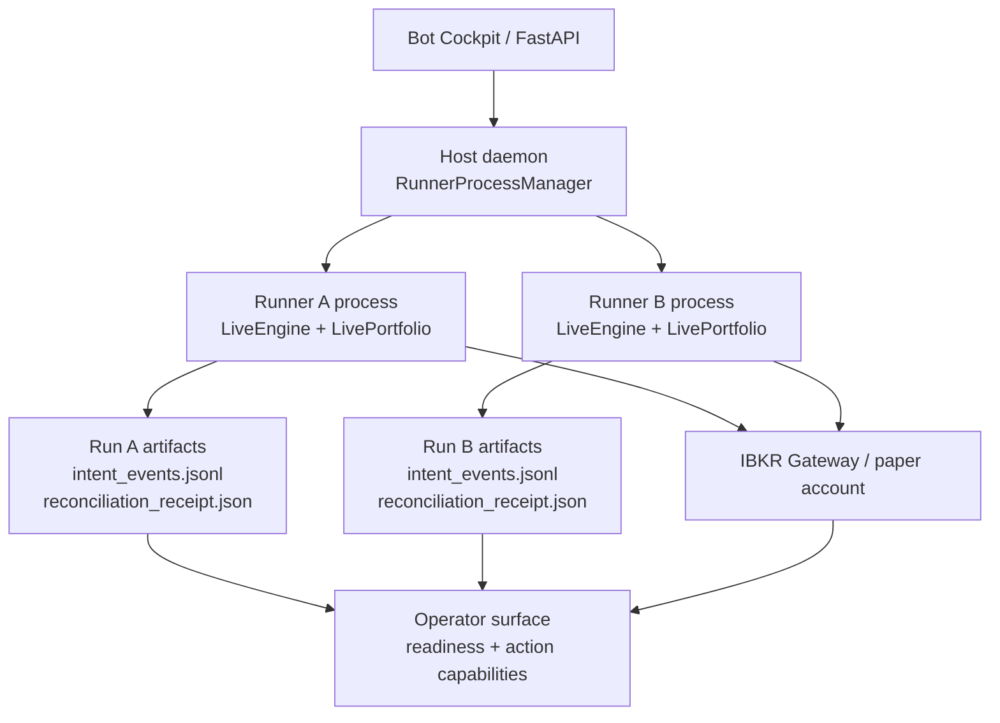

# Bot Lifecycle and Account Ownership — Authority

> **Canonical reference** for what the live-paper bot lifecycle and broker-account ownership model ships today.
> This is an implementation snapshot, not a future-design document. When this page disagrees with code, code wins and this page must be updated in the same PR.
>
> **Current status:** R2 multi-runner runtime with AccountOwner submit-lane foundation. The long-lived AccountOwner R3 daemon process and IPC intake are designed in `docs/architecture/bot-lifecycle-account-owner-prd.md` but are not implemented yet.
>
> **Owner:** the engineer editing `PythonDataService/app/engine/live/*`, `PythonDataService/app/broker/ibkr/*`, `PythonDataService/app/routers/live_instances.py`, or `PythonDataService/app/services/operator_*.py`.
>
> **Last reviewed:** 2026-06-30 (account-event hardening slice: typed forward-write envelope, monotonic account-event sequence, canonical `int64 ms UTC` timestamp storage, tolerant legacy reads, and local-time display boundary).

---

## 1. Scope and Authority

This document answers: **what actually owns bot lifecycle, broker order submission, reconciliation, and operator gates today?**

It does not answer:

- The final AccountOwner implementation details. Those live in the PRD until shipped.
- Alpha strategy behavior.
- Live-money enablement. The lifecycle described here is paper trading only.
- UI polish for the gate board. This document covers backend authority and artifacts.

Authority order:

1. Code.
2. This authority document.
3. PRDs and ADRs.
4. Model memory.

Same-PR rule: any PR that changes lifecycle gates, broker submit ownership, watchdog shutdown, reconciliation classification, or AccountOwner artifacts must update this document.

Timestamp rule: every lifecycle/account timestamp persisted to files, stored in Postgres, or sent over an API is `int64` Unix epoch milliseconds UTC. UI code may convert that integer to local/exchange time for display only; display strings are never canonical, never stored, never sent back as timestamps, and never used for lifecycle ordering.

## 2. Current Architecture

Today the host daemon spawns one OS process per `strategy_instance_id`. Each runner process may construct its own `IbkrClient`, run cold-start reconciliation, process bars, and submit broker orders through `LivePortfolio` and `place_paper_order`.

This is **not** R3. The current process-local `_submit_lock` in `LiveEngine` serializes work inside one runner only. It does not prevent a sibling runner or stale runner process from calling IBKR.

## 3. Current Lifecycle

| Phase | Current authority | Code |
|---|---|---|
| Deploy | Data-plane deploy endpoint derives broker account from the connected session, then forwards to host daemon. Host daemon writes run ledger. | `routers/live_instances.py`, `engine/live/host_daemon.py`, `engine/live/deploy.py` |
| Start recheck | Data plane blocks stale starts for poisoned runs, durable STOPPED, offline daemon, running/stopping daemon state. | `routers/live_instances.py::_assert_start_allowed` |
| Host spawn | Host daemon starts `python -m app.engine.live.run start` as a subprocess keyed by `strategy_instance_id`. | `RunnerProcessManager.start` |
| Run pre-flight | Runner validates run state, sizing, dirty tree policy, halt flags, unexpected positions, coexistence, and prior artifacts. | `engine/live/pre_flight.py`, `engine/live/run.py` |
| Cold-start reconcile | Runner writes `reconciliation_receipt.json` as `in_progress`, probes broker, classifies broker state, then writes pass/fail. | `reconciliation_orchestrator.py`, `reconciliation_classifier.py` |
| Activate | Live engine constructs portfolio/context, starts broker event stream, publishes runtime/readiness blocks, and enters bar loop. | `live_engine.py`, `readiness.py` |
| Submit | Strategy queues orders; `LivePortfolio.submit_pending_orders` writes intent WAL events and calls broker adapter. | `live_portfolio.py`, `intent_wal.py`, `submit_state_machine.py` |
| Low-level broker write | Paper safety checks run, `order_ref` is required, contract is qualified, then `client.ib.placeOrder(...)` is called. | `broker/ibkr/orders.py::place_paper_order` |
| Operator actions | Resume/Pause/Stop/Flatten-and-pause/Mark-poisoned use shared capability evaluator. Start has separate recheck. | `services/operator_capability.py`, `routers/live_instances.py` |
| Watchdog lease loss | Child watchdog detects daemon lease loss and delegates typed halt sequence. | `child_watchdog.py`, `watchdog_controller.py` |

### 3.1 Canonical Lifecycle Observability Model

The cockpit lifecycle chart is a **projection**, not a separate state machine.
Its node ids are the stable public vocabulary for operator observability. Each
node must be backed by server-authored evidence; Angular may choose layout and
styling, but it must not infer lifecycle meaning from raw process fields.

The chart-status vocabulary is intentionally small and distinct from engine
state: `passed`, `active`, `blocked`, `poison`, `freeze`, `inactive`, and
`unknown`. Missing evidence is rendered as `unknown` with a server-authored
reason, never as a fabricated pass.

| Canonical node id | Meaning | Primary source of truth |
|---|---|---|
| `deploy` | Instance package exists and the host process can be started or redeployed. | Host daemon process view, deploy/start defaults, start-capability `GateResult` rows. |
| `preflight` | Runtime configuration and readiness gates are fit to run. | `ReadinessVector`, strategy spec, sizing proof, `build_start_readiness` / `build_live_readiness`. |
| `account_safety` | Account-level gates allow the bot to run or submit. | `accounts/<account_id>/unresolved_exposure.flag`, broker safety verdict, broker connection state, account registry gate rows. |
| `reconcile` | Broker state has been classified against run/account intent evidence. | `reconciliation_receipt.json`, intent WAL cursor, broker observation evidence. |
| `activate` | Durable desired state and host process are aligned for the live loop. | `desired_state.json`, host process state, action capability rows. |
| `active` | The live loop is running and processing bars/commands. | `engine_runtime.json`, readiness sidecar, host process state, latest decision artifact. |
| `submit_order` | A strategy order intent is moving through the submit lane. | `intent_events.jsonl`, AccountOwner submit events, Activity projection rows. |
| `broker_writer` | The low-level broker writer/publisher lane is healthy or blocked. | Broker Activity WAL/publisher health, AccountOwner phase, IBKR submit evidence. |
| `recovery` | A safety incident, halt, poison, freeze, or redeploy-required state needs operator recovery. | `poisoned.flag`, `halt.flag`, operator incidents, watchdog evidence, account freeze evidence. |

The canonical overview transition table is:

| Source | Target | Meaning |
|---|---|---|
| `deploy` | `preflight` | A deployable instance is ready for runtime gates. |
| `preflight` | `account_safety` | Local runtime gates have passed; account-scoped gates are next. |
| `account_safety` | `reconcile` | Account safety permits broker-state classification. |
| `reconcile` | `activate` | Broker state is clean/adopted enough to honor desired state. |
| `activate` | `active` | Desired state is `RUNNING` and the host loop is running. |
| `active` | `submit_order` | Strategy output produced an order intent. |
| `submit_order` | `broker_writer` | Durable intent reached the broker submit boundary. |
| `active` | `recovery` | Safety evidence requires flatten, halt, poison, freeze, or redeploy. |

Submit-lane and recovery subgraphs may expose deeper nodes, but those subgraph
nodes must fold back to the canonical overview nodes above. The richer gate map
in `docs/architecture/bot-lifecycle-gate-map.md` is supporting design context;
this section is the implementation authority when the two disagree.

### 3.2 Desired-State Casing Contract

Durable desired state is uppercase and closed: `RUNNING`, `PAUSED`, `STOPPED`.
`DesiredStateView.state` is either one of those values when
`path_status=ok`, or `null` when the path is absent, corrupt, or unresolved.
Operator action names remain lowercase command verbs (`resume`, `pause`,
`stop`) and are translated at the router boundary before persistence. A
misspelled or differently-cased durable state is corruption, not an unknown
state to guess around.

## 4. Current Artifacts

| Artifact | Scope today | Authority |
|---|---|---|
| `run_ledger.json` | run | Deploy identity, account id, strategy/spec provenance, live config. |
| `desired_state.json` | instance | Durable operator intent: `RUNNING`, `PAUSED`, `STOPPED`. |
| `intent_events.jsonl` | run | Legacy/direct-submit append-only submit WAL. Source of truth for run-scoped intent lifecycle events when a runner submits directly; AccountOwner submit mode does not write this file. |
| `live_state.json` | instance | Stable projection used by reconciliation/readiness. |
| `reconciliation_receipt.json` | run | Cold-start/runtime reconcile outcome. |
| `poisoned.flag` | run | Run-level permanent unsafe state. |
| `control_plane_lease_lost.json` / incidents | run | Watchdog lease-loss evidence. |
| `broker_callbacks.jsonl` | run | Raw broker callback evidence when attached. |
| `fleet_baselines/<account_id>.json` | account-adjacent partial | Existing fleet-reset baseline used to ignore completed unknown historical executions under strict conditions. |
| `accounts/<account_id>/instance_registry.jsonl` | account | Append-only write-ahead registry of allowed strategy instance id, run id, bot order namespace, lifecycle binding state, source, and `int64 ms UTC` timestamp. |
| `accounts/<account_id>/unresolved_exposure.flag` | account | Durable account-level freeze evidence. Blocks deploy, start, router/operator-surface resume, and broker submit while active. |
| `accounts/<account_id>/owner_generation.json` | account | Current AccountOwner fencing generation and phase (`accepting`, `reconnecting`, `draining`, `frozen`). |
| `accounts/<account_id>/account_events.jsonl` | account | Append-only audit events for account freeze recorded/cleared transitions, recovery proofs, audited overrides, owner generation/reconnect, submit lane evidence, instance registry writes, and restart-intensity breaches. |
| Postgres lifecycle projection tables | rebuildable read model | Queryable projection over canonical artifacts for operator timelines and safety triage. Not canonical; safe to truncate and rebuild from files. |

### 4.1 Postgres Lifecycle Projection Read Model

The lifecycle Postgres slice is a **projection layer**, not a substrate
migration. ADR 0001 still governs the live-runtime control plane: files remain
canonical, and Postgres is a downstream read model that can be emptied, rebuilt,
or unavailable without costing truth.

The first shipped storage slice is:

- EF migration `20260630023000_AddLifecycleProjectionReadModel`;
- projection tables `bot_lifecycle_events`, `account_lifecycle_events`,
  `operator_gate_snapshots`, `lifecycle_node_receipts`, and
  `account_owner_status_snapshots`;
- Python schema-drift expectations in
  `app/services/lifecycle_projection_schema.py`;
- Python projection store helpers in
  `app/services/lifecycle_projection_store.py`;
- read-only FastAPI endpoints:
  `GET /api/lifecycle-projection/timeline` and
  `GET /api/lifecycle-projection/safety-triage`.

The `.NET` migration owns table/index/check-constraint shape only. `.NET` does
not author lifecycle meaning, expose a resolver, classify submit safety, or
decide trader-facing status.

Python owns all projection authoring. Projection rows are derived from
backend-authored lifecycle/account evidence such as `intent_events.jsonl`,
`account_events.jsonl`, reconciliation receipts, broker activity evidence, and
AccountOwner generation events. Each row carries source provenance
(`account_id`, optional `strategy_instance_id` / `run_id`, `ts_ms`,
`source_artifact`, `source_seq`/offset/hash where available, node/gate ids,
status, severity, summary, and JSON receipt payload). Replays are idempotent by
authored `event_id` plus source indexes.

If `LIFECYCLE_PROJECTION_ENABLED=false`, `POSTGRES_URL` is empty, the database
is stale, or the projection is down, the cockpit must use the existing
file-backed path (`compute_operator_surface` and
`compose_bot_lifecycle_chart`). Postgres unavailability means "projection
unavailable", not "bot state unknown."

Safety-claim limits for this slice:

- Projection rows may say an event was blocked, frozen, uncertain, or critical
  when Python authored that status from canonical evidence.
- Projection rows may surface AccountOwner generation and phase when present.
- Projection rows may support fleet triage queries such as "show warning or
  critical lifecycle rows."
- Projection rows may **not** claim R3 AccountOwner daemon/IPC single-writer
  authority. That daemon is still not shipped.
- A UI must not infer "safe to submit" from the projection table alone. That
  future claim requires a Python-authored submit-readiness contract over broker
  safety, submit capability, owner generation phase, reconciliation freshness,
  and unresolved exposure.

Not shipped in this slice: the long-running artifact tailer, Angular trader
right pane, `operator_surface.trader_guidance`, the submit-readiness enum, and
R3 AccountOwner daemon/IPC.

## 5. Current Submit Authority

Submit safety currently has three layers:

1. Legacy direct-submit mode refuses a real broker adapter without `IntentWal` and non-empty `bot_order_namespace`.
2. AccountOwner submit mode refuses a configured run-scoped `IntentWal`; it requires an AccountOwner submitter plus account id, strategy instance id, run id, bot order namespace, owner generation provider, and trace id provider.
3. `LivePortfolio.submit_pending_orders` refuses active account freezes and non-passing account registry bindings before any broker call or AccountOwner handoff.
4. AccountOwner submit mode emits `AccountOwnerSubmitIntent` to the configured submitter, writes account-scoped submit evidence to `account_events.jsonl`, and does not call its broker adapter directly.
5. Legacy direct-submit mode writes `PENDING_INTENT` before `broker.place_order`, then writes `SUBMITTED`, `ACK_FAILED_UNCERTAIN`, `SUBMITTED_RECOVERED`, `INTENT_NOT_ACCEPTED`, or `SUBMIT_UNCERTAIN_HALTED`.
6. `place_paper_order` requires `spec.order_ref` and enforces paper safety before `IB.placeOrder`.

Current limitation: this is still enforced inside each runner process, not by a single-writer AccountOwner. Multiple runner processes cannot pass submit with an unregistered/stale account binding, but a sibling process still owns its own broker connection until AccountOwner ships.

## 5.1 AccountOwner Submit Lane V1

`engine/live/account_owner.py` ships the first async AccountOwner submit lane. It is not yet a daemon child process, but the lane itself is single-writer per `AccountOwner` instance via `asyncio.Lock`.

Runner-side owner mode is available through:

- `LivePortfolio(account_owner_submitter=..., account_id=..., strategy_instance_id=..., run_id=..., bot_order_namespace=..., owner_generation_provider=..., trace_id_provider=...)`;
- `LiveEngine(..., account_owner_submitter=..., owner_generation_provider=..., trace_id_provider=...)`, which passes those values to `LivePortfolio`.

`AccountOwnerSubmitIntent` carries trace id, account id, strategy instance id, run id, bot order namespace, intent id, order ref, intent kind, order spec, owner generation, and created-at timestamp as `int64 ms UTC`. Intake validates account id, account freeze, account registry binding, owner generation, and account classifier decision before writing `account_owner_submit_prepared` to account events and calling the broker. Terminal account events are `account_owner_submit_accepted`, `account_owner_submit_rejected`, or `account_owner_submit_uncertain`.

Structured diagnostics include trace id, bot/instance id, account id, run id, intent id, order ref, owner generation, broker client id, order id, perm id, and exec id when available.

`AccountOwner.handle_reconnect(...)` ships the current generation/reconnect drain behavior inside the V1 lane. It persists `owner_generation.json`, moves phases through `reconnecting`, `draining`, `accepting`, or `frozen`, rejects new submit intents while non-accepting, rotates client ids on IBKR client-id-in-use code `326`, records reconnect drain outcomes for prepared-without-terminal account events via the supplied classifier, and resumes only after the supplied account classifier gate passes. `AccountOwner.reconnect_gate_result()` projects the current phase into `gate_id=account_owner.reconnect`.

Current limitation: production still needs a long-lived AccountOwner process with a real broker session and IPC intake. V1 proves the serialized submit lane and runner no-direct-submit mode. Reconnect drain events are reconnect evidence, not submit terminal events; until a terminal `account_owner_submit_*` event exists, a later reconnect may still classify the prepared event again.

## 6. Current Reconciliation Authority

`reconciliation_classifier.py` is pure and classifies broker artifacts against:

- folded run projection,
- allowed namespaces for the current run,
- prior unresolved tail,
- emergency-flatten audit,
- optional baseline cutoff for completed historical unknown executions.

Outcomes today:

- `Continue`
- `Adopt`
- `Poison`

Current limitation: classification is still centered on one run's `allowed_namespaces`. AccountOwner migration must classify against the account registry and the union of registry-known instance lifecycles.

## 6.1 Account Classifier V1

`engine/live/account_classifier.py` is the shipped pure account-scoped classifier contract. It consumes:

- broker evidence: status plus `BrokerSnapshot` open orders/executions;
- account registry rows from `accounts/<account_id>/instance_registry.jsonl`;
- durable submit intent evidence with account, instance, run, namespace, intent id, order ref, status, and timestamp;
- optional fleet baseline evidence with `baseline_id`, cutoff timestamp, and source;
- optional audited operator override evidence with override id, approved decision, reason, approver, `approved_at_ms`, `valid_until_ms`, prior evidence, affected identifiers, and next reconciliation step.

It returns `AccountClassifierDecision` with `outcome`, `reason`, `account_id`, optional affected instance/run/namespace identifiers, affected order refs, optional `baseline_id`, optional `override_id`, and `decided_at_ms` as `int64 ms UTC`. Every decision projects to `GateResult` through `to_gate_result()`.

| Decision | Gate status | Rule |
|---|---|---|
| `continue` | `pass` | Broker evidence matches active registry namespace and durable intent evidence, or there is no broker exposure to classify. |
| `adopt` | `block` | Broker has an order/execution in an active registry namespace but no durable intent row for that exact order ref. |
| `ignore_baseline` | `pass` | Unknown historical execution is completed and covered by the fleet baseline cutoff. |
| `retry` | `unknown` | Broker snapshot is retryably unavailable; optional operator override id is carried separately from baseline id. |
| `freeze` | `freeze` | Broker evidence is unprovable or registry namespace ownership is internally inconsistent. |
| `poison_run` | `poison` | Broker exposure has no order ref, an unparseable ref, or an unknown namespace not covered by baseline. |
| `unknown` | `freeze` | Broker state is unknown; this never silently continues. |

Fresh audited overrides may carry a `continue` decision for unprovable/unknown broker evidence. Stale overrides, account-mismatched overrides, and overrides contradicted by later broker evidence produce `freeze` decisions (`OPERATOR_OVERRIDE_STALE`, `OPERATOR_OVERRIDE_ACCOUNT_MISMATCH`, or `OPERATOR_OVERRIDE_CONTRADICTED`) rather than continuing.

## 6.2 Account Recovery And Audited Override

`engine/live/account_artifacts.py` is the shipped authority for clearing `accounts/<account_id>/unresolved_exposure.flag`. `clear_account_freeze(...)` accepts exactly one of:

- `AccountRecoveryProof`: broker-backed recovery evidence with requested action, requester, broker evidence, reconciliation result, final `GateResult`, and `recorded_at_ms`.
- `AccountAuditedOverride`: explicit operator override with approved decision, reason, approver, `approved_at_ms` and `valid_until_ms` as `int64 ms UTC`, prior evidence, affected account/run/instance identifiers, and next reconciliation step.

Recovery proof clears only when `reconciliation_result=clean` and the final gate status is `pass`. Audited overrides clear only while fresh against the actual clear time: callers may pass `now_ms`, otherwise `clear_account_freeze(...)` uses the real current clock, and `cleared_at_ms` records that same clear time. Overrides cannot clear with an approved `freeze` decision. Every successful clear keeps the freeze file as cleared evidence, appends either `account_recovery_proof_recorded` or `account_audited_override_recorded`, then appends `account_freeze_cleared`.

## 7. Current Watchdog Authority

`ChildWatchdog` reads the daemon lease and detects:

- stale/missing lease,
- daemon boot id mismatch.

Production delegates to `WatchdogHaltExecutor`, which currently:

1. persists an initial incident,
2. blocks submissions,
3. persists `PAUSED`,
4. attempts flatten with timeout,
5. persists terminal flatten proof or unresolved exposure evidence before broker disconnect,
6. disconnects broker,
7. requests engine exit,
8. leaves critical incidents unresolved.

Critical watchdog outcomes now include a canonical `GateResult` with
`gate_id=watchdog.lease_loss` and `status=freeze`; safe outcomes emit
`status=pass`. The watchdog evidence remains run-scoped incident evidence.
When watchdog flattening is unsafe and account context is available, the
halt executor writes account freeze evidence to
`accounts/<account_id>/unresolved_exposure.flag`; the artifact is enforced by
deploy/start/router resume/submit paths that consume account freeze state.

## 8. Current Operator Gates

The current backend emits a canonical `GateResult` on these shipped gate
surfaces:

- raw `ReadinessGate` rows from `build_live_readiness` and `build_start_readiness`;
- `OperatorGate` rows on `operator_surface.readiness_gates`;
- `host_process.start_capability.gate_results`;
- each `operator_surface.actions.<action>.gate_results` capability row.

The shipped `GateResult.status` vocabulary is `pass`, `block`, `poison`,
`freeze`, `unknown`, and `not_applicable`. Existing readiness rows still expose
their legacy `status` values (`pass`, `fail`, `unknown`) for compatibility;
`fail` normalizes to `block` in the canonical gate result.

| Gate group | Current implementation | Drift risk |
|---|---|---|
| Start process | `_assert_start_allowed` plus daemon start checks; the operator surface exposes Start `GateResult` rows and blocks active account freeze artifacts. | Router recheck is still separate from `operator_capability.py`; account freeze is explicitly wired today. |
| Resume/Pause/Stop/Flatten/Poison | `evaluate_action` used by status projection and mutation endpoints; the operator surface exposes per-action `GateResult` rows. Active account freeze artifacts block router/operator-surface Resume. | Strong pattern to reuse for gate board. Direct runner CLI resume does not read the account freeze artifact yet. |
| Readiness | `build_live_readiness` and `build_start_readiness` emit raw readiness gates with canonical `GateResult`; operator surface projects those into `OperatorGate`. | Live readiness is engine-authored; backend-derived start readiness is separate and labelled. |
| Resume guards | `resume_guard_state.py` folds broker safety, submission capability, reconciliation, and uncertain intent. | Instance/run scoped; does not know account freeze yet. |
| Account instance registry | Host daemon deploy writes `DEPLOYED`; host daemon start and direct `run.py start` write `ACTIVE` for ledgers with a persisted `strategy_instance_id`; `LiveEngine` injects the registry gate into submit and readiness for those modern ledger identities. | Append-only registry is shipped, but it is not yet owned by AccountOwner. Legacy fallback identities are not entered into the account registry. |
| Broker submit safety | `orders.py::_enforce_paper_safety`, reconnect recovery halt, required `order_ref`, `LivePortfolio.account_freeze_provider`, and `LivePortfolio.account_registry_gate_provider`. | Still process-local because there is no AccountOwner. |

### Restart Intensity Gate

`evaluate_restart_intensity(...)` in `engine/live/account_artifacts.py` folds durable `account_instance_binding_recorded` events with `lifecycle_state=ACTIVE`. The default `RestartIntensityPolicy` is account-scoped with `threshold=3` and `window_ms=300000` (5 minutes). A breach occurs when observed starts are at or above the threshold inside the active window.

The active window starts at `max(now_ms - window_ms, latest_restart_intensity_freeze_clear_ms)`, so a clean recovery proof starts a new window without deleting prior durable evidence. On breach the evaluator emits `gate_id=account.restart_intensity`, `status=freeze`, and an operator reason containing observed count, threshold, window, and window start/end. It also appends `account_restart_intensity_breached` with affected instance ids and writes the account freeze artifact. Host-daemon starts and direct `run.py start` evaluate this gate immediately after writing the ACTIVE account registry binding; the resulting account freeze blocks that start path and all later deploy/start/resume/submit paths that already consume `unresolved_exposure.flag`.

## 9. AccountOwner Migration Targets

When a slice ships, update this section from "target" to "shipped" with exact modules.

| Target | Current status |
|---|---|
| Account artifact root under `artifacts/accounts/<account_id>/` | Shipped in `engine/live/account_artifacts.py`. |
| Append-only `instance_registry.jsonl` written before first submit intent | Shipped in `engine/live/account_artifacts.py`, `engine/live/host_daemon.py`, `engine/live/run.py`, `engine/live/live_engine.py`, `engine/live/live_portfolio.py`, and `engine/live/readiness.py` for ledgers with persisted `strategy_instance_id`. |
| `unresolved_exposure.flag` blocking deploy/start/router resume/submit | Shipped in `engine/live/account_artifacts.py`, `routers/live_instances.py`, `services/operator_surface.py`, `engine/live/live_engine.py`, and `engine/live/live_portfolio.py`. Direct runner CLI resume remains a documented gap. |
| Account-scoped classifier over registry-known owners | Shipped in `engine/live/account_classifier.py` as pure V1 classifier with GateResult projection. |
| AccountOwner daemon child process | Not shipped. V1 submit lane exists in `engine/live/account_owner.py`, but no long-lived child process/IPC intake owns it yet. |
| Runner no-broker-write mode | Shipped when `LivePortfolio.account_owner_submitter` / `LiveEngine.account_owner_submitter` is configured. |
| AccountOwner generation/fencing token | Shipped in `engine/live/account_artifacts.py` and `engine/live/account_owner.py`. |
| Existing readiness, Start, and action capability rows generated from enforcement `GateResult` values | Shipped in `schemas/live_runs.py`, `engine/live/readiness.py`, and `services/operator_surface.py`. Account-level gate board rows are not shipped. |
| Restart intensity fold over account events | Shipped in `engine/live/account_artifacts.py`, `engine/live/host_daemon.py`, and `engine/live/run.py`. |
| Audited operator override for unreachable broker proof | Shipped in `engine/live/account_artifacts.py` and `engine/live/account_classifier.py`. |
| Backend-authored trader guidance and submit-readiness contract | Shipped in `schemas/live_runs.py`, `services/operator_surface.py`, and `routers/live_instances.py` as `operator_surface.trader_guidance`, `operator_surface.submit_readiness`, and `operator_surface.account_owner`. Angular renders these fields in the Overview right pane through `trader-guidance-pane.component.*`; it must not derive a replacement verdict. |
| Postgres lifecycle projection read model | Shipped as a rebuildable projection in `Backend/Migrations/20260630023000_AddLifecycleProjectionReadModel.cs`, `PythonDataService/app/services/lifecycle_projection_store.py`, `PythonDataService/app/services/lifecycle_projection_replay.py`, and `PythonDataService/app/routers/lifecycle_projection.py`. It is not canonical and has no R3 safety authority. |

### Trader Guidance Snapshot

`PythonDataService/app/services/operator_surface.py` now authors `operator_surface.submit_readiness` and `operator_surface.trader_guidance` from the same backend facts that feed the existing operator surface: broker safety, broker connection, submission capability, uncertain-intent WAL state, reconciliation projection, account freeze evidence, AccountOwner generation/phase evidence, runtime process state, trading-session permission, and readiness gates.

The only shipped `submit_readiness.code` allowed to claim order submission is safe is `safe_to_submit`. It requires broker safety `PAPER_ONLY`, broker connection `CONNECTED`, submission capability `SATISFIED`, no unresolved uncertain intent, AccountOwner phase `accepting` with a known generation, fresh `CLEAN` or `ADOPTED` reconciliation, no account freeze, no hard readiness gate failure, a running host process, and a trading session that permits strategy activity. All other codes are non-submit states: `safe_to_monitor`, `blocked_before_submit`, `broker_state_unproven`, `account_frozen`, `waiting_for_owner_generation`, and `submit_outcome_uncertain`.

The Angular Overview tab now places the authentic lifecycle flowchart and the trader-guidance pane side by side. `trader-guidance-pane.component.*` renders backend-authored `headline`, `explanation`, `risk_*`, `submit_readiness`, `additional_attention_groups`, and `advanced_evidence` fields verbatim. The only frontend-authored mapping in this pane is closed-union action presentation via `renderSuggestedAction`; clicking an `invoke_endpoint/reconcile_instance` remediation emits the backend remediation object to the page, where `BotControlPageComponent` calls the existing `/api/live-instances/{strategy_instance_id}/reconcile` client method.

The new contract does not ship an AccountOwner daemon, does not move canonical truth to Postgres, and does not grant Angular permission to compose trader status. Tests pin the backend contract in `PythonDataService/tests/services/test_operator_surface.py` and `PythonDataService/tests/routers/test_live_instances_operator_surface.py`; frontend rendering/dispatch is pinned in `Frontend/src/app/components/broker/bot-control/overview-tab/trader-guidance-pane.component.spec.ts`, `overview-tab.component.spec.ts`, `bot-control-page.component.spec.ts`, and `live-instances.contract.spec.ts`.

### Lifecycle Layout Snapshot

The Overview chart's node/edge meaning remains backend-authored through `lifecycle_chart`; Angular owns only fixed graph geometry. `Frontend/src/app/components/broker/bot-control/overview-tab/overview-tab.component.ts` now resolves named ngx-vflow handles from the Angular-owned node coordinates so lateral branches and vertical branches leave a source node from different sides. This changes no Python contract and grants Angular no lifecycle authority. The fan-out guard is pinned in `overview-tab.component.spec.ts` by asserting `active -> submit_order` leaves `s-right` while `active -> recovery` leaves `s-bottom`.

### Broker Activity / Writer Authority Snapshot

The Overview chart no longer labels the `broker_writer` global node as a `placeOrder boundary`. `PythonDataService/app/services/bot_lifecycle_chart.py` now labels that node as broker-activity publisher health and includes explicit copy that publisher health is capture health, not proof that R3 AccountOwner daemon/IPC single-writer authority is shipped. The `writer_guard` subnode is the AccountOwner generation/phase row; when generation evidence exists it renders that evidence, and when absent it renders unknown with explicit R2 process-local wording. AccountOwner generation lifecycle events now project to `writer_guard`, not the global `broker_writer` node.

### Lifecycle Node Receipt Snapshot

`PythonDataService/app/services/bot_lifecycle_chart.py` now attaches receipt metadata directly to `LifecycleChartNode` rows. The node-level fields are `ts_ms`, `ts_ms_resolved`, and `receipts[]`; each receipt carries a backend-authored label/value plus optional source, gate id, unit, and timestamp. This is the shipped authority for the flowchart's "when / what evidence backs this node?" contract.

The receipt sources are intentionally narrow:

- intent/order lifecycle nodes expose existing `BotLifecycleEvent` facts such as event type, source-local sequence, intent id, order ref, broker ids when present, and timestamp source;
- reconciliation nodes expose `operator_surface.reconciliation` facts such as state, adopted-intent count, last reconcile timestamp, and failure reason;
- `writer_guard` exposes AccountOwner phase/generation facts from `operator_surface.account_owner`.

`BotControlPageComponent` renders the selected node's evidence timestamp and receipt rows in the lifecycle details pane. This is still display evidence only. The rows do not create a new event log, do not make Postgres canonical, do not prove R3 daemon/IPC single-writer authority, and do not let Angular infer a lifecycle or submit-safety verdict. Angular may render and format these rows; Python remains the author of node status, evidence, receipt labels, and receipt values.

### Lifecycle Timeline Pane Snapshot

The Overview trader-guidance pane now renders the latest bounded rows from `GET /api/lifecycle-projection/timeline`. `LiveRunsService.getLifecycleTimeline(...)` queries by account id, strategy instance id, optional run id, and limit. `BotControlPageComponent` fetches those rows after the canonical file-backed status snapshot loads, then passes them into `TraderGuidancePaneComponent` as display data.

The pane renders backend-authored timeline row `summary` / `rendered_headline`, `why`, `status`, `node_id`, `source_type`, `source_seq`, and `operator_next_step` verbatim, and formats `ts_ms` for display only. If the projection endpoint is unavailable or returns the canonical-fallback flag, the cockpit keeps the existing file-backed status/chart/trader guidance visible and shows a local timeline notice instead of treating Postgres failure as bot-state failure.

This slice does not ship a projector tailer, does not make `/status` depend on Postgres, and does not let Angular derive lifecycle or submit-safety claims from timeline rows.

### Account Event Hardening Snapshot

`PythonDataService/app/engine/live/account_artifacts.py` now authors every new `account_events.jsonl` row through `AccountEventRecord`, a typed forward-write envelope requiring `account_id`, `event_type`, monotonic `seq`, and `ts_ms`.

The account-event path is account-scoped: `append_account_event(artifacts_root, account_id, payload)` always writes the path account id, even if the payload includes a different `account_id`. The append lock assigns `seq` as the next durable account-local sequence, tolerating malformed historical rows while never reusing a sequence. The writer resolves `ts_ms` from explicit `ts_ms` or known domain timestamp fields, then falls back to append time as Unix epoch milliseconds UTC; an explicit malformed `ts_ms` is rejected instead of parsed or localized.

Legacy reads stay tolerant. `read_account_events(...)` skips malformed or non-object JSONL rows, and `bot_lifecycle_projection.normalize_account_event(...)` still permits historical rows with missing `seq` or timestamp by setting `ts_ms_resolved=false` rather than fabricating a canonical timestamp. This is hardening for new writes, not a backfill, and it does not move account-event authority to Postgres.

### Postgres Projection Replay Snapshot

`PythonDataService/app/services/lifecycle_projection_replay.py` is the shipped replay seam for the Postgres lifecycle read model. It consumes already-normalized Intent WAL and account-event inputs through the existing `bot_lifecycle_projection.py` chart projection functions, converts those events to `LifecycleProjectionEventRow` rows, routes bot-scoped rows to `bot_lifecycle_events`, routes account-only rows to `account_lifecycle_events`, and projects `account_owner_generation_recorded` evidence into `account_owner_status_snapshots`.

This replay seam does not read artifacts, schedule background work, mutate canonical files, or decide whether a bot/account is safe to operate. The canonical authority remains the file-backed Intent WAL and account artifacts; Postgres is a rebuildable operator/read-side snapshot only. Tests pin this contract in `PythonDataService/tests/services/test_lifecycle_projection_replay.py`.

## 10. Code Cross-Reference

| Concern | Current files |
|---|---|
| Host runner process lifecycle | `PythonDataService/app/engine/live/host_daemon.py` |
| Runner CLI and start orchestration | `PythonDataService/app/engine/live/run.py` |
| Live bar loop and process-local submit lock | `PythonDataService/app/engine/live/live_engine.py` |
| Portfolio submit WAL and order intent handling | `PythonDataService/app/engine/live/live_portfolio.py` |
| Intent event schema and WAL | `PythonDataService/app/engine/live/intent_events.py`, `intent_wal.py`, `intent_ledger.py` |
| Submit state machine | `PythonDataService/app/engine/live/submit_state_machine.py` |
| IBKR connection | `PythonDataService/app/broker/ibkr/client.py` |
| IBKR order placement | `PythonDataService/app/broker/ibkr/orders.py` |
| Reconciliation | `PythonDataService/app/engine/live/reconciliation_orchestrator.py`, `reconciliation_classifier.py` |
| Desired state | `PythonDataService/app/engine/live/desired_state.py` |
| Operator action gates | `PythonDataService/app/services/operator_capability.py`, `resume_guard_state.py`, `operator_surface.py` |
| Start/deploy/instance API | `PythonDataService/app/routers/live_instances.py` |
| Watchdog lease loss | `PythonDataService/app/engine/live/child_watchdog.py`, `watchdog_controller.py` |
| Account artifacts, recovery, override, and restart intensity | `PythonDataService/app/engine/live/account_artifacts.py` |
| Account classifier | `PythonDataService/app/engine/live/account_classifier.py` |
| AccountOwner submit/reconnect lane | `PythonDataService/app/engine/live/account_owner.py` |
| Operator trader guidance and submit-readiness | `PythonDataService/app/schemas/live_runs.py`, `PythonDataService/app/services/operator_surface.py`, `PythonDataService/app/routers/live_instances.py`, `Frontend/src/app/components/broker/bot-control/overview-tab/trader-guidance-pane.component.*`, `Frontend/src/app/components/broker/bot-control/bot-control-page.component.ts` |
| Broker activity vs writer authority charting | `PythonDataService/app/services/bot_lifecycle_chart.py`, `PythonDataService/app/services/bot_lifecycle_projection.py` |
| Lifecycle chart node receipts | `PythonDataService/app/schemas/live_runs.py`, `PythonDataService/app/services/bot_lifecycle_chart.py`, `Frontend/src/app/api/live-instances.types.ts` |
| Lifecycle projection timeline pane | `PythonDataService/app/routers/lifecycle_projection.py`, `Frontend/src/app/services/live-runs.service.ts`, `Frontend/src/app/components/broker/bot-control/bot-control-page.component.ts`, `Frontend/src/app/components/broker/bot-control/overview-tab/trader-guidance-pane.component.*` |
| Lifecycle chart layout geometry | `Frontend/src/app/components/broker/bot-control/overview-tab/overview-tab.component.ts`, `Frontend/src/app/components/broker/bot-control/overview-tab/overview-tab.component.html` |
| Lifecycle Postgres projection read model | `Backend/Migrations/20260630023000_AddLifecycleProjectionReadModel.cs`, `PythonDataService/app/services/lifecycle_projection_store.py`, `PythonDataService/app/services/lifecycle_projection_replay.py`, `PythonDataService/app/routers/lifecycle_projection.py` |
