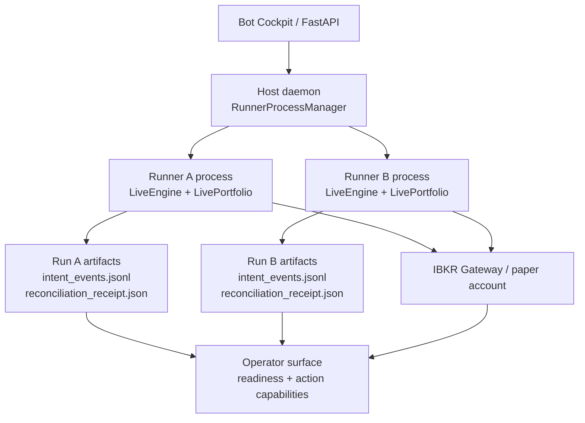

# Bot Lifecycle and Account Ownership — Authority

> **Canonical reference** for what the live-paper bot lifecycle and broker-account ownership model ships today.
> This is an implementation snapshot, not a future-design document. When this page disagrees with code, code wins and this page must be updated in the same PR.
>
> **Current status:** R2 multi-runner runtime with AccountOwner submit-lane foundation. The long-lived AccountOwner R3 daemon process and IPC intake are designed in `docs/architecture/bot-lifecycle-account-owner-prd.md` but are not implemented yet.
>
> **Owner:** the engineer editing `PythonDataService/app/engine/live/*`, `PythonDataService/app/broker/ibkr/*`, `PythonDataService/app/routers/live_instances.py`, or `PythonDataService/app/services/operator_*.py`.
>
> **Last reviewed:** 2026-06-28 (GateResult contract, account freeze artifact, write-ahead account instance registry, account-scoped classifier V1, AccountOwner submit/generation/reconnect lane, recovery/override evidence, and restart-intensity freeze shipped).

---

## 1. Scope and Authority

This document answers: **what actually owns bot lifecycle, broker order submission, reconciliation, and operator gates today?**

It does not answer:

- The final AccountOwner implementation details. Those live in the PRD until shipped.
- Alpha strategy behavior.
- Live-money enablement. The lifecycle described here is paper trading only.
- UI polish for the gate board. This document covers backend authority and artifacts.

Authority order:

1. Code.
2. This authority document.
3. PRDs and ADRs.
4. Model memory.

Same-PR rule: any PR that changes lifecycle gates, broker submit ownership, watchdog shutdown, reconciliation classification, or AccountOwner artifacts must update this document.

## 2. Current Architecture

Today the host daemon spawns one OS process per `strategy_instance_id`. Each runner process may construct its own `IbkrClient`, run cold-start reconciliation, process bars, and submit broker orders through `LivePortfolio` and `place_paper_order`.

This is **not** R3. The current process-local `_submit_lock` in `LiveEngine` serializes work inside one runner only. It does not prevent a sibling runner or stale runner process from calling IBKR.

## 3. Current Lifecycle

| Phase | Current authority | Code |
|---|---|---|
| Deploy | Data-plane deploy endpoint derives broker account from the connected session, then forwards to host daemon. Host daemon writes run ledger. | `routers/live_instances.py`, `engine/live/host_daemon.py`, `engine/live/deploy.py` |
| Start recheck | Data plane blocks stale starts for poisoned runs, durable STOPPED, offline daemon, running/stopping daemon state. | `routers/live_instances.py::_assert_start_allowed` |
| Host spawn | Host daemon starts `python -m app.engine.live.run start` as a subprocess keyed by `strategy_instance_id`. | `RunnerProcessManager.start` |
| Run pre-flight | Runner validates run state, sizing, dirty tree policy, halt flags, unexpected positions, coexistence, and prior artifacts. | `engine/live/pre_flight.py`, `engine/live/run.py` |
| Cold-start reconcile | Runner writes `reconciliation_receipt.json` as `in_progress`, probes broker, classifies broker state, then writes pass/fail. | `reconciliation_orchestrator.py`, `reconciliation_classifier.py` |
| Activate | Live engine constructs portfolio/context, starts broker event stream, publishes runtime/readiness blocks, and enters bar loop. | `live_engine.py`, `readiness.py` |
| Submit | Strategy queues orders; `LivePortfolio.submit_pending_orders` writes intent WAL events and calls broker adapter. | `live_portfolio.py`, `intent_wal.py`, `submit_state_machine.py` |
| Low-level broker write | Paper safety checks run, `order_ref` is required, contract is qualified, then `client.ib.placeOrder(...)` is called. | `broker/ibkr/orders.py::place_paper_order` |
| Operator actions | Resume/Pause/Stop/Flatten-and-pause/Mark-poisoned use shared capability evaluator. Start has separate recheck. | `services/operator_capability.py`, `routers/live_instances.py` |
| Watchdog lease loss | Child watchdog detects daemon lease loss and delegates typed halt sequence. | `child_watchdog.py`, `watchdog_controller.py` |

## 4. Current Artifacts

| Artifact | Scope today | Authority |
|---|---|---|
| `run_ledger.json` | run | Deploy identity, account id, strategy/spec provenance, live config. |
| `desired_state.json` | instance | Durable operator intent: `RUNNING`, `PAUSED`, `STOPPED`. |
| `intent_events.jsonl` | run | Append-only submit WAL. Source of truth for intent lifecycle events. |
| `live_state.json` | instance | Stable projection used by reconciliation/readiness. |
| `reconciliation_receipt.json` | run | Cold-start/runtime reconcile outcome. |
| `poisoned.flag` | run | Run-level permanent unsafe state. |
| `control_plane_lease_lost.json` / incidents | run | Watchdog lease-loss evidence. |
| `broker_callbacks.jsonl` | run | Raw broker callback evidence when attached. |
| `fleet_baselines/<account_id>.json` | account-adjacent partial | Existing fleet-reset baseline used to ignore completed unknown historical executions under strict conditions. |
| `accounts/<account_id>/instance_registry.jsonl` | account | Append-only write-ahead registry of allowed strategy instance id, run id, bot order namespace, lifecycle binding state, source, and `int64 ms UTC` timestamp. |
| `accounts/<account_id>/unresolved_exposure.flag` | account | Durable account-level freeze evidence. Blocks deploy, start, resume, and broker submit while active. |
| `accounts/<account_id>/owner_generation.json` | account | Current AccountOwner fencing generation and phase (`accepting`, `reconnecting`, `draining`, `frozen`). |
| `accounts/<account_id>/account_events.jsonl` | account | Append-only audit events for account freeze recorded/cleared transitions, recovery proofs, audited overrides, owner generation/reconnect, submit lane evidence, instance registry writes, and restart-intensity breaches. |

## 5. Current Submit Authority

Submit safety currently has three layers:

1. `LivePortfolio.__post_init__` refuses a real broker adapter without `IntentWal` and non-empty `bot_order_namespace`.
2. When AccountOwner mode is enabled, `LivePortfolio.submit_pending_orders` emits `AccountOwnerSubmitIntent` to the configured submitter and does not call its broker adapter directly.
3. `LivePortfolio.submit_pending_orders` refuses active account freezes and non-passing account registry bindings before any broker call or AccountOwner handoff.
4. Legacy direct-submit mode writes `PENDING_INTENT` before `broker.place_order`, then writes `SUBMITTED`, `ACK_FAILED_UNCERTAIN`, `SUBMITTED_RECOVERED`, `INTENT_NOT_ACCEPTED`, or `SUBMIT_UNCERTAIN_HALTED`.
5. `place_paper_order` requires `spec.order_ref` and enforces paper safety before `IB.placeOrder`.

Current limitation: this is still enforced inside each runner process, not by a single-writer AccountOwner. Multiple runner processes cannot pass submit with an unregistered/stale account binding, but a sibling process still owns its own broker connection until AccountOwner ships.

## 5.1 AccountOwner Submit Lane V1

`engine/live/account_owner.py` ships the first async AccountOwner submit lane. It is not yet a daemon child process, but the lane itself is single-writer per `AccountOwner` instance via `asyncio.Lock`.

Runner-side owner mode is available through:

- `LivePortfolio(account_owner_submitter=..., account_id=..., strategy_instance_id=..., run_id=..., bot_order_namespace=..., owner_generation_provider=..., trace_id_provider=...)`;
- `LiveEngine(..., account_owner_submitter=..., owner_generation_provider=..., trace_id_provider=...)`, which passes those values to `LivePortfolio`.

`AccountOwnerSubmitIntent` carries trace id, account id, strategy instance id, run id, bot order namespace, intent id, order ref, intent kind, order spec, owner generation, and created-at timestamp as `int64 ms UTC`. Intake validates account id, account freeze, account registry binding, owner generation, and account classifier decision before writing `account_owner_submit_prepared` to account events and calling the broker. Terminal account events are `account_owner_submit_accepted`, `account_owner_submit_rejected`, or `account_owner_submit_uncertain`.

Structured diagnostics include trace id, bot/instance id, account id, run id, intent id, order ref, owner generation, broker client id, order id, perm id, and exec id when available.

`AccountOwner.handle_reconnect(...)` ships the current generation/reconnect drain behavior inside the V1 lane. It persists `owner_generation.json`, moves phases through `reconnecting`, `draining`, `accepting`, or `frozen`, rejects new submit intents while non-accepting, rotates client ids on IBKR client-id-in-use code `326`, drains prepared-without-terminal account events as accepted/rejected/uncertain via the supplied classifier, and resumes only after the supplied account classifier gate passes. `AccountOwner.reconnect_gate_result()` projects the current phase into `gate_id=account_owner.reconnect`.

Current limitation: production still needs a long-lived AccountOwner process with a real broker session and IPC intake. V1 proves the serialized submit lane and runner no-direct-submit mode.

## 6. Current Reconciliation Authority

`reconciliation_classifier.py` is pure and classifies broker artifacts against:

- folded run projection,
- allowed namespaces for the current run,
- prior unresolved tail,
- emergency-flatten audit,
- optional baseline cutoff for completed historical unknown executions.

Outcomes today:

- `Continue`
- `Adopt`
- `Poison`

Current limitation: classification is still centered on one run's `allowed_namespaces`. AccountOwner migration must classify against the account registry and the union of registry-known instance lifecycles.

## 6.1 Account Classifier V1

`engine/live/account_classifier.py` is the shipped pure account-scoped classifier contract. It consumes:

- broker evidence: status plus `BrokerSnapshot` open orders/executions;
- account registry rows from `accounts/<account_id>/instance_registry.jsonl`;
- durable submit intent evidence with account, instance, run, namespace, intent id, order ref, status, and timestamp;
- optional fleet baseline evidence with `baseline_id`, cutoff timestamp, and source;
- optional audited operator override evidence with override id, approved decision, reason, approver, timestamp, expiry, prior evidence, affected identifiers, and next reconciliation step.

It returns `AccountClassifierDecision` with `outcome`, `reason`, `account_id`, optional affected instance/run/namespace identifiers, affected order refs, optional `baseline_id`, optional `override_id`, and `decided_at_ms` as `int64 ms UTC`. Every decision projects to `GateResult` through `to_gate_result()`.

| Decision | Gate status | Rule |
|---|---|---|
| `continue` | `pass` | Broker evidence matches active registry namespace and durable intent evidence, or there is no broker exposure to classify. |
| `adopt` | `block` | Broker has an order/execution in an active registry namespace but no durable intent row for that exact order ref. |
| `ignore_baseline` | `pass` | Unknown historical execution is completed and covered by the fleet baseline cutoff. |
| `retry` | `unknown` | Broker snapshot is retryably unavailable; optional operator override id is carried separately from baseline id. |
| `freeze` | `freeze` | Broker evidence is unprovable or registry namespace ownership is internally inconsistent. |
| `poison_run` | `poison` | Broker exposure has no order ref, an unparseable ref, or an unknown namespace not covered by baseline. |
| `unknown` | `freeze` | Broker state is unknown; this never silently continues. |

Fresh audited overrides may carry a `continue` decision for unprovable/unknown broker evidence. Stale overrides, account-mismatched overrides, and overrides contradicted by later broker evidence produce `freeze` decisions (`OPERATOR_OVERRIDE_STALE`, `OPERATOR_OVERRIDE_ACCOUNT_MISMATCH`, or `OPERATOR_OVERRIDE_CONTRADICTED`) rather than continuing.

## 6.2 Account Recovery And Audited Override

`engine/live/account_artifacts.py` is the shipped authority for clearing `accounts/<account_id>/unresolved_exposure.flag`. `clear_account_freeze(...)` accepts exactly one of:

- `AccountRecoveryProof`: broker-backed recovery evidence with requested action, requester, broker evidence, reconciliation result, final `GateResult`, and `recorded_at_ms`.
- `AccountAuditedOverride`: explicit operator override with approved decision, reason, approver, approval/expiry timestamps, prior evidence, affected account/run/instance identifiers, and next reconciliation step.

Recovery proof clears only when `reconciliation_result=clean` and the final gate status is `pass`. Audited overrides clear only while fresh and cannot clear with an approved `freeze` decision. Every successful clear keeps the freeze file as cleared evidence, appends either `account_recovery_proof_recorded` or `account_audited_override_recorded`, then appends `account_freeze_cleared`.

## 7. Current Watchdog Authority

`ChildWatchdog` reads the daemon lease and detects:

- stale/missing lease,
- daemon boot id mismatch.

Production delegates to `WatchdogHaltExecutor`, which currently:

1. persists an initial incident,
2. blocks submissions,
3. persists `PAUSED`,
4. attempts flatten with timeout,
5. persists terminal flatten proof or unresolved exposure evidence before broker disconnect,
6. disconnects broker,
7. requests engine exit,
8. leaves critical incidents unresolved.

Critical watchdog outcomes now include a canonical `GateResult` with
`gate_id=watchdog.lease_loss` and `status=freeze`; safe outcomes emit
`status=pass`. The watchdog evidence remains run-scoped incident evidence.
Account freeze evidence is represented separately by
`accounts/<account_id>/unresolved_exposure.flag`.

Current limitation: watchdog failure-to-flatten evidence does not yet
automatically write the account-scoped freeze artifact. The artifact exists and
is enforced once written.

## 8. Current Operator Gates

The current backend emits a canonical `GateResult` on these shipped gate
surfaces:

- raw `ReadinessGate` rows from `build_live_readiness` and `build_start_readiness`;
- `OperatorGate` rows on `operator_surface.readiness_gates`;
- `host_process.start_capability.gate_results`;
- each `operator_surface.actions.<action>.gate_results` capability row.

The shipped `GateResult.status` vocabulary is `pass`, `block`, `poison`,
`freeze`, `unknown`, and `not_applicable`. Existing readiness rows still expose
their legacy `status` values (`pass`, `fail`, `unknown`) for compatibility;
`fail` normalizes to `block` in the canonical gate result.

| Gate group | Current implementation | Drift risk |
|---|---|---|
| Start process | `_assert_start_allowed` plus daemon start checks; the operator surface exposes Start `GateResult` rows and blocks active account freeze artifacts. | Router recheck is still separate from `operator_capability.py`; account freeze is explicitly wired today. |
| Resume/Pause/Stop/Flatten/Poison | `evaluate_action` used by status projection and mutation endpoints; the operator surface exposes per-action `GateResult` rows. Active account freeze artifacts block Resume. | Strong pattern to reuse for gate board. |
| Readiness | `build_live_readiness` and `build_start_readiness` emit raw readiness gates with canonical `GateResult`; operator surface projects those into `OperatorGate`. | Live readiness is engine-authored; backend-derived start readiness is separate and labelled. |
| Resume guards | `resume_guard_state.py` folds broker safety, submission capability, reconciliation, and uncertain intent. | Instance/run scoped; does not know account freeze yet. |
| Account instance registry | Host daemon deploy writes `DEPLOYED`; host daemon start and direct `run.py start` write `ACTIVE` for ledgers with a persisted `strategy_instance_id`; `LiveEngine` injects the registry gate into submit and readiness for those modern ledger identities. | Append-only registry is shipped, but it is not yet owned by AccountOwner. Legacy fallback identities are not entered into the account registry. |
| Broker submit safety | `orders.py::_enforce_paper_safety`, reconnect recovery halt, required `order_ref`, `LivePortfolio.account_freeze_provider`, and `LivePortfolio.account_registry_gate_provider`. | Still process-local because there is no AccountOwner. |

### Restart Intensity Gate

`evaluate_restart_intensity(...)` in `engine/live/account_artifacts.py` folds durable `account_instance_binding_recorded` events with `lifecycle_state=ACTIVE`. The default `RestartIntensityPolicy` is account-scoped with `threshold=3` and `window_ms=300000` (5 minutes). A breach occurs when observed starts are at or above the threshold inside the active window.

The active window starts at `max(now_ms - window_ms, latest_restart_intensity_freeze_clear_ms)`, so a clean recovery proof starts a new window without deleting prior durable evidence. On breach the evaluator emits `gate_id=account.restart_intensity`, `status=freeze`, and an operator reason containing observed count, threshold, window, and window start/end. It also appends `account_restart_intensity_breached` with affected instance ids and writes the account freeze artifact. Host-daemon starts and direct `run.py start` evaluate this gate immediately after writing the ACTIVE account registry binding; the resulting account freeze blocks that start path and all later deploy/start/resume/submit paths that already consume `unresolved_exposure.flag`.

## 9. AccountOwner Migration Targets

When a slice ships, update this section from "target" to "shipped" with exact modules.

| Target | Current status |
|---|---|
| Account artifact root under `artifacts/accounts/<account_id>/` | Shipped in `engine/live/account_artifacts.py`. |
| Append-only `instance_registry.jsonl` written before first submit intent | Shipped in `engine/live/account_artifacts.py`, `engine/live/host_daemon.py`, `engine/live/run.py`, `engine/live/live_engine.py`, `engine/live/live_portfolio.py`, and `engine/live/readiness.py` for ledgers with persisted `strategy_instance_id`. |
| `unresolved_exposure.flag` blocking deploy/start/resume/submit | Shipped in `engine/live/account_artifacts.py`, `routers/live_instances.py`, `services/operator_surface.py`, `engine/live/live_engine.py`, and `engine/live/live_portfolio.py`. |
| Account-scoped classifier over registry-known owners | Shipped in `engine/live/account_classifier.py` as pure V1 classifier with GateResult projection. |
| AccountOwner daemon child process | Not shipped. V1 submit lane exists in `engine/live/account_owner.py`, but no long-lived child process/IPC intake owns it yet. |
| Runner no-broker-write mode | Shipped when `LivePortfolio.account_owner_submitter` / `LiveEngine.account_owner_submitter` is configured. |
| AccountOwner generation/fencing token | Shipped in `engine/live/account_artifacts.py` and `engine/live/account_owner.py`. |
| Existing readiness, Start, and action capability rows generated from enforcement `GateResult` values | Shipped in `schemas/live_runs.py`, `engine/live/readiness.py`, and `services/operator_surface.py`. Account-level gate board rows are not shipped. |
| Restart intensity fold over account events | Shipped in `engine/live/account_artifacts.py`, `engine/live/host_daemon.py`, and `engine/live/run.py`. |
| Audited operator override for unreachable broker proof | Shipped in `engine/live/account_artifacts.py` and `engine/live/account_classifier.py`. |

## 10. Code Cross-Reference

| Concern | Current files |
|---|---|
| Host runner process lifecycle | `PythonDataService/app/engine/live/host_daemon.py` |
| Runner CLI and start orchestration | `PythonDataService/app/engine/live/run.py` |
| Live bar loop and process-local submit lock | `PythonDataService/app/engine/live/live_engine.py` |
| Portfolio submit WAL and order intent handling | `PythonDataService/app/engine/live/live_portfolio.py` |
| Intent event schema and WAL | `PythonDataService/app/engine/live/intent_events.py`, `intent_wal.py`, `intent_ledger.py` |
| Submit state machine | `PythonDataService/app/engine/live/submit_state_machine.py` |
| IBKR connection | `PythonDataService/app/broker/ibkr/client.py` |
| IBKR order placement | `PythonDataService/app/broker/ibkr/orders.py` |
| Reconciliation | `PythonDataService/app/engine/live/reconciliation_orchestrator.py`, `reconciliation_classifier.py` |
| Desired state | `PythonDataService/app/engine/live/desired_state.py` |
| Operator action gates | `PythonDataService/app/services/operator_capability.py`, `resume_guard_state.py`, `operator_surface.py` |
| Start/deploy/instance API | `PythonDataService/app/routers/live_instances.py` |
| Watchdog lease loss | `PythonDataService/app/engine/live/child_watchdog.py`, `watchdog_controller.py` |
| Account artifacts, recovery, override, and restart intensity | `PythonDataService/app/engine/live/account_artifacts.py` |
| Account classifier | `PythonDataService/app/engine/live/account_classifier.py` |
| AccountOwner submit/reconnect lane | `PythonDataService/app/engine/live/account_owner.py` |
