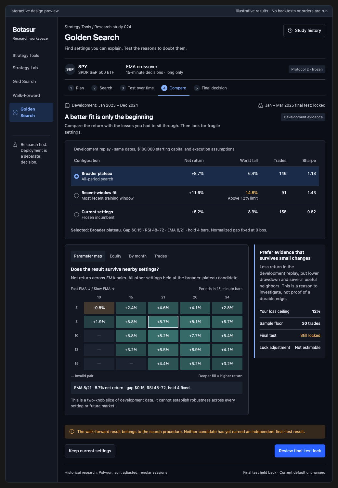
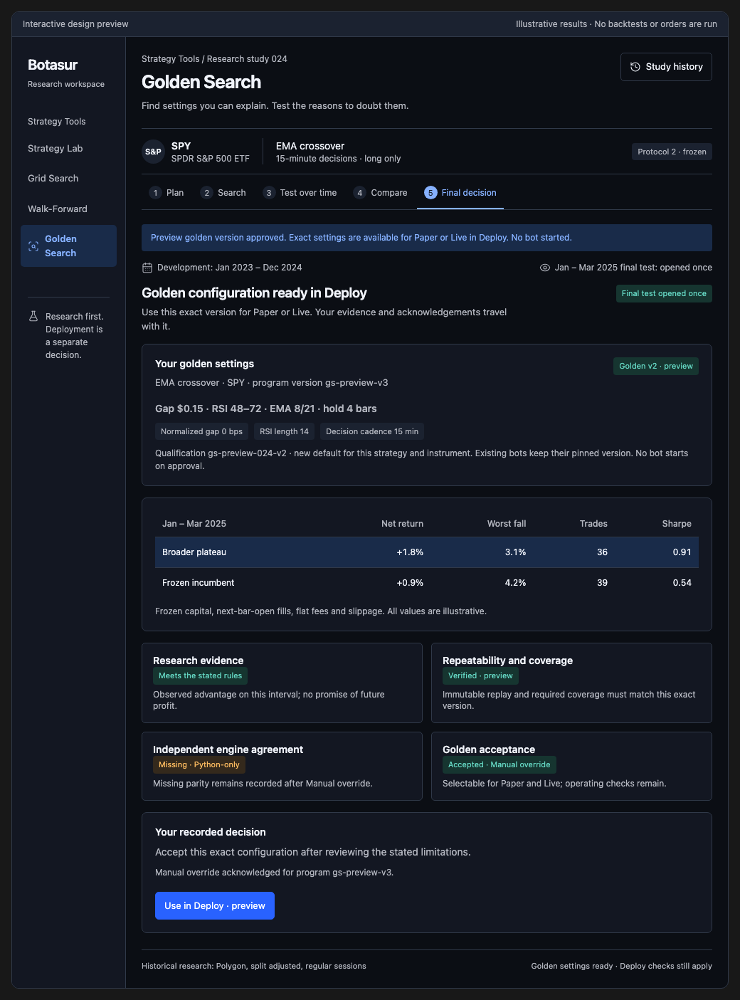

# Golden Search prototype and implementation handoff

This is the design and interactive prototype slice of [Golden Search #2696](https://github.com/tim1016/learn-ai/issues/2696). It establishes the feature's intended behavior and build order. It does not implement an Angular route, search engine, study database, proof system, or deployment permission.

## What this change delivers

- [Corrected PRD and build plan](../../prds/golden-search-2696.md): original requirements beside their corrections, source inventory, architecture, lifecycle, delivery slices and acceptance tests.
- [Preserved original proposal](../../prds/golden-search-2696-original.md): the complete issue body before the adversarial revision, explicitly superseded.
- [Methodology evidence](../../research/golden-search-methodology-evidence-2026-09-30.md): source-backed findings and concrete rank-reversal, interacting-knob and numerical-precision counterexamples.
- [Standalone interactive preview](index.html) and its [editable fragment](mockup.html): Plan, Search, Test over time, Compare and Final decision, in the existing Botasur visual language.
- [Desktop screenshot](desktop.png), [mobile screenshot](mobile.png), [approved golden configuration](approval.png) and [verification receipt](verification.json).

The draft feature PR is the implementation's review entry point. The research question stays open until the production work is delivered; this prototype does not close #2696.

## Preview

Open `docs/design/golden-search/index.html` in a modern browser after checking out the branch. GitHub displays HTML source rather than running it. No application backend, credentials, database or trading connection is required. The export may request its pinned presentation libraries from `unpkg.com`; research controls and sample results are local.

Start at Compare, choose different candidates and inspect a parameter cell. Visit Plan to switch Grid/Zoom and edit ranges; edits invalidate the estimate and remain a draft while the saved evidence keeps its frozen protocol. Opening the final test requires acknowledgement and locks the candidate. Enter a decision reason and acknowledge missing independent engine agreement, then choose **Approve golden configuration**. The success view shows the exact version and **Use in Deploy**, where both Paper and Live are selectable. Keep current settings is also a complete outcome.

Optional Codex design controls expose adequate-sample, sparse-sample, previously-used-test and proof-failure scenarios. Failed or weak research needs a separate acknowledgement and retains its warning after approval; a technical proof failure cannot publish a configuration. The standalone preview works without those host controls. Its note and approval are held only in browser memory; reloading starts a new demonstration.

The owner interview on 2026-09-30 resolved the central finish line: **golden settings available for Paper or Live in Deploy**. Evidence-only review and Paper nomination are insufficient. The production feature is incomplete until approval creates the qualified version, proof, exact Golden review and active default, with a handoff to the existing Deploy gates. There is no additional Golden Search Live-release sign-off.

Every return, trade, curve, estimate, status and parameter result shown is illustrative. No backtest runs and no broker setting, qualification or order changes. The trade view deliberately shows a sample decision ledger; a real price/indicator chart remains part of the production integration.

The prototype retains next-bar-open fills and a $1/order example fee so its frozen examples remain internally labeled. PR #2697 subsequently introduced decision-minute-open support and a zero new-request commission default. Implementers must read the current contracts rather than copy prototype assumptions.

## Verification performed

Browser interaction checks verified candidate-dependent guidance, Grid workload warnings, estimate invalidation after knob edits, draft preservation across navigation, parameter-cell inspection, evidence tabs, explicit final-test acknowledgement, candidate locking after reveal, and keep-current outcomes. Approval requires a note and parity acknowledgement; sparse, reused and failed research additionally requires a distinct research acknowledgement. The warning survives approval and Live selection. Proof mismatch prevents publishing and the Deploy handoff. Successful approval carries the exact version into both Paper and Live selections.

Automated axe checks used the WCAG 2 A/AA and 2.1 AA tags on all five screens, approval review, approved settings, and both Deploy modes at 360px and 1040px in light and dark appearances. Additional checks cover weak evidence and proof failure. The checked views had no violations. Comparison layout checks also covered 320px and 768px; the mobile tables reflow into labeled rows. The 50 recorded checks reported no JavaScript errors or horizontal overflow. These checks concern the prototype, not production trading correctness or a complete accessibility certification. The detailed receipt pins source and export hashes.

The initial tests found one low-contrast heatmap cell and a keyboard-inaccessible narrow scrolling table after candidate locking. Both were corrected and the affected checks rerun. The committed screenshots show the corrected layout.

To repeat manually, open the preview, exercise the sequence above, inspect the screens at the listed widths in both appearances, and test tab/keyboard access. With the existing Frontend development dependencies and Playwright Chromium installed, run `node docs/design/golden-search/verify.mjs` from the repository root. A separate checkout can set `GOLDEN_PREVIEW_FRONTEND_ROOT` to an existing Frontend dependency directory. The script targets the export's iframe, scopes axe to `#golden-research`, and refreshes screenshots and the receipt. No new runtime dependency was introduced.

`mockup.html` is the editable source. `index.html` is its exported standalone wrapper, generated with the Codex Visualize skill's `scripts/render.py`; regenerate that export and screenshots after changing the fragment. The export is a review artifact and must not be pasted into the Angular application as its production implementation.

## Production work remaining

- [ ] Capability declarations, immutable protocol and exposure contracts, and explicit ADR proposals.
- [ ] Research workbench wired to existing Grid and persisted candidate records.
- [ ] EMA knob exposure and deterministic Zoom with unchanged default parity.
- [ ] Study-owned evaluator, full-context cache, budget and resumable job lifecycle.
- [ ] Chronological procedure validation, interaction audits and server-authored diagnostics.
- [ ] Transactional one-shot final exam and durable decision/exposure history.
- [ ] Versioned qualification, durable proof, seal migration, Golden review and active default.
- [ ] Exact approved tuple selectable for Paper or Live through the existing Deploy gates; this completes the minimum user-facing feature.
- [ ] Optional independently validated statistical extensions.

The PRD owns detailed acceptance criteria. Python remains the numerical authority; Angular renders evidence and .NET transports it. Live market data stays with read-only IBKR; Alpaca owns accounts, orders and execution reports.

