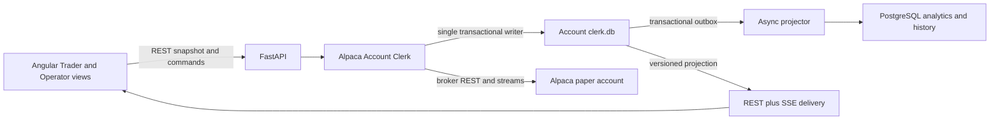
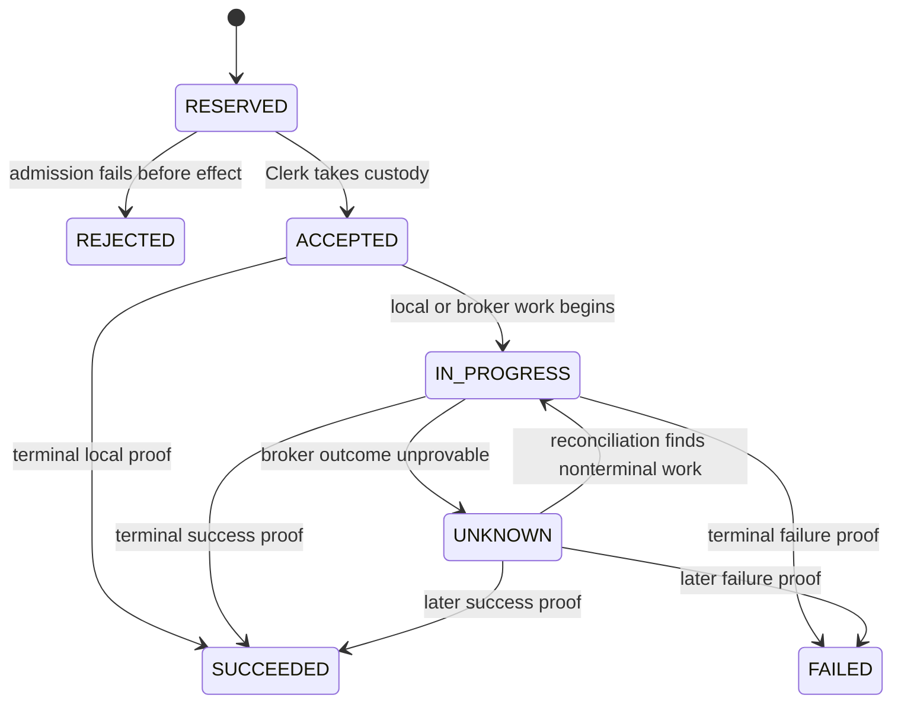

# PRD — Alpaca Account Clerk SQLite Control Plane and Custody Timeline

- **Date:** 2026-08-04
- **Status:** Proposed for implementation planning
- **Product surfaces:** Alpaca Account Clerk, Alpaca Bots roster, Trader bot panel,
  Operator bot panel, lifecycle and recovery actions
- **Deployment boundary:** trusted-local, single operator, exactly one FastAPI
  worker, Alpaca paper trading only
- **Builds on:** the Account Clerk authority, Clerk-governed bot-control PRD,
  safety/remediation PRD, broker-v2 panel, and existing versioned SSE utilities
- **Decision boundary:** this PRD proposes a future SQLite authority. It does not
  supersede accepted ADRs 0001, 0030, or 0033 until a follow-up ADR is accepted
  and the implementation cutover passes this PRD's qualification gates.

---

## 1. Executive summary

The Alpaca Account Clerk needs one local, transactional authority for commands,
effect operations, broker orders, fills, reconciliation, run fencing, terminal
receipts, and the operator-facing custody timeline.

The current control plane relies on append-only JSONL journals plus in-memory
folds and downstream PostgreSQL projections. Those journals already provide
important fail-closed behavior, including durable capture before broker contact.
However, continuing to add command reservation, guarded state transitions,
current-state queries, causal evidence, and responsive UI reads around multiple
files creates custom concurrency and recovery work that SQLite already solves
locally.

This PRD selects one SQLite database per Alpaca account:

```text
accounts/alpaca/<account_id>/clerk.db
```

SQLite becomes the sole local canonical control-plane store after cutover.
PostgreSQL remains an asynchronous, rebuildable analytical projection and is
never required for admission, broker submission, cancellation, reconciliation,
or recovery.

The database uses normal mutable tables for fast current-state reads and one
narrow, immutable `custody_transitions` table for the operation-first history
that users need. This is not a generic event-sourcing platform. The UI receives
authoritative snapshots over REST and versioned SSE; SSE transports state but
does not store or author it.

The product outcome is a fast and truthful control room in which users can
answer:

1. What is this bot or Account Clerk allowed to do now?
2. Who owns responsibility for resolving this operation?
3. Which broker orders belong to the operation?
4. What happened, at what time, and what proof changed the outcome?
5. If the outcome is unknown, what is blocked and what safe recovery continues?

## 2. Decisions already approved

This PRD treats the following as resolved product decisions.

1. The next milestone supports a trusted-local, single-operator topology with
   exactly one FastAPI worker and Alpaca paper trading only.
2. SQLite replaces JSONL as the canonical Account Clerk control-plane store.
3. The database is account-scoped and rooted beneath the corresponding Alpaca
   account artifact directory.
4. Existing paper-control data does not require migration. Cutover starts a new
   Clerk authority generation after explicit broker-account qualification.
5. PostgreSQL is a downstream projection and never enters the broker-write path.
6. Current state uses mutable normalized tables; a narrow append-only custody
   timeline preserves meaningful responsibility and broker-proof transitions.
7. The custody timeline is operation-first. Broker orders are nested child
   records beneath the Clerk effect operation that owns their resolution.
8. `UNKNOWN` is nonterminal in durable state. The Clerk retains custody and
   reconciles automatically.
9. Uncertainty has two safety scopes: `BOT` and `ACCOUNT_CLERK`. The latter means
   one Alpaca Account Clerk authority for one specific Alpaca account.
10. New or unclassified uncertainty defaults to `ACCOUNT_CLERK` scope and fails
    closed for new exposure.
11. Trader and Operator views render different levels of detail from the same
    backend-authored truth.
12. Recovery controls are backend-authorized. The UI never offers a generic
    warning-clear, blind order retry, or unproven opposite-side flatten.
13. Broker event time, Clerk observation time, and durable record time remain
    distinct `int64` Unix-millisecond UTC facts.
14. Missing or corrupt SQLite authority fails closed. A new authority generation
    requires an explicit recovery/reset flow and fresh broker proof.

## 3. Problem

### 3.1 File durability is proven, but cross-record transitions remain custom

The existing journals deliberately fsync intent evidence before broker contact.
That invariant must survive. The difficulty is that a modern command can also
need to reserve an idempotency identity, bind a payload hash, create an effect,
record a broker outbox item, advance a projection revision, and expose a
recoverable receipt. Coordinating those facts across files requires application
locking and crash-cut recovery for every new workflow.

SQLite can commit all related local facts as one transaction. A crash yields the
old committed state or the new committed state, not a partially published set of
control records.

### 3.2 Current-state reads should not replay custody history

The Clerk and panel contain many operations that read journal history and fold it
to answer current questions. A live UI needs indexed answers for current commands,
working orders, holds, exposure, recent receipts, and selected history without
validating every earlier JSON record.

### 3.3 A command needs one restart-safe lifecycle

A dropped HTTP response or page refresh must not create a second Stop, EXIT,
flatten, cancellation, or broker order. The backend must reserve command identity
before effects, reject payload conflicts, return current state for duplicates, and
continue reconciling uncertain broker outcomes after restart.

### 3.4 Current state alone does not explain custody

Operators need more than `order.status = filled`. They need to see that the Clerk
accepted EXIT, cancelled a working entry, observed a partial fill, recomputed the
remaining attributed quantity, submitted the reduction, observed the close, and
verified flatness. That history must be durable, causal, timestamped, and organized
around the complete operation rather than fragmented across individual orders.

### 3.5 Technical errors do not explain product impact

`UNKNOWN`, a raw reason code, or a generic HTTP error does not tell the user
whether one bot or the full Account Clerk is blocked, whether the Clerk still owns
resolution, which actions remain safe, or when evidence was last checked.

### 3.6 Database loss cannot be mistaken for a flat account

If the local authority disappears or becomes corrupt, the system loses attribution
and command identity even if Alpaca remains reachable. It must not create an empty
database and infer a clean account. Recovery requires explicit qualification and a
new Clerk authority generation.

## 4. Goals

1. Replace canonical JSONL control storage with one account-scoped SQLite authority.
2. Preserve capture-before-contact: no broker write without a committed local intent.
3. Make command reservation, effect creation, custody transition, current-state
   update, revision advancement, and projection outbox insertion atomic where they
   represent one local decision.
4. Make retries safe across transport loss, browser reload, and service restart.
5. Provide indexed, bounded current-state and history reads for the UI.
6. Provide an operation-first, immutable custody timeline with nested broker orders.
7. Keep `UNKNOWN` nonterminal and automatically reconciled by the Clerk.
8. Scope uncertainty truthfully to `BOT` or `ACCOUNT_CLERK`.
9. Provide clear, backend-authored Trader and Operator explanations.
10. Preserve distinct broker-event, Clerk-observation, and durable-record clocks.
11. Keep PostgreSQL and UI transport outside execution authority.
12. Fail closed on database identity, integrity, or topology violations.
13. Produce an implementation and documentation package that makes every safety
    claim traceable to schema, transaction, test, and operator behavior.

## 5. Non-goals

- Live-money trading enablement.
- Multiple FastAPI workers, multiple Clerk writers, or distributed SQLite access.
- A shared network filesystem for `clerk.db`.
- Multi-user authentication or remote operator authorization.
- A generic rules engine for custody or admission.
- A generic event-sourcing framework, Kafka, Redis Streams, or external event broker.
- WebSockets as a new control-plane dependency.
- Migrating or preserving current paper JSONL history.
- Using PostgreSQL as an admission, execution, or recovery dependency.
- Moving strategy math, P&L, sizing, or signal computation outside Python.
- Letting Angular derive safety scope, terminal state, freshness, or recovery actions.
- Treating a broker HTTP success response as terminal execution proof.
- Treating SSE delivery as evidence that broker or Clerk state is healthy.

## 6. Users and primary jobs

### 6.1 Trader

The trader needs concise answers:

- Is this bot allowed to create exposure?
- What operation is active?
- Does the Account Clerk still own resolution?
- What broker outcome is proven?
- What is blocked and what remains available?
- When was the latest broker evidence observed?
- Does the user need to act?

### 6.2 Operator

The operator additionally needs:

- Which Clerk authority generation owns this account?
- Which command, effect, and child orders form the operation?
- Which exact custody transition changed the displayed state?
- What were the broker/source, Clerk-observation, and durable-record times?
- Is uncertainty bot-scoped or Account-Clerk-scoped?
- Which reconciliation attempts ran and what evidence did they find?
- Which recovery actions are currently admitted, and why?
- Has PostgreSQL projection lag affected only history, or has local authority failed?

## 7. Canonical product language

### Account Clerk

The single account-rooted authority that admits broker effects, commits intent
before contact, owns resolution, reconciles broker evidence, attributes exposure,
and authors terminal receipts.

### Clerk authority generation

The durable identity of one initialized Account Clerk authority. A destructive
reset creates a new generation; evidence from a previous generation cannot
authorize current work.

### Command

One operator or strategy request with a stable `command_id` and immutable canonical
payload hash. Transport retries reuse the same command identity.

### Effect operation

The Clerk-owned unit of work such as ENTER, EXIT, targeted cancel, reconcile, Stop,
or Stop-and-Flatten. One operation may own zero, one, or several broker orders.

### Custody

The Clerk's durable responsibility to resolve an accepted effect honestly. Custody
does not mean the Clerk controls venue execution. Alpaca controls the broker/venue
outcome; the Clerk remains responsible for tracking, reconciling, and reporting it.

### Custody transition

An immutable, timestamped change in responsibility, broker evidence, or resolution
state for an effect operation or one of its child orders.

### Receipt

Durable proof of a terminal local or broker-backed outcome. A pending HTTP response
is not a terminal receipt.

### Unknown

A nonterminal state in which the Clerk cannot yet prove the broker outcome. The
Clerk retains custody and reconciliation responsibility.

### BOT uncertainty

An attributable failure isolated to one strategy instance/run or its allowed
intent, without loss of Account Clerk truth.

### ACCOUNT_CLERK uncertainty

An uncertainty affecting one Alpaca account's Clerk authority, such as unprovable
reconciliation, unexplained orders, unavailable account state, or corrupt local
authority. It does not automatically apply to other Alpaca accounts.

## 8. Authority and topology



Authority rules:

1. Python Account Clerk logic owns command, custody, reconciliation, exposure,
   uncertainty, receipt, and recovery meaning.
2. SQLite is the local canonical record after the accepted ADR and cutover.
3. Alpaca is authoritative for its broker/account observations, but raw broker
   facts become application authority only after the Clerk validates and commits
   them with provenance.
4. PostgreSQL is rebuildable from acknowledged outbox work while the SQLite
   authority exists. PostgreSQL cannot authorize a broker effect or repair lost
   local custody identity.
5. Angular renders backend contracts and may format time. It cannot infer safety.
6. SSE publishes revisions or snapshots. It is transport, not truth.

## 9. SQLite storage contract

### 9.1 Database identity and location

Each Alpaca account has exactly one database:

```text
<artifacts_root>/accounts/alpaca/<safe_account_id>/clerk.db
```

The database must carry:

- schema version;
- broker and exact account identity;
- Clerk authority generation;
- creation and last-open times in `int64 ms UTC`;
- control-plane revision;
- reset/recovery provenance;
- a database identity token that prevents accidental file substitution.

A database whose embedded account identity does not match the requested account
fails closed.

### 9.2 Runtime configuration

The implementation must enable and verify:

- WAL journal mode;
- foreign-key enforcement;
- a durability setting appropriate to capture-before-contact;
- a bounded busy timeout;
- one application-owned write coordinator;
- explicit transactions for all mutations;
- startup integrity and identity checks.

The implementation should prefer Python's standard `sqlite3` library unless a
new dependency demonstrates a material correctness or maintainability advantage.
SQL must remain behind one repository boundary and never spread through routers,
strategy code, or presentation services.

### 9.3 Minimum logical schema

| Table | Purpose | Mutation model |
| --- | --- | --- |
| `control_meta` | Schema, account, authority generation, revision | Guarded singleton |
| `strategy_instances` | Immutable configured bot identity | Insert once; retire only |
| `runs` | Per-instance run records and active-run fence | Insert plus guarded state |
| `commands` | Idempotent request identity, hash, state, receipt link | Guarded state machine |
| `effect_operations` | Clerk-owned ENTER/EXIT/cancel/recovery work | Guarded state machine |
| `orders` | One row per broker/client order identity | Guarded broker-state fold |
| `fills` | Permanent executions and corrections | Append/idempotent insert |
| `positions` | Current Clerk-attributed exposure | Transactional current state |
| `holds` | Active and resolved bot/Account-Clerk holds | Guarded current state |
| `uncertainties` | Active nonterminal unknowns and extensible facts | Guarded current state |
| `reconciliations` | Reconciliation attempts and terminal receipts | Insert plus terminal update |
| `receipts` | Permanent terminal command/effect proof | Insert once |
| `custody_transitions` | Immutable operation-first custody history | Append only |
| `projection_outbox` | Idempotent PostgreSQL projection work | Insert, acknowledge, prune |

Physical normalization may change during implementation, but no design may remove
the identities, uniqueness, causal links, or transaction guarantees named here.

### 9.4 Required uniqueness and immutability

At minimum, the database must enforce:

- unique `command_id` within the Clerk authority generation;
- immutable request hash for an existing command;
- unique Clerk effect idempotency identity;
- unique broker `client_order_id`/order reference;
- idempotent broker-event and fill identities;
- one active run fence per strategy instance;
- one monotonically increasing account control revision;
- immutable terminal receipt identity;
- immutable custody-transition sequence and payload after commit.

Terminal command/effect outcomes cannot regress to nonterminal states. Corrections
must be represented as new broker evidence and an explicitly allowed derived state,
not by erasing the earlier fact.

## 10. Command and custody state machines

### 10.1 Command lifecycle



`UNKNOWN` is terminal only for the current synchronous HTTP wait. It is nonterminal
for SQLite custody. An HTTP endpoint may return `202 Accepted` with the durable
command resource and recovery URL.

### 10.2 Operation-first custody

An operation owns its child orders and final verification:

```text
EXIT operation
├── accepted by Account Clerk
├── working-entry cancellation
│   └── entry order broker transitions
├── final attributed-quantity calculation
├── reducing order
│   └── close order broker transitions and fills
└── attributed-exposure verification
    └── terminal EXIT receipt
```

The UI may open an individual order, but the primary timeline and terminal outcome
belong to the effect operation.

### 10.3 Custody responsibility

- Strategy or operator authors the request.
- The Account Clerk owns custody after acceptance.
- Alpaca controls broker/venue execution after submission.
- The Account Clerk retains resolution responsibility during broker processing,
  caller cancellation, process exit, and `UNKNOWN`.
- Only a durable terminal receipt closes Clerk custody.

## 11. Custody timeline contract

Each transition must identify:

```text
sequence
authority_generation
strategy_instance_id
run_id, when applicable
command_id
effect_operation_id
order_ref and broker_order_id, when applicable
transition_kind
custody_owner
execution_authority
operation_state
broker_state, when applicable
proof_reference
source_event_at_ms, when supplied by Alpaca
clerk_observed_at_ms
recorded_at_ms
summary_code
facts_schema_version
facts_json
```

Rules:

1. `sequence` is serialization order, not broker time.
2. Missing source time remains null; it is never copied from observation time.
3. A late broker event may carry an earlier source time without rewriting earlier
   observation or record clocks.
4. Transition summary codes are stable; backend-authored prose is produced by a
   closed copy registry or stored receipt text, not inferred by Angular.
5. Opaque IDs, broker references, hashes, and URLs remain exact.
6. Timeline paging uses stable sequence/keyset semantics.
7. Current-state updates and their custody transition commit in one transaction.

## 12. Functional requirements

### R1 — Capture before broker contact

- The command, effect operation, broker intent/order reference, current custody
  state, transition, revision, and outbox work required by acceptance must commit
  before the first broker write.
- A failed commit produces no broker call.
- A crash after commit but before broker contact leaves a recoverable accepted
  operation that reconciliation can classify conservatively.

### R2 — Durable idempotency and conflict detection

- Angular creates a command ID before POST.
- The backend canonically hashes action, target, account, strategy instance, run,
  immutable semantic payload, and any operator-authored reason that changes meaning.
- Same ID and hash returns the existing resource without another effect.
- Same ID and a different hash returns a durable conflict.
- A duplicate while `IN_PROGRESS` or `UNKNOWN` returns current state and never
  starts another broker operation.
- `GET /commands/{command_id}` returns current state, timestamps, scope, receipt,
  operation link, and recovery guidance.

### R3 — Typed operation outcomes

The API and UI use a closed outcome vocabulary:

```text
reserved | rejected | accepted | in_progress | unknown | succeeded | failed
```

Pending or unknown work cannot be wrapped in a generic successful action result.
`STOPPED_AND_ATTRIBUTED_FLAT` or an equivalently precise terminal proof is required
before Stop-and-Flatten renders success.

### R4 — Automatic reconciliation of UNKNOWN

- `UNKNOWN` retains Account Clerk custody.
- Reconciliation continues automatically after the initiating HTTP request ends.
- The Clerk resolves by deterministic client order identity and validated broker
  evidence.
- A first absent lookup after a lost submit cannot be assumed terminal unless the
  broker contract and the defined grace/retry proof make absence conclusive.
- A later outcome appends a custody transition and advances current state atomically.
- Operator `Reconcile now` accelerates the existing operation; it does not create a
  second economic intent.

### R5 — Uncertainty scope and extensibility

Every uncertainty exposes a stable envelope:

```text
uncertainty_id
scope: BOT | ACCOUNT_CLERK
severity
blocks_new_exposure
allows_reduction
custody_owner
reason_code
headline
explanation
operator_impact
next_step
observed_at_ms
evidence_refs
facts_schema_version
facts_json
```

- `BOT` applies only when typed policy proves isolation to one bot.
- `ACCOUNT_CLERK` applies to one specific Alpaca account authority.
- Symbol, order, venue, and other future attributes are extensible facts rather
  than new top-level safety scopes.
- New facts may be stored and displayed immediately but cannot authorize exposure
  until Python policy understands them.
- Unrecognized reasons/facts default to `ACCOUNT_CLERK` and block new exposure.

### R6 — Admission and safe recovery actions

- Backend admission functions author both presented capability and execution.
- `BOT` uncertainty blocks the affected bot's new exposure.
- `ACCOUNT_CLERK` uncertainty blocks new exposure for all bots governed by that
  account authority.
- Proven cancellation, reconciliation, and risk reduction remain available when
  their exact prerequisites are satisfied.
- The UI never exposes generic `Clear`, blind `Retry order`, or unproven immediate
  `Emergency Flatten` actions.
- Candidate recovery actions are `Reconcile now`, `Cancel verified working orders`,
  `Prepare safe flatten`, `Stop bot decisions`, and `Open custody timeline`.
- Every presented recovery action carries backend-authored availability, reason,
  scope, evidence freshness, and next step.

### R7 — Operation-specific order safety

- `client_order_id`/order reference is generated and committed before submission.
- Lost responses reconcile by exact client order identity.
- Replacement remains nonterminal until broker events or REST evidence prove the
  replacement or rejection.
- Replacement admission accounts for Alpaca's larger-of-old-and-new buying-power
  behavior.
- An EXIT cancels relevant working entries, waits for terminal cancellation or fill
  proof, recalculates final attributed quantity, then submits the close.
- The system does not model DNR as reduce-only; those are distinct broker concepts.
- Historical order listing respects the actual Alpaca `after`/`until` timestamp
  contract and does not invent order-ID pagination parameters.

### R8 — Current projections

Indexed current-state queries must answer without custody-history replay:

- current commands by bot/account and state;
- current effect operation and nested orders;
- working and unresolved orders;
- current attributed positions;
- active holds and uncertainties;
- latest reconciliation and evidence ages;
- recent terminal receipts;
- Account Clerk generation and health;
- monotonic control revision.

### R9 — PostgreSQL projection outbox

- Every projection-relevant local transaction inserts idempotent outbox work in
  the same SQLite commit.
- A background worker projects to PostgreSQL after local commit.
- PostgreSQL outage never changes a Clerk command outcome.
- Outbox delivery is retryable and idempotent.
- Projection lag is visible to Operator users but cannot be presented as Clerk
  unhealthiness while SQLite remains healthy.
- Acknowledged outbox rows may be pruned under a documented retention policy.

### R10 — REST and versioned SSE

1. The UI fetches an initial versioned REST snapshot.
2. The backend publishes meaningful later revisions over existing broker-neutral
   versioned SSE primitives.
3. Reconnect resumes from a supported cursor/revision where possible.
4. Revision gaps, backend epochs, or invalid replay force a fresh snapshot.
5. Bounded ETag/revision polling is fallback only.
6. Angular preserves chart range, selection, expanded rows, scroll, lens, and
   selected history during updates.
7. Historical chart data remains lazy and separate from custody deltas.

### R11 — Trader and Operator messaging

Trader presentation includes:

- a plain-language headline;
- whether the bot may create exposure;
- current custody owner and operation state;
- practical impact;
- what remains available;
- last broker/Clerk evidence age;
- whether action is required.

Operator presentation additionally includes:

- exact `BOT` or `ACCOUNT_CLERK` scope;
- authority generation;
- command/effect/order identities;
- stable reason code rendered through shared labeling conventions;
- broker, observation, and record times;
- reconciliation attempts;
- complete operation-first custody timeline;
- backend-authorized recovery controls.

No UI surface may show only a raw reason code, `UNKNOWN`, or generic server error
when the backend has structured impact and recovery information.

### R12 — Timestamp presentation

- Storage and wire timestamps are `int64 ms UTC`.
- Broker/source, Clerk-observation, and durable-record clocks are distinct.
- Default UI rendering uses the viewer's local timezone and relative age.
- Operator detail can reveal exact UTC and all clocks separately.
- ET may be shown additionally for market-session context.
- Durations are derived only from compatible clocks.

### R13 — Database integrity and explicit reset

- Startup validates path confinement, database identity, account identity, schema,
  authority generation, required pragmas, and integrity.
- Missing or corrupt authority produces `ACCOUNT_CLERK` uncertainty and blocks new
  exposure.
- The corrupt database is preserved for diagnosis; it is not overwritten.
- The service never silently creates an empty database for an account previously
  known to have Clerk authority.
- Reset requires an explicit operator workflow, fresh Alpaca positions and open
  orders, and a flat/order-free account or a separately proven recovery outcome.
- Reset creates a new Clerk authority generation and invalidates prior control IDs.

## 13. UI experience

### 13.1 Trader summary example

```text
New SPY entries are paused

The Account Clerk cannot yet confirm whether the current closing order reached
Alpaca. The Clerk is reconciling automatically.

Scope: This bot
Unavailable: New exposure
Still available: Reconciliation and proven risk reduction
Last broker check: 8 seconds ago
Next step: No action is required yet
```

### 13.2 Account Clerk example

```text
Alpaca paper execution is paused

The Account Clerk cannot reconcile its open-order records with this Alpaca
account. All bots governed by this Clerk are blocked from new exposure.

Scope: Alpaca paper account …4821
Custody owner: Account Clerk
Recovery: Automatic reconciliation active
Available action: Reconcile now
```

### 13.3 Operation-first timeline example

```text
EXIT · in progress

10:31:02.114  Command reserved
10:31:02.126  Account Clerk accepted custody
10:31:03.004  Entry cancellation requested
10:31:03.641  Alpaca partial fill occurred
10:31:03.655  Clerk observed the fill · 14 ms later
10:31:04.091  Entry cancellation confirmed
10:31:04.128  Remaining attributed quantity calculated
10:31:04.182  Closing order submitted
10:31:05.041  Alpaca closing fill occurred
10:31:05.057  Clerk recorded the fill
10:31:05.083  Attributed exposure verified flat
10:31:05.091  EXIT succeeded
```

Individual child orders open into their broker-specific detail without replacing
the operation's primary timeline.

## 14. Performance and reliability budgets

Qualification fixtures cover 1, 10, and 100 bots and 10,000, 100,000, and
1,000,000 custody transitions/orders combined.

Initial budgets, validated on the supported host:

- warm catalog server p95 below 100 ms;
- warm panel server p95 below 75 ms;
- bounded custody page p95 below 100 ms;
- zero full history replay on an unchanged warm read;
- meaningful local commit visible over healthy SSE within one second under normal
  local load;
- fallback polling exposes committed state within five seconds;
- command reservation produces exactly one effect under concurrent duplicate POSTs;
- PostgreSQL outage adds no latency to the committed Clerk outcome;
- database growth and WAL checkpoint behavior remain bounded under the million-row
  fixture;
- routine UI updates preserve component and chart interaction state.

Do not encode unmeasured claims such as a fixed one-million-row scan time. Record
machine context, pragmas, row counts, transaction mix, p50/p95/max, database/WAL
size, and query plans.

## 15. Required adversarial tests

### 15.1 Atomicity and idempotency

- Kill the process before command reservation commits: no command and no broker call.
- Kill after reservation/effect commit but before broker contact: recovery finds one
  accepted operation and performs no blind duplicate.
- Lose the broker HTTP response after acceptance: command becomes `UNKNOWN` and
  resolves by exact client order identity.
- Post the same command concurrently: one effect operation and one broker intent.
- Reuse the command ID with a changed payload: durable conflict, no broker call.
- Fail PostgreSQL projection: SQLite outcome remains unchanged and outbox retries.

### 15.2 Broker races

- Original order fills while replacement is pending: replacement rejection and
  original fill are represented without phantom exposure.
- Working entry partially fills during EXIT cancellation: final close uses only the
  Clerk-proven remaining attributed quantity.
- Cancel response is lost: no closing order until cancellation/fill truth is proven.
- Duplicate and out-of-order broker events fold idempotently.
- Websocket gap/reconnect requires REST reconciliation before new exposure.

### 15.3 Custody and uncertainty

- Caller cancellation after Clerk acceptance does not abandon custody.
- Bot process death leaves accepted operations under Clerk ownership.
- `BOT` uncertainty does not block an unrelated bot while Account Clerk truth is
  fresh and proven.
- Unrecognized uncertainty defaults to `ACCOUNT_CLERK` and blocks all governed bots.
- `UNKNOWN` resolves automatically to later terminal proof without a new command.
- Trader and Operator messages agree on scope and permitted actions.

### 15.4 Database failure

- Corrupt a database page/WAL and prove fail-closed startup.
- Substitute another account's database and prove identity mismatch rejection.
- Remove `clerk.db` after authority was established and prove it is not recreated.
- Fill the disk during a transaction and prove no broker call crosses an uncommitted
  intent.
- Interrupt WAL checkpoint/backup and prove the last committed authority remains
  readable or fails closed.
- Attempt reset with positions or open orders and prove rejection.
- Complete an explicit flat/order-free reset and prove a new authority generation.

### 15.5 UI delivery

- SSE reconnect and revision-gap recovery never regress displayed state.
- An unchanged revision causes no meaningful DOM/chart mutation.
- Custody history pages remain stable while new transitions append.
- Relative ages update without rewriting canonical timestamps.
- Raw backend codes pass through the shared receipt-label conventions where required.

## 16. Cutover and rollout

### Phase 0 — Decision and proof

- Accept a follow-up ADR that supersedes the relevant JSON/JSONL portions of ADRs
  0001, 0030, and 0033 for the Alpaca Account Clerk only.
- Pin the schema, transaction matrix, state machines, PRAGMAs, and failure model.
- Build deterministic SQLite/JSONL comparison benchmarks and fault probes.

### Phase 1 — SQLite repository behind the Clerk boundary

- Implement the account-scoped repository and schema.
- Keep SQL private to the repository.
- Pass focused atomicity, idempotency, identity, and corruption tests.
- Do not contact Alpaca from a partially initialized authority.

### Phase 2 — Clean paper cutover

- Stop all governed bots.
- Obtain fresh Alpaca proof that the account is flat and has no open orders.
- Explicitly retire/quarantine legacy control artifacts; do not import them.
- Initialize the new database and Clerk authority generation.
- Redeploy desired paper strategy instances as new durable configuration.
- Reject mixed JSONL/SQLite authority after cutover.

### Phase 3 — Commands, effects, and custody timeline

- Cut command and effect idempotency to SQLite.
- Cut broker intents/orders/fills/reconciliation to SQLite.
- Enable operation-first custody reads and typed `UNKNOWN` recovery.
- Remove superseded JSONL writers and readers in the same vertical slices.

### Phase 4 — Projection and UI

- Enable SQLite current-state reads, transactional PostgreSQL outbox, and lag facts.
- Deliver initial REST snapshot plus versioned SSE.
- Add Trader summaries, Operator evidence, timestamps, and recovery actions.
- Prove stable chart and page behavior.

### Phase 5 — Qualification

- Run the complete adversarial matrix.
- Run a supervised Alpaca paper soak across multiple market sessions.
- Publish benchmark, fault-injection, and recovery evidence.
- Keep live-money execution explicitly disabled.

There is no long-lived dual-authority mode. Test adapters may compare results, but
production cutover must have exactly one canonical writer.

## 17. Documentation deliverables

The program is not complete without the following documentation:

1. Follow-up ADR for the SQLite authority and superseded file decisions.
2. Canonical domain glossary for command, effect, custody, receipt, `UNKNOWN`,
   `BOT`, and `ACCOUNT_CLERK`.
3. SQLite schema and transaction-boundary reference.
4. Command and operation state-machine diagrams.
5. Operation-first custody timeline contract.
6. Source-backed Alpaca guarantee and uncertainty matrix.
7. Invariant-to-test traceability matrix.
8. Benchmark and failure-injection report with host context.
9. Account Clerk reset, corruption, backup, and restore runbook.
10. PostgreSQL outbox projection/rebuild runbook.
11. Trader/Operator truth-language and recovery-action specification.
12. Updated Bot Control operator manual after implementation ships.

The source-backed Alpaca matrix must correct these distinctions:

- `GET /v2/orders` currently exposes a maximum `limit` of 500 and timestamp-based
  `after`/`until` filters; it does not document `after_order_id` or
  `before_order_id` parameters.
- DNR and reduce-only are separate concepts.
- Replacement HTTP success is nonterminal, and replacement buying power uses the
  larger of the old and replacement orders.
- `client_order_id` is the reconciliation identity for lost responses and duplicate
  prevention.

## 18. Success measures

- Zero broker effects without a committed SQLite intent.
- Zero duplicate broker effects under retry, response loss, restart, or double-click.
- Every active operation has one Account Clerk custody owner and a queryable timeline.
- Every terminal UI claim links to a terminal receipt.
- Every `UNKNOWN` remains nonterminal and either resolves automatically or presents
  explicit operator-required evidence.
- Every uncertainty message identifies `BOT` or `ACCOUNT_CLERK` scope, impact,
  available safety actions, last evidence age, and next step.
- Warm UI reads perform no full custody-history replay.
- PostgreSQL can be unavailable without changing admission or broker execution.
- Missing/corrupt/substituted SQLite authority never appears as a clean account.
- All timestamps remain `int64 ms UTC` at storage and wire boundaries.
- The supported one-worker topology is automatically enforced.

## 19. Definition of done

- A follow-up ADR has superseded the applicable JSONL authority decisions.
- `clerk.db` is the only canonical Alpaca Account Clerk control-plane store.
- No production JSONL control writer or fallback remains for the cutover scope.
- Current control state and custody transitions commit atomically.
- Commands, effects, orders, fills, runs, positions, holds, uncertainties,
  reconciliations, receipts, revisions, and outbox work have explicit SQLite
  authority.
- Command identity and payload conflict behavior survive restart.
- `UNKNOWN` automatically reconciles under retained Clerk custody.
- Custody history is operation-first with nested child-order detail.
- Trader and Operator contracts are backend-authored and consistent.
- Broker/source, Clerk-observation, and durable-record times are preserved and shown.
- Recovery actions are evidence-backed; generic clear/retry/blind-flatten actions do
  not exist.
- SQLite corruption, loss, identity mismatch, disk-full, and reset tests pass.
- PostgreSQL projection is asynchronous, idempotent, observable, and non-authoritative.
- REST/SSE delivery meets performance and interaction-stability budgets.
- The complete documentation package in Section 17 is published.
- Alpaca paper qualification passes; live trading remains disabled.

## 20. Dependencies and references

Repository design and authority:

- [`docs/prds/alpaca-bot-control-safety-reliability-remediation.md`](alpaca-bot-control-safety-reliability-remediation.md)
- [`docs/prds/alpaca-clerk-governed-bot-control.md`](alpaca-clerk-governed-bot-control.md)
- [`docs/architecture/alpaca-bot-control-remediation-research-plan-2026-08-02.md`](../architecture/alpaca-bot-control-remediation-research-plan-2026-08-02.md)
- [`docs/architecture/adrs/0001-control-plane-substrate-json-parquet.md`](../architecture/adrs/0001-control-plane-substrate-json-parquet.md)
- [`docs/architecture/adrs/0030-account-clerk-account-rooted-journal.md`](../architecture/adrs/0030-account-clerk-account-rooted-journal.md)
- [`docs/architecture/adrs/0033-account-custody-clocks-and-safety-contract.md`](../architecture/adrs/0033-account-custody-clocks-and-safety-contract.md)
- [`docs/audits/alpaca-bot-control-panel-architecture-audit-2026-08-02.md`](../audits/alpaca-bot-control-panel-architecture-audit-2026-08-02.md)

Official Alpaca contracts:

- [Retrieve an order by client order ID](https://docs.alpaca.markets/us/reference/getorderbyclientorderidforaccount)
- [Retrieve a list of orders](https://docs.alpaca.markets/us/reference/getallordersforaccount)
- [Replace an order by ID](https://docs.alpaca.markets/us/reference/patchorderbyorderid-1)
- [Placing orders and time-in-force behavior](https://docs.alpaca.markets/us/docs/orders-at-alpaca)
- [Trade update streaming](https://docs.alpaca.markets/us/docs/websocket-streaming)

This platform is for research and education. Live trading requires separately
validated infrastructure.
