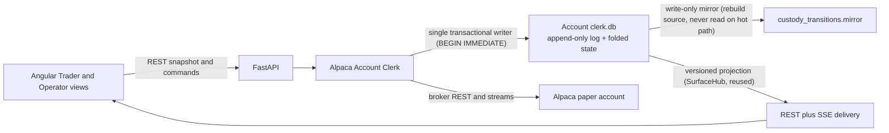
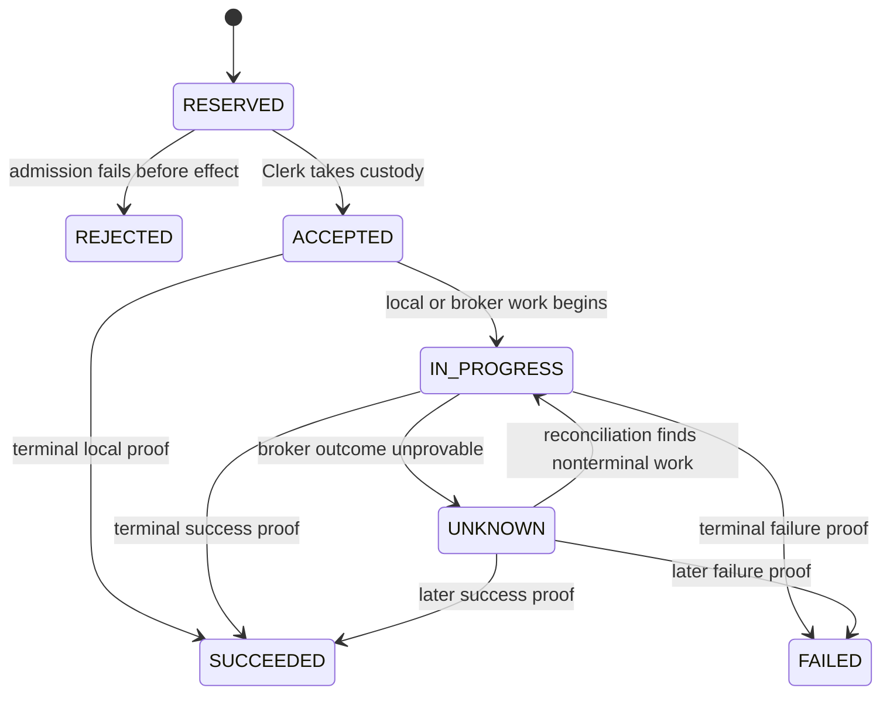

# PRD — Alpaca Account Clerk SQLite Control Plane and Custody Timeline

- **Date:** 2026-08-04
- **Status:** Revised after architecture grilling (2026-08-04). Supersedes the
  original deep-research draft of this file. Decisions are recorded in
  **ADR 0035**; that ADR must be accepted and the cutover must pass this PRD's
  qualification gates before implementation authority changes.
- **Product surfaces:** Alpaca Account Clerk, Alpaca Bots roster, Trader bot
  panel, Operator bot panel, lifecycle and recovery actions
- **Deployment boundary:** trusted-local, single operator, exactly one FastAPI
  worker, Alpaca paper trading only
- **Builds on:** the Account Clerk authority, Clerk-governed bot-control PRD,
  safety/remediation PRD, broker-v2 panel, and the existing versioned SSE
  utilities (`SurfaceHub` + `versioned-snapshot-stream`, ADR-0028)
- **Priorities (this milestone):** correctness and robustness first; deleting
  bespoke concurrency/recovery machinery over time; **speed is a later factor**.

---

## 1. Executive summary

The Alpaca Account Clerk needs one local, transactional authority for commands,
effect operations, broker orders, fills, reconciliation, run fencing, terminal
receipts, and the operator-facing custody timeline.

The current control plane relies on append-only JSONL journals folded in full on
every read, a hand-rolled file idempotency ledger, optimistic-concurrency tokens
computed over folded state (the source of the recent Resume/Stop 409 churn), and
a best-effort PostgreSQL projection with its own cursor-tail, advisory-lock, and
rebuild machinery. That is a growing pile of custom concurrency and recovery code
that a transactional store solves locally.

This PRD selects **one event-sourced SQLite database per Alpaca account**:

```text
accounts/alpaca/<account_id>/clerk.db
```

The design is deliberately **event-sourced**, not a generic event-sourcing
platform:

- A single, hash-chained, **append-only `custody_transitions` table is the sole
  canonical custody authority.** This keeps ADR-0033's "one append-only
  authority" principle intact — only the storage medium changes from a JSONL
  file to a SQLite table.
- **All current-state tables are a materialized fold of that log,** committed in
  the same transaction. Current-state can never silently drift from custody
  truth, and it is fully rebuildable from the log by replay.
- **Idempotency is content-addressed** and enforced by `UNIQUE` constraints, so
  a retry/refresh/double-submit cannot mint a second broker effect.
- **PostgreSQL is removed from this scope.** SQLite serves current-state and
  operator history. Postgres returns only if a named ADR-0001 trigger fires.
- **Robustness is bought explicitly:** `synchronous=FULL` (capture-before-contact
  survives power loss), DB-enforced single writer (`BEGIN IMMEDIATE`), a
  write-only append mirror for disaster rebuild, a hash chain for tamper- and
  corruption-evidence, and single-file backup for reproducibility.

The UI receives authoritative snapshots over REST and the existing versioned
SSE; SSE transports state but never authors it. The frontend derives no safety.

The product outcome is a fast and truthful control room in which users can
answer:

1. What is this bot or Account Clerk allowed to do now?
2. Who owns responsibility for resolving this operation?
3. Which broker orders belong to the operation?
4. What happened, at what time, and what proof changed the outcome?
5. If the outcome is unknown, what is blocked and what safe recovery continues?

## 2. Decisions (locked in the 2026-08-04 grilling; see ADR 0035)

1. **Trusted-local, single-operator topology,** one FastAPI worker, Alpaca paper
   only.
2. **Event-sourced SQLite is the canonical Account Clerk control-plane store**
   after cutover: an append-only log is the authority, current-state is a fold.
3. The database is **account-scoped** under the Alpaca account artifact
   directory.
4. **Clean-slate cutover: no migration, no history import.** Cutover starts a new
   Clerk authority generation after explicit broker-account qualification.
5. **PostgreSQL is removed from this scope** (not merely demoted). No outbox, no
   projector, no rebuild runbook. Re-introduce only on a named ADR-0001 trigger.
6. **Current-state = a materialized fold of an append-only log, in one
   transaction.** No directly-authored mutable state; no side timeline that can
   drift.
7. The custody timeline is **operation-first.** Broker orders are nested child
   records beneath the effect operation that owns their resolution.
8. `UNKNOWN` is **nonterminal** in durable state; the Clerk retains custody and
   reconciles automatically.
9. **Idempotency is content-addressed:** strategy `(sid, decision_id)`; operator
   lifecycle `(account, sid, action, intended_end_state)`; enforced by `UNIQUE`.
   Transport retry returns the existing result with no new effect and no error; a
   genuine re-request returns a typed reason; the UI shows the control disabled
   with a backend-authored tooltip.
10. **Capture-before-contact is absolute:** `synchronous=FULL`; the intent commit
    fsyncs before any broker call. Write latency is tracked, not traded away.
11. **The database enforces the single writer** (`BEGIN IMMEDIATE` +
    `busy_timeout`), retiring the honor-system single-worker footgun.
12. **Disaster recovery = a write-only append mirror** (never read except to
    rebuild a corrupt DB) — graceful degradation and a rebuild source without a
    second authority.
13. **The log is hash-chained** for tamper- and corruption-evidence; rebuild
    verifies integrity.
14. **Uncertainty has two blast-radius scopes,** `BOT` and `ACCOUNT_CLERK`;
    cause rides as extensible `reason_code` + `facts_json`. Unrecognized →
    `ACCOUNT_CLERK`, fail closed for new exposure.
15. **Broker-neutral core, Alpaca-first.** The log/fold/idempotency engine is
    broker-agnostic; only the adapter is broker-specific. IBKR convergence is an
    aspiration, not a constraint.
16. **The frontend derives no safety.** The backend authors capability (primary
    action, disabled reasons, freshness). The roster moves onto the existing
    versioned SSE; that infrastructure is reused, not rebuilt.
17. Broker-event, Clerk-observation, and durable-record times remain distinct
    `int64` Unix-millisecond UTC facts (ADR-0033, unchanged).
18. Missing or corrupt SQLite authority **fails closed**; a new generation
    requires an explicit recovery/reset flow and fresh broker proof.

## 3. Problem

### 3.1 File durability is proven, but cross-record transitions remain custom

The existing journals deliberately fsync intent evidence before broker contact —
that invariant must survive. But a modern command must also reserve an
idempotency identity, bind a payload hash, create an effect, record a broker
order reference, advance a projection revision, and expose a recoverable
receipt. Coordinating those facts across files requires application locking and
crash-cut recovery for every new workflow. SQLite commits all related local
facts as one transaction: a crash yields the old or the new committed state,
never a partially-published set.

### 3.2 Current-state reads should not replay custody history

Today every current-state question folds the whole journal from byte 0 (O(n) per
op). A live UI needs indexed answers for current commands, working orders, holds,
exposure, receipts, and selected history without validating every earlier record.
An event-sourced fold maintains those tables incrementally in the same
transaction as the append.

### 3.3 A command needs one restart-safe, content-addressed lifecycle

A dropped HTTP response or a page refresh must not create a second Stop, EXIT,
flatten, cancellation, or broker order. Content-addressed idempotency keys with
`UNIQUE` enforcement make a duplicate a no-op that returns the existing result;
optimistic tokens derived from folded state (today's approach) are the churn
source we are removing.

### 3.4 Current state alone does not explain custody

Operators need more than `order.status = filled`: that the Clerk accepted EXIT,
cancelled a working entry, observed a partial fill, recomputed the remaining
attributed quantity, submitted the reduction, observed the close, and verified
flatness. That history must be durable, causal, timestamped, and organized around
the whole operation — which is exactly the append-only log that is now the
authority.

### 3.5 Technical errors do not explain product impact

`UNKNOWN`, a raw reason code, or a generic HTTP error does not tell a user
whether one bot or the whole Account Clerk is blocked, whether the Clerk still
owns resolution, which actions remain safe, or when evidence was last checked.

### 3.6 Database loss cannot be mistaken for a flat account

If the local authority disappears or corrupts, attribution and command identity
are lost even if Alpaca is reachable. The system must not create an empty
database and infer a clean account. Recovery is: fail closed → rebuild from the
append mirror if possible (integrity-verified via the hash chain) → otherwise an
explicit operator reset with fresh broker proof and a new generation.

## 4. Goals

1. Replace canonical JSONL control storage with one account-scoped, event-sourced
   SQLite authority (append-only log + folded current-state).
2. Preserve capture-before-contact: no broker write without a committed,
   `synchronous=FULL` local intent.
3. Make command reservation, effect creation, custody transition, current-state
   fold, revision advancement, and mirror append atomic — one local decision, one
   transaction.
4. Make retries safe across transport loss, browser reload, and service restart
   via content-addressed idempotency.
5. Provide indexed, bounded current-state and history reads for the UI without
   history replay.
6. Provide an operation-first, immutable, hash-chained custody timeline with
   nested broker orders — this log **is** the authority.
7. Keep `UNKNOWN` nonterminal and automatically reconciled.
8. Scope uncertainty truthfully to `BOT` or `ACCOUNT_CLERK`.
9. Provide clear, backend-authored Trader and Operator explanations; the frontend
   derives no safety.
10. Preserve distinct broker-event, Clerk-observation, and durable-record clocks.
11. Remove PostgreSQL and keep UI transport outside execution authority.
12. Fail closed on database identity, integrity, or topology violations; recover
    from the append mirror where possible.
13. Delete bespoke concurrency/recovery machinery (in-process intake lock,
    manual WAL discipline, whole-file fold, file idempotency ledger, Postgres
    projection) as this ships.
14. Produce an implementation and documentation package that makes every safety
    claim traceable to schema, transaction, test, and operator behavior.

## 5. Non-goals

- Live-money trading enablement.
- Multiple FastAPI workers, multiple Clerk writers, or distributed SQLite access.
- A shared network filesystem for `clerk.db`.
- Multi-user authentication or remote operator authorization.
- A generic rules engine, event-sourcing framework, Kafka, Redis Streams, or
  external event broker.
- **Any PostgreSQL dependency in this scope** — no projection, no outbox, no
  analytics pipeline. (Re-evaluated only on a named ADR-0001 trigger.)
- WebSockets as a new control-plane dependency (the existing versioned SSE is
  reused).
- Migrating or preserving current paper JSONL history.
- Moving strategy math, P&L, sizing, or signal computation outside Python.
- Letting Angular derive safety scope, terminal state, freshness, primary
  action, or recovery actions.
- Treating a broker HTTP success response as terminal execution proof.
- Treating SSE delivery as evidence that broker or Clerk state is healthy.

## 6. Users and primary jobs

### 6.1 Trader

- Is this bot allowed to create exposure?
- What operation is active?
- Does the Account Clerk still own resolution?
- What broker outcome is proven?
- What is blocked and what remains available?
- When was the latest broker evidence observed?
- Does the user need to act?

### 6.2 Operator

- Which Clerk authority generation owns this account?
- Which command, effect, and child orders form the operation?
- Which exact custody transition changed the displayed state?
- What were the broker/source, Clerk-observation, and durable-record times?
- Is uncertainty bot-scoped or Account-Clerk-scoped?
- Which reconciliation attempts ran and what evidence did they find?
- Which recovery actions are currently admitted, and why?
- Is the local authority healthy, degraded to mirror, or failed?

## 7. Canonical product language

Aligned with the repository glossary (`CONTEXT.md`); the content-addressed
command identity here is the existing **command intent identity** term.

### Account Clerk
The single account-rooted authority that admits broker effects, commits intent
before contact, owns resolution, reconciles broker evidence, attributes
exposure, and authors terminal receipts.

### Clerk authority generation
The durable identity of one initialized Account Clerk authority. A destructive
reset creates a new generation; evidence from a previous generation cannot
authorize current work.

### Command
One operator or strategy request with a **content-addressed** identity and an
immutable canonical payload hash. Transport retries reuse the same identity and
return the same outcome.

### Effect operation
The Clerk-owned unit of work — ENTER, EXIT, targeted cancel, reconcile, Stop, or
Stop-and-Flatten. One operation may own zero, one, or several broker orders.

### Custody
The Clerk's durable responsibility to resolve an accepted effect honestly. It
does not mean the Clerk controls venue execution; Alpaca controls the broker
outcome, the Clerk tracks, reconciles, and reports it.

### Custody transition
An immutable, hash-chained, timestamped change in responsibility, broker
evidence, or resolution state for an effect operation or one of its child
orders. **The append-only sequence of these transitions is the canonical
authority; all current-state is a fold of it.**

### Receipt
Durable proof of a terminal local or broker-backed outcome. A pending HTTP
response is not a terminal receipt.

### Unknown
A nonterminal state in which the Clerk cannot yet prove the broker outcome. The
Clerk retains custody and reconciliation responsibility.

### BOT uncertainty
An attributable failure isolated to one strategy instance/run or its allowed
intent, without loss of Account Clerk truth.

### ACCOUNT_CLERK uncertainty
An uncertainty affecting one Alpaca account's Clerk authority (unprovable
reconciliation, unexplained orders, unavailable account state, corrupt local
authority). It does not automatically apply to other Alpaca accounts.

## 8. Authority and topology



Authority rules:

1. Python Account Clerk logic owns command, custody, reconciliation, exposure,
   uncertainty, receipt, and recovery meaning.
2. The append-only, hash-chained `custody_transitions` log inside `clerk.db` is
   the local canonical record after the accepted ADR and cutover; all other
   tables are its fold.
3. Alpaca is authoritative for its broker/account observations, but raw broker
   facts become application authority only after the Clerk validates and commits
   them (as a transition) with provenance.
4. The write-only mirror is a rebuild source, never a second authority and never
   read on the hot path.
5. Angular renders backend contracts and may format time. It cannot infer safety,
   primary action, or freshness.
6. SSE publishes revisions or snapshots. It is transport, not truth.
7. **No PostgreSQL participates in admission, execution, reconciliation,
   recovery, or history for this scope.**

## 9. SQLite storage contract

### 9.1 Database identity and location

```text
<artifacts_root>/accounts/alpaca/<safe_account_id>/clerk.db
<artifacts_root>/accounts/alpaca/<safe_account_id>/custody_transitions.mirror
```

The database must carry: schema version; broker and exact account identity;
Clerk authority generation; creation and last-open times (`int64 ms UTC`);
control-plane revision; reset/recovery provenance; and a database identity token
that prevents accidental file substitution. A database whose embedded account
identity does not match the requested account fails closed.

### 9.2 Runtime configuration

The implementation must enable and verify:

- WAL journal mode;
- **`synchronous = FULL`** (capture-before-contact must survive power loss);
- foreign-key enforcement;
- **`BEGIN IMMEDIATE`** for all mutations + a bounded `busy_timeout` (the DB is
  the single-writer enforcer);
- one application-owned write coordinator (belt-and-suspenders over the DB lock);
- explicit transactions for all mutations;
- startup integrity (`integrity_check`), identity, and hash-chain checks.

Prefer Python's standard `sqlite3` unless a new dependency demonstrates a
material correctness or maintainability advantage. SQL stays behind one
repository boundary and never spreads through routers, strategy, or presentation
code.

### 9.3 Minimum logical schema

| Table | Purpose | Mutation model |
| --- | --- | --- |
| `control_meta` | Schema, account, authority generation, revision | Guarded singleton |
| `strategy_instances` | Immutable configured bot identity | Insert once; retire only |
| `runs` | Per-instance run records and active-run fence | Insert plus guarded state |
| `commands` | Content-addressed request identity, hash, state, receipt link | Guarded fold state |
| `effect_operations` | Clerk-owned ENTER/EXIT/cancel/recovery work | Guarded fold state |
| `orders` | One row per broker/client order identity | Guarded broker-state fold |
| `fills` | Permanent executions and corrections | Append/idempotent insert |
| `positions` | Current Clerk-attributed exposure | Fold of the log |
| `holds` | Active and resolved bot/Account-Clerk holds | Fold of the log |
| `uncertainties` | Active nonterminal unknowns and extensible facts | Fold of the log |
| `reconciliations` | Reconciliation attempts and terminal receipts | Insert plus terminal fold |
| `receipts` | Permanent terminal command/effect proof | Insert once |
| `custody_transitions` | **Canonical** immutable, hash-chained, operation-first log | Append only |

`custody_transitions` is the authority; every other row above is a fold of it,
written in the same transaction as the append. There is **no `projection_outbox`
table** (PostgreSQL is out of scope). Physical normalization may change, but no
design may remove the identities, uniqueness, causal links, hash chain, or
transaction guarantees named here.

### 9.4 Required uniqueness and immutability

- unique content-addressed command identity within the authority generation;
- immutable request hash for an existing command;
- unique Clerk effect idempotency identity;
- unique broker `client_order_id`/order reference;
- idempotent broker-event and fill identities;
- one active run fence per strategy instance;
- one monotonically increasing account control revision;
- immutable terminal receipt identity;
- immutable custody-transition sequence, payload, **and hash-chain link** after
  commit.

Terminal outcomes cannot regress to nonterminal. Corrections are new broker
evidence and an explicitly allowed derived state, never erasure of an earlier
fact.

## 10. Command and custody state machines

### 10.1 Command lifecycle



`UNKNOWN` is terminal only for the current synchronous HTTP wait; it is
nonterminal for SQLite custody. An endpoint may return `202 Accepted` with the
durable command resource and recovery URL. A duplicate content-addressed command
returns the existing resource (see R2).

### 10.2 Operation-first custody

```text
EXIT operation
├── accepted by Account Clerk
├── working-entry cancellation
│   └── entry order broker transitions
├── final attributed-quantity calculation
├── reducing order
│   └── close order broker transitions and fills
└── attributed-exposure verification
    └── terminal EXIT receipt
```

The UI may open an individual order, but the primary timeline and terminal
outcome belong to the effect operation.

### 10.3 Custody responsibility

- Strategy or operator authors the request.
- The Account Clerk owns custody after acceptance.
- Alpaca controls broker/venue execution after submission.
- The Clerk retains resolution responsibility during broker processing, caller
  cancellation, process exit, and `UNKNOWN`.
- Only a durable terminal receipt closes Clerk custody.

## 11. Custody timeline contract

Each transition identifies:

```text
sequence
prev_hash, row_hash        (hash chain)
authority_generation
strategy_instance_id
run_id, when applicable
command_id
effect_operation_id
order_ref and broker_order_id, when applicable
transition_kind
custody_owner
execution_authority
operation_state
broker_state, when applicable
proof_reference
source_event_at_ms, when supplied by Alpaca
clerk_observed_at_ms
recorded_at_ms
summary_code
facts_schema_version
facts_json
```

Rules:

1. `sequence` is serialization order, not broker time.
2. `row_hash = H(prev_hash || canonical(payload))`; the chain is verified at
   startup and on mirror rebuild.
3. Missing source time remains null; it is never copied from observation time.
4. A late broker event may carry an earlier source time without rewriting earlier
   observation or record clocks.
5. Summary codes are stable; backend-authored prose comes from a closed copy
   registry or stored receipt text, never inferred by Angular.
6. Opaque IDs, broker references, hashes, and URLs remain exact.
7. Timeline paging uses stable sequence/keyset semantics.
8. **The append, the current-state fold, and the mirror append commit in one
   transaction.**

## 12. Functional requirements

### R1 — Capture before broker contact
- The command, effect operation, broker order reference, current-state fold,
  transition (with hash link), revision, and mirror append required by
  acceptance commit **before** the first broker write, under `synchronous=FULL`.
- A failed commit produces no broker call.
- A crash after commit but before broker contact leaves a recoverable accepted
  operation that reconciliation classifies conservatively.
- Write latency is recorded as an observable.

### R2 — Content-addressed idempotency and conflict detection
- Idempotency identity is content-addressed and `UNIQUE`-enforced: strategy
  `(sid, decision_id)`; operator lifecycle
  `(account, sid, action, intended_end_state)`.
- The backend canonically hashes action, target, account, instance, run, the
  immutable semantic payload, and any operator reason that changes meaning.
- **Transport retry** (same identity, same hash) returns the existing resource
  with no new effect and **no error**.
- **Genuine re-request** returns a typed reason (e.g. "a stop has already been
  requested"); the UI renders the control disabled with a backend-authored
  tooltip.
- Same identity, different hash → durable conflict, no broker call.
- A duplicate while `IN_PROGRESS`/`UNKNOWN` returns current state and starts no
  second broker operation.
- `GET /commands/{command_id}` returns current state, timestamps, scope, receipt,
  operation link, and recovery guidance.
- A random nonce is used only where re-issue is genuinely meaningful.

### R3 — Typed operation outcomes
Closed vocabulary: `reserved | rejected | accepted | in_progress | unknown |
succeeded | failed`. Pending/unknown work is never wrapped as a generic success.
`STOPPED_AND_ATTRIBUTED_FLAT` (or an equally precise terminal proof) is required
before Stop-and-Flatten renders success.

### R4 — Automatic reconciliation of UNKNOWN
- `UNKNOWN` retains Account Clerk custody.
- Reconciliation continues automatically after the initiating request ends.
- Resolution is by deterministic client order identity and validated broker
  evidence; a first absent lookup after a lost submit is not assumed terminal
  until the broker contract and the defined grace/retry proof make absence
  conclusive (the existing 30s grace + `by_client_order_id` discipline is
  preserved).
- A later outcome appends a transition and advances current state atomically.
- Operator `Reconcile now` accelerates the existing operation; it never creates a
  second economic intent.

### R5 — Uncertainty scope and extensibility
Every uncertainty exposes a stable envelope:

```text
uncertainty_id
scope: BOT | ACCOUNT_CLERK
severity
blocks_new_exposure
allows_reduction
custody_owner
reason_code
headline
explanation
operator_impact
next_step
observed_at_ms
evidence_refs
facts_schema_version
facts_json
```

- `BOT` only when typed policy proves isolation to one bot.
- `ACCOUNT_CLERK` applies to one specific Alpaca account authority.
- Symbol, order, venue, and future attributes are extensible facts, not new
  top-level scopes.
- New facts may be stored/displayed immediately but cannot authorize exposure
  until Python policy understands them.
- Unrecognized reasons/facts default to `ACCOUNT_CLERK` and block new exposure.

### R6 — Admission and safe recovery actions
- Backend admission functions author both presented capability and execution.
- `BOT` uncertainty blocks the affected bot's new exposure; `ACCOUNT_CLERK`
  blocks new exposure for all bots governed by that account authority.
- Proven cancellation, reconciliation, and risk reduction remain available when
  their exact prerequisites are satisfied.
- The UI never exposes generic `Clear`, blind `Retry order`, or unproven
  immediate `Emergency Flatten`.
- Candidate recovery actions: `Reconcile now`, `Cancel verified working orders`,
  `Prepare safe flatten`, `Stop bot decisions`, `Open custody timeline`, and —
  on authority failure — `Rebuild from mirror` / `Reset authority`.
- Every presented recovery action carries backend-authored availability, reason,
  scope, evidence freshness, and next step.

### R7 — Operation-specific order safety
- `client_order_id`/order reference is generated and committed before submission.
- Lost responses reconcile by exact client order identity.
- **Order replacement (PATCH) is net-new** (it does not exist today). If built,
  replacement stays nonterminal until broker events/REST evidence prove the
  replacement or rejection, and admission accounts for Alpaca's
  larger-of-old-and-new buying-power behavior.
- An EXIT cancels relevant working entries, waits for terminal cancellation or
  fill proof, recalculates final attributed quantity, then submits the close
  (cancel-first / prove-terminal, preserved from today).
- DNR and reduce-only are distinct broker concepts and are not modeled as
  equivalent.
- Historical order listing respects Alpaca's `after`/`until` timestamp contract
  and does not invent order-ID pagination; the fixed 500-item page bound is made
  explicit and logged when it truncates.

### R8 — Current projections (folds, not replay)
Indexed current-state queries answer without custody-history replay: current
commands by bot/account and state; current effect operation and nested orders;
working/unresolved orders; current attributed positions; active holds and
uncertainties; latest reconciliation and evidence ages; recent terminal
receipts; Account Clerk generation and health; monotonic control revision.

### R9 — Disaster-recovery append mirror (replaces the former Postgres outbox)
- Every committed transition is also appended to a plain fsync'd mirror file in
  the same transaction boundary.
- The mirror is **never read on the hot path** — only to rebuild a corrupt
  `clerk.db`.
- Rebuild replays the mirror, verifies the hash chain, and reconstructs the log
  and all folds; a hash-chain break fails closed rather than importing tampered
  data.
- Mirror growth is bounded by a documented retention/rotation policy aligned with
  the authority generation.

### R10 — REST and versioned SSE (reuse existing infrastructure)
1. The UI fetches an initial versioned REST snapshot.
2. Later revisions publish over the **existing** `SurfaceHub` +
   `versioned-snapshot-stream` primitives (ADR-0028) — no new SSE stack.
3. Reconnect resumes from the supported `stream_epoch:surface_version` cursor;
   epoch change forces a fresh snapshot.
4. Bounded revision polling is fallback only.
5. **The Alpaca roster moves onto versioned SSE,** retiring its current
   3-endpoint 5s/15s polling.
6. Angular preserves chart range, selection, expanded rows, scroll, lens, and
   selected history during updates.
7. Historical chart data stays lazy and separate from custody deltas.

### R11 — Trader and Operator messaging (backend-authored)
Trader: plain-language headline; may-create-exposure; custody owner and operation
state; practical impact; what remains available; last broker/Clerk evidence age;
whether action is required.

Operator additionally: exact `BOT`/`ACCOUNT_CLERK` scope; authority generation;
command/effect/order identities; stable reason code via shared labeling;
broker/observation/record times; reconciliation attempts; the full operation-first
timeline; backend-authorized recovery controls; authority health
(healthy / degraded-to-mirror / failed).

**The backend authors which action is primary and why each is disabled.** No UI
surface shows only a raw reason code, `UNKNOWN`, or a generic server error when
structured impact/recovery information exists, and the frontend derives neither
primary action nor freshness.

### R12 — Timestamp presentation
- Storage and wire timestamps are `int64 ms UTC`.
- Broker/source, Clerk-observation, and durable-record clocks are distinct.
- Default UI rendering: viewer's local timezone + relative age.
- Operator detail can reveal exact UTC and all clocks separately; ET may appear
  for market-session context.
- Durations derive only from compatible clocks.

### R13 — Database integrity, mirror recovery, and explicit reset
- Startup validates path confinement, database identity, account identity,
  schema, authority generation, required pragmas, `integrity_check`, and the
  hash chain.
- Missing/corrupt authority produces `ACCOUNT_CLERK` uncertainty and blocks new
  exposure.
- On corruption, the DB is preserved for diagnosis (never overwritten); recovery
  attempts a hash-verified rebuild from the mirror before proposing a reset.
- The service never silently creates an empty database for an account previously
  known to have Clerk authority.
- Reset requires an explicit operator workflow, fresh Alpaca positions and open
  orders, and a flat/order-free account (or a separately proven recovery
  outcome), and creates a new generation that invalidates prior control IDs.

## 13. UI experience

### 13.1 Trader summary example
```text
New SPY entries are paused

The Account Clerk cannot yet confirm whether the current closing order reached
Alpaca. The Clerk is reconciling automatically.

Scope: This bot
Unavailable: New exposure
Still available: Reconciliation and proven risk reduction
Last broker check: 8 seconds ago
Next step: No action is required yet
```

### 13.2 Account Clerk example
```text
Alpaca paper execution is paused

The Account Clerk cannot reconcile its open-order records with this Alpaca
account. All bots governed by this Clerk are blocked from new exposure.

Scope: Alpaca paper account …4821
Custody owner: Account Clerk
Recovery: Automatic reconciliation active
Available action: Reconcile now
```

### 13.3 Operation-first timeline example
```text
EXIT · in progress

10:31:02.114  Command reserved
10:31:02.126  Account Clerk accepted custody
10:31:03.004  Entry cancellation requested
10:31:03.641  Alpaca partial fill occurred
10:31:03.655  Clerk observed the fill · 14 ms later
10:31:04.091  Entry cancellation confirmed
10:31:04.128  Remaining attributed quantity calculated
10:31:04.182  Closing order submitted
10:31:05.041  Alpaca closing fill occurred
10:31:05.057  Clerk recorded the fill
10:31:05.083  Attributed exposure verified flat
10:31:05.091  EXIT succeeded
```

Individual child orders open into broker-specific detail without replacing the
operation's primary timeline. Backend authors the primary action; the frontend
renders disabled controls with backend-authored tooltips.

## 14. Performance and reliability budgets

Qualification fixtures cover 1, 10, and 100 bots and 10,000, 100,000, and
1,000,000 custody transitions/orders combined. **Both the correctness matrix
(§15) and these budgets gate qualification** (build correctness-first; prove it
holds at scale before Done).

Initial budgets, validated on the supported host:

- warm catalog server p95 below 100 ms;
- warm panel server p95 below 75 ms;
- bounded custody page p95 below 100 ms;
- zero full history replay on an unchanged warm read;
- meaningful local commit visible over healthy SSE within one second under normal
  local load;
- fallback polling exposes committed state within five seconds;
- content-addressed idempotency produces exactly one effect under concurrent
  duplicate POSTs;
- capture-before-contact write (`synchronous=FULL`) latency recorded (p50/p95/max)
  — measured and reported, not traded away;
- database growth, WAL checkpoint, and mirror growth remain bounded under the
  million-row fixture.

Record machine context, pragmas, row counts, transaction mix, p50/p95/max,
database/WAL/mirror size, and query plans. Do not encode unmeasured claims.

## 15. Required adversarial tests

### 15.1 Atomicity and idempotency
- Kill before the command commit: no command, no broker call.
- Kill after commit but before broker contact: recovery finds one accepted
  operation and performs no blind duplicate.
- Lose the broker HTTP response after acceptance: command becomes `UNKNOWN` and
  resolves by exact client order identity.
- Post the same content-addressed command concurrently: one effect, one intent.
- Transport-retry a completed command: existing result returned, no error, no new
  effect.
- Reuse the identity with a changed payload: durable conflict, no broker call.

### 15.2 Broker races
- Original fills while a (future) replacement is pending: no phantom exposure.
- Working entry partially fills during EXIT cancellation: close uses only the
  Clerk-proven remaining attributed quantity.
- Cancel response lost: no closing order until cancellation/fill truth is proven.
- Duplicate and out-of-order broker events fold idempotently.
- Websocket gap/reconnect requires REST reconciliation before new exposure.

### 15.3 Custody and uncertainty
- Caller cancellation after acceptance does not abandon custody.
- Bot process death leaves accepted operations under Clerk ownership.
- `BOT` uncertainty does not block an unrelated bot while account truth is fresh.
- Unrecognized uncertainty defaults to `ACCOUNT_CLERK` and blocks all governed
  bots.
- `UNKNOWN` resolves automatically to later terminal proof without a new command.
- Trader and Operator messages agree on scope and permitted actions.

### 15.4 Database failure and mirror recovery
- Corrupt a database page/WAL and prove fail-closed startup.
- **Rebuild a corrupt `clerk.db` from the mirror; prove the hash chain verifies
  and every fold reconstructs identically.**
- **Tamper with a mirror line and prove hash-chain-break detection fails closed
  (no tampered import).**
- Substitute another account's database and prove identity-mismatch rejection.
- Remove `clerk.db` after authority was established and prove it is not recreated.
- Fill the disk during a transaction and prove no broker call crosses an
  uncommitted intent.
- Interrupt WAL checkpoint/backup and prove the last committed authority remains
  readable or fails closed.
- Attempt reset with positions/open orders and prove rejection.
- Complete an explicit flat/order-free reset and prove a new generation.

### 15.5 UI delivery
- SSE reconnect and revision-gap recovery never regress displayed state.
- An unchanged revision causes no meaningful DOM/chart mutation.
- Custody history pages stay stable while new transitions append.
- Relative ages update without rewriting canonical timestamps.
- The roster on SSE preserves search/filter/selection across updates.
- Raw backend codes pass through the shared receipt-label conventions.

## 16. Cutover and rollout

### Phase 0 — Decision and proof
- Accept **ADR 0035** (this ADR supersedes the JSONL-authority portions of ADRs
  0001, 0008, 0030, 0033 for the Alpaca clerk only).
- Pin the schema, transaction matrix, state machines, PRAGMAs, hash-chain format,
  mirror format, and failure model.
- Build deterministic fault probes and the perf fixtures.

### Phase 1 — Event-sourced SQLite repository behind the Clerk boundary
- Implement the account-scoped repository: append-only hash-chained log, the fold
  into current-state, the mirror append, `synchronous=FULL`, `BEGIN IMMEDIATE`.
- Keep SQL private to the repository; keep the fold a pure, replayable function.
- Pass focused atomicity, idempotency, identity, corruption, and
  rebuild-from-mirror tests.
- Do not contact Alpaca from a partially initialized authority.

### Phase 2 — Clean paper cutover
- Stop all governed bots; obtain fresh Alpaca proof of flat + no open orders.
- Retire/quarantine legacy JSONL (do not import).
- Initialize the new database and authority generation.
- Redeploy desired paper instances as new durable configuration.
- Reject mixed JSONL/SQLite authority after cutover.

### Phase 3 — Commands, effects, and custody timeline
- Cut command/effect content-addressed idempotency to SQLite.
- Cut broker intents/orders/fills/reconciliation to SQLite.
- Enable operation-first custody reads and typed `UNKNOWN` recovery.
- Remove superseded JSONL writers/readers and the file idempotency ledger in the
  same vertical slices.

### Phase 4 — Reads and UI (no Postgres)
- Enable SQLite fold-based current-state reads.
- Deliver the REST snapshot + versioned SSE (reused infra); move the roster onto
  SSE.
- Add Trader summaries, Operator evidence, timestamps, backend-authored primary
  action + recovery actions; remove frontend safety/verb/freshness derivation.
- Prove stable chart and page behavior.
- Delete the Postgres projection subsystem for this scope.

### Phase 5 — Qualification
- Run the complete adversarial matrix (incl. mirror rebuild + hash-chain).
- Run the perf fixtures (1/10/100 bots; 10k/100k/1M rows) — both gate.
- Supervised Alpaca paper soak across multiple market sessions.
- Publish benchmark, fault-injection, and recovery evidence.
- Live-money execution stays disabled.

There is no long-lived dual-authority mode. Test adapters may compare results,
but production cutover has exactly one canonical writer.

## 17. Documentation deliverables

1. **ADR 0035** — the SQLite event-sourced authority and superseded file
   decisions (done; requires acceptance).
2. Canonical domain glossary alignment for command, effect, custody, receipt,
   `UNKNOWN`, `BOT`, `ACCOUNT_CLERK` (cross-referenced from `CONTEXT.md`).
3. SQLite schema and transaction-boundary reference (log + fold + mirror).
4. Command and operation state-machine diagrams.
5. Operation-first custody timeline + hash-chain contract.
6. Source-backed Alpaca guarantee and uncertainty matrix.
7. Invariant-to-test traceability matrix.
8. Benchmark and failure-injection report with host context.
9. Account Clerk **corruption / mirror-rebuild / backup / restore / reset**
   runbook.
10. Trader/Operator truth-language and recovery-action specification.
11. Updated Bot Control operator manual after implementation ships.

(No PostgreSQL outbox/projection runbook — Postgres is out of scope.)

The source-backed Alpaca matrix must record:

- `GET /v2/orders` exposes a maximum `limit` of 500 and timestamp-based
  `after`/`until` filters; it does not document `after_order_id`/`before_order_id`.
- DNR and reduce-only are separate concepts.
- Replacement HTTP success is nonterminal; replacement buying power uses the
  larger of the old and replacement orders (relevant only if PATCH is built).
- `client_order_id` is the reconciliation identity for lost responses and
  duplicate prevention.

## 18. Success measures

- Zero broker effects without a committed SQLite intent (`synchronous=FULL`).
- Zero duplicate broker effects under retry, response loss, restart, or
  double-click (content-addressed idempotency).
- Every active operation has one Account Clerk custody owner and a queryable,
  hash-chained timeline.
- Current-state never diverges from the log (it is a fold; rebuild reproduces it).
- Every terminal UI claim links to a terminal receipt.
- Every `UNKNOWN` remains nonterminal and either resolves automatically or
  presents explicit operator-required evidence.
- Every uncertainty message identifies `BOT`/`ACCOUNT_CLERK` scope, impact,
  available safety actions, last evidence age, and next step.
- Warm UI reads perform no full custody-history replay.
- The system runs with no PostgreSQL dependency.
- Missing/corrupt/substituted SQLite authority never appears as a clean account;
  a corrupt DB rebuilds from the hash-verified mirror or fails closed.
- All timestamps remain `int64 ms UTC` at storage and wire boundaries.
- The one-worker topology is enforced by the database, not by convention alone.
- The frontend derives no safety, primary action, or freshness.

## 19. Definition of done

- ADR 0035 accepted (supersedes the applicable JSONL authority decisions for
  Alpaca).
- `clerk.db` (event-sourced) is the only canonical Alpaca Account Clerk store; a
  write-only mirror exists for rebuild.
- No production JSONL control writer, file idempotency ledger, or Postgres
  projection remains for the cutover scope.
- The log append, current-state fold, and mirror append commit atomically.
- Commands, effects, orders, fills, runs, positions, holds, uncertainties,
  reconciliations, receipts, revisions have explicit SQLite fold authority over
  the one log.
- Content-addressed command identity and payload-conflict behavior survive
  restart; transport retry returns the existing result without error.
- `UNKNOWN` automatically reconciles under retained custody.
- Custody history is operation-first, hash-chained, with nested child-order
  detail.
- Trader and Operator contracts are backend-authored and consistent; the frontend
  derives no safety/verb/freshness; the roster is on versioned SSE.
- Broker/source, Clerk-observation, and durable-record times are preserved and
  shown.
- Recovery actions are evidence-backed; generic clear/retry/blind-flatten do not
  exist; `Rebuild from mirror` and `Reset authority` are available on failure.
- Corruption, loss, identity mismatch, disk-full, mirror-rebuild, hash-chain
  tamper, and reset tests pass.
- REST/SSE delivery meets performance and interaction-stability budgets.
- The complete documentation package in §17 is published.
- Alpaca paper qualification passes; live trading remains disabled.

## 20. Dependencies and references

Repository design and authority:

- [`docs/architecture/adrs/0035-alpaca-clerk-sqlite-event-sourced-authority.md`](../architecture/adrs/0035-alpaca-clerk-sqlite-event-sourced-authority.md)
- [`docs/prds/alpaca-bot-control-safety-reliability-remediation.md`](alpaca-bot-control-safety-reliability-remediation.md)
- [`docs/prds/alpaca-clerk-governed-bot-control.md`](alpaca-clerk-governed-bot-control.md)
- [`docs/architecture/alpaca-bot-control-remediation-research-plan-2026-08-02.md`](../architecture/alpaca-bot-control-remediation-research-plan-2026-08-02.md)
- [`docs/architecture/adrs/0001-control-plane-substrate-json-parquet.md`](../architecture/adrs/0001-control-plane-substrate-json-parquet.md)
- [`docs/architecture/adrs/0008-durable-submit-protocol-order-identity-recovery.md`](../architecture/adrs/0008-durable-submit-protocol-order-identity-recovery.md)
- [`docs/architecture/adrs/0030-account-clerk-account-rooted-journal.md`](../architecture/adrs/0030-account-clerk-account-rooted-journal.md)
- [`docs/architecture/adrs/0033-account-custody-clocks-and-safety-contract.md`](../architecture/adrs/0033-account-custody-clocks-and-safety-contract.md)
- [`docs/audits/alpaca-bot-control-panel-architecture-audit-2026-08-02.md`](../audits/alpaca-bot-control-panel-architecture-audit-2026-08-02.md)

Official Alpaca contracts:

- [Retrieve an order by client order ID](https://docs.alpaca.markets/us/reference/getorderbyclientorderidforaccount)
- [Retrieve a list of orders](https://docs.alpaca.markets/us/reference/getallordersforaccount)
- [Replace an order by ID](https://docs.alpaca.markets/us/reference/patchorderbyorderid-1)
- [Placing orders and time-in-force behavior](https://docs.alpaca.markets/us/docs/orders-at-alpaca)
- [Trade update streaming](https://docs.alpaca.markets/us/docs/websocket-streaming)

This platform is for research and education. Live trading requires separately
validated infrastructure.
