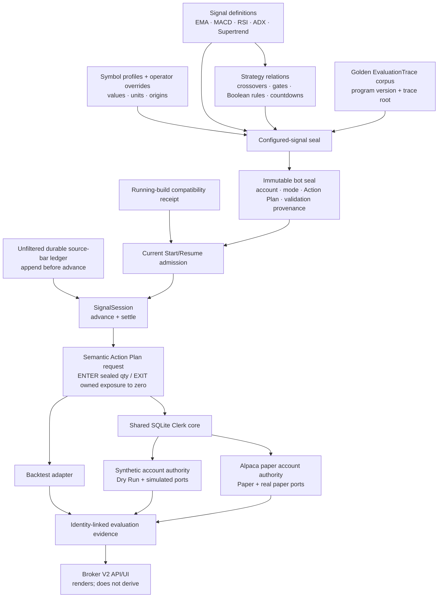
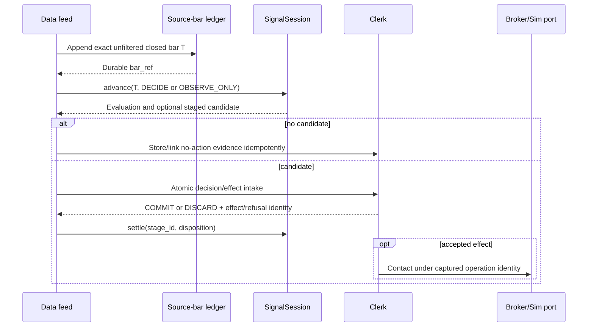
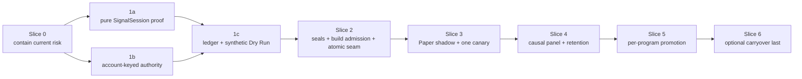

# PRD — Sealed Signal Programs to Governed Alpaca Bots

- **Date:** 2026-08-21
- **Status:** ADR 0042 captured the authority decision; delivery remains underway
- **Product surface:** Alpaca Broker V2 under `/brokers/alpaca/...`; Backtest, Dry Run, and Alpaca Paper strategy execution
- **Decision boundary:** No real-money Live mode; no deprecated IBKR bot-control work
- **Research basis:** Completed strategy-to-bot Wayfinder map, eight resolved architecture tickets, and two adversarial senior-architect reviews
- **Canonical authorities preserved:** Python owns strategy mathematics; the activated account-scoped SQLite Alpaca Clerk owns custody and broker effects
- **First delivery slice:** Safety containment only; no new broker-effect path

---

## 1. Executive summary

The product should let a trader compose a strategy from signals such as EMA,
MACD, RSI, ADX, and Supertrend, possibly evaluated at different closed
timeframes. The strategy relates those facts through named rules such as a
crossover, threshold, range gate, Boolean condition, countdown, or cooldown.
Every value is resolved for the selected symbol with an explicit unit before a
bot is created.

The architecture has two deliberately separate authorities:

1. A **sealed signal program** owns the deterministic mathematical answer to
   “what did this strategy decide from these bars?”
2. The account-scoped **SQLite Alpaca Clerk** owns the safety and execution
   answer to “may this account act, what work is in custody, and what happened
   at the broker?”

Backtest, Dry Run, and Paper share the same signal session through a semantic
Action Plan request. They intentionally diverge after that seam. Backtest uses
its research execution model. Dry Run uses the Clerk under an isolated
synthetic account. Paper uses the Clerk under the selected Alpaca paper
account. Dry Run and Paper therefore exercise the same custody protocol without
mixing simulated and real-paper account truth.

Restart truth comes from an unfiltered, durable source-bar ledger plus durable
Clerk dispositions. The bar append is the first durable step of every decision
clock. A saved strategy checkpoint is only an optional, replay-verified cache.
Start and Resume also prove that the running build is compatible with the
sealed program version and golden trace root. An unproven build cannot run.

This PRD accepts the reviewed direction and incorporates the final three design
corrections:

- retain unfiltered bars before calling the signal session;
- require the build-compatibility receipt during Start and Resume; and
- record `CANDIDATE_UNCAPTURED_AT_CRASH` when replay finds a staged candidate
  that crashed before Clerk intake.

No part of this PRD enables real-money trading.

## 2. The design in plain language

Think of a bot as a recipe, a safety officer, and an evidence trail.

- The **recipe** combines indicators and conditions. It does not know the
  account balance, position, broker order, or fill.
- The **safety officer** is the Clerk. It knows the selected account, attributed
  exposure, active work, holds, uncertainty, orders, and fills.
- The **evidence trail** connects the deployed recipe to each bar, evaluation,
  decision, Clerk effect, broker order, execution, and correction.

A `$0.20` EMA gap appropriate for SPY must not silently become the threshold
for a `$1` instrument. The deployment records whether a value is dollars,
percent, basis points, bars, minutes, or another closed unit, where that value
came from, and whether it matches validated settings.

The strategy may propose `ENTER` or `EXIT`. It cannot create an order. The
Clerk may accept, refuse, deduplicate, recover, cancel, or reduce. The UI may
explain these facts, but it cannot calculate a signal or infer custody.

## 3. Architecture map



The line between the Action Plan request and its adapters is the intentional
parity boundary. Equal fills, fees, P&L, buying power, or broker acceptance are
not claimed after that line.

## 4. Problem statement and current findings

The current Alpaca path has the right custody authority but no single sealed
strategy-runtime boundary. The completed map found these failure-producing
seams:

1. Runtime construction uses a separate dispatch table that can drift from the
   strategy registry.
2. The current bot binding does not identify every semantic input: program
   behavior, account, validation snapshot, provider, calendar, warmup, clocks,
   and replay policy.
3. Paper warmup and history/live handoff are not proved exact-once.
4. Pause can drop bars instead of merely suppressing decisions, changing
   multi-timeframe state.
5. Exact decision bars are not retained in the bot path.
6. Strategy state and Clerk custody can diverge after restart or a rejected
   action.
7. Decision receipts and Clerk effects are not captured atomically.
8. Dry Run currently bypasses important Clerk behavior.
9. Routine panel reads can combine SQLite authority with file or hard-coded
   projections.
10. A panel can display a plausible signal-to-transaction story without a
    durable causal link.
11. Receipt tail pruning can discard effect-bearing or refused evidence.
12. The process-global Clerk composition cannot safely host both synthetic and
    real account authorities.

The map also corrected two earlier assumptions:

- Competing EXIT is already fenced per entry order. The defect is an unhandled
  domain exception and loss of run continuity, not a reachable second reducing
  order.
- A structural scan suggests current A/B/C fill callbacks are bookkeeping, not
  decision inputs. That scan is only a heuristic; public-interface parity
  fixtures are the proof.

## 5. Goals

1. Compose strategies from registered, parameterized, multi-timeframe signals
   without introducing a second mathematical authority.
2. Produce the same canonical evaluation trace from the same qualified bars in
   Backtest, Dry Run, and Paper through the semantic Action Plan request.
3. Freeze the complete intended meaning of a deployed bot while allowing
   current safety policy and health evidence to evolve.
4. Make Start and Resume refuse account, program, build, provider, validation,
   clock, bar-policy, or replay drift.
5. Recover signal state deterministically from durable inputs and Clerk
   dispositions rather than mandatory strategy-object serialization.
6. Exercise one custody protocol in Dry Run and Paper under strictly isolated
   account authorities.
7. Preserve cancellation and safe risk reduction when new exposure is blocked.
8. Give operators a causally true, identity-linked explanation of every
   decision and execution outcome.
9. Migrate one evidence-rich strategy at a time without hot-swapping active
   processes.

## 6. Non-goals

- Real-money Live trading, its override policy, or a live risk envelope.
- A generic multi-broker execution framework.
- Extending or using deprecated IBKR bot-control and broker-navigation
  surfaces. The active IBKR market-data bridge may remain a sealed data source.
- Rewriting every strategy into a declarative DSL. Handwritten programs remain
  valid when they satisfy the same interface and evidence contract.
- Equal fill price, fill time, fee, slippage, P&L, buying power, or broker
  acceptance across modes.
- Scaling into existing positions or treating bots as broker-native
  sub-positions.
- Changing indicator formulas, tolerances, or reference outputs as part of the
  architecture migration.
- A mandatory checkpoint serializer for signal sessions.
- Cross-account or cross-authority fleet P&L/exposure aggregation.

## 7. Users and primary jobs

### Strategy author

- Define signals, relations, parameters, units, timeframes, warmup, and clocks.
- Prove numerical behavior against pinned references and golden fixtures.
- Know whether an exit is level/countdown-derivable after a discarded stage.

### Trader

- Select a validated strategy and symbol-aware settings.
- Understand what exact meaning will be frozen into the bot.
- Run Backtest or Dry Run before Paper.
- See whether parameters match validated settings and why Start/Resume is
  allowed or refused.

### Operator

- Identify the first authority that blocked or changed an outcome.
- Distinguish signal state, lifecycle intent, process liveness, and Clerk
  custody.
- Trace a decision to the selected effect, order, fill, correction, or explicit
  absence.
- Recover safely after a crash without creating a late or duplicate order.

### Senior architect / reviewer

- Verify that each claim has one authority.
- Attack crash windows, account substitution, provider drift, replay parity,
  and causal projection.
- Reject any path that recreates strategy math, custody, or admission in the UI,
  .NET transport, or an alternate journal.

## 8. Canonical product language

| Term | Meaning and authority |
|---|---|
| **Signal Definition** | One Python-authored numerical fact and its source series, timeframe, parameter, unit, warmup, and tolerance contract. |
| **Strategy Relation** | Parameterized logic combining signal facts, such as crossover, level/range gate, comparison, Boolean relation, countdown, or cooldown. |
| **Signal Program** | Immutable broker-neutral program capable of creating staged ENTER/EXIT candidates. It may be handwritten or declarative. |
| **Signal Session** | Run-local bar routing, consolidation, readiness, mathematical memory, clocks, and staged signal-cycle state. It owns no account or order. |
| **Configured-signal seal** | Canonical identity of the exact mathematical program and its bar/replay semantics. |
| **Bot-configuration seal** | Configured signal plus execution account, mode, Action Plan, sizing, carryover, and selected validation evidence. |
| **Source-bar ledger** | Durable, unfiltered exact bars observed for an account authority, provider, and symbol. |
| **Evaluation** | One deterministic program result at one semantic decision clock. |
| **Stage** | A candidate signal-cycle transition waiting for Clerk `COMMIT` or `DISCARD`. |
| **Semantic Action Plan request** | `ENTER(sealed quantity)` or `EXIT(reduce attributed exposure to zero)`. |
| **Clerk disposition** | Durable `COMMIT` or `DISCARD` result for a staged evaluation. |
| **Account authority** | Exactly one Clerk repository and its compatible ports for a real-paper or `sim:` account. |
| **Strategy instance** | Durable configured bot identity; one instance may have many process runs. |
| **Run** | One admitted process lifetime under current policy and build evidence. |

## 9. Authority model

| Claim | Sole authority | Forbidden duplicate |
|---|---|---|
| Indicator values, relations, clocks, readiness, staged candidates | Canonical Python Signal Program/Session | Angular, .NET, Clerk, runner-specific math |
| Registered program version, schema, and capability | Python strategy registry | Independent live dispatch table |
| Resolved parameter values, units, and origins | Parameter/Profile Resolver before deployment | Runtime price-based guesses or mutable post-deploy lookup |
| Immutable bot meaning | Deployment Seal Service | File name, UI payload, or run-local object identity |
| Current mode admission | Mode Admission under accepted ADR policy | Strategy registry or UI-derived permission |
| Exact observed input bars | Source-bar ledger | Provider re-fetch or filtered per-bot cache as replay proof |
| Attributed exposure and outstanding custody | Activated account-scoped SQLite Clerk | Strategy `in_position`, fake portfolio, runner state machine |
| New exposure/cancel/reduce capability | Clerk policy, rechecked atomically at intake | Runner reconstruction from raw folds |
| Broker effect, order, fill, correction, uncertainty | Clerk and broker evidence | Simulator journal for Paper or file fallback |
| Desired Pause/Stop/Run intent | Durable runner control intent | Process liveness or Clerk position projection |
| Process liveness | In-process runner registry/supervisor | Custody or exposure claim |
| Validation fact and selected provenance | Accepted validation authority and sealed event snapshot | QC backtest ID alone or operator prose |
| Causal operator story | Identity-linked SQLite projector | Timestamp-nearest or “latest signal” joins |
| Presentation | Angular | Numerical, custody, admission, or causality derivation |

## 10. Strategy composition contract

### 10.1 Signal definition

Every registered signal declares:

- source provider, symbol, field, and base bar;
- closed timeframe, such as 1, 15, or 30 minutes;
- parameter names, types, units, legal ranges, and defaults;
- warmup and readiness rules;
- missing, duplicate, revised, and out-of-order bar semantics;
- numerical source, tolerance, golden fixture, and canonical Python function;
- timestamp and session/calendar semantics; and
- deterministic output shape and reason evidence.

### 10.2 Strategy relation

Relations have named semantics, not anonymous callback behavior. Initial
relation vocabulary:

- cross above / cross below;
- above / below / equal within tolerance;
- inside / outside range;
- `AND`, `OR`, and explicit negation;
- minimum gap with a unit-bearing threshold;
- holding countdown in qualified decision clocks; and
- cooldown after a committed or discarded stage.

Example:

> Enter when EMA(5) crosses above EMA(10), their gap is at least 20 basis
> points, RSI(14) is between 50 and 70, and ADX(14) is above 20. Evaluate EMA
> and RSI on closed 15-minute bars, ADX on closed 30-minute bars, and exit after
> five qualified 15-minute decision clocks.

### 10.3 Parameter resolution

Parameters resolve once in this precedence order:

1. registered program defaults;
2. symbol-specific profile; and
3. explicit operator overrides.

The result records each value, unit, and origin. `0.20 USD`, `20 bps`, and
`0.2 percent` are distinct values. A runtime cannot silently re-resolve them.
The bot seal records `parameters_match_validated_settings` and the identity of
the validated fixture used for comparison.

### 10.4 Promotion rule

A declarative Strategy Spec is not automatically more authoritative than a
handwritten algorithm. Each Signal Program becomes Backtest-eligible or
Paper-eligible only after its public-interface golden and parity fixtures pass.
Fill-dependent decision programs remain ineligible until a separately accepted
typed feedback extension exists.

## 11. Immutable identity and current run evidence

One `strategy_instance_id` binds two versioned canonical hashes.

### 11.1 `configured_signal_hash`

The configured-signal payload seals:

- strategy key and program implementation protocol version;
- registry `program_version` and golden `EvaluationTrace` corpus root;
- resolved parameter values, units, origins, legal schema version, and
  `parameters_match_validated_settings`;
- every signal series, provider, symbol, field, base timeframe, derived
  timeframe, and decision stream;
- closed-bar timestamp convention;
- duplicate, revision, gap, and out-of-order semantics;
- calendar, timezone, RTH/session rule, early-close behavior, and session-close
  ownership;
- history/live watermark and overlap policy;
- warmup, readiness, `DECIDE`, `OBSERVE_ONLY`, Pause, and replay semantics;
- level/countdown exit eligibility evidence where carryover may later be
  considered; and
- numerical provenance, tolerances, and parity fixture identities.

Source bars are deliberately retained **unfiltered**. The sealed session rule,
not the ledger writer, applies RTH/session eligibility.

### 11.2 `bot_configuration_hash`

The bot payload seals:

- `configured_signal_hash`;
- broker and exact execution account identity;
- normalized Action Plan and sizing semantics;
- mode: `dry_run` or Alpaca `paper`;
- carryover policy;
- selected validation event ID and immutable validation snapshot hash; and
- a future Live-only override only if a separate accepted Live contract permits
  it.

The account is part of the promise. Registration requires
`sealed_account_id == repo.account_id`; otherwise it returns
`SEALED_ACCOUNT_MISMATCH` before creating a run or effect.

### 11.3 Dynamic run evidence

The following are recorded per run but are not semantic bot identity:

- current admission-policy version and verdict;
- current validation status, including optional advisory
  `VALIDATION_REVOKED` after a run has started;
- running build digest and compatibility-receipt identity;
- source-feed and broker health;
- current Clerk activation, holds, uncertainty, capability, and custody;
- optional checkpoint codec/cache identity;
- Dry Run simulated fill policy; and
- runtime and replay watermarks.

The simulated fill policy cannot change signal decisions and therefore is run
evidence, not seal content.

### 11.4 Running-build compatibility

Start and Resume must:

1. resolve the digest of the running artifact;
2. load a compatibility receipt generated by the golden-trace qualification
   job;
3. prove that receipt binds the running digest to the sealed
   `(program_version, trace_root)`; and
4. record the receipt and resolved digest on the run.

Absent, invalid, tampered, or mismatched evidence returns
`PROGRAM_BUILD_UNPROVEN`. CI failure alone is not an admission control.

The physical build-digest source—container image digest, repository commit plus
dirty-state proof, or a manifest of loaded file hashes—is an implementation
decision that must be settled before Slice 2.

### 11.5 Legacy migration

- Never rewrite v1 hash bytes in place.
- If an exact v2 seal is reconstructible, append it to the same
  `strategy_instance_id` with migration evidence.
- If any semantic input is unprovable, clone a new instance with explicit
  lineage and leave the old instance inspectable but not resumable.

### 11.6 What `provider` in the sealed data contract means

`SignalDataContract.provider` records the **qualification lineage** — the data
source that produced the golden `EvaluationTrace` corpus the program's
`golden_trace_root` pins. For `ema-crossover-signal/v1` that is `polygon`,
because the golden corpus is generated by `PolygonReplayMarketDataFeed` in the
offline qualification suite.

It is **not** an authorization for which live feed a running bot may consume,
and no code treats it as one. Live bars come from the single feed wired at
`app/main.py` (`app.marketdata.ibkr_feed.get_market_data_feed`), which stamps
every bar `feed_id="ibkr"`. There is exactly one live feed in this system;
there is no live Polygon feed to switch to.

The two values therefore differ by design, and the difference is recorded here
rather than left to be rediscovered: a reader who sees `provider="polygon"` on
a bot trading IBKR bars is looking at a lineage field, not a violated
constraint. The pairwise provider-parity gate formerly required by §22.2 item 5
was withdrawn on 2026-08-22 by explicit product decision — with no live Polygon
feed, the comparison has no second operand.

If a second live provider is ever introduced, this decision must be revisited:
at that point the seal would need a distinct live-feed identity and a real
substitution gate, because the ambiguity that is harmless with one feed becomes
a genuine safety hole with two.

## 12. Deep signal interface

```python
class BotSignalProgram(Protocol):
    def open(self, resolved_config: ResolvedSignalConfig) -> SignalSession: ...


class SignalSession(Protocol):
    def advance(
        self,
        source_bar: ClosedSourceBar,
        mode: AdvanceMode,  # DECIDE | OBSERVE_ONLY
    ) -> tuple[SignalEvaluation, ...]: ...

    def settle(
        self,
        stage_id: str,
        disposition: StageDisposition,  # COMMIT | DISCARD
    ) -> None: ...
```

The session owns:

- one-minute input deduplication;
- sealed RTH/session filtering;
- multi-timeframe consolidation;
- warmup and readiness;
- indicator/relation memory;
- decision clocks and stable evaluation identity;
- staged signal-cycle changes; and
- deterministic replay state.

It must not own:

- account, buying power, portfolio, exposure, or position;
- execution quantity beyond the semantic Action Plan request;
- Clerk admission, hold, order, fill, or uncertainty;
- validation or mode admission; or
- a mandatory persistence codec.

The coordinator settles every stage before the next `advance`. Calling
`advance` with an unsettled stage returns a typed `UNSETTLED_STAGE` quarantine
fault; it never waits, skips a clock, or guesses.

## 13. Source-bar ledger and deterministic replay

### 13.1 Ledger contract

The retained-bar ledger is a new durable store, not a change to the existing
chart-bar retention path. It must:

- append the exact unfiltered closed source bar before `SignalSession.advance`;
- key observations by account authority, provider, symbol, and stable bar
  identity;
- preserve the payload and observation identity needed to detect duplicates and
  revisions;
- reject conflicting reuse of one bar identity;
- let multiple bots apply their own sealed RTH/session policy to the same
  unfiltered authority stream;
- retain enough history for warmup and any open signal cycle; and
- expose stable references used by evaluations and the causal graph.

The ledger may share the Clerk SQLite database or use a sibling durable store.
That physical choice remains open. It must not weaken append-before-advance,
account-authority isolation, consistent evidence reads, retention, backup, or
WAL growth controls.

### 13.2 Ordered decision clock



Append is always the first durable step. Clerk capture remains before broker
contact.

### 13.3 Recovery algorithm

1. Restore and reconcile Clerk custody independently.
2. Resolve the exact bot seal and prove current admission/build compatibility.
3. Open the exact sealed Signal Program.
4. Replay retained bars from `max(warmup_start, open_cycle_start)` in
   `OBSERVE_ONLY`.
5. Reapply each durable Clerk `COMMIT` or `DISCARD` disposition.
6. If replay produces a live candidate with no Clerk disposition, append a
   runner-authored `CANDIDATE_UNCAPTURED_AT_CRASH` receipt with no effect link
   and apply `DISCARD`.
7. Catch up all off-duty bars without late effects.
8. Obtain a fresh Clerk capability/custody cut before the first future
   `DECIDE` clock.

Provider re-fetch is not replay evidence. A checkpoint may accelerate replay
only after its semantic-state digest is proved equal to replay.

### 13.4 Crash semantics

| Crash point | Durable evidence | Required resume behavior |
|---|---|---|
| Before bar append | No observed bar | Resume from the last durable bar. |
| After append, before `advance` | Bar T exists; no evaluation | Replay T normally in `OBSERVE_ONLY`. |
| After `advance`, before Clerk intake | Bar T exists; candidate was process-local | Recreate candidate, emit `CANDIDATE_UNCAPTURED_AT_CRASH`, apply `DISCARD`, and create no effect. |
| After Clerk capture, before session `settle` | Bar, decision, disposition, and possibly effect exist | Replay T and reapply the durable disposition; reuse the operation identity. |
| After broker contact with unknown acknowledgement | Clerk captured one operation identity | Recover that identity; never create a replacement decision or contact. |
| During no-action receipt append | Bar and stable evaluation identity exist | Treat identical replay as idempotent; never create a new receipt or rewrite differing evidence. |

The resumed trace is allowed to differ from an uninterrupted trace only through
a named authority edge such as `CANDIDATE_UNCAPTURED_AT_CRASH`; silent
divergence is forbidden.

## 14. Parity and intentional divergence

Backtest, Dry Run, and Paper compare the same canonical `EvaluationTrace` from
identical qualified bars through:

- bar acceptance/rejection;
- timeframe bucket close;
- signal values and readiness;
- relation/gate results;
- decision clock and evaluation identity;
- staged candidate and reason evidence; and
- semantic Action Plan request.

The common request is:

- `ENTER(sealed quantity)`; or
- `EXIT(reduce instance-attributed exposure to zero)`.

Concrete Paper EXIT quantity after a partial fill is a Clerk fact. Encoding it
in the common request would create false parity failures.

Intentional divergence begins after the request:

| Mode | Execution authority |
|---|---|
| Backtest | Existing research portfolio, fill, fee, and slippage model |
| Dry Run | SQLite Clerk under a `sim:<strategy_instance_id>` authority with simulated read/trade ports |
| Paper | SQLite Clerk under the selected Alpaca paper-account authority with real paper ports |

Provider identity remains sealed. Current Paper bars from IBKR and research or
historical bars from Polygon are not interchangeable until missing-minute,
session-boundary, half-day, and evaluation-trace parity passes.

## 15. Synthetic Dry Run authority

Dry Run uses the real Clerk core but never the real account authority.

Required composition rules:

- Clerk lookup is account-keyed; no process-global singleton may silently bind
  a synthetic bot to a real account.
- Registration checks the sealed account against the repository account.
- A real Alpaca trade port refuses every `sim:` account at construction.
- Synthetic ports refuse real account identities.
- `SimBroker` implements the same required account/capability reads used by
  Clerk admission.
- Synthetic account activation is explicit and durable.
- `SimulatedTradePort(fill_policy)` derives a simulated price from the retained
  bar ledger, such as decision-bar close or next-bar open. It does not create a
  second price feed.
- Stream-health holds created by Dry Run can affect only the synthetic
  authority.
- Panel rows carry `authority_kind`; an aggregate API accepts exactly one
  authority and cannot combine simulated with real-paper exposure or P&L.

Dry Run therefore owns custody for its synthetic account. ADR 0034 needs a
clarifying amendment replacing the statement that Dry Run “holds no custody”
or records through “its own journal” with the precise statement that Dry Run
holds no **real-account** custody and owns an isolated synthetic account
authority. This clarification does not supersede the accepted validation
policy.

## 16. Decision and custody protocol

There is no second persisted `FLAT/ENTERING/LONG/EXITING` bot machine. Signal
memory answers where the mathematical cycle is. Clerk folds answer what the
account owns and what work is outstanding.

For an effect-bearing evaluation, Clerk intake atomically:

1. validates the sealed instance, admitted run, account, and `evaluation_id`;
2. reads one Clerk-authored semantic cut: attributed exposure, nonterminal
   ENTER/EXIT, holds, uncertainty, liveness, and operation capability;
3. appends the effect-bearing decision receipt;
4. accepts an effect operation or records a typed pre-custody refusal; and
5. updates folds before broker contact.

Identity rules:

- `decision_id = evaluation_id` for every outcome;
- decision key: `(strategy_instance_id, evaluation_id)`;
- effect key: `(strategy_instance_id, decision_id)`;
- `effect_operation_id` and `order_ref` are durable causal links; and
- replay of identical evidence returns the original result; conflicting reuse
  is quarantined.

`ENTER` is refused when attributed exposure or a nonterminal ENTER exists.
`EXIT` is cancel-first and reduces only instance-attributed exposure. A hold
blocks new risk, not provably owned cancellation or safe reduction. Typed
uncertainty may still refuse reduction when exact custody is unprovable.

A competing EXIT returns `EXIT_IN_PROGRESS` with the existing effect identity.
`AdmissionBlockedError` and `UnknownEntryOrderError` must not escape and crash a
run holding exposure.

## 17. Pause, Stop, Resume, and carryover

### Pause / Continue

- Pause changes future decision clocks to `OBSERVE_ONLY`; it does not drop bars.
- The session continues consolidation and mathematical memory.
- A staged EXIT discarded during Pause must re-emit on the first eligible
  `DECIDE` clock when its relation is level- or countdown-true.

### Stop

- Persist durable Stop intent.
- Prevent future new signal decisions and ENTER effects.
- Allow already-custodied cancellation/reduction to resolve.
- Retire the process without inventing flatness.

### Resume

- Creates a new `run_id`, not a new strategy owner.
- Rechecks current mode policy, validation, account, activation, provider,
  retained replay coverage, and build compatibility.
- Reconstructs signal state from ledger plus dispositions.
- Reconciles Clerk custody before the first future decision.

### Carryover

Carryover starts disabled for every program. It becomes eligible per program
only when:

- retained bars cover warmup and the full open signal cycle;
- every staged evaluation has a durable disposition or named crash receipt;
- uninterrupted and resumed traces match;
- the first future decision cannot double-enter; and
- exits are proved level/countdown-derivable by a suppress-one-EXIT fixture.

EMA crossover (`bars_until_exit <= 0`) and deployment validation
(`bars_since_enter >= N`) appear level/countdown-based, but executable fixtures,
not code inspection, establish eligibility. Strategy A/B/C require the same
fixture before Paper carryover.

## 18. Validation and admission

ADR 0034 remains the validation authority.

| Mode | Human validation | Clerk authority | Behavioral proof | Override |
|---|---|---|---|---|
| Backtest | Not required to run research | None | Records provenance and comparison | Not applicable |
| Dry Run | Not required | Required for isolated synthetic account | Not required for admission; display available evidence | Refused |
| Paper | Current human `validated` flag | Required for selected Alpaca paper account | `accepted_for_deploy` or `evidence_only` is displayed, not gating | Refused |
| Future Live | Closed | Closed | Closed | Closed pending separate accepted contract |

A QuantConnect backtest ID is provenance, not admission by itself. Start and
Resume re-hash every Paper-admissible proof, including `evidence_only`, and bind
the selected validation event/snapshot into the bot seal.

Revocation during a running session is an accepted limitation: it need not
create a custody hold or terminate the process. The current Clerk capability
cut may expose `VALIDATION_REVOKED` as advisory evidence. The next Start/Resume
must apply current policy and refuse if required.

## 19. Causal provenance and read model


The projector follows stored identities. It must never join by nearest time,
latest signal, latest transaction, or visual proximity. An absent link is a
first-class state, not an invitation to guess.

Authoring is separated:

- signal reasons: Signal Program;
- admission reasons: Mode Admission;
- custody/effect reasons: Clerk;
- broker lifecycle: broker evidence interpreted by Clerk;
- validation labels: validation authority; and
- trader/operator narratives: Python projection services over those facts.

Routine bot configuration projects from SQLite `config_json`; file state is
repair/restoration evidence, not a routine product fallback. Panel reads are
scoped to one account authority. A fully consistent single-SQLite snapshot for
the whole panel is desirable P2 work, not a P0/P1 exposure control.

Effect-bearing, refused, uncertainty, correction, validation, seal, and crash
receipts are retained durably. A bounded UI tail may be compacted only when the
causal graph remains traversable and retained summaries are provably complete.

## 20. Functional requirements

### Strategy and seal

- **FR-001:** The registry exposes exactly one program factory and declared
  stream contract for every Paper-eligible strategy.
- **FR-002:** Every signal parameter carries a type, unit, origin, and legal
  range.
- **FR-003:** Deployment resolves defaults, symbol profile, and operator
  overrides once and seals the result.
- **FR-004:** `configured_signal_hash` and `bot_configuration_hash` use a
  versioned canonical serialization.
- **FR-005:** Changing any semantic field changes the appropriate hash; changing
  dynamic policy/health evidence does not.
- **FR-006:** The seal displays and persists
  `parameters_match_validated_settings`.
- **FR-007:** Registration refuses account mismatch before any run/effect row.
- **FR-008:** Start/Resume returns `PROGRAM_BUILD_UNPROVEN` without a valid
  compatibility receipt for the running digest and sealed program/root.

### Bars, session, and replay

- **FR-009:** The source-bar ledger durably appends the unfiltered bar before
  every session `advance`.
- **FR-010:** The session, not the ledger writer, applies the sealed RTH/session
  policy.
- **FR-011:** One router owns bucket closing, including session close and
  half-days.
- **FR-012:** Pause uses `OBSERVE_ONLY`; it never drops qualified bars.
- **FR-013:** History/live overlap uses a sealed exact watermark and typed
  duplicate/revision/gap policy.
- **FR-014:** A session cannot advance past an unsettled stage.
- **FR-015:** Replay uses retained bars and durable dispositions, never provider
  re-fetch as evidence.
- **FR-016:** Replay emits `CANDIDATE_UNCAPTURED_AT_CRASH` when a recreated
  candidate has no disposition.
- **FR-017:** Replaying an identical no-action evaluation is idempotent and does
  not rewrite evidence.

### Custody and effects

- **FR-018:** Clerk intake atomically captures the decision receipt and accepted
  effect or typed refusal.
- **FR-019:** Decision identity is outcome-independent and equals evaluation
  identity.
- **FR-020:** ENTER is fenced by attributed exposure and nonterminal ENTER.
- **FR-021:** Holds do not veto provably owned cancel or safe reduction.
- **FR-022:** Competing EXIT returns typed existing custody; domain exceptions do
  not crash the run.
- **FR-023:** Broker contact occurs only after operation custody is durable.
- **FR-024:** Unknown acknowledgements recover the same operation identity.

### Synthetic authority and projection

- **FR-025:** Dry Run uses an activated `sim:` account and the same Clerk core.
- **FR-026:** Real and synthetic ports refuse the opposite authority kind at
  construction.
- **FR-027:** Simulated fills read one declared price policy from the retained
  bar ledger.
- **FR-028:** Feed-health effects from Dry Run cannot mutate a real account.
- **FR-029:** Roster rows expose `authority_kind`; aggregate operations accept
  exactly one authority.
- **FR-030:** The panel follows stored evaluation/effect/order/execution links
  and renders explicit absence.
- **FR-031:** Routine immutable configuration reads come from SQLite.
- **FR-032:** Durable causal evidence is exempt from sequence-tail pruning.

### Validation and product boundary

- **FR-033:** Every Paper-admissible validation disposition is re-hashed against
  current evidence at Start/Resume.
- **FR-034:** Paper refuses evidence override.
- **FR-035:** No schema, route, UI action, or composition root makes real-money
  Live reachable.
- **FR-036:** Deprecated IBKR bot-control paths are not imported or extended.

## 21. Reliability, security, and performance requirements

- **NFR-001 Determinism:** Same seal, same retained bars, and same dispositions
  produce the same canonical evaluation trace.
- **NFR-002 Fail closed:** Unknown account, build, program, provider, validation,
  activation, custody, or replay evidence cannot admit new exposure.
- **NFR-003 Reduction availability:** Failure of new-exposure admission does not
  automatically remove an owned cancel/reduce capability.
- **NFR-004 Idempotency:** Every decision, effect, broker operation, deploy
  command, replay receipt, and migration step has stable conflict semantics.
  A separate `deploy_command_id` is optional because
  `strategy_instance_id + bot_configuration_hash` can already provide
  create-once Deploy idempotency.
- **NFR-005 Account isolation:** One request/run/composition root carries one
  account authority; cross-authority aggregation is impossible by type.
- **NFR-006 Auditability:** The first divergent authority edge is stored and
  displayed.
- **NFR-007 Temporal rigor:** All wire/storage timestamps remain `int64 ms UTC`;
  closed-bar and session semantics are sealed.
- **NFR-008 Math rigor:** Every new or promoted signal has a pinned reference,
  golden fixture, explicit tolerance, and registry entry.
- **NFR-009 Storage:** Expected source-bar growth is approximately 390 one-minute
  RTH rows per trading day per provider/symbol/authority before deduplication.
  Retention, WAL, backup, and compaction tests must cover the chosen placement.
- **NFR-010 Operability:** Active legacy processes are never hot-swapped. New
  code activates only on a new admitted run after seal/build proof.

## 22. Acceptance and adversarial evidence

### 22.1 Golden behavior suite

1. EMA crossover behind Backtest produces the canonical `EvaluationTrace`.
2. The golden corpus contains every validated settings fixture, including
   values outside the common parameter region.
3. Backtest, Dry Run, and Paper produce equal trace events through the semantic
   Action Plan request from the same retained bars.
4. Strategy A/B/C and deployment validation prove whether fill callbacks affect
   decisions at the public interface; source scanning is not accepted as proof.
5. Suppress one EXIT disposition for EMA and deployment validation; assert the
   level/countdown exit re-emits at the next eligible decision clock.
6. Repeat the suppress-one-EXIT fixture for A/B/C before any carryover
   eligibility.

### 22.2 Bar and time suite

1. Two bots on the same provider/symbol with different RTH policies replay from
   the same unfiltered ledger and reproduce their own traces.
2. Polygon research input and session-filtered IBKR input cover an ordinary
   day, early-close day, DST boundary, missing minute, duplicate minute,
   revision, and history/live overlap.
3. Session close emits one evaluation identity and at most one effect.
4. A Pause spanning a 15- or 30-minute boundary preserves indicator/bucket
   state and emits no late effects.
5. ~~A provider swap fails admission until pairwise bar and trace parity passes.~~
   **Withdrawn 2026-08-22 by explicit product decision.** There is no live
   Polygon feed to compare against, so a pairwise provider-parity criterion has
   nothing to test and would block the canary indefinitely on a proof that
   cannot be constructed. Live bars are IBKR. See §11.6 for what
   `SignalDataContract.provider` does and does not mean.

### 22.3 Crash and idempotency suite

Inject a crash:

- before bar append;
- after append and before `advance`;
- after candidate and before Clerk intake;
- after decision/effect capture and before `settle`;
- after broker contact and before acknowledgement persistence;
- during no-action receipt append; and
- during restart replay.

For each, compare uninterrupted and resumed traces, dispositions, effects, and
broker contacts. The only permitted difference is a stored, typed divergence
edge such as `CANDIDATE_UNCAPTURED_AT_CRASH`. No test may create a second broker
contact for the same operation.

### 22.4 Account and custody suite

1. `SEALED_ACCOUNT_MISMATCH` occurs before run registration.
2. Real port construction with a `sim:` account fails closed; synthetic port
   construction with a real account fails closed.
3. A Dry Run feed outage can hold only its synthetic authority.
4. Flat, exposed, working ENTER, partial-fill ENTER, unknown ENTER, working
   EXIT, ordinary hold, and typed uncertainty each produce the expected
   ENTER/cancel/reduce capability.
5. Two concurrent fresh ENTER evaluation IDs create at most one accepted
   exposure operation.
6. A repeated EXIT returns the original effect identity and does not throw.
7. Two bots on one account/symbol reduce only their own attributed exposure.
8. A panel aggregate cannot accept mixed synthetic and real authority rows.

### 22.5 Build, seal, and validation suite

1. Mutate every seal field individually and assert the correct nested hash
   changes.
2. Mutate dynamic policy, health, or fill-policy evidence and assert the bot
   identity does not change.
3. Tamper, delete, or mismatch the running-build receipt; Start and Resume
   return `PROGRAM_BUILD_UNPROVEN`.
4. Change program behavior without bumping version/root; qualification fails
   and runtime admission remains blocked.
5. Mutate accepted and `evidence_only` validation evidence; both demote on
   Start/Resume.
6. Deploy parameters outside a validated fixture; the sealed and displayed
   `parameters_match_validated_settings=false` remains visible.

### 22.6 Causal read suite

1. Select an old transaction while a newer signal exists; the panel displays
   only the old transaction's linked decision or explicit absence.
2. Delete/corrupt the file projection; SQLite immutable configuration remains
   the routine panel truth.
3. Replay no-action evaluations; receipt count and bytes remain stable.
4. Pruning preserves every effect-bearing, refused, crash, correction,
   validation, and seal edge.

## 23. Risk-prioritized delivery plan



### Slice 0 — safety containment, no new broker-effect path

Deliver:

- empty the carryover allowlist;
- fence ENTER against attributed exposure and nonterminal ENTER;
- ensure holds do not veto provably owned cancel/reduce;
- translate `AdmissionBlockedError` and `UnknownEntryOrderError` to typed
  results;
- eliminate duplicate session-close evaluation;
- project routine immutable configuration from SQLite `config_json`;
- preserve feed capability/account identity through wrappers; and
- re-hash `evidence_only` proof exactly as every Paper-admissible proof.

Use real SQLite with controlled synthetic ports. The hold/cancel/reduce change
is a deliberate, risk-reducing custody-policy change on the real account, not a
claim of “no semantic change.”

Rollback: disable the new typed paths and retain the stricter exposure fence;
carryover remains off. No new signal or broker route exists.

### Slice 1a — pure SignalSession proof

Deliver:

- `ema_crossover_signal` behind the deep session interface in Backtest;
- canonical EvaluationTrace schema and golden root; and
- suppress-one-EXIT re-emission fixture.

No broker, account, SQLite, or UI change.

Rollback: route Backtest to its prior adapter; no durable migration required.

### Slice 1b — account-keyed authority composition

Deliver:

- account-keyed Clerk registry/composition root;
- `SEALED_ACCOUNT_MISMATCH` registration fence;
- real-port refusal for `sim:` identities and converse synthetic-port refusal;
- `SimBroker.get_account()` and capability support; and
- explicit synthetic account activation.

No strategy-code change. The only real-account behavior added is a fail-closed
refusal.

Rollback: stop synthetic activation and return to the single real-account
composition; retain account-substitution and port-construction fences.

### Slice 1c — retained ledger and synthetic Dry Run

Deliver:

- unfiltered source-bar ledger with append-before-advance;
- Dry Run through Slice 1a's session and Slice 1b's synthetic authority;
- simulated fill policy reading the retained ledger;
- crash-window receipts including `CANDIDATE_UNCAPTURED_AT_CRASH`; and
- single-authority Dry Run projection.

No real-account effect path.

Rollback: disable new Dry Run admission; retained evidence remains readable.

### Slice 2 — immutable seals, runtime build proof, and atomic decision seam

Deliver:

- nested v2 seal schemas and legacy append/clone migration;
- parameter/profile resolver and validated-settings display fact;
- runtime build-digest resolver and compatibility receipt admission;
- exact provider/calendar/warmup/replay identity;
- atomic Clerk decision/effect capture with `decision_id=evaluation_id`;
- durable effect and order causal links; and
- evidence-retention exemptions.

No Paper strategy moves to the new seam until all fixtures pass.

Rollback: refuse v2-only Start/Resume; never downgrade or rewrite migrated seal
evidence.

### Slice 3 — Paper shadow and one strategy/account canary

Deliver:

- Paper coordinator consuming the same session and Action Plan request;
- shadow trace comparison with no broker contact;
- one strategy/account canary after provider and crash parity; and
- old/new causal receipt comparison.

Promotion is per program. Any mismatch disables the new Paper adapter without
changing Clerk custody.

Rollback: stop the canary at a Clerk-proved safe boundary and resume only the
qualified legacy path with a new run; no active process is hot-swapped.

### Slice 4 — causal panel and durable evidence

Deliver:

- identity-linked decision/effect/order/execution/correction read model;
- explicit missing-link and named-divergence states;
- `authority_kind` and single-authority aggregate types;
- SQLite immutable configuration projection; and
- retention/compaction policy that preserves causal evidence.

The stronger one-transaction consistent panel snapshot is P2 and can land here
after exposure controls.

### Slice 5 — expand the qualified program set

Promote SMA crossover, RSI mean reversion, deployment validation, and Strategy
A/B/C one at a time. Each requires registry construction, golden corpus,
mode-parity trace, provider fixtures, crash fixtures, and exit re-emission
classification.

### Slice 6 — optional carryover, last

Enable carryover only for individually qualified programs whose retained
coverage, disposition completeness, resume trace, first-future-decision safety,
and exit re-emission proof all pass. The global default remains off.

## 24. Priority register

### P0 — contain before migration

1. Disable carryover.
2. Add Clerk ENTER fence for attributed exposure and nonterminal ENTER.
3. Keep owned cancel/reduce available under ordinary holds and return typed
   exception results.
4. Remove duplicate session-close evaluation.
5. Atomically capture decision/effect with `decision_id=evaluation_id` before a
   Paper canary.

### P1 — required for target safety and determinism

- unfiltered append-before-advance source-bar ledger;
- runtime build receipt enforced at admission;
- `CANDIDATE_UNCAPTURED_AT_CRASH` replay evidence;
- real-port refusal of `sim:` accounts;
- account-keyed Clerk composition and single-authority aggregates;
- Pause-as-`OBSERVE_ONLY` and exact history/live watermark;
- nested seals for account, provider, program, validation, clocks, and replay;
- pairwise IBKR/Polygon parity before substitution;
- current-proof re-hash for `evidence_only`;
- durable decision/effect/order links and protected receipt retention; and
- SQLite routine immutable configuration projection.

### P2 — important after direct exposure controls

- one-transaction consistent SQLite panel snapshot;
- return existing effect identity for every competing EXIT seam;
- optional dedicated Deploy command ID;
- optional replay-verified checkpoints; and
- physical storage optimization for retained bars.

## 25. Observability and operator language

Every Start/Resume and every decision clock emits structured evidence with:

- `strategy_instance_id`, `run_id`, account authority and kind;
- both seal hashes, program version, trace root, build digest, and build receipt;
- provider, source `bar_ref`, evaluation/decision identity, and stage;
- mode, applied admission-policy version, and validation snapshot;
- Action Plan request, Clerk capability/disposition, effect operation, and
  broker identity when present;
- first divergent authority edge; and
- timestamps as `int64 ms UTC`.

Closed reason vocabulary must include at least:

- `SEALED_ACCOUNT_MISMATCH`;
- `PROGRAM_BUILD_UNPROVEN`;
- `UNSETTLED_STAGE`;
- `CANDIDATE_UNCAPTURED_AT_CRASH`;
- `EXIT_IN_PROGRESS`;
- `VALIDATION_REVOKED` as optional advisory evidence; and
- typed bar gap/duplicate/revision/provider mismatch outcomes.

The backend authors trader/operator prose from these closed facts. Angular uses
the shared receipt-label and asset-identity presentation contracts.

## 26. Success measures

1. Every Paper-eligible strategy has exactly one registry-backed program
   factory and no second live dispatch authority.
2. Identical retained bars produce identical evaluation traces through the
   Action Plan request in all supported modes.
3. Every injected crash produces zero duplicate broker contacts and either the
   uninterrupted trace or a named divergence edge.
4. Start/Resume refuses every tampered account, seal, provider, validation, or
   build receipt before new exposure.
5. A Dry Run can exercise Clerk holds, attribution, uncertainty, and recovery
   without a reachable real-account write.
6. No ordinary hold or competing EXIT exception crashes a run while exposure
   exists.
7. Every displayed order/fill story has a stored causal path or an explicit
   missing-link state.
8. No durable effect/refusal/crash/correction evidence is lost to UI-tail
   pruning.
9. Carryover remains disabled until each program's resume evidence passes.
10. No real-money Live route, mode, composition root, or control is reachable.

## 27. Open implementation decisions

These do not reopen the authority design:

1. **Ledger placement:** same SQLite database as Clerk custody or a sibling
   durable store. Benchmark WAL growth, backup/restore, snapshot composition,
   and open-cycle retention before choosing.
2. **Running build digest:** container image digest, repository/build manifest,
   or loaded-file digest set. It must be stable, resolvable at runtime, and
   generated/verified by the golden-trace job.
3. **Retention sizing:** policy for cycles longer than 30 trading days and for
   instruments/sessions beyond ordinary US equity RTH.
4. **No-action receipt strategy:** idempotent retained row versus derivable
   replay evidence, while preserving audit and conflict detection.
5. **Single-snapshot panel read:** land after P1 authority isolation; do not
   block containment.

## 28. Accepted limitations

- A golden trace root cannot prove behavior outside its fixture parameter
  region. Mitigation: include every validated settings fixture and seal/display
  `parameters_match_validated_settings`.
- Validation can be revoked during a running session without forcing an
  immediate custody hold. It is visible advisory evidence and gates the next
  Start/Resume.
- Current providers are not assumed equivalent. Identity remains sealed until
  parity evidence exists.
- Fill-dependent decision programs remain ineligible under the first signal
  interface.
- Dry Run simulated execution cannot prove real broker fill behavior; it proves
  shared signal, custody-policy, identity, and recovery behavior.

## 29. Documentation and authority follow-up

Before an authority-changing implementation slice:

1. Capture the selected sealed-program, replay, synthetic-authority, and atomic
   intake decisions in an accepted ADR with required vocabulary lineage.
2. Amend ADR 0034's Dry Run sentence to say “no real-account custody; isolated
   synthetic account authority,” without changing its validation policy.
3. Add the new terms and identity invariants to the live domain glossary.
4. Update `docs/architecture/engine-authority-map.md` and
   `docs/math-sources-of-truth.md` in the same PR that moves or promotes an
   engine/math authority.
5. Add any still-open observed implementation defect to `docs/known-gaps.md`;
   do not use this PRD as the defect backlog after implementation starts.
6. Prune this PRD to Git history once shipped decisions are absorbed by
   canonical ADRs and authority documents.

## 30. Definition of Done

This initiative is complete only when:

- all P0 items have executable regression, concurrency, and fault-injection
  evidence;
- the EMA program passes Backtest/Dry Run/Paper trace parity through the shared
  request seam;
- the source-bar ledger is unfiltered, append-before-advance, retained,
  backed-up, and replay-tested;
- Start/Resume enforces account, seal, validation, provider, activation, replay,
  and running-build compatibility;
- Dry Run and Paper use isolated account authorities over the same Clerk core;
- decision/effect capture is atomic and broker contact is operation-first;
- causal links and missing-link states are visible in Broker V2;
- real and synthetic account data cannot be mixed by port or aggregate type;
- every promoted strategy has reference, golden, tolerance, crash, provider,
  and suppress-one-EXIT fixtures;
- carryover remains off except for individually qualified programs; and
- accepted ADRs and authority registries contain the durable decisions.

## 31. Senior-architect review request

Review this PRD adversarially. For each objection, provide:

1. verdict: approve, approve with changes, or reject;
2. first violated authority;
3. exact event sequence that demonstrates the failure;
4. factual error, design error, implementation gap, or accepted limitation;
5. smallest correction that preserves one authority per claim;
6. revised P0/P1 ordering if safety priority changes; and
7. whether the proposed slice/rollback boundary remains independently safe.

Specifically try to falsify:

- unfiltered append-before-advance replay under crashes;
- runtime enforcement of build compatibility;
- candidate-without-disposition crash evidence;
- account-keyed synthetic/real isolation;
- cancel/reduce availability under holds and uncertainty;
- level/countdown exit re-emission;
- provider/session/half-day parity;
- atomic decision/effect capture and unknown acknowledgement recovery; and
- causal panel reads without cross-authority aggregation.

General agreement is not useful. Name the first authority edge that breaks.

## 32. Evidence entry points

- [Alpaca Paper strategy execution authority](../architecture/engine-authority-map.md)
- [Immutable instances and mode-tiered admission — ADR 0034](../architecture/adrs/0034-immutable-strategy-instances-append-only-runs.md)
- [SQLite Clerk authority — ADR 0035](../architecture/adrs/0035-alpaca-clerk-sqlite-event-sourced-authority.md)
- [SQLite sole Alpaca custody authority — ADR 0037](../architecture/adrs/0037-sqlite-sole-alpaca-custody-authority.md)
- [One Alpaca runner control plane — ADR 0038](../architecture/adrs/0038-alpaca-sole-bot-control-plane.md)
- [Math sources of truth](../math-sources-of-truth.md)
- [Known implementation gaps](../known-gaps.md)
- `PythonDataService/app/engine/strategy/registry.py`
- `PythonDataService/app/engine/strategy/algorithms/ema_crossover_signal.py`
- `PythonDataService/app/engine/strategy/algorithms/deployment_validation.py`
- `PythonDataService/app/services/bot_trade_strategy.py`
- `PythonDataService/app/services/bot_binding_repository.py`
- `PythonDataService/app/broker/alpaca/clerk/active_authority.py`
- `PythonDataService/app/broker/alpaca/clerk/sqlite/runtime.py`
- `PythonDataService/app/broker/alpaca/clerk/sqlite/enter.py`
- `PythonDataService/app/broker/alpaca/clerk/sqlite/exit.py`
- `PythonDataService/app/broker/alpaca/clerk/sqlite/decision_receipts.py`
- `PythonDataService/app/marketdata/ibkr_feed.py`
- `PythonDataService/app/services/broker_v2_panel/sqlite_panel_source.py`

---

This project is for research and education. Backtest and paper results are not
financial advice, and this design does not authorize live-money execution.
